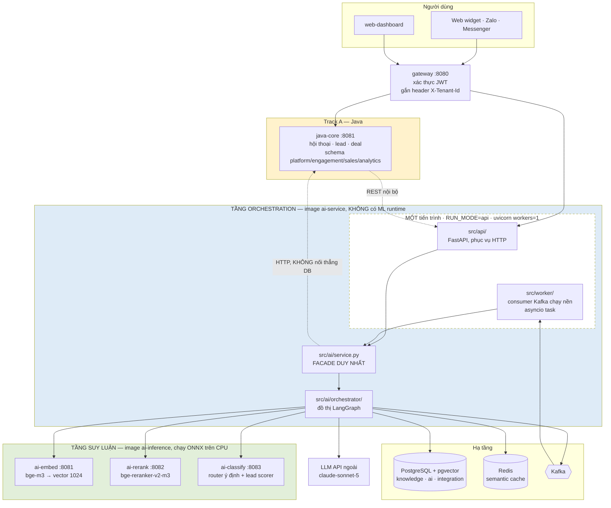
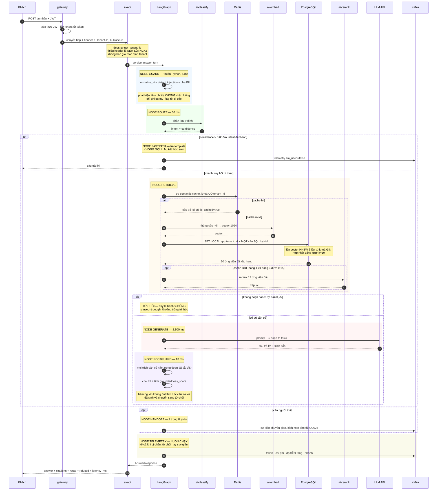
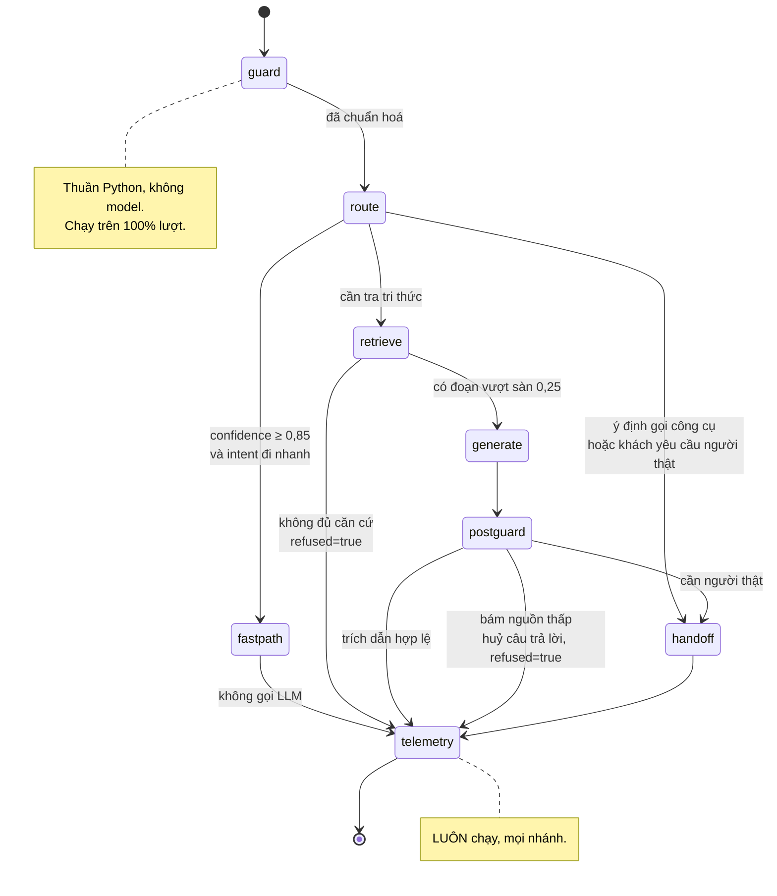
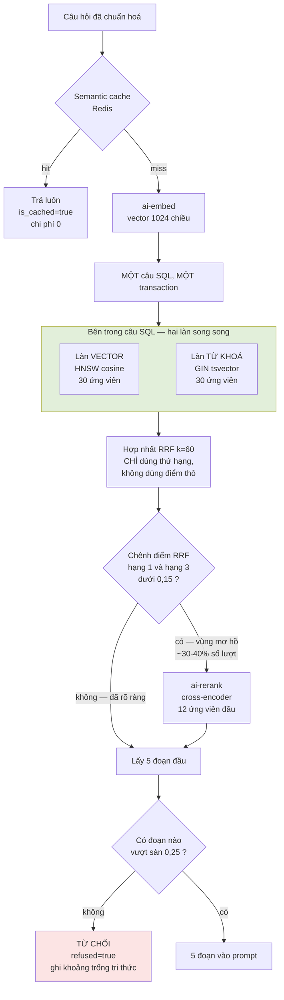
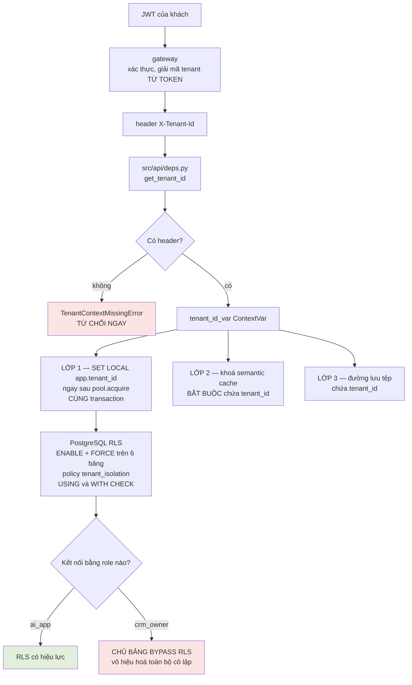
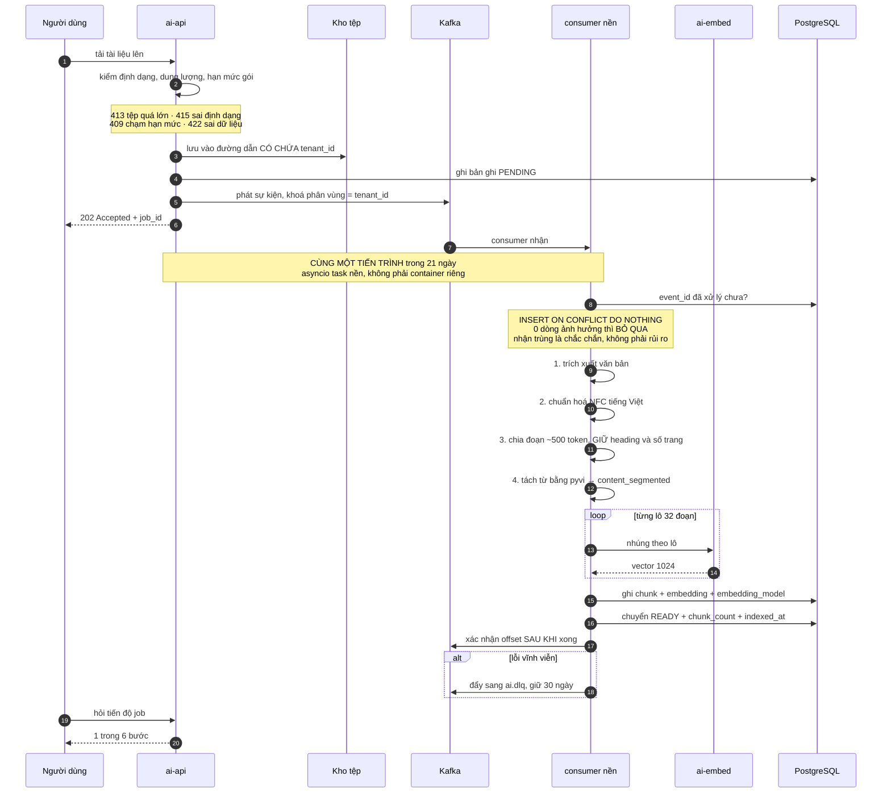
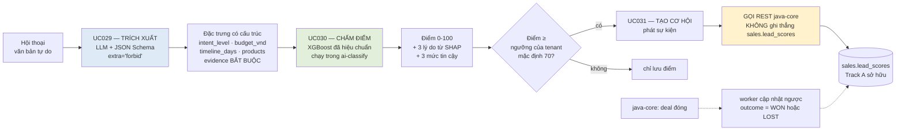
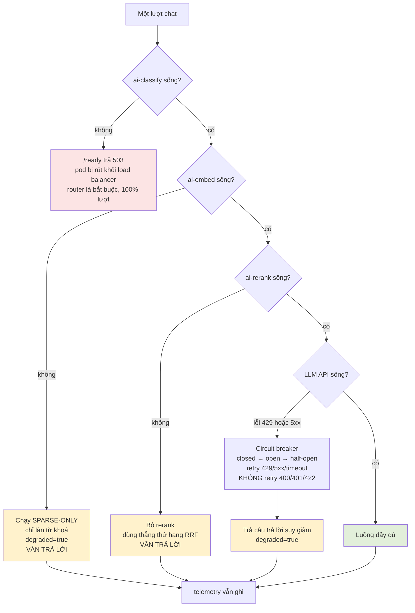

# Luồng xử lý AI — từ tin nhắn của khách tới câu trả lời

Tài liệu này vẽ **đường đi thật của một request** qua Module AI, để bạn mở file nào cũng biết
mình đang đứng ở chặng nào của bức tranh lớn.

Mọi con số và tên file dưới đây **lấy từ code trong repo**, không chép từ tài liệu thiết kế.
Chỗ nào code và tài liệu lệch nhau thì có ghi chú `⚠️`.

**Cập nhật:** 20/09/2026 · **Trạng thái code:** khung đã dựng, phần lớn logic chưa viết —
xem cột *Trạng thái* ở [§10](#10-mỗi-chặng-nằm-ở-file-nào).

---

## Mục lục

| § | Nội dung | Đọc khi nào |
|---|---|---|
| [1](#1-bản-đồ-toàn-cảnh) | Bản đồ toàn cảnh — ai gọi ai | Ngày đầu tiên |
| [2](#2-một-lượt-chat-từ-đầu-đến-cuối) | Một lượt chat từ đầu đến cuối | Hiểu luồng chính |
| [3](#3-đồ-thị-langgraph--8-node) | Đồ thị LangGraph 8 node | Trước khi viết `orchestrator/` |
| [4](#4-bên-trong-node-retrieve--trái-tim-của-rag) | Bên trong node retrieve — trái tim của RAG | Trước khi viết `rag/` |
| [5](#5-ngân-sách-độ-trễ--luật-4000-ms) | Ngân sách độ trễ — luật 4.000 ms | Khi tối ưu |
| [6](#6-đường-đi-của-tenant_id--xương-sống-bảo-mật) | Đường đi của `tenant_id` | **Đọc kỹ nhất** |
| [7](#7-luồng-bất-đồng-bộ--nạp-tài-liệu) | Luồng bất đồng bộ — nạp tài liệu · **cách nối consumer vào tiến trình api** | Trước khi viết `worker/` |
| [8](#8-luồng-lead--hội-thoại-thành-cơ-hội-bán-hàng) | Luồng lead — hội thoại thành cơ hội | UC029/030/031 |
| [9](#9-khi-có-thứ-gì-đó-chết--chế-độ-suy-giảm) | Khi có thứ gì đó chết — chế độ suy giảm | Khi test độ bền |
| [10](#10-mỗi-chặng-nằm-ở-file-nào) | Mỗi chặng nằm ở file nào | Tra cứu hằng ngày |
| [11](#11-sáu-chỗ-code-và-tài-liệu-đang-lệch) | Sáu chỗ code và tài liệu đang lệch | Trước khi code |

---

## 1. Bản đồ toàn cảnh

Có **hai tầng**, và ranh giới giữa chúng là quyết định kiến trúc lớn nhất của dự án.



**Ba điều đọc ra từ bản đồ này:**

1. **`ai-service` không nạp model.** Nó chỉ gọi HTTP sang ba service của tầng suy luận. Cổng chặn
   CI kiểm mỗi build: `pip list | grep -E "onnxruntime|torch|xgboost"` phải **rỗng**. Nhờ vậy pod
   sẵn sàng trong 2–5 giây thay vì 20–40 giây.

2. **`ai-service` không nối thẳng CSDL nghiệp vụ của Track A.** Muốn đọc hội thoại hay ghi điểm
   lead thì gọi REST của `java-core`. Đây không phải thủ tục hành chính: nối thẳng là biến mô hình
   ngôn ngữ thành một đường vòng qua RLS, và khi bị tiêm chỉ thị thì đó chính là đường khai thác.

3. **Trong 21 ngày: MỘT tiến trình làm cả hai việc** — HTTP và consumer Kafka, giống
   `@KafkaListener` của `java-core`. Đây là **quyết định triển khai đã chốt**, không phải nợ kỹ
   thuật. Nhưng `src/api/` và `src/worker/` vẫn **không được import chéo nhau**: chúng được nối
   với nhau ở `entrypoint.py`, xem [§7](#7-luồng-bất-đồng-bộ--nạp-tài-liệu). Nhờ vậy sau này muốn
   tách ra hai tiến trình chỉ cần đổi một biến môi trường, không sửa dòng code nào.

---

## 2. Một lượt chat từ đầu đến cuối

Đây là luồng bạn sẽ demo trước hội đồng. Đọc kỹ nhất.



**Ba chỗ người mới hay hiểu sai:**

- **Từ chối không phải lỗi.** `refused=true` là một kết quả hợp lệ và là một trong những thứ đáng
  khoe nhất khi bảo vệ: hệ thống biết mình không biết. Mỗi lần từ chối còn thành một dòng dữ liệu
  chỉ ra kho tri thức đang thiếu chỗ nào.

- **Node telemetry luôn chạy.** Đặt cuối đồ thị và chạy kể cả trên nhánh hỏng. Chỉ ghi ở nhánh
  thành công thì báo cáo thiếu đúng những trường hợp đáng quan tâm nhất.

- **Có hai điểm số khác nhau, đừng lẫn.** `retrieval_top_score` đo *đoạn văn có giống câu hỏi
  không*. `groundedness_score` đo *câu trả lời có thật sự dựa vào đoạn đó không*. Truy hồi tốt mà
  mô hình vẫn bịa là trường hợp có thật, và chỉ điểm thứ hai bắt được.

---

## 3. Đồ thị LangGraph — 8 node



**Luật vàng khi hai người cùng code đồ thị này:** mỗi người chỉ **đăng ký** node của mình vào
registry, **không sửa** node của người kia. `AgentState` phải chốt chung trước khi ai viết node
đầu tiên — lệch ở đây là conflict cả tuần.

| Node | Ai viết | Ngân sách p95 | Gọi ra ngoài |
|---|---|---|---|
| `guard` | Dev A | 5 ms | không |
| `route` | Dev B | 60 ms | ai-classify |
| `fastpath` | Dev B | ~0 | không |
| `retrieve` | Dev A | 15 + 120 + 80 + 300 ms | Redis, ai-embed, PostgreSQL, ai-rerank |
| `generate` | Dev A | 2.500 ms | LLM API |
| `postguard` | Dev A | 10 ms | không |
| `handoff` | Dev B | 10 ms | Kafka |
| `telemetry` | Dev B | 10 ms | Kafka |

---

## 4. Bên trong node retrieve — trái tim của RAG

Đây là chặng quyết định `recall@5` và là phần đáng viết nhất trong Chương 5 báo cáo.



**Vì sao hai làn chứ không một:**

Làn vector hiểu ý nghĩa nhưng **yếu với mã sản phẩm, số hiệu, tên riêng** — hỏi "gói SP-2024B"
thì vector trả về mọi thứ na ná về gói dịch vụ. Làn từ khoá thì ngược lại: bắt chính xác chuỗi ký
tự nhưng không hiểu "giá bao nhiêu" với "chi phí thế nào" là một. Bỏ một làn là mất một nửa.

**Vì sao RRF chỉ dùng thứ hạng:**

Hai làn cho ra hai thang điểm hoàn toàn khác nhau — cosine trong `[0,1]`, BM25 không chặn trên.
Cộng có trọng số thì phải chuẩn hoá hai thang đó, mà mọi cách chuẩn hoá đều thêm một tham số phải
tinh chỉnh. RRF vứt bỏ điểm thô, chỉ lấy thứ hạng, nên không có tham số nào ngoài hằng số 60.
**Đừng "cải tiến" nó thành weighted sum** — đó là đi ngược ADR-0006.

**Hai cái bẫy đã biết:**

```sql
-- BẮT BUỘC đặt trong CÙNG transaction với câu truy vấn
SET LOCAL hnsw.ef_search = 100;
SET LOCAL hnsw.iterative_scan = 'relaxed_order';
```
Không đặt thì HNSW quét xong mới lọc RLS, và **recall sụp đổ mà không có cảnh báo nào**.

Hàm chuẩn hoá tiếng Việt dùng lúc **nạp tài liệu** phải **giống hệt** hàm dùng lúc **truy vấn**.
Lệch nhau là truy hồi hụt — không exception, không log, chỉ có recall thấp mà không hiểu vì sao.

---

## 5. Ngân sách độ trễ — luật 4.000 ms

| # | Tầng | Chạy ở đâu | p95 | Cắt được? |
|---|---|---|---|---|
| 1 | Guardrails + chuẩn hoá | ai-api, thuần Python | 5 ms | không cần |
| 2 | ai-classify — phân loại ý định | tầng suy luận | **60 ms** | có — model nhẹ hơn |
| 3 | Semantic cache | Redis | 15 ms | có — hit là kết thúc luôn |
| 4 | ai-embed — nhúng câu hỏi | tầng suy luận | **120 ms** | có — model cấp thấp hơn |
| 5 | Hybrid SQL | PostgreSQL | 80 ms | có — giảm `ef_search` |
| 6 | ai-rerank — có điều kiện | tầng suy luận | **300 ms** | **cắt đầu tiên** |
| 7 | Dựng prompt + gọi LLM | API ngoài | 2.500 ms | có — model rẻ hơn |
| 8 | Postguard + kiểm trích dẫn | ai-api | 10 ms | không cần |
| 9 | Handoff + telemetry | Kafka | 10 ms | không cần |
| — | Dự phòng | — | 900 ms | đệm cho jitter, GC, retry |
| | **TỔNG** | | **< 4.000 ms** | **ràng buộc cứng** |

**Hai quy tắc rút ra:**

- Dòng 2 + 4 + 6 là **tổng phần suy luận CPU, phải < 480 ms**. Đây là con số dùng để chấp nhận hay
  loại một model, không phải cảm tính.
- **Các dòng phân bổ lại được cho nhau, chỉ dòng TỔNG là bất biến.** Nếu embedding cần 200 ms thay
  vì 120 ms thì lấy từ khoản dự phòng 900 ms — **đừng loại model**.

---

## 6. Đường đi của `tenant_id` — xương sống bảo mật

Đây là phần mà sai một chỗ là hỏng cả đồ án: rò rỉ dữ liệu giữa hai doanh nghiệp là lỗi không sửa
được bằng lời giải thích, và nó là **1 trong 7 chỉ số nghiệm thu**.



**Năm luật, mỗi luật ứng với một cách hỏng đã biết:**

1. **`tenant_id` luôn từ header đã xác thực, không bao giờ từ body/query/path.** Lấy từ body nghĩa
   là khách tự khai mình là ai.
2. **Thiếu thì ném lỗi, không mặc định.** Mặc định về một tenant nào đó là rò rỉ có hệ thống.
3. **`SET LOCAL` phải đặt ngay sau `pool.acquire()` và trong cùng transaction.** Đây là bẫy
   connection pool: `SET` không có `LOCAL` sẽ dính lại trên kết nối và rò sang request của tenant
   khác.
4. **Runtime dùng role `ai_app`, không bao giờ `crm_owner`.** Chủ bảng bypass RLS kể cả khi đã
   `FORCE`. `crm_owner` chỉ dành cho Flyway.
5. **Khoá semantic cache bắt buộc chứa `tenant_id`.** Thiếu nó thì doanh nghiệp A hỏi một câu và
   nhận về câu trả lời dựng từ tài liệu của doanh nghiệp B.

> **Phép thử quan trọng nhất:** hỏi tenant A một câu **chỉ trả lời được bằng tài liệu của B**.
> Kết quả đúng là **TỪ CHỐI** — không phải trả lời sai, và cũng không phải trả lời đúng. RLS chặn
> được truy vấn SQL, nhưng chỉ phép thử này chứng minh mô hình ngôn ngữ không trở thành đường vòng.

---

## 7. Luồng bất đồng bộ — nạp tài liệu

Tải tài liệu lên **không** chờ nạp xong mới trả lời. API trả `202 + job_id` ngay, phần nặng chạy
ở consumer Kafka.

> **Quyết định đã chốt cho 21 ngày:** consumer chạy **cùng tiến trình với API**, dưới dạng
> asyncio task nền — đúng mô hình `@KafkaListener` mà `java-core` đang dùng. Tách ra tiến trình
> riêng là việc **làm sau**, khi có nhu cầu thật. Cách nối dây và ba điều kiện kèm theo ở
> [mục dưới](#chạy-gộp-hay-tách--cách-nối-dây-cho-đúng).



**Bốn luật của consumer, bỏ luật nào cũng hỏng theo một kiểu riêng:**

| Luật | Bỏ thì hỏng thế nào |
|---|---|
| `enable_auto_commit=False` | Đánh dấu xong **trước khi** thực sự xong — pod chết là mất sự kiện, im lặng |
| Chống trùng theo `event_id` | Khách nhắn 3 hôm sinh 3 cơ hội trùng, phễu chuyển đổi thổi phồng ngay bậc đầu |
| `max_poll_interval_ms=600000` | Job nạp chạy vài phút, mặc định 5 phút → Kafka rebalance giữa lúc đang nạp |
| Bắt `SIGTERM`, rời group sạch | Bản tin đang dở bị bỏ giữa chừng khi pod bị thay |

> **Bẫy Kafka hai listener** — lỗi khó đoán nhất của dự án: `kafka:9092` từ **trong** mạng Docker,
> `localhost:29092` từ **máy chủ**. Dùng nhầm thì client treo rồi timeout, không thông báo nào chỉ
> ra nguyên nhân.

### Chạy gộp hay tách — cách nối dây cho đúng

Ba khái niệm hay bị gộp làm một, tách ra thì mọi thứ rõ ngay:

| | Là gì | Trong 21 ngày |
|---|---|---|
| **Image** | Một `Dockerfile`, một artifact | Chung — đã chốt |
| **Compute** | Máy chạy container | Chung — 1 instance cloud |
| **Tiến trình** | Cái mà `RUN_MODE` chọn | **Chung** — quyết định này |

**Chỗ nối dây là `entrypoint.py`, KHÔNG phải `lifespan` của `api/main.py`.** Đây là điểm dễ làm
sai nhất: nếu để `api/main.py` tự khởi động consumer thì `src/api/` phải `import src.worker`, và
lệnh `grep` trong CI sẽ đỏ ngay (nó bắt cả import lười nằm trong thân hàm). `entrypoint.py` nằm
*trên* cả hai nên được phép import cả hai:

```python
# src/entrypoint.py — CHỈ file này được import cả api lẫn worker
if mode == "api":
    import uvicorn
    from src.api.main import create_app

    hooks = []
    if os.getenv("RUN_CONSUMER_IN_API", "true").lower() == "true":
        from src.worker.main import consumer_lifespan      # hợp lệ: entrypoint ở trên cả hai
        hooks.append(consumer_lifespan)

    # truyền THỂ HIỆN app, không truyền chuỗi "src.api.main:app"
    uvicorn.run(create_app(background=hooks), host="0.0.0.0", port=port, workers=1)

elif mode == "worker":
    asyncio.run(run_worker())        # đường tách ra sau này, giữ nguyên, chưa dùng
```

```python
# src/api/main.py — KHÔNG biết Kafka là gì, chỉ chạy những gì được đưa cho
def create_app(background: list[Callable[[], AbstractAsyncContextManager]] | None = None):
    ...

@asynccontextmanager
async def lifespan(app):
    async with AsyncExitStack() as stack:
        await eureka.register(get_settings())
        for hook in app.state.background:
            await stack.enter_async_context(hook())    # vào: tạo asyncio task
        try:
            yield
        finally:
            await eureka.deregister()                  # ra: stack tự huỷ task, chờ xử lý nốt
```

```python
# src/worker/main.py — phơi ra một async context manager, không biết FastAPI là gì
@asynccontextmanager
async def consumer_lifespan() -> AsyncIterator[None]:
    task = asyncio.create_task(run_worker())
    try:
        yield
    finally:
        task.cancel()
        with suppress(asyncio.CancelledError):
            await task
```

`api/` chỉ biết "chạy mấy cái async context manager này"; `worker/` chỉ biết "tôi là một async
context manager". **Không bên nào import bên kia.** Tách ra sau này = đặt
`RUN_CONSUMER_IN_API=false` và chạy thêm một container `RUN_MODE=worker` — **không sửa code**.

**Ba điều kiện bắt buộc khi chạy gộp:**

| # | Điều kiện | Bỏ qua thì sao |
|---|---|---|
| 1 | **`replicas` giữ ở 1** | Mỗi pod một consumer trong cùng group → rebalance liên tục và tiêu thụ trùng. Với 1 instance thì không thành vấn đề |
| 2 | **Đo tải hỗn hợp ở Ngày 7**, ngưỡng p95 không xấu quá **15%** khi đang nạp | Đây là chỗ khác `@KafkaListener` của CRM: consumer bên Track A chỉ ghi vài dòng DB, còn nạp tài liệu ở đây là parse PDF + chia đoạn + nhúng, **chạy vài phút và ăn CPU** — nó tranh CPU trực tiếp với request chat |
| 3 | **`max_poll_interval_ms=600000`** | Job chạy vài phút, để mặc định 5 phút thì Kafka coi consumer đã chết và rebalance ngay giữa lúc đang nạp |

Nếu điều kiện 2 trượt thì mới tách — và lúc đó chi phí đúng bằng việc bật thêm một container.

---

## 8. Luồng lead — hội thoại thành cơ hội bán hàng

Ba use case nối nhau, và **ranh giới giữa chúng là chỗ hay bị lẫn nhất**.



**Ranh giới đừng lẫn:**

- **UC029 = LLM → đặc trưng.** Văn bản vào, dữ liệu có cấu trúc ra.
- **UC030 = XGBoost → điểm.** Đặc trưng vào, con số 0–100 ra.
- **Đừng để LLM chấm điểm.** Nó không tái lập được, không hiệu chuẩn được, và không giải thích
  được bằng SHAP.

**Cơ chế chống bịa của UC029:** mỗi trường trích ra phải kèm `evidence` — **trích dẫn nguyên văn**
từ hội thoại. Không có evidence thì trường đó bị coi là bịa và **bị loại ở bước validate**. Khi
Pydantic ném `ValidationError`, gửi lại **đúng thông báo lỗi đó** cho LLM sửa **một lần**; lần hai
vẫn hỏng thì bỏ và ghi telemetry — **không vá bằng regex**. Vá bằng regex là biến một lỗi nhìn
thấy được thành một lỗi im lặng.

**Vòng phản hồi (đường nét đứt)** là thứ khiến model học được từ thực tế: khi deal đóng,
`java-core` phát sự kiện, worker cập nhật ngược `outcome`. Không có vòng này thì lead scorer mãi
mãi chỉ đoán mà không bao giờ biết mình đoán đúng hay sai.

---

## 9. Khi có thứ gì đó chết — chế độ suy giảm

Nguyên tắc: **không bao giờ đẩy lỗi 5xx tới người dùng chỉ vì một service phụ chết.**



Lý do `ai-classify` chết thì trả 503 còn hai cái kia thì suy giảm: router chạy trên **100% lượt**
và không có đường vòng. `ai-embed` có đường vòng (làn từ khoá), `ai-rerank` vốn đã là **có điều
kiện** nên bỏ nó chỉ làm chất lượng giảm chút ít.

---

## 10. Mỗi chặng nằm ở file nào

Cột **Trạng thái** tính tới 20/09/2026 — `✅` có code chạy được · `🟡` chỉ có docstring · `❌` chưa có file.

| Chặng | File | Trạng thái |
|---|---|---|
| Chọn vai trò + **nối consumer vào tiến trình api** | `ai-service/src/entrypoint.py` | ✅ chọn vai trò; ❌ chưa nối consumer |
| Nhận HTTP, lifespan | `ai-service/src/api/main.py` | ✅ còn 4 TODO, **2 trong đó phải xoá** — xem §11 |
| Lấy `tenant_id`, `trace_id` | `ai-service/src/api/deps.py` | ✅ |
| Khai báo route | `ai-service/src/api/v1/router.py` | 🟡 0 route |
| Cấu hình toàn cục | `ai-service/src/ai/config.py` | ✅ |
| DTO giao ước với java-core | `ai-service/src/ai/schemas.py` | ✅ |
| Facade duy nhất | `ai-service/src/ai/service.py` | 🟡 |
| Đồ thị 8 node | `ai-service/src/ai/orchestrator/` | ❌ chưa có `graph.py`, `state.py` |
| Chuẩn hoá, injection, PII | `ai-service/src/ai/guardrails/` | ❌ chưa có `normalize.py`, `injection.py`, `pii.py` |
| Nạp, chia đoạn, tách từ | `ai-service/src/ai/rag/ingest/` | 🟡 |
| Hybrid search + RRF | `ai-service/src/ai/rag/retrieve/` | 🟡 |
| Rerank có điều kiện | `ai-service/src/ai/rag/rerank/` | 🟡 |
| Sinh câu trả lời, kiểm trích dẫn | `ai-service/src/ai/rag/generate/` | 🟡 |
| Trích xuất tín hiệu lead | `ai-service/src/ai/extraction/` | 🟡 |
| Chấm điểm lead | `ai-service/src/ai/scoring/` | 🟡 |
| Phân cụm chủ đề | `ai-service/src/ai/clustering/` | 🟡 |
| Client gọi tầng suy luận | `ai-service/src/ai/inference/clients.py` | 🟡 |
| Pool + `SET LOCAL` | `ai-service/src/ai/db/` | ❌ chưa có model nào |
| Producer/consumer Kafka | `ai-service/src/ai/events/` | 🟡 |
| Log JSON + metric | `ai-service/src/ai/telemetry/` | ✅ metric khai rồi nhưng chưa `.observe()` |
| Gọi REST java-core | `ai-service/src/ai/integrations/java_core/` | 🟡 |
| Consumer Kafka + `consumer_lifespan` | `ai-service/src/worker/main.py` | 🟡 `NotImplementedError` |
| Ba service suy luận | `inference/src/roles/` | 🟡 `NotImplementedError` |
| Ghim số luồng ONNX | `inference/src/session.py` | 🟡 |
| Lược đồ CSDL | `ai-service/migration/V201`–`V209` | ✅ chạy được, mới từ **V210** |
| Chỉ mục HNSW | `ai-service/scripts/create_hnsw_index.sql` | ✅ chạy tay sau khi nạp |
| Cổng chặn ML runtime | `.github/workflows/ci.yml` | ✅ |

**Bốn lệnh kiểm nhanh:**

```bash
cd ai-service
python3.11 -m compileall -q src tests                 # cú pháp
python3.11 -c "import src, src.ai, src.worker"        # import được không
ruff check src tests                                  # lint
grep -rnE '^[[:space:]]*(from|import)[[:space:]]+src\.(api|worker)\b' src/ai/   # phải RỖNG
```

Lệnh cuối là luật chiều phụ thuộc: `src/ai/` **không bao giờ** import `src.api` hay `src.worker`.
Phải neo vào đầu dòng, nếu không nó tự khớp câu lệnh viết trong docstring và báo vi phạm giả.

Hai lệnh nữa CI cũng chạy — đây là thứ giữ cho việc "gộp bây giờ, tách sau" không tốn gì:

```bash
grep -rnE '^[[:space:]]*(from|import)[[:space:]]+src\.worker\b' src/api/    # phải RỖNG
grep -rnE '^[[:space:]]*(from|import)[[:space:]]+src\.api\b'    src/worker/ # phải RỖNG
```

Consumer chạy chung tiến trình với API **không** được phép vi phạm hai lệnh này — dây nối đặt ở
`entrypoint.py`, xem [§7](#chạy-gộp-hay-tách--cách-nối-dây-cho-đúng).

---

## 11. Sáu chỗ code và tài liệu đang lệch

Ghi ra đây để bạn không mất thời gian phân vân khi gặp.

### Hai TODO trong `api/main.py` phải xử lý trước khi viết `lifespan` thật

Cả hai là tàn dư từ **trước** ADR-0015, khi chưa tách tầng suy luận. Để nguyên là code sai.

| Dòng | TODO hiện tại | Phải làm gì |
|---|---|---|
| [main.py:36](ai-service/src/api/main.py#L36) | *"khởi động consumer Kafka như một asyncio task nền"* | **CHUYỂN, không xoá.** Consumer vẫn chạy nền như đã chốt, nhưng dây nối đặt ở `entrypoint.py` — để đây thì `api/` phải import `worker/` và CI đỏ. Xem [§7](#chạy-gộp-hay-tách--cách-nối-dây-cho-đúng) |
| [main.py:38](ai-service/src/api/main.py#L38) | *"nạp mô hình nhúng và mô hình xếp hạng lại"* | **XOÁ HẲN.** Trái kiến trúc hai tầng — `ai-service` không nạp model, cổng chặn CI sẽ chặn build. Model nằm ở `inference/` |

### Bốn chỗ số liệu lệch

| # | `config.py` ghi | Docstring / tài liệu ghi | Nên theo |
|---|---|---|---|
| 1 | `retrieve_top_k = 20` | `rag/__init__.py`: mỗi làn **30 ứng viên** | ⚠️ **Chưa chốt.** 30/làn cho recall cao hơn, 20 rẻ hơn. Đo rồi chốt ở Ngày 6, sửa cho khớp một chỗ |
| 2 | `refusal_threshold = 0.5` | `rag/__init__.py`: sàn toàn tập **0,25**, sàn từng đoạn **0,15** | ⚠️ Hai đại lượng **khác nhau** đang dùng tên gần giống. Tách tên rõ ràng khi viết `abstain` ở Ngày 10 |
| 3 | — | `ai-service/src/ai/inference/__init__.py` ghi cổng CI **5 gói** | ✅ ADR-0015 chốt **3 gói** `onnxruntime\|torch\|xgboost`. CI đang chạy đúng 3 gói. Docstring chưa cập nhật |
| 4 | — | `V207` và vài docstring còn ghi đường dẫn `app/db/session.py` | ✅ ADR-0015 đổi sang `src/ai/db/session.py`. Đường dẫn cũ là tàn dư của ADR-0010 đã bị thay |

Ngoài ra `worker/main.py` và `inference/src/entrypoint.py` còn tham chiếu **"kế hoạch 49 ngày,
Ngày 12 / Ngày 32"** — lịch đó đã được thay bằng kế hoạch 21 ngày
(`docs/Ke-hoach-21-ngay-Module-AI-CRM.xlsx`).

---

## Đọc thêm

| Cần biết | Mở |
|---|---|
| Làm gì ngày nào, ai làm | `docs/Ke-hoach-21-ngay-Module-AI-CRM.xlsx` |
| Vì sao chọn như vậy | `docs/adr/` — 17 ADR, đặc biệt 0002, 0006, 0007, 0015, 0016 |
| Đặc tả 20 use case AI | `docs/Dac-ta-UseCase-Module-AI.docx` |
| Cột, kiểu, khoá của từng bảng | `docs/erd-mermaid.md` |
| Bề mặt tấn công T1–T8 | `docs/threat-model.md` |
| Hợp đồng liên làn | `docs/openapi/` và `docs/events/` |
