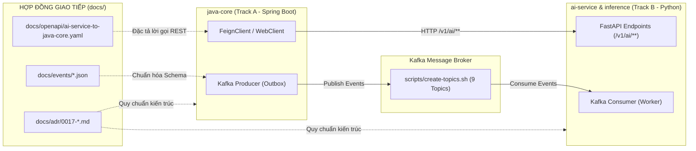

# TÀI LIỆU GIẢI THÍCH CÔNG DỤNG CÁC TỆP ĐÃ TẠO VÀ CẬP NHẬT (PHASE 1)

> **Mục tiêu:** Tài liệu này giải thích chi tiết nguồn gốc, vai trò kỹ thuật, ý nghĩa nghiệp vụ và luồng tương tác giữa các tệp được tạo mới và cập nhật trong **Phase 1 (Task Ngày 1: Chốt 4 mâu thuẫn hợp đồng + Siết cổng CI)** của dự án Nền tảng Chatbot AI CRM.

---

## I. TỔNG QUAN PHƯƠNG PHÁP: CONTRACT-FIRST ARCHITECTURE

Hệ thống được xây dựng theo kiến trúc Microservices phân tán với hai khối hạt nhân:
1. **`java-core` (Track A):** Backend nghiệp vụ CRM (Spring Boot, PostgreSQL, quản lý khách hàng, hội thoại, phân quyền đa khách thuê RLS).
2. **`ai-service` + `inference` (Track B):** Module xử lý trí tuệ nhân tạo (FastAPI, LangGraph RAG, Router ý định, Lead Scorer ONNX).

Để hai khối này hoạt động trơn tru mà không bị lỗi lệch định dạng (Contract Drift), toàn bộ hệ thống áp dụng triết lý **Contract-First (Thiết kế hợp đồng trước khi code)**:
- **Giao tiếp đồng bộ (Synchronous):** Quy định bằng tài liệu **OpenAPI 3.1 YAML**.
- **Giao tiếp bất đồng bộ (Asynchronous):** Quy định bằng **JSON Schema sự kiện Kafka**.
- **Cơ sở học thuật & kỹ thuật:** Được lưu trữ trong các **Architecture Decision Records (ADR)**.
- **Kỷ luật tự động hóa:** Được bảo vệ bởi **GitHub Actions CI**.

---

## II. CHI TIẾT CÁC TỆP TẠO MỚI (NEW FILES)

### 1. [0017-chot-bon-mau-thuan-hop-dong-va-siet-cong-ci.md](file:///e:/KLTN/ai-crm-chatbot-platform/docs/adr/0017-chot-bon-mau-thuan-hop-dong-va-siet-cong-ci.md)
* **Vị trí:** `docs/adr/`
* **Loại tệp:** Architecture Decision Record (Bản ghi quyết định kiến trúc).
* **Công dụng kỹ thuật:**
  * Lưu trữ chính thức **4 quyết định kỹ thuật then chốt** giải quyết xung đột giữa tài liệu đặc tả cũ và mã nguồn thực tế:
    1. **Tên Endpoint:** Khóa tiền tố `/v1/ai/**` cho toàn bộ API nghiệp vụ của AI Service; giữ nguyên `/health`, `/ready`, `/metrics` ở mức root.
    2. **Bộ Topic Kafka:** Chốt danh sách 9 topic chính thức phục vụ kiến trúc hướng sự kiện (Event-Driven), trong đó bổ sung topic bắt buộc `crm.deal.closed`.
    3. **Vị trí Golden Set:** Chọn đường dẫn duy nhất tại `ai-service/tests/eval/golden_set.jsonl` làm test fixture đánh giá tự động RAG, loại bỏ hoàn toàn các nhắc nhở gây nhầm lẫn khác.
    4. **Cỡ tập test người thật:** Quyết định giảm quy mô tập gán nhãn thủ công từ $\ge 250$ câu xuống đúng **200 câu** cho nhóm 2 người trong 21 ngày.
    5. **Cổng CI:** Siết exit 1 khi dung lượng Docker image `ai-service:ci` vượt hoặc bằng 400 MB.
* **Ý nghĩa thực tế trong luận văn tốt nghiệp:**
  * Đây là **bằng chứng học thuật** trực tiếp đưa vào Chương 3 và Chương 5 của Luận văn nhằm chứng minh phương pháp nghiên cứu có luận cứ khoa học, có phân tích sự đánh đổi (Trade-offs) và tính toán khả thi theo nhân sự.

---

### 2. [crm.deal.closed.v1.json](file:///e:/KLTN/ai-crm-chatbot-platform/docs/events/crm.deal.closed.v1.json)
* **Vị trí:** `docs/events/`
* **Loại tệp:** JSON Schema (Draft 2020-12).
* **Bên phát (Producer):** `java-core` (Module Sales).
* **Bên nhận (Consumer):** `ai-service` (Consumer `scoring-feedback-cg`).
* **Khóa phân vùng (Partition Key):** `tenant_id` (đảm bảo tính toàn vẹn dữ liệu đa khách thuê).
* **Công dụng nghiệp vụ:**
  * Khi nhân viên kinh doanh kết thúc một cơ hội bán hàng (Deal) trên CRM bằng trạng thái Thắng (`WON`) hoặc Thua (`LOST`), sự kiện này sẽ được gửi sang Kafka.
  * **Tại sao bắt buộc phải có:** Cung cấp **"nhãn kết quả thực tế" (Ground-Truth Outcome)** cho bài toán Machine Learning Lead Scoring (UC030). AI cần biết khách hàng từng được chấm 85 điểm thì sau đó có thực sự chốt đơn không, từ đó tính ma trận nhầm lẫn (Confusion Matrix), tính điểm ROC-AUC và kích hoạt chu trình cập nhật lại mô hình XGBoost.

---

### 3. [crm.conversation.closed.v1.json](file:///e:/KLTN/ai-crm-chatbot-platform/docs/events/crm.conversation.closed.v1.json)
* **Vị trí:** `docs/events/`
* **Loại tệp:** JSON Schema (Draft 2020-12).
* **Bên phát (Producer):** `java-core` (Module Engagement).
* **Bên nhận (Consumer):** `ai-service` (Worker `summarizer-cg`).
* **Công dụng nghiệp vụ:**
  * Phát ra khi một phiên chat giữa khách hàng và chatbot hoặc nhân viên tư vấn kết thúc.
  * **Tại sao xử lý bất đồng bộ:** Việc gọi LLM để đọc lại hàng chục tin nhắn và tóm tắt thành 4 phần (*Nhu cầu chính, Thông tin đã cung cấp, Vấn đề chưa giải quyết, Bước tiếp theo*) theo UC026 tốn từ 2 đến 4 giây. Đẩy qua Kafka giúp người dùng đóng chat lập tức mà không phải chờ màn hình xoay tròn, worker AI sẽ xử lý ngầm và ghi kết quả tóm tắt lại vào cơ sở dữ liệu.

---

### 4. [crm.kb.document.uploaded.v1.json](file:///e:/KLTN/ai-crm-chatbot-platform/docs/events/crm.kb.document.uploaded.v1.json)
* **Vị trí:** `docs/events/`
* **Loại tệp:** JSON Schema (Draft 2020-12).
* **Bên phát (Producer):** `java-core` (Module Knowledge).
* **Bên nhận (Consumer):** `ai-service` (Worker `ingestion-cg`).
* **Công dụng nghiệp vụ:**
  * Bắn ra khi người quản trị tải một tài liệu kiến thức (PDF, DOCX, TXT) lên Web Dashboard.
  * Kích hoạt pipeline **Nạp và lập chỉ mục tri thức (UC018/019)**: đọc tệp, băm nhỏ (chunking), gọi model embedding chuyển hóa văn bản thành vector 1024 chiều và nạp vào PostgreSQL pgvector để phục vụ tìm kiếm RAG.

---

## III. CHI TIẾT CÁC TỆP ĐÃ ĐƯỢC CẬP NHẬT (MODIFIED FILES)

### 1. [ai-service-to-java-core.yaml](file:///e:/KLTN/ai-crm-chatbot-platform/docs/openapi/ai-service-to-java-core.yaml)
* **Vị trí:** `docs/openapi/`
* **Loại tệp:** Đặc tả OpenAPI Specification phiên bản 3.1.
* **Thay đổi & Công dụng:**
  * Đổi tên toàn bộ các endpoint xử lý từ dạng cũ (`/v1/answer`, `/v1/documents/ingest`...) sang đúng họ **`/v1/ai/**`** (`/v1/ai/chat`, `/v1/ai/kb/documents`, `/v1/ai/lead-score`, `/v1/ai/summarize`, `/v1/ai/extract`, `/v1/ai/feedback`...).
  * Điền đầy đủ schema tham số, cấu trúc Body gửi lên và Body phản hồi kèm theo mã trạng thái HTTP chuẩn mực (200, 201, 400, 401, 404, 422, 500, 503).
  * Khai báo bảo mật `security` (Bearer Token và Header nội bộ).
  * **Đã được xác thực qua Redocly CLI:** Kết quả lint **100% hợp lệ (0 lỗi, 0 cảnh báo)**, cho phép Track A sử dụng công cụ sinh code (OpenAPI Code Generator) để tự động tạo Client trong Spring Boot.

---

### 2. [create-topics.sh](file:///e:/KLTN/ai-crm-chatbot-platform/scripts/create-topics.sh)
* **Vị trí:** `scripts/`
* **Loại tệp:** Bash shell script khởi tạo hạ tầng Kafka.
* **Thay đổi & Công dụng:**
  * Bổ sung đầy đủ **9 topic Kafka chính thức** cho toàn bộ Module AI:
    1. `crm.kb.document.uploaded` (Nạp tri thức)
    2. `crm.conversation.closed` (Tóm tắt hội thoại)
    3. `crm.deal.closed` (Phản hồi nhãn outcome chốt deal)
    4. `ai.kb.document.indexed` (Báo cáo chỉ mục hoàn tất)
    5. `ai.lead.signal.detected` (Tín hiệu khách hàng tiềm năng)
    6. `ai.handoff.requested` (Chuyển giao cho người thật)
    7. `ai.tool_call.audited` (Nhật ký kiểm toán MCP)
    8. `ai.turn.completed` (Thống kê hạn mức và token sử dụng)
    9. `ai.dlq` (Hàng đợi thông điệp chết Dead-Letter Queue)
  * Vẫn giữ các topic legacy cũ (`crm.conversation.v1`, `crm.lead.v1`...) để bảo đảm các tính năng sẵn có không bị gián đoạn.

---

### 3. [ci.yml](file:///e:/KLTN/ai-crm-chatbot-platform/.github/workflows/ci.yml)
* **Vị trí:** `.github/workflows/`
* **Loại tệp:** Cấu hình CI/CD trên GitHub Actions.
* **Thay đổi & Công dụng:**
  * Sửa bước `Dung lượng image` tại dòng 93-103: Thay vì chỉ hiển thị thông báo cảnh báo `::warning::`, CI nay kiểm tra: nếu kích thước image `ai-service:ci` $\ge 400$ MB thì kích hoạt lệnh **`exit 1` (Làm fail build ngay lập tức)**.
  * **Ý nghĩa:** Bảo đảm kiến trúc tách biệt 2 tầng (*Decoupled Inference*). Nếu bất kỳ ai cài nhầm các gói suy luận nặng (`torch`, `onnxruntime`, `xgboost`) vào `ai-service` làm phình to image, GitHub Actions sẽ lập tức chặn không cho merge code vào nhánh `develop`.

---

### 4. Đồng bộ hệ thống tài liệu quản trị
* [CLAUDE.md](file:///e:/KLTN/ai-crm-chatbot-platform/CLAUDE.md): Cập nhật quy tắc dự án, chuyển 4 vấn đề từ mục *"Còn treo"* sang mục *"Đã chốt, đừng mở lại"* theo ADR-0017.
* [docs/contracts/README.md](file:///e:/KLTN/ai-crm-chatbot-platform/docs/contracts/README.md): Cập nhật trạng thái hợp đồng liên làn, ghi nhận phía AI đã chốt xong toàn bộ chuẩn giao tiếp.
* [docs/events/README.md](file:///e:/KLTN/ai-crm-chatbot-platform/docs/events/README.md): Lập bảng kê 9 topic Kafka chính thức kèm mô tả người sản xuất và người tiêu thụ.
* [docs/adr/README.md](file:///e:/KLTN/ai-crm-chatbot-platform/docs/adr/README.md): Đăng ký mã ADR-0017 vào mục lục chung của toàn hệ thống.
* [service.py](file:///e:/KLTN/ai-crm-chatbot-platform/ai-service/src/ai/service.py): Chuyển chuỗi docstring sang `r"""` (raw string) chứa các biểu thức chính quy (regex), giúp việc biên dịch Python `compileall` đạt trạng thái sạch hoàn toàn (không còn cú pháp warning).

---

## IV. BẢNG TỔNG HỢP VAI TRÒ VÀ NGƯỜI DÙNG CHÍNH

| Tên Tệp | Đối tượng sử dụng chính | Tác vụ cụ thể khi sử dụng |
|---|---|---|
| `docs/adr/0017-*.md` | Nhóm đồ án, Giảng viên phản biện | Đọc hiểu lý do ra quyết định, trích dẫn vào Luận văn tốt nghiệp. |
| `docs/openapi/ai-service-to-java-core.yaml` | Dev Track A (Java) & Dev Track B (AI) | Lập trình FeignClient/WebClient ở Java, triển khai FastAPI Router ở Python. |
| `docs/events/*.json` | Dev Track A & Track B | Viết class DTO tương ứng để serialize/deserialize message Kafka. |
| `scripts/create-topics.sh` | DevOps / Cả hai Dev | Khởi tạo môi trường Docker / Kafka local trước khi chạy test tích hợp. |
| `.github/workflows/ci.yml` | GitHub Actions Runner | Tự động kiểm soát chất lượng code, chặn vi phạm kiến trúc khi tạo Pull Request. |
