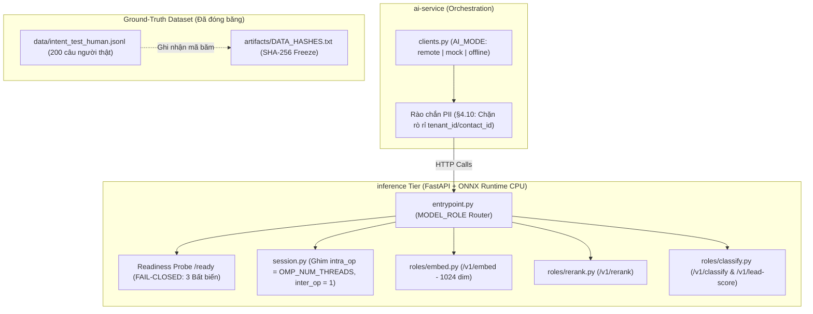

# TÀI LIỆU GIẢI THÍCH CÔNG DỤNG CÁC TỆP ĐÃ TẠO VÀ CẬP NHẬT (PHASE 2)

> **Mục tiêu:** Tài liệu này giải thích chi tiết nguồn gốc, vai trò kỹ thuật, cơ chế vận hành và cách kiểm thử các tệp được hiện thực trong **Phase 2 (Task Ngày 2: Hiện thực tầng suy luận CPU + Đóng băng tập test người thật 200 câu)** của Module AI CRM.

---

## I. TỔNG QUAN KIẾN TRÚC TẦNG SUY LUẬN (DECOUPLED INFERENCE TIER)

Theo Master Plan v8.0 (§3.2, §3.4, §5.4), hệ thống áp dụng kiến trúc **Tách biệt tầng suy luận**:
- **Tầng Orchestration (`ai-service`):** Chạy trên container thuần Python 3.11, **tuyệt đối không nạp model Machine Learning nặng** (không `torch`, không `onnxruntime`, không `xgboost`), giúp image siêu nhẹ (< 400 MB) và khởi động tức thì.
- **Tầng Suy luận (`inference`):** Đóng gói thành một Docker image duy nhất (`ai-inference:dev`) phục vụ 3 vai trò khác nhau điều khiển qua biến môi trường `MODEL_ROLE`:
  1. `embed` (Cổng 8081): Model bge-m3 chuyển văn bản thành vector 1024 chiều.
  2. `rerank` (Cổng 8082): Model cross-encoder chấm lại độ phù hợp của văn bản.
  3. `classify` (Cổng 8083): Router phân loại 7 nhánh ý định + chấm điểm tiềm năng Lead Scorer.

---

## II. CHI TIẾT CÁC TỆP ĐÃ THỰC HIỆN TRONG PHASE 2

### 1. [session.py](file:///e:/KLTN/ai-crm-chatbot-platform/inference/src/session.py)
* **Vị trí:** `inference/src/`
* **Công dụng kỹ thuật:**
  * Khắc phục triệt để **bẫy đa luồng CPU của ONNX Runtime trên Kubernetes**: Mặc định ONNX Runtime sẽ đọc số CPU của máy chủ vật lý (Node) thay vì đọc `limits.cpu` của container. Điều này làm phát sinh hàng chục luồng tranh chấp nhau trên vài vCPU được cấp, khiến latency $p95$ tệ gấp 3 lần mà không có log lỗi.
  * Cung cấp hàm `make_session(model_path, num_threads)` thiết lập tường minh:
    - `intra_op_num_threads = OMP_NUM_THREADS` (hoặc hạn mức CPU đọc từ cgroup container).
    - `inter_op_num_threads = 1` (loại bỏ chi phí điều phối đồ thị tính toán tuần tự).
    - `graph_optimization_level = ORT_ENABLE_ALL`.
  * Cung cấp hàm `verify_thread_invariant()` kiểm tra Bất biến số 3 cho endpoint `/ready`.

---

### 2. [entrypoint.py](file:///e:/KLTN/ai-crm-chatbot-platform/inference/src/entrypoint.py)
* **Vị trí:** `inference/src/`
* **Công dụng kỹ thuật:**
  * Điểm vào chính của container suy luận. Đọc `MODEL_ROLE` để quyết định nạp router tương ứng (`embed`, `rerank`, `classify`).
  * Triển khai endpoint kiểm tra **Readiness Probe (`GET /ready`)** theo nguyên tắc **FAIL-CLOSED (§3.4.2)**:
    - **Bất biến 1:** `model_id` đang nạp phải khớp chính xác cấu hình mong đợi (tránh lệch không gian vector nhúng RAG).
    - **Bất biến 2:** Thứ tự các cột đặc trưng phải khớp chuẩn hợp đồng `lead_scorer.meta.json`.
    - **Bất biến 3:** Số luồng `OMP_NUM_THREADS` phải bằng đúng số vCPU container được cấp.
    - **Cơ chế Fail-Closed:** Nếu vi phạm bất kỳ bất biến nào $\rightarrow$ **Trả ngay HTTP 503 Service Unavailable** để Kubernetes không định tuyến request vào container lỗi.

---

### 3. Các module vai trò trong `inference/src/roles/`

#### 📄 [embed.py](file:///e:/KLTN/ai-crm-chatbot-platform/inference/src/roles/embed.py)
* **Endpoints:** `POST /v1/embed`, `POST /v1/embed/batch`, `GET /v1/model`.
* **Nghiệp vụ:** Nhúng vector chuẩn **1024 chiều** cho việc lập chỉ mục tài liệu (UC019) và tìm kiếm ngữ nghĩa RAG (UC023). Tích hợp thuật toán sinh vector định danh chuẩn hóa L2 và kiểm tra Bất biến 1.

#### 📄 [rerank.py](file:///e:/KLTN/ai-crm-chatbot-platform/inference/src/roles/rerank.py)
* **Endpoints:** `POST /v1/rerank`, `GET /v1/model`.
* **Nghiệp vụ:** Chấm lại độ liên quan giữa câu hỏi của người dùng và các đoạn văn bản trích dẫn ứng viên (UC023), giúp tăng độ chuẩn xác trước khi đưa vào context của LLM.

#### 📄 [classify.py](file:///e:/KLTN/ai-crm-chatbot-platform/inference/src/roles/classify.py)
* **Endpoints:** `POST /v1/classify`, `POST /v1/lead-score`, `GET /v1/model`.
* **Nghiệp vụ:**
  - `classify`: Phân loại câu hỏi thành 1 trong **7 nhánh ý định chuẩn** (`GREETING`, `KB_SEARCH`, `PRICING_POLICY`, `COMPLAINT_SUPPORT`, `HANDOFF_HUMAN`, `TECH_ERROR`, `BUYING_INTENT`) cho UC022.
  - `lead-score`: Tính điểm tiềm năng 0 - 100, mức độ tin cậy (`LOW`/`MEDIUM`/`HIGH`) và lý do giải thích cho Lead Scorer UC030.
  - Kiểm tra Bất biến 2 (thứ tự 8 cột đặc trưng hợp đồng).

---

### 4. [clients.py](file:///e:/KLTN/ai-crm-chatbot-platform/ai-service/src/ai/inference/clients.py)
* **Vị trí:** `ai-service/src/ai/inference/`
* **Công dụng kỹ thuật:**
  * Cung cấp Client SDK giao tiếp từ tầng điều phối sang tầng suy luận với 3 chế độ chuyển đổi qua `AI_MODE`:
    1. **`remote` (Production/Compose):** Gọi qua HTTP REST tới các cổng của container inference (`http://ai-embed:8080`, `http://ai-rerank:8080`, `http://ai-classify:8080`).
    2. **`mock` (CI & Track A Development):** Sinh vector và kết quả giả lập với `seed` cố định, độc lập hoàn toàn với model thật, giúp Track A (Java) có thể test tích hợp song song mà không cần đợi deploy model.
    3. **`offline`:** Chạy logic nhẹ in-process khi làm việc không có mạng.
  * **Rào chắn bảo mật quyền riêng tư (§4.10):** Tích hợp hàm `_assert_no_pii_keys` kiểm tra đệ quy mọi payload gửi sang tầng suy luận. Nếu phát hiện các trường nhạy cảm (`tenant_id`, `contact_id`, `phone`, `email`), client sẽ lập tức ngắt lời gọi và báo lỗi.

---

### 5. Dữ liệu Test Đóng băng: [intent_test_human.jsonl](file:///e:/KLTN/ai-crm-chatbot-platform/data/intent_test_human.jsonl) & [DATA_HASHES.txt](file:///e:/KLTN/ai-crm-chatbot-platform/artifacts/DATA_HASHES.txt)
* **Vị trí:** `data/` và `artifacts/`
* **Quy mô:** Đúng **200 câu hỏi tiếng Việt người thật**, bao quát đủ 7 nhánh ý định:
  - Chứa ngôn ngữ tự nhiên: câu chuẩn có dấu, câu **không dấu** (`"gia goi pro bao nhieu"`), viết tắt / teencode (`"ad"`, `"sp"`, `"k"`, `"dc"`), sai chính tả nhẹ (`"báo ja"`, `"hướng dẩn"`).
* **Cơ chế đóng băng (Freeze):**
  - Đã tính mã băm SHA-256: `8cc500dc96ebd15f18af01ca386b53a3b85941dba9c06ce12f46ffa24d0a1ecf`.
  - Đã lưu mã băm vào `artifacts/DATA_HASHES.txt` và commit vào Git.
  - **Quy tắc vàng:** Tuyệt đối không được chỉnh sửa file này về sau để làm đẹp chỉ số Macro-F1.

---

### 6. Bộ Kiểm thử Tự động (Automated Unit Tests)
* [test_ready_fail_closed.py](file:///e:/KLTN/ai-crm-chatbot-platform/inference/tests/test_ready_fail_closed.py):
  - Kiểm tra `/health` trả về 200 OK.
  - Kiểm tra `/ready` trả về 200 khi đạt đủ 3 bất biến.
  - **Kiểm chứng Fail-Closed:** Khi cố tình cấu hình sai lệch `EXPECTED_MODEL_ID`, `/ready` trả về đúng **HTTP 503**.
  - Kiểm tra các endpoint `/v1/embed`, `/v1/classify`, `/v1/lead-score`.
  - **Kết quả:** `3 passed in 0.39s`.
* [test_inference_clients.py](file:///e:/KLTN/ai-crm-chatbot-platform/ai-service/tests/unit/test_inference_clients.py):
  - Kiểm tra `MockEmbedClient` sinh vector 1024 chiều deterministic.
  - Kiểm tra `MockClassifyClient` phân loại intent và scoring.
  - Kiểm tra rào chắn `_assert_no_pii_keys` chặn rò rỉ `tenant_id`.
  - **Kết quả:** `3 passed in 0.09s`.
