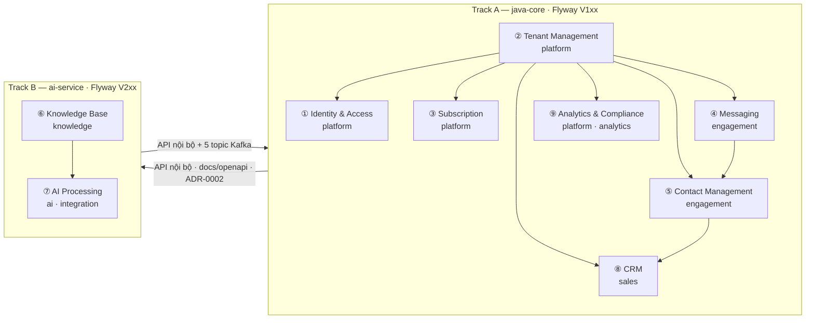
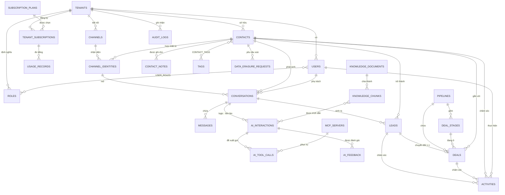

# ERD — Chatbot AI CSKH đa kênh tích hợp CRM, SaaS đa khách thuê

Lược đồ cơ sở dữ liệu **chính thức** của hệ thống: **30 bảng nghiệp vụ** + 2 bảng hạ tầng, trên
**7 schema** PostgreSQL 16, phủ trọn 8 actor và **42/42 use case** (UC001–UC042).

> Tài liệu này **đã được hiện thực và kiểm chứng**: 21 file migration Flyway (V101–V113,
> V201–V208) chạy sạch trên PostgreSQL 16 + pgvector, qua đủ 6 mục kiểm ở [mục 16](#16-kiểm-chứng).
> Mọi cột, mọi ràng buộc `CHECK` dưới đây lấy từ cơ sở dữ liệu đang chạy, không phải bản phác.

---

## 1. Phạm vi, nguồn và nguyên tắc

| Nguồn | Vai trò |
|---|---|
| `docs/plan/Dac-ta-UseCase-Dot1..6.docx` | **Nguồn duy nhất** của mô hình. Mọi bảng phải truy được về ít nhất một use case |
| `docs/openapi/dashboard-api.yaml` | **Nguồn duy nhất của giá trị enum.** Hợp đồng đã chốt với web-dashboard — CSDL theo nó, không ngược lại |
| ADR-0001 | Cô lập đa khách thuê bằng Row-Level Security |
| ADR-0002 | `ai-service` không nối thẳng bảng nghiệp vụ của Track A |
| ADR-0003 | Outbox pattern — ghi sự kiện trong cùng transaction nghiệp vụ |
| ADR-0007 | pgvector thay cơ sở dữ liệu vector riêng |
| `docs/threat-model.md` | Bề mặt T1–T8 — quyết định các cột kiểm toán và cột mã hoá |

**Sáu nguyên tắc, và chỗ chúng hiện ra:**

| Nguyên tắc | Hiện ra ở đâu |
|---|---|
| Không thừa thiết kế | 30 bảng. 20 nhóm bảng đã cân nhắc rồi bỏ, có lập luận từng cái ([mục 11](#11-bảng-đã-cân-nhắc-rồi-bỏ)) |
| Chuẩn hoá tới 3NF | Không phụ thuộc bắc cầu. 4 chỗ chệch chuẩn có chủ ý, ghi rõ ([mục 10.4](#104-có-đạt-3nf-không)) |
| Dễ triển khai với PostgreSQL | `uuid`, `jsonb`, `tsvector`, `inet`, mảng, UNIQUE bộ phận, RLS — tính năng gốc; chỉ thêm `pgvector` |
| Phù hợp quy mô SME | Xuất báo cáo đồng bộ (UC042 nhánh 4.2), không bảng thanh toán, không hàng đợi webhook riêng |
| Mở rộng được | 7 hướng mở rộng, không hướng nào đòi tách lại bảng đã có ([mục 12](#12-hướng-mở-rộng-tương-lai)) |
| Thực tế như sản phẩm thật | RLS `FORCE`, khoá ngoại phức hợp, bí mật mã hoá, chống nhận trùng webhook, hàm `SECURITY DEFINER` cho đường đăng nhập |

---

## 2. Quy ước chung

| Chủ đề | Quy ước | Vì sao |
|---|---|---|
| Tên bảng | số nhiều, `snake_case`, không dấu | khớp `docs/events/`, ánh xạ thẳng JPA / SQLAlchemy |
| Khoá chính | `uuid PRIMARY KEY DEFAULT gen_random_uuid()` | không lộ số lượng bản ghi; ghép được giữa hai làn mà không cần chuỗi số chung |
| Khoá chính bảng nhật ký | `bigint GENERATED ALWAYS AS IDENTITY` | 3 bảng chỉ ghi thêm: `audit_logs`, `ai_tool_calls`, `outbox_events` |
| Cô lập tenant | `tenant_id uuid NOT NULL` trên **mọi** bảng nghiệp vụ | RLS lọc ngay trên bảng bị truy vấn, nên cột phải nằm tại chỗ dù suy ra được từ bảng cha |
| Dấu thời gian | `timestamptz NOT NULL DEFAULT now()` cho `created_at` và `updated_at` | lưu UTC; `updated_at` do trigger `touch_updated_at()` giữ, không phó mặc tầng ứng dụng |
| Enum | `varchar(n)` + `CHECK` | thêm giá trị không cần `ALTER TYPE` (khoá bảng); ánh xạ thẳng `@Enumerated(EnumType.STRING)` |
| Tiền | `cost_vnd numeric(16,4)` · `amount numeric(18,2)` | một lượt gọi mô hình nhỏ hơn một đồng — làm tròn sớm là mất số liệu báo cáo chi phí |
| Hình dạng thay đổi | `jsonb` | cấu hình kênh, giá trị kiểm toán, tham số công cụ MCP, tiến độ xoá dữ liệu |
| Danh sách đơn giản | `text[]`, `uuid[]` | `allowed_tools`, `required_fields`, `retrieved_chunk_ids` |
| Danh sách bản ghi nhỏ | `jsonb` mảng | `tool_schema_cache` (sổ đăng ký công cụ), `top_factors` |
| Xoá | xoá mềm bằng `status` / `deleted_at` / `anonymized_at`; bảng nhật ký chỉ ghi thêm | UC016 và UC040 đều cấm xoá vật lý |
| Bí mật | `bytea` đã mã hoá + `key_id`, **không bao giờ** văn bản thô | token kênh (UC008 bước 7), xác thực MCP (UC021 bước 11) |

### Ràng buộc "mọi bảng nghiệp vụ có `tenant_id`" — và ba ngoại lệ

28/30 bảng nghiệp vụ có `tenant_id NOT NULL`. Ba ngoại lệ, nêu ngay đây để không phải đi tìm:

1. **`tenants` không có `tenant_id`** — chính nó *là* tenant. Policy RLS so `id`.
2. **`subscription_plans` không có `tenant_id`** — danh mục gói do quản trị nền tảng định nghĩa,
   mọi tenant đọc chung. Không bật RLS; `crm_app` chỉ có `SELECT`.
3. **`users.tenant_id` và `roles.tenant_id` cho phép NULL.** `users`: đúng một trường hợp,
   tài khoản quản trị nền tảng (`scope = 'PLATFORM'`), có `CHECK` ràng hai cột đi cùng nhau.
   `roles`: `NULL` nghĩa là vai trò hệ thống dùng chung cho mọi tenant.

---

## 3. Bước 1 — Bounded context

9 bounded context, ánh xạ sang 7 schema PostgreSQL. Ranh giới schema đồng thời là **ranh giới sở
hữu giữa hai người làm**, nên nó không chỉ là cách nhóm bảng cho đẹp — nó là cơ chế tránh xung
đột migration khi hai máy làm song song.

| # | Bounded context | Schema | Làn | Flyway | Bảng |
|---|---|---|---|---|---|
| 1 | **Identity & Access** | `platform` | A | V103 | `users` `roles` `user_roles` |
| 2 | **Tenant Management** | `platform` | A | V102 | `tenants` |
| 3 | **Subscription** | `platform` | A | V102 | `subscription_plans` `tenant_subscriptions` `usage_records` |
| 4 | **Messaging** | `engagement` | A | V106–V107 | `channels` `channel_identities` `conversations` `messages` |
| 5 | **Contact Management** | `engagement` | A | V105 | `contacts` `tags` `contact_tags` `contact_notes` |
| 6 | **Knowledge Base** | `knowledge` | B | V202–V203 | `knowledge_documents` `knowledge_chunks` |
| 7 | **AI Processing** | `ai` + `integration` | B | V204–V205 | `ai_interactions` `ai_tool_calls` `ai_feedback` `mcp_servers` |
| 8 | **CRM** | `sales` | A | V108 | `pipelines` `deal_stages` `leads` `deals` `activities` |
| 9 | **Analytics & Compliance** | `platform` + `analytics` | A | V104, V109–V110 | `audit_logs` `data_erasure_requests` (+2 hạ tầng) |



**Chiều phụ thuộc giữa hai làn là API, không phải khoá ngoại.** Hệ quả trực tiếp lên lược đồ:
**không có khoá ngoại nào cắt qua đường TA↔TB**, và tài khoản `ai_app` **không có cả quyền
`USAGE`** trên bốn schema của Track A — lớp chặn cuối nếu ai đó lỡ viết truy vấn nối thẳng.

---

## 4. Bước 2 — Danh sách entity

| # | Bảng | Context | Mô tả | PK | FK |
|---|---|---|---|---|---|
| 1 | `platform.tenants` | Tenant | Doanh nghiệp thuê bao — gốc của mọi dữ liệu nghiệp vụ | `id` | — |
| 2 | `platform.users` | Identity | Người dùng của tenant + tài khoản quản trị nền tảng | `id` | `tenant_id` |
| 3 | `platform.roles` | Identity | Vai trò và tập quyền (RBAC) | `id` | `tenant_id` |
| 4 | `platform.user_roles` | Identity | Bảng nối User ↔ Role | `(user_id, role_id)` | `(user_id,tenant_id)` `role_id` `tenant_id` `granted_by` |
| 5 | `platform.subscription_plans` | Subscription | Danh mục gói cấp nền tảng | `id` | — |
| 6 | `platform.tenant_subscriptions` | Subscription | Thuê bao theo chu kỳ | `id` | `tenant_id` `plan_id` `scheduled_plan_id` `changed_by` |
| 7 | `platform.usage_records` | Subscription | Mức tiêu thụ so với hạn mức | `id` | `tenant_id` `(subscription_id,tenant_id)` |
| 8 | `platform.audit_logs` | Compliance | Nhật ký kiểm toán — chỉ ghi thêm | `id` bigint | `tenant_id` `actor_user_id` |
| 9 | `platform.data_erasure_requests` | Compliance | Yêu cầu xoá dữ liệu cá nhân — Nghị định 13 | `id` | `tenant_id` `(contact_id,tenant_id)` `(identity_verified_by,tenant_id)` |
| 10 | `engagement.contacts` | Contact | Danh bạ khách hàng đã hợp nhất | `id` | `tenant_id` `(owner_user_id,tenant_id)` `(merged_into_contact_id,tenant_id)` |
| 11 | `engagement.tags` | Contact | Thẻ phân loại | `id` | `tenant_id` `(created_by,tenant_id)` |
| 12 | `engagement.contact_tags` | Contact | Bảng nối Contact ↔ Tag | `(contact_id, tag_id)` | `(contact_id,tenant_id)` `(tag_id,tenant_id)` `(tagged_by,tenant_id)` |
| 13 | `engagement.contact_notes` | Contact | Ghi chú nội bộ | `id` | `tenant_id` `(contact_id,tenant_id)` `(author_user_id,tenant_id)` |
| 14 | `engagement.channels` | Messaging | Kênh: Web Widget · Zalo OA · Messenger | `id` | `tenant_id` `(created_by,tenant_id)` |
| 15 | `engagement.channel_identities` | Messaging | Danh tính khách trên từng kênh — nơi hợp nhất diễn ra | `id` | `(channel_id,tenant_id)` `(contact_id,tenant_id)` |
| 16 | `engagement.conversations` | Messaging | Hội thoại — thực thể trung tâm | `id` | `(channel_id,tenant_id)` `(channel_identity_id,tenant_id)` `(contact_id,tenant_id)` `(assigned_user_id,tenant_id)` |
| 17 | `engagement.messages` | Messaging | Tin nhắn, bốn loại người gửi | `id` | `(conversation_id,tenant_id)` `(sender_user_id,tenant_id)` |
| 18 | `sales.pipelines` | CRM | Phễu bán hàng của doanh nghiệp | `id` | `tenant_id` |
| 19 | `sales.deal_stages` | CRM | Giai đoạn trong phễu | `id` | `(pipeline_id,tenant_id)` |
| 20 | `sales.leads` | CRM | Cơ hội tiềm năng, kèm điểm và lý do | `id` | `(contact_id,tenant_id)` `(source_conversation_id,tenant_id)` `(owner_user_id,tenant_id)` |
| 21 | `sales.deals` | CRM | Cơ hội bán hàng theo phễu | `id` | `(lead_id,tenant_id)` `(contact_id,tenant_id)` `(pipeline_id,tenant_id)` `(pipeline_id,stage_id)` `(owner_user_id,tenant_id)` |
| 22 | `sales.activities` | CRM | Hoạt động chăm sóc và nhắc việc | `id` | `(contact_id,tenant_id)` `(lead_id,tenant_id)` `(deal_id,tenant_id)` `(performed_by,tenant_id)` `(remind_user_id,tenant_id)` |
| 23 | `knowledge.knowledge_documents` | Knowledge | Tài liệu tri thức + trạng thái lập chỉ mục | `id` | `tenant_id` *(logic)* |
| 24 | `knowledge.knowledge_chunks` | Knowledge | Đoạn tài liệu + vector — bảng RAG | `id` | `document_id` |
| 25 | `integration.mcp_servers` | AI Processing | Máy chủ MCP + danh sách trắng công cụ | `id` | `tenant_id` *(logic)* |
| 26 | `ai.ai_interactions` ★ | AI Processing | Từng lượt xử lý của tác tử: ý định, truy hồi, token, chi phí, độ trễ | `id` | `tenant_id` `conversation_id` `message_id` *(logic)* |
| 27 | `ai.ai_tool_calls` | AI Processing | Nhật ký gọi công cụ MCP, kể cả lời gọi bị chặn | `id` bigint | `ai_interaction_id` `mcp_server_id` |
| 28 | `ai.ai_feedback` ★ | AI Processing | Đánh giá chất lượng câu trả lời | `id` | `ai_interaction_id` |

**2 bảng hạ tầng** (ADR-0003, migration V110): `platform.outbox_events` ·
`analytics.processed_events`. Không phải mô hình nghiệp vụ, nhưng bắt buộc phải có trước khi
viết consumer đầu tiên.

---

## 5. Bước 3 — Thuộc tính chi tiết

**Null** ✓ = cho phép NULL · **U** ✓ = có ràng buộc UNIQUE (đơn hoặc trong tổ hợp) ·
**FK** = bảng được tham chiếu · *(logic)* = tham chiếu liên làn, không có `REFERENCES`.

---

### Context 2 — Tenant Management

#### 5.1. `platform.tenants` — doanh nghiệp thuê bao

> UC001 · UC004 · UC005 · UC007 · UC030 · UC031

| Cột | Kiểu | Null | U | FK | Mô tả |
|---|---|:--:|:--:|---|---|
| `id` | uuid | — | PK | — | |
| `name` | varchar(200) | — | — | — | Tên doanh nghiệp |
| `slug` | varchar(64) | — | ✓ | — | Mã trên URL. Máy chủ sinh, **không nhận từ phía gọi** |
| `industry` | varchar(100) | ✓ | — | — | |
| `contact_email` | varchar(255) | — | — | — | |
| `phone` | varchar(20) | ✓ | — | — | |
| `timezone` | varchar(64) | — | — | — | `Asia/Ho_Chi_Minh` |
| `locale` | varchar(10) | — | — | — | `vi-VN` |
| `business_hours` | jsonb | — | — | — | Ngoài giờ thì tác tử AI trực toàn phần |
| `ai_tone` | varchar(30) | — | — | — | `PROFESSIONAL` · `FRIENDLY` · `CONCISE` |
| `lead_score_threshold` | smallint | — | — | — | 0–100, mặc định 70. Vượt ngưỡng thì UC031 tự tạo Lead |
| `auto_lead_creation` | boolean | — | — | — | |
| `status` | varchar(30) | — | — | — | `TRIAL` · `ACTIVE` · `SUSPENDED` · `EXPIRED` |
| `suspended_reason` | text | ✓ | — | — | `CHECK`: bắt buộc khi `status = 'SUSPENDED'` |
| `suspended_at` | timestamptz | ✓ | — | — | |
| `created_at` · `updated_at` | timestamptz | — | — | — | |

---

### Context 1 — Identity & Access

#### 5.2. `platform.users` — người dùng

> UC001 · UC002 · UC003 · UC013 · UC015

| Cột | Kiểu | Null | U | FK | Mô tả |
|---|---|:--:|:--:|---|---|
| `id` | uuid | — | PK | — | |
| `tenant_id` | uuid | ✓ | ✓ | `tenants` | NULL **chỉ khi** `scope = 'PLATFORM'` |
| `email` | varchar(255) | — | ✓ | — | Hai chỉ mục bộ phận: một cho `TENANT`, một cho `PLATFORM` |
| `password_hash` | varchar(255) | — | — | — | BCrypt cost 12; không bao giờ trả ra API |
| `full_name` | varchar(200) | — | — | — | |
| `phone` | varchar(20) | ✓ | — | — | |
| `avatar_url` | text | ✓ | — | — | |
| `scope` | varchar(20) | — | — | — | `TENANT` · `PLATFORM` |
| `status` | varchar(30) | — | — | — | `PENDING` · `ACTIVE` · `DISABLED` |
| `email_verified_at` | timestamptz | ✓ | — | — | Chưa xác minh thì không đăng nhập được |
| `last_login_at` | timestamptz | ✓ | — | — | |
| `failed_login_count` | smallint | — | — | — | Khoá tạm sau 5 lần sai |
| `locked_until` | timestamptz | ✓ | — | — | |
| `deleted_at` | timestamptz | ✓ | — | — | Xoá mềm — hội thoại cũ vẫn phải hiện tên người trả lời |
| `created_at` · `updated_at` | timestamptz | — | — | — | |

`CHECK ((scope='TENANT' AND tenant_id IS NOT NULL) OR (scope='PLATFORM' AND tenant_id IS NULL))`
· `UNIQUE (id, tenant_id)` để các bảng con khai khoá ngoại phức hợp.

#### 5.3. `platform.roles` — vai trò

> UC002 · UC003

| Cột | Kiểu | Null | U | FK | Mô tả |
|---|---|:--:|:--:|---|---|
| `id` | uuid | — | PK | — | |
| `tenant_id` | uuid | ✓ | ✓ | `tenants` | NULL = vai trò hệ thống dùng chung |
| `code` | varchar(30) | — | ✓ | — | `TENANT_ADMIN` · `AGENT` (seed sẵn ở V103) |
| `name` | varchar(100) | — | — | — | |
| `description` | text | ✓ | — | — | |
| `permissions` | jsonb | — | — | — | Mảng mã quyền: `["conversation:read","lead:write",…]` |
| `is_system` | boolean | — | — | — | `CHECK (is_system = (tenant_id IS NULL))` |
| `created_at` · `updated_at` | timestamptz | — | — | — | |

**`UNIQUE (tenant_id, code)` thường KHÔNG chặn được trùng ở vai trò hệ thống**: Postgres coi mọi
NULL là khác nhau, nên hai dòng `(NULL,'AGENT')` cùng lọt. Phải tách hai chỉ mục bộ phận —
`(code) WHERE tenant_id IS NULL` và `(tenant_id, code) WHERE tenant_id IS NOT NULL`.

Quyền lưu bằng `jsonb` thay vì hai bảng `permissions` + `role_permissions`: danh mục quyền là
**hằng số ở tầng mã nguồn**, không phải dữ liệu người dùng nhập.

#### 5.4. `platform.user_roles` — nối User ↔ Role

| Cột | Kiểu | Null | U | FK | Mô tả |
|---|---|:--:|:--:|---|---|
| `user_id` | uuid | — | PK | `users` | Khoá ngoại **phức hợp** `(user_id, tenant_id)` |
| `role_id` | uuid | — | PK | `roles` | Khoá ngoại **đơn** — xem ghi chú |
| `tenant_id` | uuid | — | — | `tenants` | Lặp lại để RLS lọc ngay trên bảng nối |
| `granted_by` | uuid | ✓ | — | `users` | Ai đã gán |
| `granted_at` | timestamptz | — | — | — | |
| `created_at` · `updated_at` | timestamptz | — | — | — | |

`role_id` dùng khoá ngoại **đơn**, không phức hợp: vai trò hệ thống có `tenant_id NULL` trong khi
`user_roles.tenant_id` NOT NULL, nên cặp `(role_id, tenant_id)` không bao giờ khớp. Cô lập ở đây
do RLS trên chính `user_roles` lo.

---

### Context 3 — Subscription

#### 5.5. `platform.subscription_plans` — gói dịch vụ

| Cột | Kiểu | Null | U | Mô tả |
|---|---|:--:|:--:|---|
| `id` | uuid | — | PK | |
| `code` | varchar(30) | — | ✓ | `TRIAL` · `STARTER` · `GROWTH` · `PRO` |
| `name` | varchar(100) | — | — | |
| `monthly_price_vnd` | numeric(14,2) | — | — | |
| `conversation_quota` | int | — | — | Hạn mức hội thoại mỗi chu kỳ — trục thu phí của mô hình SaaS |
| `ai_token_quota` | bigint | — | — | |
| `max_users` · `max_documents` · `max_channels` · `storage_mb` | int/smallint | — | — | Bốn hạn mức còn lại |
| `is_active` | boolean | — | — | Gói ngừng bán vẫn phải giữ: thuê bao cũ còn tham chiếu |
| `sort_order` | smallint | — | — | |
| `created_at` · `updated_at` | timestamptz | — | — | |

**Không có `tenant_id`, không bật RLS.** V102 seed sẵn 4 gói.

#### 5.6. `platform.tenant_subscriptions` — thuê bao theo chu kỳ

| Cột | Kiểu | Null | U | FK | Mô tả |
|---|---|:--:|:--:|---|---|
| `id` | uuid | — | PK | — | |
| `tenant_id` | uuid | — | ✓ | `tenants` | `UNIQUE (tenant_id, period_start)` |
| `plan_id` | uuid | — | — | `subscription_plans` | |
| `status` | varchar(30) | — | — | — | `TRIALING` · `ACTIVE` · `PAST_DUE` · `EXPIRED` · `CANCELED` |
| `period_start` · `period_end` | timestamptz | — | ✓ | — | `CHECK (period_end > period_start)` |
| `auto_renew` | boolean | — | — | — | |
| `scheduled_plan_id` | uuid | ✓ | — | `subscription_plans` | Hạ gói chỉ hiệu lực từ chu kỳ sau |
| `scheduled_effective_at` | timestamptz | ✓ | — | — | |
| `canceled_at` | timestamptz | ✓ | — | — | |
| `changed_by` | uuid | ✓ | — | `users` | |
| `created_at` · `updated_at` | timestamptz | — | — | — | |

#### 5.7. `platform.usage_records` — mức sử dụng

| Cột | Kiểu | Null | U | FK | Mô tả |
|---|---|:--:|:--:|---|---|
| `id` | uuid | — | PK | — | |
| `tenant_id` | uuid | — | — | `tenants` | |
| `subscription_id` | uuid | — | ✓ | `tenant_subscriptions` | Khoá ngoại phức hợp |
| `metric` | varchar(30) | — | ✓ | — | `CONVERSATION` · `AI_TOKEN` · `DOCUMENT` · `STORAGE_MB` · `USER` |
| `used_value` | bigint | — | — | — | Cộng dồn trong chu kỳ |
| `quota_value` | bigint | — | — | — | **Sao chép** từ gói lúc mở chu kỳ |
| `last_calculated_at` | timestamptz | ✓ | — | — | |
| `created_at` · `updated_at` | timestamptz | — | — | — | |

`quota_value` sao chép chứ không đọc qua `plan_id` — đây **không** phải vi phạm 3NF mà là
*snapshot có chủ ý*: nó là dữ kiện lịch sử của chu kỳ, không phải thuộc tính của gói hiện tại.
Đổi gói giữa chừng mà đọc qua khoá ngoại thì báo cáo chu kỳ cũ sai ngay.

---

### Context 5 — Contact Management

#### 5.8. `engagement.contacts` — danh bạ khách hàng

> UC011 · UC016 · UC017 · UC029 · UC041

| Cột | Kiểu | Null | U | FK | Mô tả |
|---|---|:--:|:--:|---|---|
| `id` | uuid | — | PK | — | |
| `tenant_id` | uuid | — | ✓ | `tenants` | |
| `full_name` | varchar(200) | ✓ | — | — | Khách ẩn danh chưa có tên |
| `email` | varchar(255) | ✓ | ✓ | — | UNIQUE **bộ phận** `(tenant_id, lower(email)) WHERE email IS NOT NULL AND deleted_at IS NULL` |
| `phone` | varchar(20) | ✓ | ✓ | — | Cùng dạng |
| `company` | varchar(200) | ✓ | — | — | |
| `primary_channel` | varchar(30) | — | — | — | `WEB_WIDGET` · `ZALO` · `FACEBOOK` · `PHONE` |
| `owner_user_id` | uuid | ✓ | — | `users` | |
| `status` | varchar(30) | — | — | — | `ACTIVE` · `MERGED` · `ANONYMIZED` |
| `merged_into_contact_id` | uuid | ✓ | — | `contacts` | Tự tham chiếu, khoá ngoại phức hợp |
| `last_contacted_at` | timestamptz | ✓ | — | — | |
| `consent_marketing` | boolean | — | — | — | Nghị định 13 |
| `anonymized_at` | timestamptz | ✓ | — | — | |
| `deleted_at` | timestamptz | ✓ | — | — | |
| `created_at` · `updated_at` | timestamptz | — | — | — | |

Hai `CHECK` giữ trạng thái và dữ liệu không lệch nhau:
`(status='MERGED') = (merged_into_contact_id IS NOT NULL)` và
`(status='ANONYMIZED') = (anonymized_at IS NOT NULL)`.

UNIQUE **bộ phận** chứ không UNIQUE thường: khách ẩn danh không có email, và bản ghi đã xoá mềm
phải nhường chỗ cho bản ghi mới cùng email.

#### 5.9. `engagement.tags` · 5.10. `engagement.contact_tags` · 5.11. `engagement.contact_notes`

> UC017

**`tags`**: `id` · `tenant_id` · `name varchar(50)` · `color varchar(7)` (`CHECK` khớp
`^#[0-9A-Fa-f]{6}$`) · `description` · `usage_count int` · `created_by` · dấu thời gian.
UNIQUE `(tenant_id, lower(name))` — chặn "VIP" và "vip" cùng tồn tại.

**`contact_tags`**: PK tổ hợp `(contact_id, tag_id)` · `tenant_id` · `tagged_by` (NULL = do AI
gắn tự động) · `tagged_at` · dấu thời gian. Cả ba khoá ngoại đều phức hợp.

**`contact_notes`**: `id` · `tenant_id` · `contact_id` · `author_user_id` · `content text`
(`CHECK` không rỗng) · `is_pinned` · dấu thời gian. **Không bao giờ** hiển thị cho khách hàng.

---

### Context 4 — Messaging

#### 5.12. `engagement.channels` — kênh kết nối

> UC008 · UC009 · UC010

| Cột | Kiểu | Null | U | FK | Mô tả |
|---|---|:--:|:--:|---|---|
| `id` | uuid | — | PK | — | |
| `tenant_id` | uuid | — | ✓ | `tenants` | |
| `type` | varchar(30) | — | ✓ | — | `WEB_WIDGET` · `ZALO` · `FACEBOOK` |
| `name` | varchar(150) | — | — | — | |
| `external_id` | varchar(255) | ✓ | ✓ | — | Page ID / OA ID. UNIQUE bộ phận `(tenant_id, type, external_id)` |
| `widget_key` | varchar(64) | ✓ | ✓ | — | Khoá công khai nhúng vào thẻ script. **UNIQUE toàn cục** vì tra cứu trước khi biết tenant |
| `status` | varchar(30) | — | — | — | `DISCONNECTED` · `PENDING_VERIFY` · `ACTIVE` · `ERROR` |
| `config` | jsonb | — | — | — | Màu, lời chào, tên miền được phép — gộp cấu hình widget vào đây |
| `credential_encrypted` | bytea | ✓ | — | — | Access token **đã mã hoá** |
| `credential_key_id` | varchar(64) | ✓ | — | — | `CHECK`: có bí mật thì phải có khoá, nếu không thì không xoay khoá được |
| `token_expires_at` | timestamptz | ✓ | — | — | |
| `webhook_secret_encrypted` | bytea | ✓ | — | — | Xác thực callback |
| `last_error` · `last_synced_at` | text · timestamptz | ✓ | — | — | |
| `created_by` | uuid | ✓ | — | `users` | |
| `created_at` · `updated_at` | timestamptz | — | — | — | |

`CHECK`: `WEB_WIDGET` phải có `widget_key`, hai kênh còn lại thì không.

Một bảng cho cả ba kênh, phần khác nhau nằm trong `config`. Tách ba bảng theo loại kênh là nhân
ba mọi truy vấn hộp thư hợp nhất mà không thêm ràng buộc nào có ích.

#### 5.13. `engagement.channel_identities` — danh tính trên kênh

> UC010 · UC011 · UC016

| Cột | Kiểu | Null | U | FK | Mô tả |
|---|---|:--:|:--:|---|---|
| `id` | uuid | — | PK | — | |
| `tenant_id` | uuid | — | ✓ | `tenants` | |
| `channel_id` | uuid | — | ✓ | `channels` | |
| `contact_id` | uuid | ✓ | — | `contacts` | **NULL cho tới khi hợp nhất được danh tính** |
| `external_user_id` | varchar(255) | — | ✓ | — | PSID Messenger / user id Zalo / uuid trình duyệt |
| `display_name` · `avatar_url` | varchar(200) · text | ✓ | — | — | Lấy từ nền tảng nhắn tin |
| `raw_profile` | jsonb | ✓ | — | — | Hồ sơ thô, hình dạng khác nhau theo kênh |
| `first_seen_at` · `last_seen_at` | timestamptz | — | — | — | |
| `created_at` · `updated_at` | timestamptz | — | — | — | |

**Đây là bảng làm cho "đa kênh" có nghĩa.** Không có nó thì một người nhắn qua Zalo rồi qua
widget là hai khách hàng khác nhau, và toàn bộ giá trị của hộp thư hợp nhất biến mất. Hợp nhất
là đặt `contact_id` cho nhiều dòng cùng trỏ về một `contact`.

#### 5.14. `engagement.conversations` — hội thoại

> UC010 · UC012 · UC013 · UC014 · UC015 · UC026 · UC038

| Cột | Kiểu | Null | U | FK | Mô tả |
|---|---|:--:|:--:|---|---|
| `id` | uuid | — | PK | — | |
| `tenant_id` | uuid | — | ✓ | `tenants` | |
| `channel_id` | uuid | — | — | `channels` | |
| `channel_identity_id` | uuid | — | — | `channel_identities` | |
| `contact_id` | uuid | ✓ | — | `contacts` | Điền khi hợp nhất được danh tính |
| `subject` | varchar(200) | ✓ | — | — | Tiêu đề rút gọn do AI đặt |
| `status` | varchar(30) | — | — | — | `BOT_HANDLING` · `PENDING_AGENT` · `AGENT_HANDLING` · `RESOLVED` · `CLOSED` |
| `priority` | varchar(20) | — | — | — | `LOW` · `NORMAL` · `HIGH` · `URGENT` |
| `assigned_user_id` · `assigned_at` | uuid · timestamptz | ✓ | — | `users` | `CHECK`: đi cùng nhau |
| `handover_at` · `handover_reason` | timestamptz · varchar(30) | ✓ | — | — | `CHECK`: đi cùng nhau. 8 lý do — xem dưới |
| `primary_intent` · `topic` | varchar(50) · varchar(100) | ✓ | — | — | Nguồn cho thống kê chủ đề (UC038) |
| `sentiment` | varchar(20) | ✓ | — | — | `POSITIVE` · `NEUTRAL` · `NEGATIVE` |
| `summary` · `summarized_at` | text · timestamptz | ✓ | — | — | UC026 |
| `message_count` · `unread_count` | int | — | — | — | Cột đếm sẵn, trigger giữ đồng bộ |
| `first_response_at` | timestamptz | ✓ | — | — | Trigger đặt ở tin đầu của `BOT`/`AGENT` |
| `last_message_at` | timestamptz | ✓ | — | — | Cột sắp xếp chính của hộp thư |
| `resolved_at` · `closed_reason` | timestamptz · varchar(50) | ✓ | — | — | |
| `csat_score` | smallint | ✓ | — | — | 1–5 |
| `created_at` · `updated_at` | timestamptz | — | — | — | |

`handover_reason`: `CUSTOMER_REQUEST` · `LOW_CONFIDENCE` · `NO_GROUNDING` · `NEGATIVE_SENTIMENT`
· `REPEATED_FAILURE` · `WRITE_TOOL_APPROVAL` · `QUOTA_EXCEEDED` · `LLM_ERROR`.

**`status` là MỘT cột, không tách `status` + `handled_by`.** Ba giá trị đầu đã mã hoá sẵn việc ai
đang xử lý, và hợp đồng `TrangThaiHoiThoai` khai đúng năm giá trị này.

`message_count` / `unread_count` là **denormalization có chủ ý**. Hộp thư là màn mở nhiều nhất
trong hệ thống; đếm lại `messages` cho 50 dòng danh sách là 50 lần quét bảng lớn nhất.

#### 5.15. `engagement.messages` — tin nhắn

> UC010 · UC011 · UC013 · UC023 · UC041

| Cột | Kiểu | Null | U | FK | Mô tả |
|---|---|:--:|:--:|---|---|
| `id` | uuid | — | PK | — | |
| `tenant_id` | uuid | — | ✓ | `tenants` | |
| `conversation_id` | uuid | — | — | `conversations` | `ON DELETE CASCADE` |
| `sender_type` | varchar(20) | — | — | — | `CUSTOMER` · `BOT` · `AGENT` · `SYSTEM` |
| `sender_user_id` | uuid | ✓ | — | `users` | `CHECK`: chỉ có khi `sender_type='AGENT'` |
| `direction` | varchar(10) | — | — | — | `INBOUND` · `OUTBOUND` |
| `content` | text | — | — | — | |
| `content_type` | varchar(20) | — | — | — | `TEXT` · `IMAGE` · `FILE` · `STICKER` · `LOCATION` · `SYSTEM_NOTE` |
| `attachments` | jsonb | — | — | — | Mảng `{url, mime, size, name}`. `CHECK jsonb_typeof = 'array'` |
| `external_message_id` | varchar(255) | ✓ | ✓ | — | UNIQUE bộ phận `(tenant_id, external_message_id)` — **chống nhận trùng webhook** |
| `delivery_status` | varchar(20) | — | — | — | `PENDING` · `SENT` · `DELIVERED` · `FAILED` |
| `ai_interaction_id` | uuid | ✓ | — | *(logic)* | Trỏ `ai.ai_interactions` — **không FK**, liên làn |
| `is_redacted` | boolean | — | — | — | Đã che nội dung theo yêu cầu xoá dữ liệu cá nhân |
| `sent_at` | timestamptz | — | — | — | Thời điểm nền tảng ghi nhận, khác `created_at` |
| `created_at` · `updated_at` | timestamptz | — | — | — | |

Zalo và Messenger đều gửi lại webhook khi không nhận được `200` kịp; không có ràng buộc UNIQUE
trên `external_message_id` thì hội thoại đầy tin nhắn lặp.

`attachments` là `jsonb` chứ không tách bảng: tệp đính kèm **không bao giờ được truy vấn độc
lập** — chúng chỉ hiển thị kèm tin nhắn cha.

---

### Context 8 — CRM

#### 5.16. `sales.pipelines` · 5.17. `sales.deal_stages`

> UC034 · UC037

**`pipelines`**: `id` · `tenant_id` · `name varchar(150)` · `is_default` · `is_active` · dấu thời
gian. UNIQUE `(tenant_id, name)`, và một chỉ mục bộ phận `(tenant_id) WHERE is_default` bảo đảm
mỗi doanh nghiệp có **đúng một** phễu mặc định.

**`deal_stages`**: `id` · `tenant_id` · `pipeline_id` · `name varchar(100)` · `position smallint`
· `probability smallint` (0–100) · `is_won` · `is_lost` (`CHECK NOT (is_won AND is_lost)`) ·
`required_fields text[]` · dấu thời gian. UNIQUE `(pipeline_id, position)` và
`(pipeline_id, id)` — cái sau để `deals` khai được khoá ngoại kép, xem dưới.

**Không seed trong migration.** Hai bảng có `tenant_id`, mà lúc migration chạy chưa có tenant
nào; phễu mặc định sinh trong luồng đăng ký doanh nghiệp (UC001).

#### 5.18. `sales.leads` — cơ hội tiềm năng

> UC029 · UC030 · UC031 · UC032 · UC033

| Cột | Kiểu | Null | U | FK | Mô tả |
|---|---|:--:|:--:|---|---|
| `id` | uuid | — | PK | — | |
| `tenant_id` | uuid | — | ✓ | `tenants` | |
| `contact_id` | uuid | — | — | `contacts` | |
| `source_conversation_id` | uuid | ✓ | — | `conversations` | `ON DELETE SET NULL` — hội thoại bị xoá theo UC041 thì cơ hội vẫn còn, chỉ mất liên kết |
| `source` | varchar(30) | — | — | — | `AI_AUTO` · `MANUAL` |
| `status` | varchar(30) | — | — | — | `NEW` · `CONTACTED` · `QUALIFIED` · `CONVERTED` · `DISQUALIFIED` |
| `interested_product` | varchar(200) | ✓ | — | — | |
| `budget_min` · `budget_max` | numeric(18,2) | ✓ | — | — | `CHECK max >= min` |
| `budget_confidence` · `urgency` | varchar(10) | ✓ | — | — | `LOW` · `MEDIUM` · `HIGH` |
| `interest_summary` | text | ✓ | — | — | Do AI trích |
| `current_score` | smallint | ✓ | — | — | 0–100. **Track B ghi qua API**, không ghi thẳng CSDL |
| `score_reason` | jsonb | ✓ | — | — | Tín hiệu đóng góp và trọng số |
| `score_updated_at` | timestamptz | ✓ | — | — | `CHECK`: đi cùng `current_score` |
| `owner_user_id` | uuid | ✓ | — | `users` | |
| `converted_at` · `disqualified_reason` | timestamptz · varchar(200) | ✓ | — | — | |
| `created_at` · `updated_at` | timestamptz | — | — | — | |

Ngân sách lưu dưới dạng **khoảng** kèm mức chắc chắn, không quy về một con số: khách hàng hiếm
khi nói một số chính xác, và ép tác tử trích ra một con số duy nhất là buộc nó đoán — con số
đoán trông y hệt con số khách đã nói.

`score_reason` là thứ biến điểm số từ một con số không giải thích được thành một kết luận có
căn cứ. Đây cũng là **ngoại lệ liên làn duy nhất**: bảng thuộc schema Track A nhưng Track B là
bên ghi `current_score`, qua `PUT /internal/leads/{id}/score` (ADR-0002).

#### 5.19. `sales.deals` — cơ hội bán hàng

> UC033 · UC034 · UC037

| Cột | Kiểu | Null | U | FK | Mô tả |
|---|---|:--:|:--:|---|---|
| `id` | uuid | — | PK | — | |
| `tenant_id` | uuid | — | ✓ | `tenants` | |
| `lead_id` | uuid | ✓ | ✓ | `leads` | **UNIQUE** → quan hệ 1–1 tuỳ chọn (UC033) |
| `contact_id` | uuid | — | — | `contacts` | |
| `pipeline_id` · `stage_id` | uuid | — | — | `pipelines` · `deal_stages` | Xem khoá ngoại kép dưới |
| `title` | varchar(200) | — | — | — | |
| `status` | varchar(20) | — | — | — | `OPEN` · `WON` · `LOST` |
| `source` | varchar(20) | — | — | — | `AI_LEAD` · `MANUAL` |
| `amount` | numeric(18,2) | ✓ | — | — | |
| `currency` | char(3) | — | — | — | `VND` |
| `expected_close_date` | date | ✓ | — | — | |
| `stage_changed_at` | timestamptz | — | — | — | Tính thời gian đọng ở mỗi giai đoạn |
| `closed_at` · `close_reason` | timestamptz · varchar(200) | ✓ | — | — | `CHECK (status='OPEN') = (closed_at IS NULL)` |
| `owner_user_id` | uuid | ✓ | — | `users` | |
| `created_at` · `updated_at` | timestamptz | — | — | — | |

**Khoá ngoại kép `(pipeline_id, stage_id) → deal_stages (pipeline_id, id)`** ép giai đoạn phải
*thuộc chính phễu của cơ hội*. Hai khoá ngoại rời không chặn được việc kéo cơ hội sang một giai
đoạn của phễu khác — lỗi này rất khó thấy vì bảng Kanban vẫn vẽ ra bình thường.

#### 5.20. `sales.activities` — hoạt động chăm sóc

> UC035

| Cột | Kiểu | Null | U | FK | Mô tả |
|---|---|:--:|:--:|---|---|
| `id` | uuid | — | PK | — | |
| `tenant_id` | uuid | — | — | `tenants` | |
| `contact_id` | uuid | — | — | `contacts` | `ON DELETE CASCADE` |
| `lead_id` · `deal_id` | uuid | ✓ | — | `leads` · `deals` | `ON DELETE SET NULL` |
| `type` | varchar(30) | — | — | — | `CALL` · `MEETING` · `QUOTE` · `EMAIL` · `NOTE` |
| `subject` · `content` | varchar(200) · text | ✓ | — | — | |
| `outcome` | varchar(30) | ✓ | — | — | `DONE` · `NO_ANSWER` · `REFUSED` · `NOT_INTERESTED` · `RESCHEDULED` |
| `source` | varchar(20) | — | — | — | `MANUAL` · `AUTO` |
| `performed_by` | uuid | — | — | `users` | |
| `performed_at` | timestamptz | ✓ | — | — | |
| `remind_at` · `remind_user_id` | timestamptz · uuid | ✓ | — | `users` | |
| `remind_status` | varchar(20) | — | — | — | `NONE` · `PENDING` · `SENT` · `DONE` · `CANCELED`. `CHECK`: `NONE` ⟺ `remind_at IS NULL` |
| `created_at` · `updated_at` | timestamptz | — | — | — | |

`source = AUTO` là hoạt động hệ thống sinh khi chuyển giao hội thoại. Tách khỏi `MANUAL` vì gộp
chung sẽ làm sai chỉ số năng suất nhân viên.

Ba khoá ngoại nullable thay cho mẫu đa hình `(entity_type, entity_id)`: mẫu đa hình **không có
khoá ngoại thật**, nên CSDL không chặn được hoạt động trỏ vào cơ hội đã xoá.

#### 5.20b. `sales.lead_scores` — lịch sử chấm điểm

> UC030 · UC032 — thêm ở **V113**

Bảng **chỉ ghi thêm**: `REVOKE UPDATE ON sales.lead_scores FROM crm_app`. Sửa một điểm cũ là làm
hỏng đúng thứ UC030 6.2 muốn bảo toàn — khả năng so sánh giữa hai phiên bản mô hình. `DELETE` thì
vẫn giữ vì UC041 phải xoá được `features` chứa dữ liệu cá nhân.

**Ngoại lệ liên làn duy nhất của dự án:** bảng nằm trong schema Track A, Track B ghi vào qua
`PUT /internal/leads/{id}/score` chứ không nối thẳng CSDL (ADR-0002).

| Cột | Kiểu | Null | U | FK | Mô tả |
|---|---|:--:|:--:|---|---|
| `id` | uuid | — | PK | — | |
| `tenant_id` | uuid | — | — | `tenants` | |
| `lead_id` | uuid | — | — | `leads` | `ON DELETE CASCADE` |
| `contact_id` | uuid | — | — | `contacts` | `ON DELETE CASCADE` |
| `score` | smallint | — | — | — | `CHECK BETWEEN 0 AND 100` |
| `model_version` | varchar(50) | — | — | — | Bản ghi cũ giữ nguyên phiên bản của chúng (UC030 6.2) |
| `features` | jsonb | — | — | — | Vector đặc trưng đã chuẩn hoá — thứ làm điểm số tái lập được |
| `top_factors` | jsonb | — | — | — | Ba yếu tố đóng góp nhiều nhất; `CHECK jsonb_typeof = 'array'` |
| `confidence` | varchar(10) | — | — | — | `LOW` · `MEDIUM` · `HIGH` — hạ khi thiếu đặc trưng (UC030 2.2) |
| `scored_at` | timestamptz | — | — | — | |

`sales.leads.current_score` **không** dư: nó là ảnh chụp dòng mới nhất, giữ lại để danh sách Lead
sắp theo điểm mà không phải nối bảng ở mỗi lần mở màn.

---

### Context 9 — Compliance

#### 5.21. `platform.audit_logs` — nhật ký kiểm toán

> UC003 · UC007 · UC016 · UC021 · UC040 · UC041

| Cột | Kiểu | Null | U | FK | Mô tả |
|---|---|:--:|:--:|---|---|
| `id` | bigint | — | PK | — | `GENERATED ALWAYS AS IDENTITY` |
| `tenant_id` | uuid | — | — | `tenants` | Hành động của quản trị nền tảng cũng luôn nhắm vào một tenant cụ thể |
| `actor_type` | varchar(20) | — | — | — | `USER` · `AI_AGENT` · `SYSTEM` · `PLATFORM_ADMIN` |
| `actor_user_id` | uuid | ✓ | — | `users` | `CHECK`: bắt buộc khi tác nhân là người |
| `action` | varchar(60) | — | — | — | `USER_ROLE_CHANGED` · `CONTACT_DELETED` · `AUDIT_LOG_REVEALED` … |
| `entity_type` · `entity_id` | varchar(50) · uuid | — / ✓ | — | — | |
| `before_data` · `after_data` | jsonb | ✓ | — | — | Dữ liệu cá nhân phải che trước khi ghi |
| `ip_address` | inet | ✓ | — | — | |
| `user_agent` · `request_id` | text · varchar(64) | ✓ | — | — | Ghép với vết theo dõi phân tán |
| `severity` | varchar(20) | — | — | — | `INFO` · `WARNING` · `CRITICAL` |
| `created_at` · `updated_at` | timestamptz | — | — | — | `updated_at` bằng `created_at`, không bao giờ đổi |

**Chỉ ghi thêm — cưỡng chế bằng quyền, không bằng quy ước.** V111 thu hồi `UPDATE` và `DELETE`
của `crm_app`. RLS không giúp gì ở đây; chỉ quyền mới chặn.

#### 5.22. `platform.data_erasure_requests` — yêu cầu xoá dữ liệu cá nhân

> UC041 · Nghị định 13/2023/NĐ-CP

| Cột | Kiểu | Null | U | FK | Mô tả |
|---|---|:--:|:--:|---|---|
| `id` | uuid | — | PK | — | |
| `tenant_id` | uuid | — | — | `tenants` | |
| `contact_id` | uuid | — | — | `contacts` | Chủ thể dữ liệu |
| `requested_by` | varchar(20) | — | — | — | `CONTACT` · `STAFF` |
| `legal_basis` | text | — | — | — | Căn cứ pháp lý, bắt buộc |
| `status` | varchar(30) | — | — | — | `PENDING` · `IN_PROGRESS` · `COMPLETED` · `PARTIALLY_FAILED` |
| `items` | jsonb | — | — | — | Tiến độ theo từng bảng; mỗi mục có `action`: `DELETE` · `ANONYMIZE` · `KEEP_AGGREGATE` |
| `identity_verified_by` · `identity_verified_at` | uuid · timestamptz | ✓ | — | `users` | `CHECK`: đi cùng nhau |
| `external_systems_note` | text | ✓ | — | — | Phạm vi xoá **không** vươn tới hệ thống ngoài đã nhận dữ liệu qua MCP |
| `certificate_uri` | text | ✓ | — | — | Biên bản xác nhận đã xoá |
| `requested_at` · `started_at` · `completed_at` | timestamptz | — / ✓ | — | — | |
| `created_at` · `updated_at` | timestamptz | — | — | — | |

`CHECK (status = 'PENDING' OR identity_verified_at IS NOT NULL)` — **không thực thi được khi chưa
xác minh danh tính người yêu cầu.** Đây là chỗ dễ bỏ sót nhất của quy trình: một yêu cầu xoá giả
mạo được thực thi là mất dữ liệu vĩnh viễn, và không có đường lùi.

`items` dùng `jsonb` thay bảng con vì khi lỗi giữa chừng ta chỉ cần biết chỗ nào đã xong để chạy
lại phần dở dang — không có truy vấn nào đọc từng mục độc lập.

---

#### 5.22b. `analytics.metrics_daily` — mô hình đọc của báo cáo

> UC006 · UC036 · UC037 · UC038 · UC039 — thêm ở **V113**

Bảng này tồn tại vì **ranh giới quyền**, không phải vì hiệu năng: chi phí, token và độ trễ nằm ở
`ai.ai_interactions` (Track B), còn `/analytics/*` do java-core phục vụ và `crm_app` không có
`USAGE` trên schema `ai` (V111). UC036 hậu điều kiện cũng đòi "mô hình đọc đã tổng hợp sẵn" một
cách tường minh.

Người ghi: consumer `analytics-cg` từ `crm.conversation.v1` và `crm.ai-interaction.v1`, chống
trùng bằng `analytics.processed_events` (ADR-0003).

| Cột | Kiểu | Null | U | FK | Mô tả |
|---|---|:--:|:--:|---|---|
| `id` | uuid | — | PK | — | |
| `tenant_id` | uuid | — | ◆ | `tenants` | |
| `metric_date` | date | — | ◆ | — | |
| `channel_id` | uuid | ✓ | ◆ | `channels` | `ON DELETE CASCADE`; NULL là dòng tổng hợp cấp tenant |
| `branch` | varchar(30) | ✓ | ◆ | — | Bảy giá trị **khớp từng chữ** với `ai_interactions.branch` |
| `model_name` | varchar(100) | ✓ | ◆ | — | UC039 2.2 — tách số liệu theo phiên bản mô hình |
| `conversation_count` · `ai_handled_count` · `handover_count` | int | — | — | — | Nguồn `crm.conversation.v1` |
| `first_response_sum_ms` · `first_response_count` | bigint · int | — | — | — | Trung bình tính từ hai cột, không lưu sẵn |
| `interaction_count` · `refusal_count` | int | — | — | — | Nguồn `crm.ai-interaction.v1` |
| `positive_feedback` · `negative_feedback` | int | — | — | — | |
| `prompt_tokens` · `completion_tokens` | bigint | — | — | — | |
| `cost_vnd` | numeric(16,4) | — | — | — | Bốn chữ số thập phân như `ai_interactions.cost_vnd` |
| `latency_sum_ms` | bigint | — | — | — | Dùng cho **trung bình**, cộng dồn được |
| `latency_p50_ms` · `latency_p95_ms` | int | ✓ | — | — | Phân vị **trong ngày** — không cộng dồn được, xem chú thích |

◆ = `CONSTRAINT uq_metrics_daily UNIQUE NULLS NOT DISTINCT (tenant_id, metric_date, channel_id,
branch, model_name)`. **`NULLS NOT DISTINCT` là bắt buộc** (PostgreSQL 15+): khuôn `UNIQUE` mặc
định coi mỗi `NULL` là một giá trị khác nhau, nên consumer sẽ chèn thêm một dòng mới mỗi lần chạy
thay vì cộng dồn vào dòng cũ — số liệu phình dần mà không có gì báo.

**Đánh đổi ghi rõ:** phân vị của tổng nhiều ngày *không* bằng phân vị của từng ngày. Báo cáo
nhiều ngày phải hoặc nói rõ là khoảng, hoặc dùng `latency_sum_ms / interaction_count`. Muốn phân
vị chính xác thì phải quay về dữ liệu thô ở `ai.ai_interactions`.

---

### Context 6 — Knowledge Base *(Track B — không FK sang Track A)*

#### 5.23. `knowledge.knowledge_documents`

> UC018 · UC019 · UC020

| Cột | Kiểu | Null | U | FK | Mô tả |
|---|---|:--:|:--:|---|---|
| `id` | uuid | — | PK | — | |
| `tenant_id` | uuid | — | ✓ | *(logic)* | **Không FK** — liên làn |
| `title` | varchar(255) | — | ✓ | — | `UNIQUE (tenant_id, title, version)` |
| `source_type` | varchar(30) | — | — | — | `PDF` · `DOCX` · `TXT` · `MD` · `HTML` · `URL` |
| `file_name` · `file_path` · `mime_type` · `file_size_bytes` | | ✓ | — | — | Cộng vào hạn mức `STORAGE_MB` |
| `source_url` | text | ✓ | — | — | `CHECK`: `URL` thì phải có, còn lại phải có `file_path` |
| `language` | varchar(10) | — | — | — | `vi` · `en` |
| `status` | varchar(30) | — | — | — | `PENDING` · `PROCESSING` · `READY` · `FAILED` · `ARCHIVED` |
| `chunk_count` | int | — | — | — | |
| `error_message` | text | ✓ | — | — | `CHECK`: bắt buộc khi `FAILED` — hiển thị nguyên văn để người dùng sửa file |
| `version` | int | — | ✓ | — | Tải lại cùng tên thì tăng version, **không đè bản cũ** |
| `uploaded_by` | uuid | ✓ | — | *(logic)* | |
| `indexed_at` | timestamptz | ✓ | — | — | |
| `created_at` · `updated_at` | timestamptz | — | — | — | |

Vòng đời nạp gộp vào cột `status` thay cho bảng `ingestion_jobs` riêng: một tài liệu có đúng một
tiến trình nạp đang chạy. Giữ `version` để câu trả lời đã sinh vẫn trích dẫn được đúng bản đã dùng.

#### 5.24. `knowledge.knowledge_chunks` — đoạn và vector

> UC019 · UC023 · UC025

| Cột | Kiểu | Null | U | FK | Mô tả |
|---|---|:--:|:--:|---|---|
| `id` | uuid | — | PK | — | |
| `tenant_id` | uuid | — | — | *(logic)* | **Mọi truy vấn vector phải lọc cột này ngay trong câu** |
| `document_id` | uuid | — | ✓ | `knowledge_documents` | `ON DELETE CASCADE` |
| `chunk_index` | int | — | ✓ | — | `UNIQUE (document_id, chunk_index)` |
| `content` | text | — | — | — | ~500 token |
| `content_segmented` | tsvector | ✓ | — | — | Đã tách từ tiếng Việt. Index **GIN** |
| `token_count` | int | — | — | — | |
| `embedding` | vector(1024) | ✓ | — | — | Index **HNSW** — tạo **ngoài** Flyway |
| `embedding_model` · `embedding_version` | varchar | — | — | — | Lưu **trên từng dòng** |
| `page_number` · `heading` | int · varchar(255) | ✓ | — | — | Để trích dẫn nguồn trong câu trả lời |
| `metadata` | jsonb | ✓ | — | — | |
| `created_at` · `updated_at` | timestamptz | — | — | — | |

Hai làn truy hồi — vector và từ khoá — nằm **cùng một bảng**. Hợp nhất bằng RRF `k=60` ở tầng
ứng dụng rồi rerank lấy top-5. Tách hai bảng thì mỗi lần nạp phải ghi hai nơi và dễ lệch.

`embedding_model` lưu trên từng dòng, không phải một tham số toàn cục: thí nghiệm sẽ đổi mô hình
nhúng nhiều lần, và không có cột này thì mỗi lần đổi phải nạp lại toàn bộ kho.

---

### Context 7 — AI Processing *(Track B)*

#### 5.25. `integration.mcp_servers`

> UC021 · UC024 · UC028

| Cột | Kiểu | Null | U | Mô tả |
|---|---|:--:|:--:|---|
| `id` | uuid | — | PK | |
| `tenant_id` | uuid | — | ✓ | *(logic)* |
| `name` | varchar(150) | — | ✓ | `UNIQUE (tenant_id, name)` |
| `endpoint_url` | text | — | — | |
| `transport` | varchar(20) | — | — | `HTTP` · `SSE` · `STDIO` |
| `spec_version` | varchar(20) | — | — | **Ghim phiên bản đặc tả MCP** |
| `auth_type` | varchar(20) | — | — | `NONE` · `API_KEY` · `OAUTH2`. `CHECK`: khác `NONE` thì phải có bí mật |
| `credential_encrypted` · `credential_key_id` | bytea · varchar(64) | ✓ | — | |
| `allowed_tools` | text[] | — | — | **Danh sách trắng công cụ** |
| `tool_schema_cache` | jsonb | — | — | **Sổ đăng ký công cụ** (V208). Mảng `{name, description, schema_hash, enabled, risk_level, requires_approval, approved_at}`; `CHECK jsonb_typeof = 'array'`. UC028 b3 so `schema_hash` hiện tại với giá trị đã duyệt ở đây — lệch thì chặn **toàn bộ** công cụ của máy chủ |
| `rate_limit_per_min` · `timeout_ms` | int | — | — | Mặc định 60 · 5000 |
| `status` | varchar(30) | — | — | `DRAFT` · `ACTIVE` · `ERROR` · `DISABLED` |
| `last_health_check_at` · `last_error` | timestamptz · text | ✓ | — | |
| `created_by` | uuid | ✓ | — | *(logic)* |
| `created_at` · `updated_at` | timestamptz | — | — | |

Ghim `spec_version` vì máy chủ MCP bên kia do doanh nghiệp vận hành: họ nâng cấp lúc nào ta không
biết, và một thay đổi lược đồ công cụ không được phép làm hỏng tác tử đang chạy.

#### 5.26. `ai.ai_interactions` ★ — lượt xử lý của tác tử

> UC022 · UC023 · UC024 · UC025 · UC026 · UC029 · UC039

| Cột | Kiểu | Null | U | Mô tả |
|---|---|:--:|:--:|---|
| `id` | uuid | — | PK | |
| `tenant_id` · `conversation_id` | uuid | — | — | *(logic)* — không FK, liên làn |
| `message_id` | uuid | ✓ | — | *(logic)* |
| `branch` | varchar(30) | — | — | `SMALL_TALK` · `RAG` · `TOOL_CALL` · `CLARIFY` · `HANDOFF` · `SUMMARY` · `EXTRACTION` |
| `intent` · `intent_confidence` | varchar(50) · numeric(4,3) | ✓ | — | 0.000–1.000 |
| `user_query` · `response_text` | text | ✓ | — | |
| `retrieved_chunk_ids` | uuid[] | — | — | **Cơ sở để giải thích vì sao bot trả lời như vậy** |
| `retrieval_top_score` | numeric(5,4) | ✓ | — | Dưới ngưỡng thì chuyển nhánh từ chối |
| `is_answered` | boolean | — | — | `CHECK`: false thì phải có `refusal_reason` |
| `refusal_reason` | varchar(50) | ✓ | — | `NOT_COVERED` · `OUT_OF_SCOPE_DATA` · `LOW_CONFIDENCE` · `SAFETY_PROBE` |
| `safety_flag` | varchar(40) | ✓ | — | **V208.** `PROMPT_INJECTION_INPUT` · `PROMPT_INJECTION_TOOL_RESULT` · `PROMPT_INJECTION_DOCUMENT` · `CROSS_TENANT_PROBE` · `INTERNAL_DATA_PROBE`. Chỉ mục **bộ phận** `WHERE safety_flag IS NOT NULL`. Đánh cờ không dừng luồng — UC022 5.2 nói rõ phải định tuyến bình thường |
| `model_name` · `model_version` | varchar | — / ✓ | — | |
| `prompt_tokens` · `completion_tokens` · `total_tokens` | int | — | — | Cộng vào `usage_records.AI_TOKEN` qua sự kiện |
| `cost_vnd` | numeric(16,4) | — | — | Bốn chữ số thập phân |
| `latency_ms` | int | ✓ | — | Phân tích độ trễ theo từng nhánh |
| `status` · `error_message` | varchar(20) · text | — / ✓ | — | `SUCCESS` · `FAILED` · `TIMEOUT` |
| `created_at` · `updated_at` | timestamptz | — | — | |

**Bảng đắt giá nhất về mặt điểm số.** Không có nó thì không tính được chi phí mỗi hội thoại,
không phân tích được độ trễ theo nhánh, và không trả lời được câu chắc chắn bị hỏi:
*"làm sao chứng minh bot không bịa?"* — `retrieved_chunk_ids` chính là câu trả lời.

#### 5.27. `ai.ai_tool_calls` — nhật ký gọi công cụ MCP

> UC024 · UC028

| Cột | Kiểu | Null | U | FK | Mô tả |
|---|---|:--:|:--:|---|---|
| `id` | bigint | — | PK | — | `GENERATED ALWAYS AS IDENTITY` |
| `tenant_id` | uuid | — | — | *(logic)* | |
| `ai_interaction_id` | uuid | — | — | `ai_interactions` | FK trong cùng làn nên hợp lệ |
| `mcp_server_id` | uuid | ✓ | — | `mcp_servers` | NULL khi bị chặn trước lúc chọn được máy chủ |
| `tool_name` | varchar(100) | — | — | — | |
| `risk_level` | varchar(20) | — | — | — | `READ` · `WRITE` · `DESTRUCTIVE` |
| `arguments` | jsonb | — | — | — | Đối số mô hình đề xuất — lưu **cả khi bị chặn** |
| `result_summary` | jsonb | ✓ | — | — | Rút gọn; không lưu toàn bộ tải trọng |
| `decision` | varchar(20) | — | — | — | `ALLOWED` · `BLOCKED` · `NEEDS_APPROVAL` |
| `block_reason` | varchar(50) | ✓ | — | — | 6 giá trị, `CHECK` đi cùng `decision = 'BLOCKED'` |
| `approval_status` · `approved_by` · `approved_at` | | ✓ | — | *(logic)* | `PENDING` · `APPROVED` · `REJECTED` · `EXPIRED` |
| `outcome` | varchar(20) | ✓ | — | — | `SUCCESS` · `BUSINESS_ERROR` · `TIMEOUT` · `TRANSPORT_ERROR`. `CHECK`: chỉ khi `ALLOWED` |
| `latency_ms` · `error_message` | int · text | ✓ | — | — | |
| `created_at` · `updated_at` | timestamptz | — | — | — | |

`block_reason`: `NOT_ALLOWLISTED` · `TOOL_DISABLED` · `SCHEMA_HASH_MISMATCH` ·
`INVALID_ARGUMENTS` · `CROSS_TENANT_IDENTIFIER` · `RATE_LIMIT_EXCEEDED`.

Ghi **cả lời gọi bị chặn**, không chỉ lời gọi thành công. Một dòng `BLOCKED` +
`CROSS_TENANT_IDENTIFIER` là bằng chứng vận hành cụ thể rằng lớp phòng thủ đã làm việc, thay cho
một lời khẳng định suông trong báo cáo. V206 thu hồi `DELETE` — không có đường nào xoá bằng chứng.

#### 5.28. `ai.ai_feedback` ★ — đánh giá chất lượng

> UC027

| Cột | Kiểu | Null | U | FK | Mô tả |
|---|---|:--:|:--:|---|---|
| `id` | uuid | — | PK | — | |
| `tenant_id` | uuid | — | — | *(logic)* | |
| `ai_interaction_id` | uuid | — | ✓ | `ai_interactions` | `ON DELETE CASCADE` |
| `rater_type` | varchar(20) | — | ✓ | — | `CUSTOMER` · `AGENT` · `AUTO_EVAL` |
| `rater_user_id` | uuid | ✓ | ✓ | *(logic)* | `CHECK`: bắt buộc khi `AGENT` |
| `rating` | varchar(20) | — | — | — | `POSITIVE` · `NEGATIVE` |
| `reason_code` | varchar(30) | ✓ | — | — | `WRONG_INFO` · `IRRELEVANT` · `INCOMPLETE` · `BAD_TONE`. `CHECK`: bắt buộc khi `NEGATIVE` |
| `comment` | text | ✓ | — | — | |
| `correction_text` | text | ✓ | — | — | **Nguồn phát hiện khoảng trống tri thức** |
| `created_at` · `updated_at` | timestamptz | — | — | — | |

Chỉ mục UNIQUE dùng `COALESCE(rater_user_id, '000…0')` để một lượt chỉ nhận một đánh giá từ mỗi
phía — UNIQUE thường không chặn được vì Postgres coi mọi NULL là khác nhau.

Đây là bảng cho phép viết câu *"trên N hội thoại thực tế, tỉ lệ phản hồi tích cực là X%"* — câu
mà phần lớn đồ án không viết được vì không thu thập dữ liệu này ngay từ đầu.

---

## 6. Bước 4 — Quan hệ

### 6.1. One-to-Many (44 quan hệ)

```
Tenant               1 --- N   User
Tenant               1 --- N   Role                    (tenant_id NULL = vai trò hệ thống)
Tenant               1 --- N   TenantSubscription
Tenant               1 --- N   UsageRecord
Tenant               1 --- N   Channel
Tenant               1 --- N   Contact
Tenant               1 --- N   Tag
Tenant               1 --- N   Conversation
Tenant               1 --- N   Pipeline
Tenant               1 --- N   Lead
Tenant               1 --- N   Deal
Tenant               1 --- N   Activity
Tenant               1 --- N   AuditLog
Tenant               1 --- N   DataErasureRequest
Tenant               1 --- N   KnowledgeDocument       (logic, không FK — liên làn)
Tenant               1 --- N   MCPServer               (logic, không FK — liên làn)
Tenant               1 --- N   AIInteraction           (logic, không FK — liên làn)

SubscriptionPlan     1 --- N   TenantSubscription
TenantSubscription   1 --- N   UsageRecord

Channel              1 --- N   ChannelIdentity
Channel              1 --- N   Conversation
Contact              1 --- N   ChannelIdentity         ← hợp nhất danh tính đa kênh
Contact              1 --- N   Conversation
Contact              1 --- N   ContactNote
Contact              1 --- N   Lead
Contact              1 --- N   Deal
Contact              1 --- N   Activity
Contact              1 --- N   DataErasureRequest
Contact              1 --- N   Contact                 (merged_into_contact_id — tự tham chiếu)
ChannelIdentity      1 --- N   Conversation
Conversation         1 --- N   Message
Conversation         1 --- N   Lead
Conversation         1 --- N   AIInteraction           (logic, không FK — liên làn)

User                 1 --- N   Conversation            (assigned_user_id)
User                 1 --- N   Message                 (sender_user_id)
User                 1 --- N   ContactNote             (author_user_id)
User                 1 --- N   Contact                 (owner_user_id)
User                 1 --- N   Lead                    (owner_user_id)
User                 1 --- N   Deal                    (owner_user_id)
User                 1 --- N   Activity                (performed_by, remind_user_id)
User                 1 --- N   AuditLog                (actor_user_id)

Pipeline             1 --- N   DealStage
Pipeline             1 --- N   Deal
DealStage            1 --- N   Deal
Lead                 1 --- N   Activity
Deal                 1 --- N   Activity

KnowledgeDocument    1 --- N   KnowledgeChunk
MCPServer            1 --- N   AIToolCall
AIInteraction        1 --- N   AIToolCall
AIInteraction        1 --- N   AIFeedback
```

### 6.2. One-to-One

```
Lead                 1 --- 1   Deal                    (deals.lead_id UNIQUE, nullable — UC033)
Message              1 --- 1   AIInteraction           (logic liên làn; tin của bot ↔ một lượt xử lý)
```

Quan hệ đầu là 1–1 **tuỳ chọn**: lead chưa chuyển đổi thì không có deal, deal tạo tay thì không có
lead. Cài bằng `UNIQUE` trên khoá ngoại chứ không tách bảng — tách bảng cho quan hệ 1–1 chỉ đáng
khi hai nửa có vòng đời hoặc quyền truy cập khác nhau.

### 6.3. Many-to-Many

```
User            N --- N   Role       →  qua UserRole      (PK tổ hợp user_id + role_id)
Contact         N --- N   Tag        →  qua ContactTag    (PK tổ hợp contact_id + tag_id)
AIInteraction   N --- N   KnowledgeChunk                  → qua mảng retrieved_chunk_ids uuid[]
```

Quan hệ N–N thứ ba **cố tình không có bảng nối**: nó chỉ được đọc theo một chiều ("lượt trả lời
này đã trích dẫn đoạn nào"), và bảng nối sẽ sinh ~5 dòng cho **mỗi** lượt hỏi đáp — tức bảng lớn
nhất hệ thống chỉ để phục vụ một tra cứu. Cần thống kê "đoạn nào hay được trích nhất" thì dùng
`unnest(retrieved_chunk_ids)`.

---

## 7. Tham chiếu liên làn — không có khoá ngoại

Mười hai cột cắt qua ranh giới Track A ↔ Track B, tất cả là `uuid` **không** `REFERENCES`:

| Bảng nguồn (Track B) | Cột | Trỏ tới (Track A) | Toàn vẹn bảo đảm bởi |
|---|---|---|---|
| `knowledge.knowledge_documents` | `tenant_id` · `uploaded_by` | `tenants` · `users` | RLS + kiểm ở tầng API |
| `knowledge.knowledge_chunks` | `tenant_id` | `tenants` | RLS |
| `integration.mcp_servers` | `tenant_id` · `created_by` | `tenants` · `users` | RLS + API |
| `ai.ai_interactions` | `tenant_id` · `conversation_id` · `message_id` | `tenants` · `conversations` · `messages` | RLS + API nội bộ xác nhận hội thoại tồn tại trước khi ghi |
| `ai.ai_tool_calls` | `tenant_id` · `approved_by` | `tenants` · `users` | RLS + API |
| `ai.ai_feedback` | `tenant_id` · `rater_user_id` | `tenants` · `users` | RLS + API |

Một tham chiếu ngược chiều: `engagement.messages.ai_interaction_id` → `ai.ai_interactions`.

Mất khoá ngoại là mất một lớp bảo đảm toàn vẹn — **cái giá đã biết trước** của ADR-0002, đổi lấy
việc mô hình ngôn ngữ không có bất kỳ đường nào chạm thẳng vào bảng nghiệp vụ. Lớp chặn cuối:
`ai_app` **không được cấp `USAGE`** trên bốn schema của Track A, nên một truy vấn nối thẳng sẽ
báo lỗi quyền ngay chứ không âm thầm chạy.

---

## 8. Bước 5 — ERD tổng



### ERD dạng văn bản

```
╔══════════════════════════════════════════════════════════════════════════════════╗
║  TRACK A — java-core · Flyway V101–V112 · platform / engagement / sales /        ║
║            analytics                                                              ║
╚══════════════════════════════════════════════════════════════════════════════════╝

  ┌──── ② TENANT ────┐        ┌──── ③ SUBSCRIPTION ──────────────────────────┐
  │ tenants          │═══1:N══│ tenant_subscriptions ──1:N── usage_records   │
  │  id (PK)         │        │  plan_id ──N:1── subscription_plans          │
  │  slug (U)        │        │                    (KHÔNG có tenant_id)      │
  │  status          │        └──────────────────────────────────────────────┘
  └────────┬─────────┘
           ║ 1:N              ┌──── ① IDENTITY & ACCESS ─────────────────────┐
           ╠══════════════════│ users ──N:N── roles     (qua user_roles)     │
           ║                  │  scope: TENANT | PLATFORM                    │
           ║                  │  roles.tenant_id NULL = vai trò hệ thống     │
           ║                  └──────────────────────────────────────────────┘
           ║
           ║   ┌──── ④ MESSAGING ────────────────────────────────────────────┐
           ╠═══│  channels ──1:N── channel_identities ──1:N── conversations  │
           ║   │   type: WEB_WIDGET | ZALO | FACEBOOK              │          │
           ║   │   config jsonb (gộp cấu hình widget)             │ 1:N      │
           ║   │                                                  ▼          │
           ║   │                                              messages       │
           ║   │                       sender_type: CUSTOMER|BOT|AGENT|SYSTEM│
           ║   │                       external_message_id U ← chống trùng   │
           ║   └───────────────┬─────────────────────────────────────────────┘
           ║                   │ contact_id (NULL cho tới khi hợp nhất)
           ║   ┌──── ⑤ CONTACT MANAGEMENT ──────────────────────────────────┐
           ╠═══│  contacts ──1:N── contact_notes                            │
           ║   │      ├──N:N── tags   (qua contact_tags)                    │
           ║   │      └──1:N── (chính nó: merged_into_contact_id)           │
           ║   └──────┼─────────────────────────────────────────────────────┘
           ║          │ 1:N
           ║   ┌──── ⑧ CRM ──────────────────────────────────────────────────┐
           ╠═══│  pipelines ──1:N── deal_stages                              │
           ║   │       │                    │                                │
           ║   │       └──1:N── deals ──────┘  FK KÉP (pipeline_id,stage_id) │
           ║   │  leads ──1:1── deals          ép giai đoạn thuộc đúng phễu  │
           ║   │   current_score ← ghi bằng API từ Track B                   │
           ║   │        └────────── activities ──────────┘                   │
           ║   └─────────────────────────────────────────────────────────────┘
           ║
           ║   ┌──── ⑨ ANALYTICS & COMPLIANCE ──────────────────────────────┐
           ╚═══│  audit_logs (chỉ ghi thêm — REVOKE UPDATE/DELETE)          │
               │  data_erasure_requests (Nghị định 13, items jsonb)          │
               │  outbox_events · processed_events   ← hạ tầng, KHÔNG RLS   │
               └────────────────────────────────────────────────────────────┘

                     ▲                                      │
                     │  API nội bộ (docs/openapi)           │  tham chiếu logic
                     │  + 5 topic Kafka                     │  KHÔNG có FK
                     │            ── ADR-0002 ──            ▼

╔══════════════════════════════════════════════════════════════════════════════════╗
║  TRACK B — ai-service · Flyway V201–V207 · knowledge / ai / integration          ║
╚══════════════════════════════════════════════════════════════════════════════════╝

  ┌──── ⑥ KNOWLEDGE BASE ─────────────┐   ┌──── ⑦ AI PROCESSING ─────────────────┐
  │ knowledge_documents               │   │ ai_interactions ──1:N── ai_feedback  │
  │   status: PENDING→READY           │   │   retrieved_chunk_ids uuid[] ────────┼──┐
  │        │ 1:N                      │   │   cost_vnd · latency_ms · tokens     │  │
  │        ▼                          │   │        │ 1:N                         │  │
  │ knowledge_chunks                  │   │        ▼                             │  │
  │   embedding vector(1024)  HNSW    │◄──┼── ai_tool_calls ──N:1── mcp_servers  │  │
  │   content_segmented tsvector GIN  │   │    decision: ALLOWED | BLOCKED |     │  │
  │   tenant_id  ← LỌC TRONG TRUY VẤN │   │              NEEDS_APPROVAL          │  │
  └───────────────────────────────────┘   └──────────────────────────────────────┘  │
              ▲                                                                     │
              └─────────────────── trích dẫn (N:N qua mảng) ────────────────────────┘
```

### Endpoint chưa có bảng thật — sau đợt rà soát truy vết

Hợp đồng `dashboard-api.yaml` có **78 đường dẫn** (trước rà soát: 85). Bảy nhóm endpoint từng
chạy trên tầng giả lập MSW đã được phân loại lại bằng cách truy vết ngược từ bản đặc tả use case
— chi tiết ở **`docs/traceability-uc-db-api-screen.md`**.

Kết luận cũ của mục này ("cả bảy đều ngoài 42 use case") **rộng tay ở ba chỗ**: `/leads/{id}/scores`
nằm trong hậu điều kiện UC030, `/tools` nằm trong hậu điều kiện UC021 và bước 3 của UC028,
`/safety-events` nằm trong bước 7-8 của UC040 — cả ba đều là luồng chính.

| Endpoint | Kết luận | Phục vụ bằng |
|---|---|---|
| `/leads/{leadId}/scores` | **KEEP** | **`sales.lead_scores`** — bảng mới ở V113 |
| `/tools`, `/tools/{toolId}` | **KEEP** | `integration.mcp_servers.tool_schema_cache` với cấu trúc cam kết (V208) |
| `/safety-events` | **KEEP** | Hợp nhất `ai_tool_calls` BLOCKED + **`ai_interactions.safety_flag`** (V208) + `audit_logs` severity cao |
| `GET /knowledge-gaps` | **SIMPLIFY** | Truy vấn gộp trên `ai_interactions` (`is_answered = false`) |
| `/canned-responses` | **REMOVE** | Chỉ ở UC013 3.1 — luồng chính dùng `/knowledge/search` |
| `/assignment-rules` | **SIMPLIFY** | Hai cột `tenants.assignment_mode` / `assignment_config` (V113) |
| `/reports/exports` | **SIMPLIFY** | `POST` xuất đồng bộ (UC042 nhánh 4.2); hai `GET` bỏ |

Thêm vào đó, `/analytics/*` và `/usage/daily` **không** phục vụ được bằng "truy vấn tổng hợp
trực tiếp" như bản trước của mục này khẳng định: chi phí, token và độ trễ nằm ở `ai.ai_interactions`
(Track B), còn `crm_app` không có `USAGE` trên schema `ai` (V111). Đó là ranh giới quyền của
ADR-0002, không phải chuyện hiệu năng — nên **`analytics.metrics_daily`** là bắt buộc, và UC036
hậu điều kiện vốn đã đòi "mô hình đọc đã tổng hợp sẵn" một cách tường minh.

Hai nhóm còn lại vẫn phục vụ được bằng lược đồ hiện có: `/ingestion-jobs` (chiếu từ
`knowledge_documents.status`) và `/me/sessions` — nhóm sau đã **bỏ khỏi hợp đồng** vì không use
case nào cho người dùng tự quản lý phiên.

---

## 9. Kế hoạch hiện thực — đã chạy

### 9.1. Track A — V101 đến V113

| Số | Nội dung | Bảng |
|---|---|---|
| V101 | 4 schema · `touch_updated_at()` · `current_tenant()` | — |
| V102 | Doanh nghiệp và gói (+ seed 4 gói) | `tenants` `subscription_plans` `tenant_subscriptions` `usage_records` |
| V103 | Định danh và phân quyền (+ seed 2 vai trò) | `users` `roles` `user_roles` |
| V104 | Nhật ký kiểm toán | `audit_logs` |
| V105 | Danh bạ và thẻ | `contacts` `tags` `contact_tags` `contact_notes` |
| V106 | Kênh và danh tính | `channels` `channel_identities` |
| V107 | Hội thoại và tin nhắn (+ trigger đếm) | `conversations` `messages` |
| V108 | Phễu bán hàng và CRM | `pipelines` `deal_stages` `leads` `deals` `activities` |
| V109 | Xoá dữ liệu cá nhân | `data_erasure_requests` |
| V110 | Hạ tầng nhắn tin | `outbox_events` `processed_events` |
| V111 | `GRANT` cho `crm_app` | — |
| V112 | **RLS** + 3 hàm `SECURITY DEFINER` | — |
| V113 | Lịch sử điểm, mô hình đọc, quy tắc phân công | `lead_scores` `metrics_daily` (+2 cột `tenants`) |

### 9.2. Track B — V201 đến V208

| Số | Nội dung | Bảng |
|---|---|---|
| V201 | 3 schema · `vector` · `ai.current_tenant()` | — |
| V202 | Tài liệu tri thức | `knowledge_documents` |
| V203 | Đoạn + vector + index **GIN** | `knowledge_chunks` |
| V204 | Lượt xử lý và đánh giá | `ai_interactions` `ai_feedback` |
| V205 | MCP và nhật ký công cụ | `mcp_servers` `ai_tool_calls` |
| V206 | `GRANT` cho `ai_app` | — |
| V207 | **RLS** | — |
| V208 | `safety_flag` + cấu trúc `tool_schema_cache` | — (chỉ `ALTER`) |

Track A chạy tự động khi khởi động java-core. Track B chạy bằng `bash scripts/migrate-ai.sh`.

> **Bảng lịch sử phải riêng.** Track A dùng `platform.flyway_schema_history`, Track B dùng
> `knowledge.flyway_schema_history_ai`. Dùng chung thì mỗi lần chạy một làn, Flyway thấy migration
> của làn kia là *applied but missing* và từ chối chạy tiếp.

**Chỉ mục HNSW không nằm trong dải Flyway** — ở `ai-service/scripts/create_hnsw_index.sql`, chạy
**sau khi** nạp dữ liệu. Flyway chạy lúc khởi động, tức luôn là lúc bảng còn rỗng; dựng HNSW trên
bảng rỗng rồi chèn từng dòng cho đồ thị kém hơn hẳn — không có dấu hiệu nào báo, chỉ thấy Recall@5
thấp bất thường.

### 9.3. Ba tài khoản cơ sở dữ liệu

| Tài khoản | Dùng cho | Quyền |
|---|---|---|
| `crm_owner` | **Chỉ** Flyway | Chủ bảng, superuser — bypass RLS |
| `crm_app` | java-core runtime | CRUD; `audit_logs` chỉ `SELECT/INSERT`; `subscription_plans` chỉ `SELECT` |
| `ai_app` | ai-service runtime | CRUD trên 3 schema Track B; `ai_tool_calls` không `DELETE`; **không `USAGE`** trên schema Track A |

---

## 10. Đánh giá chất lượng

### 10.1. Phủ 42 use case

| Nhóm | Use case | Bảng phục vụ |
|---|---|---|
| **A** | UC001 Đăng ký tài khoản doanh nghiệp | `tenants` `users` `roles` `user_roles` `tenant_subscriptions` `usage_records` `pipelines` `deal_stages` |
| | UC002 Đăng nhập hệ thống | `users` `roles` `user_roles` `audit_logs` + `find_login_identity()` |
| | UC003 Quản lý người dùng và phân quyền | `users` `roles` `user_roles` `subscription_plans.max_users` `audit_logs` |
| | UC004 Quản lý hồ sơ doanh nghiệp | `tenants` `audit_logs` |
| | UC005 Xem và nâng cấp gói | `subscription_plans` `tenant_subscriptions` |
| | UC006 Theo dõi hạn mức | `usage_records` `tenant_subscriptions` `subscription_plans` **`metrics_daily`** |
| | UC007 Quản lý doanh nghiệp thuê bao | `tenants` `tenant_subscriptions` `audit_logs` |
| **B** | UC008 Cấu hình kênh | `channels` `audit_logs` |
| | UC009 Nhúng Web Widget | `channels.widget_key` `channels.config` + `resolve_widget_key()` |
| | UC010 Khách gửi tin nhắn | `channels` `channel_identities` `conversations` `messages` `usage_records` |
| | UC011 Tiếp nhận tin và hợp nhất danh tính | `channel_identities` `contacts` `messages` |
| | UC012 Hộp thư hợp nhất | `conversations` `messages` `contacts` `channels` |
| | UC013 Nhân viên trả lời | `messages` `conversations` `users` |
| | UC014 Chuyển giao AI → nhân viên | `conversations.status` `handover_at` `handover_reason` |
| | UC015 Gán hội thoại | `conversations.assigned_user_id` `users` |
| | UC016 Quản lý danh bạ | `contacts` `channel_identities` `audit_logs` |
| | UC017 Ghi chú và gắn thẻ | `contact_notes` `tags` `contact_tags` |
| **C** | UC018 Tải lên tài liệu | `knowledge_documents` `usage_records` |
| | UC019 Nạp và lập chỉ mục | `knowledge_documents.status` `knowledge_chunks` |
| | UC020 Quản lý kho tri thức | `knowledge_documents` `knowledge_chunks` |
| | UC021 Cấu hình MCP | `mcp_servers` **`tool_schema_cache`** (sổ đăng ký: `schema_hash`, `enabled`, `requires_approval`) `audit_logs` |
| **D** | UC022 Phân loại ý định và định tuyến | `ai_interactions.branch` `intent` **`safety_flag`** `conversations.primary_intent` |
| | UC023 Trả lời theo tri thức | `knowledge_chunks` `ai_interactions.retrieved_chunk_ids` `messages` |
| | UC024 Truy vấn hệ thống ngoài qua MCP | `mcp_servers` `ai_tool_calls` `ai_interactions` |
| | UC025 Từ chối khi thiếu căn cứ | `ai_interactions.is_answered` `refusal_reason` `retrieval_top_score` **`safety_flag`** · khoảng trống tri thức là **truy vấn gộp** |
| | UC026 Tóm tắt hội thoại | `conversations.summary` `ai_interactions` (`SUMMARY`) |
| | UC027 Đánh giá chất lượng | `ai_feedback` `ai_interactions` |
| | UC028 Chặn lời gọi vi phạm | `ai_tool_calls.decision` `block_reason` `mcp_servers.allowed_tools` **`tool_schema_cache[].schema_hash`** |
| **E** | UC029 Trích xuất tín hiệu quan tâm | `ai_interactions` (`EXTRACTION`) `leads.interest_summary` |
| | UC030 Chấm điểm tiềm năng | **`lead_scores`** (lịch sử, chỉ ghi thêm) · `leads.current_score` là ảnh chụp · `tenants.lead_score_threshold` |
| | UC031 Tự động tạo Lead | `leads` (`source = AI_AUTO`) `tenants.auto_lead_creation` |
| | UC032 Quản lý Lead | `leads` `activities` **`lead_scores`** (lịch sử điểm, bước 6) |
| | UC033 Chuyển Lead thành Deal | `leads.converted_at` `deals.lead_id` |
| | UC034 Quản lý Deal theo phễu | `pipelines` `deal_stages` `deals.stage_id` `stage_changed_at` |
| | UC035 Hoạt động chăm sóc | `activities` |
| **F** | UC036 Bảng điều khiển tổng quan | **`metrics_daily`** — hậu điều kiện đòi "mô hình đọc đã tổng hợp sẵn" tường minh |
| | UC037 Phễu chuyển đổi | `contacts` `leads` `deals` `deal_stages` |
| | UC038 Thống kê chủ đề | `conversations.topic` `ai_interactions.intent` `metrics_daily.ai_handled_count` |
| | UC039 Báo cáo hiệu quả và chi phí AI | **`metrics_daily`** (`cost_vnd` `latency_p50/p95_ms` `refusal_count` theo `branch` và `model_name`) · `ai_feedback` |
| | UC040 Nhật ký kiểm toán | `audit_logs` · cảnh báo an toàn hợp nhất `ai_tool_calls` BLOCKED + `ai_interactions.safety_flag` |
| | UC041 Xoá dữ liệu cá nhân | `data_erasure_requests` `contacts.anonymized_at` `messages.is_redacted` `audit_logs` |
| | UC042 Xuất báo cáo ra tệp | `audit_logs` `action='REPORT_EXPORTED'` — hiện thực **nhánh 4.2** của chính use case |

**42/42 use case phủ trọn** theo chuẩn *luồng chính + hậu điều kiện* — xem
`docs/traceability-uc-db-api-screen.md` §1 để biết chuẩn này loại trừ những gì.

Trước đợt rà soát tháng 8/2026, con số thật là **38/42**: UC030 mất lịch sử điểm, UC036 và UC039
không có đường lấy số liệu AI qua ranh giới quyền hai làn, UC040 không có chỗ ghi cảnh báo an
toàn của `ai-service`. V113 và V208 vá đúng bốn chỗ đó.

UC042 cố ý không có bảng: nó hiện thực **nhánh 4.2** của chính use case — dữ liệu nhỏ thì xuất
trực tiếp, không tạo công việc chạy nền. Đây là chỗ **duy nhất** trong 42 use case mà hệ thống
chọn một nhánh thay thế làm mặc định; khi xuất mất hơn 30 giây thì cần `report_exports` —
hướng mở rộng số 1.

### 10.2. Có bảng dư thừa không?

Không. Hai phép thử:

- **Phép thử xoá:** mỗi bảng đều có ít nhất một use case sẽ *hỏng* nếu xoá nó. Bảng mỏng nhất là
  `contact_tags` (5 cột nghiệp vụ) nhưng nó là bảng nối của một quan hệ N–N thật.
- **Phép thử gộp:** không có cặp bảng nào cùng khoá chính và cùng vòng đời. Cặp gần nhất là
  `leads`/`deals` (1–1 tuỳ chọn) — không gộp được vì lead tồn tại trước deal, deal có thể tạo tay
  không cần lead, và hai bên có chủ sở hữu khác nhau.

### 10.3. Có bảng thiếu không?

**Từng thiếu hai.** Đợt rà soát truy vết tháng 8/2026 tìm ra chúng bằng cách đọc ngược từ bản
đặc tả thay vì từ danh sách endpoint:

| Bảng đã thêm | Câu trong bản đặc tả làm lộ ra chỗ thiếu |
|---|---|
| `sales.lead_scores` | UC030 hậu điều kiện: *"Các bản ghi điểm cũ được **giữ lại thành lịch sử** thay vì bị ghi đè."* `leads.current_score` chỉ giữ giá trị mới nhất. Hợp đồng `java-core-to-ai-service.yaml` đã khai `sales.LEAD_SCORES` từ trước — bảng này vốn phải có ở V108 |
| `analytics.metrics_daily` | UC036 hậu điều kiện: *"Các chỉ số được đọc từ **mô hình đọc đã tổng hợp sẵn, không truy vấn trực tiếp vào bảng giao dịch**."* Và ràng buộc cứng hơn: `crm_app` không có `USAGE` trên schema `ai`, nên không có đường nào khác để `/analytics/*` lấy chi phí và token |

Ngoài hai bảng đó, mọi thiếu hụt còn lại giải được bằng **cột** (`ai_interactions.safety_flag`,
`tenants.assignment_mode` / `assignment_config`) hoặc bằng **truy vấn gộp** (danh sách khoảng
trống tri thức). Năm bảng từng dự kiến — `knowledge_gaps`, `safety_events`, `tool_registry`,
`canned_responses`, `assignment_rules` — đều **không** cần, xem mục 11.

### 10.4. Có đạt 3NF không?

Có, với **bốn chỗ chệch chuẩn được ghi rõ**:

| Chỗ | Dạng | Vì sao chấp nhận |
|---|---|---|
| `conversations.message_count` · `unread_count` · `first_response_at` | Thuộc tính suy ra | Hộp thư là màn mở nhiều nhất; đếm lại `messages` cho 50 dòng là 50 lần quét bảng lớn nhất. Trigger `sync_conversation_counters()` giữ đồng bộ |
| `tags.usage_count` | Thuộc tính suy ra | Cùng lý do, quy mô nhỏ hơn |
| `messages.attachments` (jsonb) | Nhóm lặp | Tệp đính kèm không bao giờ được truy vấn độc lập |
| `roles.permissions` (jsonb) · `data_erasure_requests.items` (jsonb) | Nhóm lặp | Danh mục quyền là hằng số ở tầng mã; tiến độ xoá chỉ đọc trọn gói |
| `usage_records.quota_value` | *Không* vi phạm | Snapshot lịch sử của chu kỳ, không phải thuộc tính của gói hiện tại |

Nói cho đúng: `attachments`, `permissions` và `items` về lý thuyết chạm **1NF** chứ không phải
3NF. PostgreSQL coi `jsonb` là một kiểu vô hướng có toán tử riêng, nên đây là lựa chọn kiểu dữ
liệu chứ không phải lỗi chuẩn hoá — nhưng đánh đổi vẫn là đánh đổi thật. Câu trả lời chuẩn bị sẵn
nếu hội đồng hỏi: *tách bảng khi xuất hiện truy vấn cần đọc chúng độc lập; hiện chưa có truy vấn
nào như vậy trong 42 use case.*

Không có phụ thuộc bắc cầu nào còn sót. `tenant_id` lặp lại trên bảng con **không** phải phụ
thuộc bắc cầu mà là điều kiện kỹ thuật của RLS — RLS lọc trên bảng bị truy vấn, không đi theo
khoá ngoại lên bảng cha.

### 10.5. Vừa tầm đồ án, vừa có tư duy sản phẩm thật?

| Dấu hiệu "đồ án" | Dấu hiệu "sản phẩm thật" |
|---|---|
| 30 bảng — hai người dựng xong trong 19 tuần | RLS `FORCE` + khoá ngoại phức hợp trên **mọi** bảng con |
| Xuất báo cáo đồng bộ | Bí mật mã hoá `bytea` + `key_id` xoay được |
| Không có bảng thanh toán | `external_message_id` UNIQUE chống nhận trùng webhook |
| Ba nhóm endpoint là truy vấn gộp, không có bảng riêng | Khoá ngoại kép ép giai đoạn thuộc đúng phễu |
| Không đa ngôn ngữ giao diện | `audit_logs` cưỡng chế chỉ-ghi-thêm bằng `REVOKE`, không bằng quy ước |
| | Ba hàm `SECURITY DEFINER` giải bài toán đăng nhập dưới RLS |

---

## 11. Bảng đã cân nhắc rồi bỏ

**Biết bỏ gì và vì sao** là thứ phân biệt thiết kế có suy nghĩ với thiết kế chép mẫu.

| Bảng đã bỏ | Thay bằng | Lập luận |
|---|---|---|
| `permissions` + `role_permissions` | `roles.permissions jsonb` | Danh mục quyền là hằng số ở tầng mã, không phải dữ liệu người dùng |
| `widget_configs` | `channels.config jsonb` | Quan hệ 1–1, cùng vòng đời, cùng quyền truy cập |
| `message_attachments` | `messages.attachments jsonb` | Không truy vấn nào đọc tệp đính kèm độc lập với tin nhắn cha |
| `handoff_events` | 2 cột trên `conversations` + `audit_logs` | Một hội thoại chuyển giao gần như luôn đúng một lần |
| `conversation_summaries` | `conversations.summary` + `ai_interactions` | Tóm tắt mới nhất là thứ giao diện cần; bản cũ vẫn còn trong `ai_interactions` |
| `deal_stage_history` | `deals.stage_changed_at` + `audit_logs` | Thời gian đọng ở giai đoạn hiện tại là chỉ số thực tế được dùng; `stageHistory` không nằm trong `required` của hợp đồng |
| `mcp_credentials` | 2 cột trên `mcp_servers` | Quan hệ 1–1, cùng vòng đời |
| `ingestion_jobs` | `knowledge_documents.status` + `error_message` + `indexed_at` | Một tài liệu có đúng một tiến trình nạp đang chạy |
| `data_erasure_items` | `data_erasure_requests.items jsonb` | Chỉ đọc trọn gói để biết chỗ nào chạy lại; không có truy vấn nào đọc từng mục |
| `topic_clusters` + `conversation_topics` | `conversations.topic` + `ai_interactions.intent` | Gom cụm là bài toán của tầng phân tích, không cần thực thể riêng |
| `platform_admins` | `users.scope = 'PLATFORM'` | Cùng cấu trúc với `users`, khác mỗi phạm vi |
| `user_sessions` + `auth_tokens` | JWT không trạng thái + Redis cho danh sách thu hồi | Phiên là dữ liệu tạm — đặt ở CSDL quan hệ là chọn sai kho lưu trữ |
| ~~`usage_metrics_daily` + `funnel_snapshots` + `topic_stats`~~ | **Đã gộp thành `analytics.metrics_daily` (V113)** | Lập luận cũ ("SME chưa đủ dữ liệu để cần bảng tổng hợp") **sai ở chỗ nhìn nhầm vấn đề**: cản trở không phải hiệu năng mà là ranh giới quyền — `crm_app` không đọc được schema `ai`. Một bảng năm chiều thay cho ba bảng |
| `eval_runs` + `eval_results` | — | Phục vụ chương thực nghiệm, không phải mô hình nghiệp vụ |
| `tool_registry` | `mcp_servers.tool_schema_cache jsonb` có cấu trúc cam kết | Công cụ không có vòng đời độc lập với máy chủ — ngắt máy chủ là toàn bộ công cụ mất hiệu lực (UC021 1a). Đổi lại UC028 không phải nối bảng ở đường chạy trước **mọi** lời gọi công cụ |
| `safety_events` | `ai_interactions.safety_flag` + `ai_tool_calls.decision` + `audit_logs.severity` | Ba loại sự kiện có **ba chủ sở hữu** khác nhau, và `ai_app` không có quyền trên schema Track A. Bảng chung buộc java-core ghi vào schema Track B — đúng cái đường ADR-0002 đóng lại. Gộp ở tầng đọc rẻ hơn |
| `knowledge_gaps` | Truy vấn gộp trên `ai_interactions` | Không thao tác nào của người dùng ghi vào nó, và mọi thuộc tính đều suy ra được từ chính các lượt từ chối |
| `canned_responses` | `/knowledge/search` đã có | Chỉ xuất hiện ở UC013 **3.1**, luồng thay thế. Luồng chính bước 4 là "gợi ý truy hồi từ kho tri thức" |
| `assignment_rules` | 2 cột trên `tenants` | Doanh nghiệp vừa và nhỏ có **một** chế độ phân công, không phải một tập quy tắc có vòng đời riêng |
| `report_exports` | `audit_logs` + xuất đồng bộ | UC042 nhánh 4.2. Thêm lại khi một lần xuất vượt 30 giây |
| ~~`lead_score_history`~~ | **Đã thêm thật, tên `sales.lead_scores` (V113)** | Lập luận cũ ("ngoài 42 use case") **sai**: UC030 hậu điều kiện đòi lịch sử một cách tường minh |

---

## 12. Hướng mở rộng tương lai

Theo thứ tự nên làm. Mỗi mục là một migration cộng thêm, **không** phải sửa lại thiết kế:

| Thứ tự | Thêm | Khi nào cần | Ảnh hưởng bảng đang có |
|---|---|---|---|
| 1 | `report_exports` | Một lần xuất vượt 30 giây | Không — `POST /reports/exports` đổi từ trả tệp sang trả mã công việc |
| 2 | `tool_registry` | Sổ đăng ký công cụ cần truy vấn độc lập với máy chủ | Chuyển dữ liệu từ `mcp_servers.tool_schema_cache` |
| 3 | `knowledge_gaps` | Cần gom nhóm câu hỏi theo **ngữ nghĩa** thay vì chuẩn hoá chuỗi | Không |
| 4 | `assignment_rules` | Quy tắc theo kênh và theo thẻ vượt quá sức chứa của một `jsonb` | Chuyển dữ liệu từ `tenants.assignment_config` |
| 5 | Phân vùng `metrics_daily` theo tháng | Vượt ~2 năm dữ liệu nhiều tenant | Không — `metric_date` đã sẵn làm khoá phân vùng |
| 6 | `message_attachments` | Xuất hiện màn "tất cả tệp trong hội thoại" | Chuyển dữ liệu từ `messages.attachments` |
| 7 | Phân mảnh `messages` theo tháng | Vượt ~10 triệu tin nhắn | Không — `sent_at` đã sẵn làm khoá phân mảnh |

Không mục nào đòi tách lại bảng đã có hay đổi khoá chính. Đó là thước đo thực tế của "có khả năng
mở rộng": **chi phí của việc thêm về sau là thấp và biết trước.**

---

## 13. Row-Level Security

29/32 bảng bật `ENABLE` + `FORCE`. Ba bảng không bật, **có chủ ý**:

| Bảng | Vì sao không bật |
|---|---|
| `subscription_plans` | Danh mục cấp nền tảng, không có `tenant_id`, mọi tenant đọc chung |
| `outbox_events` | Job phát sự kiện chạy nền, **không có ngữ cảnh tenant** và phải quét được mọi dòng chưa phát. Bật RLS thì poller không thấy gì và sự kiện đọng lại vĩnh viễn mà không báo lỗi |
| `processed_events` | Cùng lý do — consumer kiểm trùng trước khi biết tenant |

```sql
CREATE POLICY tenant_isolation ON engagement.conversations
    USING      (tenant_id = platform.current_tenant())
    WITH CHECK (tenant_id = platform.current_tenant());
```

### 13.1. Bốn cái bẫy

**1. `FORCE`, không chỉ `ENABLE`.** Chỉ `ENABLE` thì chủ bảng vẫn đọc hết mọi tenant, và test
xanh trong khi cô lập đã hỏng.

**2. Runtime không bao giờ dùng chủ bảng.** `crm_owner` là superuser nên bypass RLS kể cả khi đã
`FORCE`. Nó chỉ dành cho Flyway.

**3. Policy gọi `current_tenant()`, không viết thẳng `current_setting(...)::uuid`.** Viết thẳng
thì khi ứng dụng quên `SET LOCAL app.tenant_id`, truy vấn nổ:

```
ERROR:  invalid input syntax for type uuid: ""
```

An toàn (fail-closed, không rò dữ liệu) nhưng thông báo không chỉ ra nguyên nhân — người debug sẽ
đi tìm chỗ nào truyền uuid rỗng thay vì tìm chỗ thiếu `SET LOCAL`. Hàm `current_tenant()` báo:

```
ERROR:  Chưa đặt app.tenant_id. Mọi truy vấn nghiệp vụ phải chạy trong ngữ cảnh tenant
        (java-core: filter ở security/; ai-service: app/db/session.py).
```

Cũng **không** trả `NULL` để lặng lẽ ra rỗng: thiếu ngữ cảnh tenant là lỗi lập trình, và danh
sách rỗng trông y hệt "chưa có dữ liệu" — loại lỗi tệ nhất vì không ai nhận ra.

**4. Vai trò hệ thống có `tenant_id NULL`.** Dùng khuôn policy chuẩn cho `platform.roles` là
hỏng: `NULL = <uuid>` trả về NULL nên không tenant nào đọc được vai trò nào, và đăng nhập mất
phân quyền. V112 tách `role_read` (mở) khỏi `role_write` (khoá theo tenant).

### 13.2. Khoá ngoại phức hợp — lớp phòng thủ thứ hai

Bảng cha khai `UNIQUE (id, tenant_id)`, bảng con khai:

```sql
FOREIGN KEY (channel_id, tenant_id) REFERENCES engagement.channels (id, tenant_id)
```

Chỉ có FK đơn thì RLS chặn được *truy vấn* nhưng không chặn được một bản ghi con **trỏ sang tenant
khác** khi tầng ứng dụng có lỗi. Áp cho **mọi** khoá ngoại nội bộ Track A.

### 13.3. Đường đăng nhập — chỗ RLS không thể áp

Lúc đăng nhập, hệ thống chưa biết tenant: người dùng mới chỉ gõ email. Với RLS `FORCE` và
`app.tenant_id` chưa đặt thì không đọc được `users`, và **không ai đăng nhập được**. Đây là hệ
quả trực tiếp của việc siết cô lập ở tầng CSDL, và là chỗ hầu hết thiết kế RLS bỏ quên.

V112 giải bằng ba hàm `SECURITY DEFINER` thuộc sở hữu `crm_owner`:

| Hàm | Dùng cho | Trả về |
|---|---|---|
| `platform.find_login_identity(email)` | Xác thực | Chỉ thông tin đăng nhập — **không** dữ liệu nghiệp vụ |
| `platform.slug_is_taken(slug)` | Đăng ký, kiểm trùng mã | boolean |
| `engagement.resolve_widget_key(key)` | Web Widget gọi từ trình duyệt khách (bề mặt T2) | `channel_id`, `tenant_id`, `config`, `status` |

Cả ba đều `REVOKE ALL FROM PUBLIC` rồi `GRANT EXECUTE TO crm_app`, và đều `SET search_path` cố
định để chặn tấn công qua `search_path`. Thêm hàm mới ở đây là **mở rộng bề mặt tấn công** — cân
nhắc kỹ, và không bao giờ trả về dữ liệu hội thoại hay danh bạ.

---

## 14. Chỉ mục

| Bảng | Chỉ mục | Truy vấn phục vụ |
|---|---|---|
| `conversations` | `(tenant_id, status, last_message_at DESC NULLS LAST)` | Hộp thư hợp nhất — truy vấn chạy nhiều nhất |
| `conversations` | `(tenant_id, assigned_user_id, status)` | "Hội thoại của tôi" |
| `conversations` | `(tenant_id, topic, created_at DESC) WHERE topic IS NOT NULL` | Thống kê chủ đề |
| `messages` | `(conversation_id, sent_at)` | Cuộn nội dung hội thoại |
| `messages` | UNIQUE bộ phận `(tenant_id, external_message_id)` | Chống nhận trùng webhook |
| `channel_identities` | UNIQUE `(tenant_id, channel_id, external_user_id)` | Tra danh tính khi có tin nhắn đến |
| `contacts` | UNIQUE bộ phận trên `lower(email)` và `phone` | Hợp nhất danh tính, chống trùng |
| `knowledge_chunks` | **HNSW** `(embedding vector_cosine_ops) m=16, ef_construction=64` | Truy hồi vector — **tạo ngoài Flyway** |
| `knowledge_chunks` | **GIN** `(content_segmented)` | Làn truy hồi từ khoá |
| `knowledge_chunks` | `(tenant_id, document_id)` | Lọc tenant trước khi chạm vector |
| `ai_interactions` | `(tenant_id, created_at DESC)` · `(tenant_id, conversation_id, created_at)` | Báo cáo chi phí, truy vết hội thoại |
| `ai_interactions` | `(tenant_id, refusal_reason, created_at DESC) WHERE NOT is_answered` | "Vì sao bot từ chối" |
| `ai_tool_calls` | `(tenant_id, decision, created_at DESC)` | Nhật ký lời gọi bị chặn |
| `ai_tool_calls` | `(tenant_id, created_at DESC) WHERE approval_status='PENDING'` | Hàng chờ duyệt |
| `leads` | `(tenant_id, status, current_score DESC NULLS LAST)` | Danh sách lead ưu tiên |
| `deals` | `(tenant_id, pipeline_id, stage_id, expected_close_date)` | Bảng Kanban |
| `activities` | `(tenant_id, remind_user_id, remind_at) WHERE remind_status='PENDING'` | Nhắc việc hôm nay |
| `outbox_events` | `(created_at) WHERE published_at IS NULL` | Job phát sự kiện mỗi 500ms |
| `audit_logs` | `(tenant_id, created_at DESC)` · `(tenant_id, entity_type, entity_id)` | Tra nhật ký |

Chỉ mục **bộ phận** ở `outbox_events` và `activities` không phải tiểu tiết: job phát sự kiện quét
mỗi 500ms, và chỉ mục đầy đủ sẽ phình theo toàn bộ lịch sử sự kiện trong khi vùng cần đọc luôn rất
nhỏ.

---

## 15. Truy vấn vector — cái bẫy RLS không đỡ được

```sql
SELECT id, content, 1 - (embedding <=> $1) AS score
  FROM knowledge.knowledge_chunks
 WHERE tenant_id = $2                      -- BẮT BUỘC, dù đã có RLS
 ORDER BY embedding <=> $1
 LIMIT 8;
```

Bỏ `WHERE tenant_id = $2` thì câu trên **vẫn đúng về mặt bảo mật** — RLS lọc hết dòng của tenant
khác. Nhưng RLS không đổi được thứ tự quét: HNSW xếp hạng trên **toàn bộ** bảng rồi RLS mới lọc
bỏ, nên với kho nhiều tenant, tám kết quả đầu có thể bị lọc sạch và câu trả về **rỗng** dù tenant
hiện tại có đoạn phù hợp.

Đây là chỗ **duy nhất** trong dự án mà lọc tenant ở tầng ứng dụng là bắt buộc, và lý do là hiệu
năng chứ không phải bảo mật (ADR-0007, bề mặt T6). Mọi chỗ khác thì để RLS lo — tự lọc ở tầng ứng
dụng tạo cảm giác an toàn giả và che mất lỗi cấu hình RLS.

---

## 16. Kiểm chứng

Dựng lại từ đầu và chạy:

```bash
docker compose down -v && docker compose up -d postgres
mvn -pl java-core spring-boot:run        # Flyway V101–V112 + Hibernate validate
bash scripts/migrate-ai.sh               # V201–V207
```

Sáu mục kiểm dưới đây **đã chạy và đạt** trên PostgreSQL 16.15 + pgvector:

| # | Mục kiểm | Kết quả |
|---|---|---|
| 1 | Đếm bảng theo schema | `platform` 10 · `engagement` 8 · `sales` 5 · `analytics` 1 · `knowledge` 2 · `ai` 3 · `integration` 1 = **30** |
| 2 | Bảng thiếu `ENABLE`+`FORCE` | Đúng **3** dòng: `subscription_plans`, `outbox_events`, `processed_events` |
| 3 | Cô lập tenant qua `crm_app` | Tenant A thấy 1 khách của A; đổi sang B thấy 1 khách của B; tài khoản `scope='PLATFORM'` **không** lọt vào phạm vi tenant; vai trò hệ thống vẫn đọc được |
| 4 | Nhật ký chỉ ghi thêm | `INSERT` được, `UPDATE` → `permission denied for table audit_logs` |
| 5 | Khoá ngoại phức hợp | Hội thoại của tenant A trỏ vào kênh của tenant B → `violates foreign key constraint "fk_conv_channel"` |
| 6 | Vector + HNSW | 50 đoạn của A; `ai_app` ở ngữ cảnh B đếm được **0**; `ix_chunk_embedding` tạo thành công |

Thêm hai mục phát sinh trong lúc kiểm:

| # | Mục kiểm | Kết quả |
|---|---|---|
| 7 | Thiếu `app.tenant_id` | Báo lỗi **chỉ đúng nguyên nhân** thay vì `invalid input syntax for type uuid` |
| 8 | Trigger đếm tin nhắn | 2 tin (1 của khách, 1 của bot) → `message_count=2`, `unread_count=1`, `first_response_at` đã đặt |

Câu truy vấn cho mục 2 — đáng chạy lại mỗi khi thêm bảng:

```sql
SELECT n.nspname||'.'||c.relname, c.relrowsecurity, c.relforcerowsecurity
  FROM pg_class c JOIN pg_namespace n ON n.oid = c.relnamespace
 WHERE n.nspname IN ('platform','engagement','sales','analytics',
                     'knowledge','ai','integration')
   AND c.relkind = 'r' AND c.relname NOT LIKE 'flyway%'
   AND NOT (c.relrowsecurity AND c.relforcerowsecurity);
```

---

## 17. Vì sao thiết kế này đạt mức 9/10

**1. Cô lập đa khách thuê cài ở tầng thấp nhất có thể.** Phần lớn đồ án SaaS lọc `tenant_id` ở
tầng ứng dụng — hỏng một câu truy vấn là rò dữ liệu. Ở đây là RLS `FORCE`, cộng khoá ngoại phức
hợp trên mọi bảng con, cộng ba tài khoản CSDL tách vai. Ba lớp, mỗi lớp chặn một loại lỗi khác
nhau, và [mục 16](#16-kiểm-chứng) chứng minh bằng kết quả chạy thật chứ không bằng lời.

**2. Ranh giới AI ↔ nghiệp vụ là ranh giới kiến trúc thật.** `ai-service` không có khoá ngoại nào
chạm vào bảng của Track A, và `ai_app` **không được cấp cả quyền `USAGE`** trên bốn schema đó. Kể
cả khi mô hình bị dụ sinh ra truy vấn độc hại, nó không có kết nối để chạy. Cái giá — mất toàn vẹn
tham chiếu qua ranh giới — được nêu thẳng ở [mục 7](#7-tham-chiếu-liên-làn--không-có-khoá-ngoại).

**3. Tác tử AI giải thích được.** `ai_interactions` lưu `retrieved_chunk_ids`,
`retrieval_top_score`, `refusal_reason`, `total_tokens`, `cost_vnd`, `latency_ms` trên **từng
lượt**. Trả lời được ba câu mà đa số đồ án chatbot không trả lời được: *bot lấy thông tin ở đâu*,
*một hội thoại tốn bao nhiêu tiền*, *vì sao lượt này nó từ chối*.

**4. Mỗi bảng bị bỏ đều có lập luận.** [Mục 11](#11-bảng-đã-cân-nhắc-rồi-bỏ) liệt kê 15 nhóm bảng
đã cân nhắc rồi bỏ kèm thứ thay thế. Một ERD 30 bảng *vì đã cân đo* khác hẳn một ERD 30 bảng *vì
nghĩ được đến đó* — hội đồng phân biệt được chỉ bằng một câu hỏi.

**5. Bốn bẫy RLS được nêu kèm cách phát hiện.** Thiếu `FORCE`, chạy bằng chủ bảng, policy nổ khi
thiếu ngữ cảnh, và vai trò `tenant_id NULL` biến mất khỏi mọi tenant — cả bốn đều **không có
thông báo lỗi** và đều làm test xanh trong khi hệ thống hỏng. Ba trong bốn cái được phát hiện
trong lúc chạy kiểm chứng, không phải suy đoán trên giấy.

**6. Mở rộng được mà không phải làm lại.** [Mục 12](#12-hướng-mở-rộng-tương-lai) liệt kê 8 hướng;
7/8 là *thêm bảng mới*, chỉ 1 cần chuyển dữ liệu. Bằng chứng cụ thể cho "có khả năng mở rộng",
thay vì một câu khẳng định suông ở phần kết luận.

**Điểm trừ còn lại (vì sao là 9 chứ không phải 10):** bảy nhóm endpoint của hợp đồng chưa có bảng
thật và còn chạy trên dữ liệu giả lập; bốn chỗ denormalize cần trigger giữ đồng bộ — và trigger là
thứ dễ sai lặng lẽ; bỏ khoá ngoại liên làn là mất thật một lớp bảo đảm toàn vẹn, chỉ bù được bằng
kỷ luật ở tầng ứng dụng.

---

## Phụ lục — Kiểm kê

| Chỉ số | Giá trị |
|---|---|
| Bảng nghiệp vụ | **30** |
| Bảng hạ tầng (ADR-0003) | 2 → tổng **32** |
| Bounded context | 9 · trên 7 schema PostgreSQL |
| File migration | 21 (V101–V113 · V201–V208) |
| Bảng có `tenant_id` | 30/32 (trừ `tenants` và `subscription_plans`) |
| Bảng bật RLS `ENABLE`+`FORCE` | **29/32** |
| Hàm `SECURITY DEFINER` | 3 — chỉ cho đường chưa có ngữ cảnh tenant |
| Quan hệ 1–N | 44 |
| Quan hệ 1–1 | 1 có khoá ngoại (`leads` ↔ `deals`) + 1 logic liên làn |
| Quan hệ N–N | 3 (2 có bảng nối, 1 dùng mảng `uuid[]`) |
| Cột tham chiếu liên làn không FK | 12 (B → A) + 1 (A → B) |
| Use case phủ trọn | **42/42** |
| Chỗ chệch chuẩn hoá, có ghi rõ | 4 |
| Nhóm bảng đã cân nhắc rồi bỏ | 20 |
| Mục kiểm chứng đã chạy và đạt | 8 + 8 mục của đợt rà soát truy vết |
