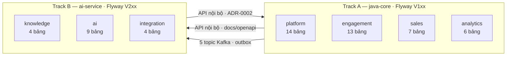
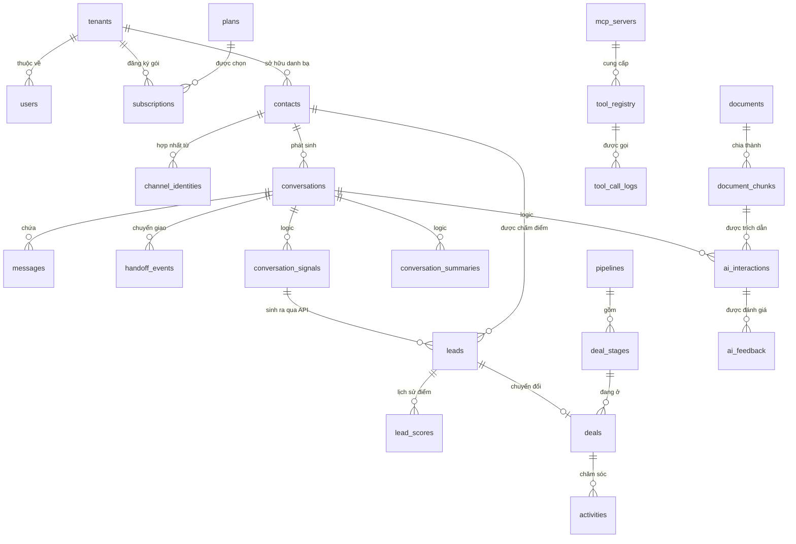
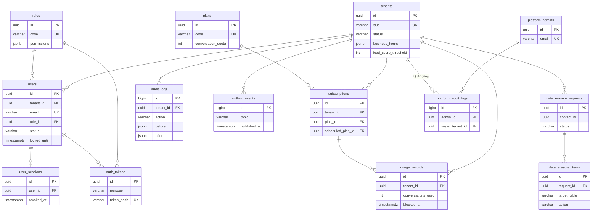
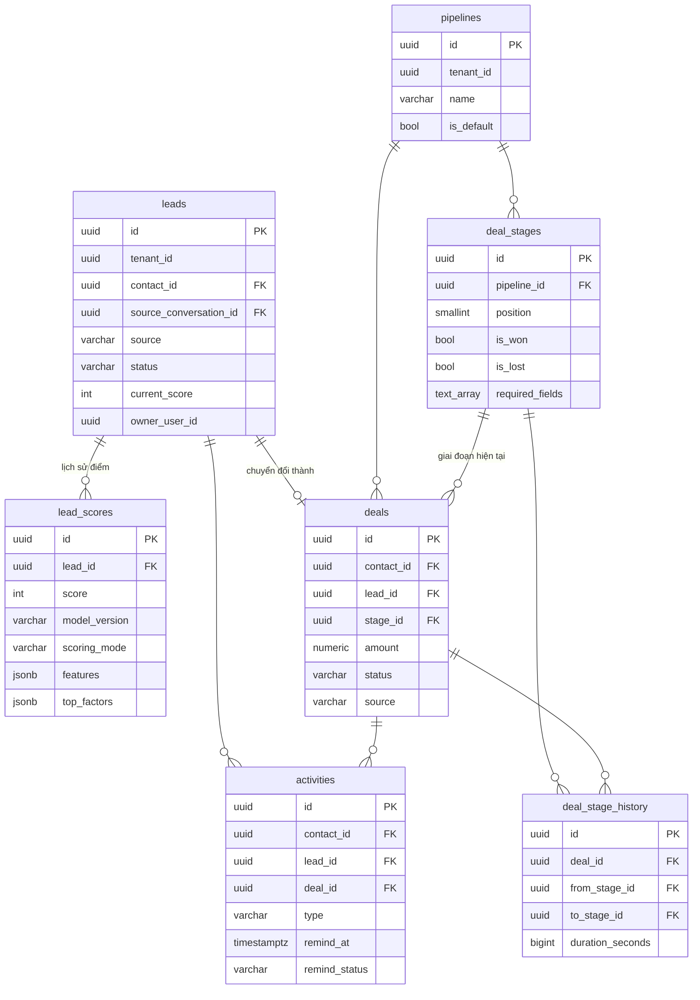
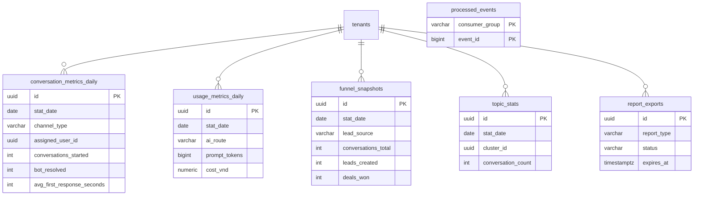
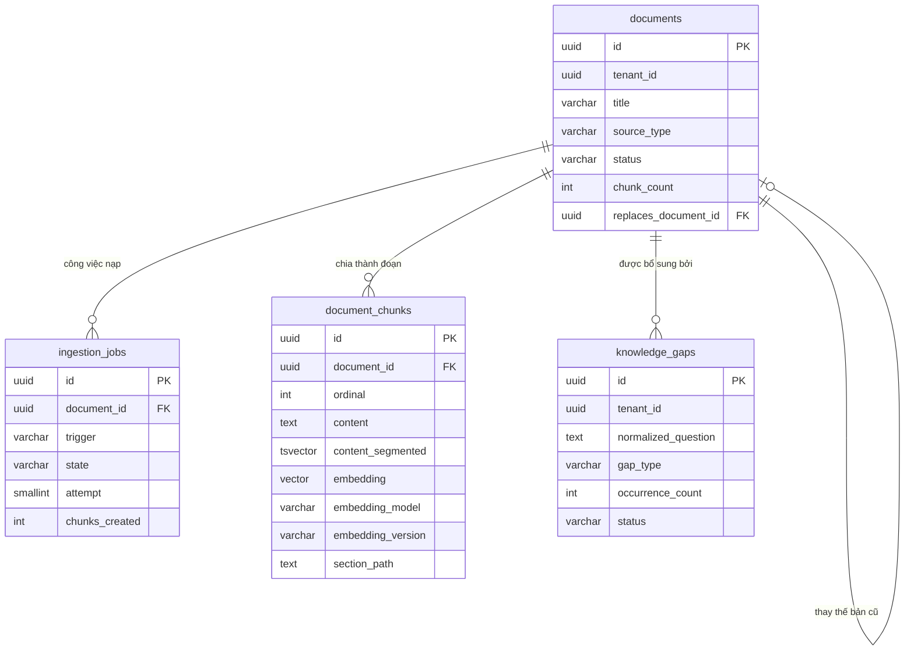
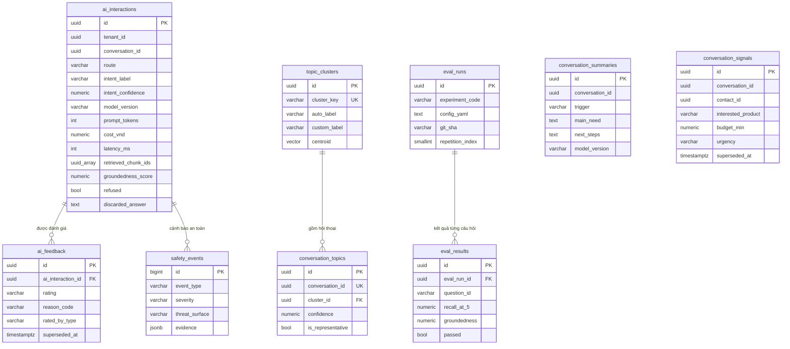
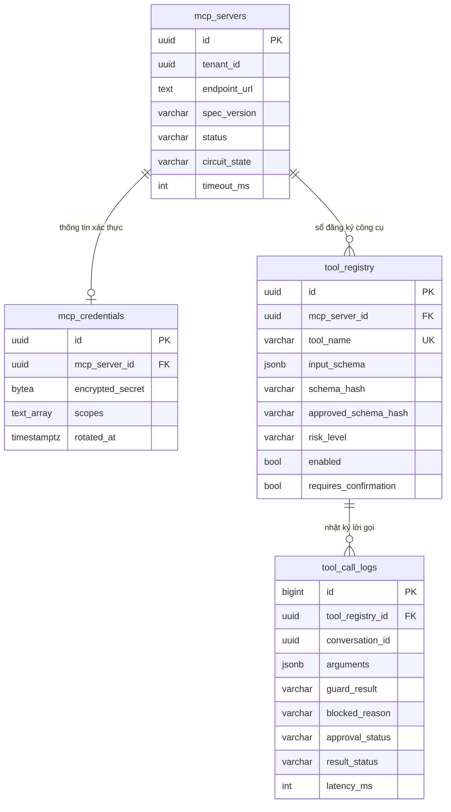

# ERD — Chatbot AI CSKH tích hợp CRM cho doanh nghiệp vừa và nhỏ

Lược đồ cơ sở dữ liệu đầy đủ: **57 bảng** trên **7 schema**, dẫn xuất trực tiếp từ 6 tài liệu đặc
tả use case (8 actor, UC001–UC042).

---

## 1. Phạm vi và nguồn

| Nguồn | Vai trò |
|---|---|
| `docs/plan/Dac-ta-UseCase-Dot1..6.docx` | **Nguồn duy nhất** của thiết kế. Mọi bảng phải truy được về ít nhất một use case |
| Kế hoạch phần 9 — Lược đồ dữ liệu | Bản phác ban đầu. Chỗ nào ERD đi khác, xem mục 17 |
| ADR-0001 | Cô lập đa khách thuê bằng Row-Level Security |
| ADR-0002 | `ai-service` không nối thẳng bảng nghiệp vụ của Track A |
| ADR-0003 | Outbox pattern — ghi sự kiện trong cùng transaction nghiệp vụ |
| ADR-0007 | pgvector thay cơ sở dữ liệu vector riêng |
| `docs/threat-model.md` | Bề mặt tấn công T1–T8, quyết định các cột kiểm toán |

Mã nguồn hiện có trong repo (`Lead`, `LeadStatus`, hai `migration/README.md`) là **khung dựng
tạm**. Sau khi ERD này được chốt thì mã nguồn chỉnh theo ERD, không phải ngược lại — danh sách
việc phải chỉnh nằm ở cuối mục 17.

### Quy mô

| Schema | Làn | Flyway | Số bảng |
|---|---|---|---|
| `platform` | Track A | V101–V105 | 14 |
| `engagement` | Track A | V106–V108 | 13 |
| `sales` | Track A | V109 | 7 |
| `analytics` | Track A | V110–V111 | 6 |
| `knowledge` | Track B | V202–V203 | 4 |
| `ai` | Track B | V204–V206 | 9 |
| `integration` | Track B | V207–V208 | 4 |
| | | | **57** |

★ = ba bảng đắt giá nhất về mặt điểm số (kế hoạch mục 9.1).
‡ = hai bảng duy nhất **không** truy về use case nào; chúng phục vụ 11 thí nghiệm E1–E11 của
chương 5 và đã có trong phần 9 kế hoạch.

---

## 2. Quy ước chung — áp dụng cho toàn bộ 57 bảng

| Chủ đề | Quy ước | Vì sao |
|---|---|---|
| Tên bảng | số nhiều, `snake_case`, không dấu | thống nhất với `docs/events/` và JPA |
| Khóa chính nghiệp vụ | `id uuid PRIMARY KEY DEFAULT gen_random_uuid()` | không lộ số lượng bản ghi ra ngoài, ghép được giữa hai làn |
| Khóa chính bảng nhật ký | `id bigint GENERATED ALWAYS AS IDENTITY` | 6 bảng: `outbox_events`, `audit_logs`, `platform_audit_logs`, `processed_events`, `safety_events`, `tool_call_logs`. `outbox_events.id` chính là `event_id` mà `docs/events/*.json` khai kiểu integer |
| Cô lập tenant | `tenant_id uuid NOT NULL` trên **mọi** bảng nghiệp vụ | RLS lọc ngay trên bảng bị truy vấn, nên cột phải nằm tại chỗ dù suy ra được từ bảng cha |
| Dấu thời gian | `timestamptz`, lưu UTC. `created_at NOT NULL DEFAULT now()`, `updated_at` | `tenants.timezone` chỉ dùng khi hiển thị và khi xét giờ làm việc (UC010 luồng 7.1) |
| Enum | `varchar(30)` + `CHECK (col IN (...))` | thêm giá trị không phải `ALTER TYPE`; ánh xạ thẳng `@Enumerated(EnumType.STRING)` |
| Tiền | `cost_vnd numeric(16,4)` · `amount numeric(18,2)` | chi phí một lượt gọi mô hình nhỏ hơn một đồng, làm tròn sớm là mất số liệu chương 5 |
| Dữ liệu hình dạng thay đổi | `jsonb` | giá trị trước/sau khi kiểm toán, vector đặc trưng, lược đồ tham số công cụ |
| Danh sách | `text[]`, `uuid[]` | tên miền được phép, `scopes`, `retrieved_chunk_ids` |
| Xóa | xóa mềm bằng `status` / `deleted_at` / `anonymized_at`; bảng nhật ký chỉ ghi thêm | UC016 luồng 5a và UC040 luồng 2.2 đều cấm xóa vật lý |
| Bí mật | `bytea` đã mã hóa + `key_id`, không bao giờ lưu văn bản thô | UC008 bước 7, UC021 bước 11 |

### Ba ràng buộc bất biến

1. **FK phức hợp chống lẫn tenant.** Bảng cha khai thêm `UNIQUE (id, tenant_id)`; bảng con khai
   `FOREIGN KEY (conversation_id, tenant_id) REFERENCES engagement.conversations (id, tenant_id)`.
   Chỉ có FK đơn thì RLS chặn được **truy vấn** nhưng không chặn được một bản ghi con trỏ sang
   tenant khác.
2. **Không FK liên làn.** Mọi tham chiếu Track A ↔ Track B là tham chiếu logic — xem mục 12.
3. **`tenant_id` ở schema Track B không có FK sang `platform.tenants`.** Nó chỉ là giá trị dùng
   cho RLS. Đây là hệ quả trực tiếp của điều 2, dễ bị quên nhất khi viết migration V2xx.

---

## 3. Bản đồ schema và ranh giới sở hữu



`sales.lead_scores` là **ngoại lệ duy nhất**: bảng nằm trong schema của Track A, Track B ghi vào
bằng `PUT /internal/leads/{leadId}/score` chứ không nối thẳng.

---

## 4. Sơ đồ tổng quan — các cụm thực thể



---

## 5. Schema `platform` — 14 bảng (Track A, V101–V105)



### 5.1. `platform.tenants` — doanh nghiệp thuê bao

UC001 · UC004 · UC007 · UC015 · UC016 · UC030 · UC031

| Cột | Kiểu | Ràng buộc | Ghi chú |
|---|---|---|---|
| `id` | uuid | PK | định danh riêng sinh ở UC001 bước 5 |
| `name` | varchar(200) | NOT NULL | |
| `slug` | varchar(64) | NOT NULL, UNIQUE | mã doanh nghiệp dùng trên URL |
| `industry` | varchar(100) | | lĩnh vực hoạt động (UC001 bước 1) |
| `timezone` | varchar(64) | NOT NULL, DEFAULT `Asia/Ho_Chi_Minh` | |
| `default_locale` | varchar(10) | NOT NULL, DEFAULT `vi-VN` | |
| `business_hours` | jsonb | NOT NULL, DEFAULT `{}` | UC004 bước 2; tính hợp lệ giờ mở/đóng kiểm ở tầng ứng dụng (luồng 5.1) |
| `ai_tone` | varchar(30) | CHECK `PROFESSIONAL` · `FRIENDLY` · `CONCISE` | giọng điệu trả lời của tác tử AI (UC004) |
| `lead_score_threshold` | smallint | NOT NULL, DEFAULT 70, CHECK 0–100 | UC030 bước 7, UC031 |
| `auto_lead_creation` | boolean | NOT NULL, DEFAULT true | UC031 luồng 3.1 |
| `auto_lead_daily_limit` | int | NOT NULL, DEFAULT 100 | UC031 luồng 3.3 |
| `auto_assign_enabled` | boolean | NOT NULL, DEFAULT false | UC015 luồng 1b |
| `restrict_agent_scope` | boolean | NOT NULL, DEFAULT false | UC016 luồng 7.1 |
| `refusal_handoff_threshold` | smallint | NOT NULL, DEFAULT 2 | UC025 bước 8 |
| `summary_turn_threshold` | smallint | NOT NULL, DEFAULT 6 | UC026 tiền điều kiện |
| `message_retention_days` | int | | chính sách lưu trữ có thời hạn (Nghị định 13) |
| `status` | varchar(30) | NOT NULL, CHECK `TRIAL` · `ACTIVE` · `SUSPENDED` · `EXPIRED` | UC007 |
| `suspended_reason` | text | | UC007 bước 8–9 bắt buộc nhập lý do |
| `suspended_at` | timestamptz | | |
| `created_at` · `updated_at` | timestamptz | | |

Không có cột `tenant_id` — chính nó là tenant. Policy RLS so `id` với `app.tenant_id` (mục 13).

### 5.2. `platform.plans` — gói dịch vụ

UC003 bước 4 · UC005 · UC006 · UC017 luồng 9.1 · UC018 bước 5

| Cột | Kiểu | Ràng buộc | Ghi chú |
|---|---|---|---|
| `id` | uuid | PK | |
| `code` | varchar(30) | NOT NULL, UNIQUE | `TRIAL` · `STARTER` · `GROWTH` · `PRO` |
| `name` | varchar(100) | NOT NULL | |
| `monthly_price_vnd` | numeric(14,2) | NOT NULL | |
| `conversation_quota` | int | NOT NULL | hạn mức hội thoại mỗi chu kỳ — trục thu phí của mô hình SaaS |
| `token_quota` | bigint | NOT NULL | |
| `max_users` | int | NOT NULL | UC003 bước 4 |
| `max_documents` | int | NOT NULL | UC018 bước 5 |
| `max_tags` | int | NOT NULL | UC017 luồng 9.1 |
| `is_active` | boolean | NOT NULL, DEFAULT true | |
| `sort_order` | smallint | NOT NULL | thứ tự trong bảng so sánh gói (UC005 bước 3) |
| `created_at` · `updated_at` | timestamptz | | |

**Không có `tenant_id`** — gói dịch vụ do A04 định nghĩa ở cấp nền tảng, mọi tenant đọc chung.
Không bật RLS; cấp `SELECT` cho `crm_app`, `INSERT/UPDATE` chỉ cho luồng quản trị nền tảng.

### 5.3. `platform.subscriptions` — thuê bao theo chu kỳ

UC001 bước 7 · UC005 · UC007 · UC009 luồng 11.1

| Cột | Kiểu | Ràng buộc | Ghi chú |
|---|---|---|---|
| `id` | uuid | PK | |
| `tenant_id` | uuid | NOT NULL, FK → `tenants` | |
| `plan_id` | uuid | NOT NULL, FK → `plans` | |
| `status` | varchar(30) | CHECK `TRIALING` · `ACTIVE` · `PAST_DUE` · `EXPIRED` · `CANCELED` | UC005 luồng 2.1 chuyển hệ thống sang chế độ chỉ đọc |
| `period_start` · `period_end` | timestamptz | NOT NULL | |
| `scheduled_plan_id` | uuid | FK → `plans` | UC005 luồng 6.3 — hạ gói chỉ có hiệu lực từ chu kỳ kế tiếp |
| `scheduled_effective_at` | timestamptz | | |
| `previous_plan_id` | uuid | FK → `plans` | phục vụ báo cáo nâng/hạ gói |
| `changed_by` | uuid | FK → `users` | |
| `created_at` · `updated_at` | timestamptz | | |

`UNIQUE (tenant_id, period_start)` · index `(tenant_id, status)`.

### 5.4. `platform.usage_records` — mức sử dụng của chu kỳ

UC001 bước 7 · UC005 bước 8 · UC006 · UC010 luồng 6.1 · UC019 luồng 7.3

| Cột | Kiểu | Ràng buộc | Ghi chú |
|---|---|---|---|
| `id` | uuid | PK | |
| `tenant_id` | uuid | NOT NULL | |
| `subscription_id` | uuid | NOT NULL, FK → `subscriptions` | |
| `period_start` · `period_end` | timestamptz | NOT NULL | |
| `conversation_quota` | int | NOT NULL | **chụp lại** hạn mức áp dụng cho chu kỳ. UC005 bước 8 áp hạn mức mới ngay cho chu kỳ hiện tại, nên không đọc động từ `plans` |
| `token_quota` | bigint | NOT NULL | |
| `conversations_used` | int | NOT NULL, DEFAULT 0 | |
| `tokens_used` | bigint | NOT NULL, DEFAULT 0 | |
| `cost_vnd` | numeric(16,4) | NOT NULL, DEFAULT 0 | |
| `warned_at` | timestamptz | | mốc 80% (UC006 luồng 3.1) |
| `blocked_at` | timestamptz | | mốc 100% — ngừng xử lý tự động, vẫn nhận tin (UC006 luồng 3.4) |
| `updated_at` | timestamptz | | |

`UNIQUE (tenant_id, period_start)`.

### 5.5. `platform.users` — người dùng của doanh nghiệp

UC001 bước 6 · UC002 · UC003

| Cột | Kiểu | Ràng buộc | Ghi chú |
|---|---|---|---|
| `id` | uuid | PK | |
| `tenant_id` | uuid | NOT NULL, FK → `tenants` | |
| `email` | varchar(200) | NOT NULL, **UNIQUE toàn hệ thống** | UC001 bước 3 yêu cầu duy nhất trong toàn hệ thống. Hệ quả: một địa chỉ thư không thể thuộc hai doanh nghiệp — ghi rõ trong báo cáo |
| `password_hash` | varchar(100) | | BCrypt (UC001 bước 6). NULL khi đang chờ nhận lời mời |
| `full_name` | varchar(200) | | |
| `role_id` | uuid | NOT NULL, FK → `roles` | một người dùng một vai trò (UC003 bước 2) |
| `status` | varchar(30) | NOT NULL, CHECK `PENDING` · `ACTIVE` · `DISABLED` | UC003 bước 6 và luồng 3a |
| `email_verified_at` | timestamptz | | UC001 bước 9, luồng 9.2 cho phép gửi lại |
| `failed_login_count` | smallint | NOT NULL, DEFAULT 0 | UC002 luồng 4.1 — 5 lần trong 15 phút |
| `locked_until` | timestamptz | | UC002 luồng 4.2 |
| `last_login_at` | timestamptz | | |
| `last_login_ip` | inet | | |
| `invited_by` | uuid | FK → `users` | |
| `disabled_at` · `disabled_by` | timestamptz · uuid | | |
| `created_at` · `updated_at` | timestamptz | | |

`UNIQUE (tenant_id, email)` (UC003 bước 5) · `UNIQUE (id, tenant_id)` cho FK phức hợp.

### 5.6. `platform.platform_admins` — quản trị hệ thống (A04)

UC002 · UC007 · UC040 luồng 1.1

| Cột | Kiểu | Ràng buộc | Ghi chú |
|---|---|---|---|
| `id` | uuid | PK | |
| `email` | varchar(200) | NOT NULL, UNIQUE | |
| `password_hash` | varchar(100) | NOT NULL | |
| `full_name` | varchar(200) | | |
| `status` | varchar(30) | CHECK `ACTIVE` · `DISABLED` | |
| `failed_login_count` | smallint | NOT NULL, DEFAULT 0 | |
| `locked_until` · `last_login_at` | timestamptz | | |
| `created_at` · `updated_at` | timestamptz | | |

**Bảng riêng, không có `tenant_id`, không bật RLS.** A04 không thuộc doanh nghiệp nào. Nhờ tách
bảng mà `users.tenant_id` giữ được `NOT NULL` và policy RLS không phải xử lý giá trị NULL — nếu
nhét A04 vào `users` thì mọi policy đều phải nới lỏng, làm yếu chính cơ chế ở ADR-0001. Việc A04
không đọc được dữ liệu tenant (UC007 luồng 6.1–6.2) trở thành hệ quả tự nhiên: tài khoản này
không bao giờ có `app.tenant_id` để đặt.

### 5.7. `platform.roles` — vai trò và ma trận phân quyền

UC003 · ma trận mục 1.3 của đợt 1

| Cột | Kiểu | Ràng buộc | Ghi chú |
|---|---|---|---|
| `id` | uuid | PK | |
| `code` | varchar(30) | NOT NULL, UNIQUE, CHECK `TENANT_ADMIN` · `AGENT` | A03 và A02. A01 không có tài khoản, A04 ở `platform_admins` |
| `name` | varchar(100) | NOT NULL | |
| `permissions` | jsonb | NOT NULL | ánh xạ thẳng ma trận 1.3, ví dụ `{"conversations":"FULL","contacts":"READ_WRITE","knowledge":"READ","audit":"NONE"}` |
| `description` | text | | |
| `created_at` | timestamptz | | |

**Không có `tenant_id`** — hai vai trò do hệ thống định nghĩa, doanh nghiệp không tự tạo vai trò
mới. Vì vậy không cần bảng `permissions` / `role_permissions` chuẩn hóa (mục 17).

### 5.8. `platform.user_sessions` — phiên làm việc

UC002 bước 5 · UC003 luồng 3a · UC007 bước 10

| Cột | Kiểu | Ràng buộc | Ghi chú |
|---|---|---|---|
| `id` | uuid | PK | |
| `tenant_id` | uuid | NOT NULL | |
| `user_id` | uuid | NOT NULL, FK → `users (id, tenant_id)` | |
| `refresh_token_hash` | varchar(128) | NOT NULL, UNIQUE | chỉ lưu giá trị băm |
| `issued_at` · `expires_at` | timestamptz | NOT NULL | |
| `revoked_at` | timestamptz | | |
| `revoked_reason` | varchar(30) | CHECK `LOGOUT` · `USER_DISABLED` · `TENANT_SUSPENDED` · `PASSWORD_CHANGED` | UC003 luồng 3a và UC007 bước 10 đều phải thu hồi phiên đang mở |
| `ip_address` | inet | | |
| `user_agent` | text | | |

Index bộ phận `(tenant_id, user_id) WHERE revoked_at IS NULL`.

Mã thông báo truy cập RS256 (UC002 bước 5) **không lưu trong cơ sở dữ liệu** — nó tự chứng thực và
có thời hạn ngắn. Chỉ mã làm mới mới cần lưu để thu hồi được.

### 5.9. `platform.auth_tokens` — mã dùng một lần

UC001 bước 9 · UC003 bước 7

| Cột | Kiểu | Ràng buộc | Ghi chú |
|---|---|---|---|
| `id` | uuid | PK | |
| `tenant_id` | uuid | NOT NULL | |
| `purpose` | varchar(30) | NOT NULL, CHECK `EMAIL_VERIFICATION` · `USER_INVITATION` · `PASSWORD_RESET` | |
| `email` | varchar(200) | NOT NULL | |
| `user_id` | uuid | FK → `users` | |
| `role_id` | uuid | FK → `roles` | chỉ dùng với `USER_INVITATION` |
| `token_hash` | varchar(128) | NOT NULL, UNIQUE | |
| `expires_at` | timestamptz | NOT NULL | liên kết thiết lập mật khẩu có thời hạn (UC003 bước 7) |
| `consumed_at` | timestamptz | | |
| `created_by` | uuid | FK → `users` | |
| `created_at` | timestamptz | NOT NULL | |

Index `(tenant_id, purpose, email)` — hỗ trợ luồng gửi lại thư xác thực (UC001 luồng 9.2).

### 5.10. `platform.audit_logs` — nhật ký kiểm toán cấp doanh nghiệp

Xuất hiện ở 20 use case; đọc ở UC040

| Cột | Kiểu | Ràng buộc | Ghi chú |
|---|---|---|---|
| `id` | bigint | PK, IDENTITY | |
| `tenant_id` | uuid | NOT NULL | |
| `actor_type` | varchar(20) | NOT NULL, CHECK `USER` · `AI_AGENT` · `SYSTEM` · `PLATFORM_ADMIN` | |
| `actor_id` | uuid | | |
| `actor_email` | varchar(200) | | chụp lại để bản ghi vẫn đọc được sau khi người dùng bị xóa |
| `action` | varchar(60) | NOT NULL | `LOGIN_SUCCESS`, `LOGIN_FAILED`, `USER_INVITED`, `ROLE_CHANGED`, `CONTACT_MERGED`, `CONVERSATION_ASSIGNED`, `DOCUMENT_DELETED`, `ERASURE_EXECUTED`… |
| `entity_type` · `entity_id` | varchar(60) · uuid | | |
| `before` · `after` | jsonb | | UC004 bước 8, UC016 bước 10, UC017 luồng 3a |
| `reason` | text | | UC015 luồng 1a, UC040 luồng 6.2 |
| `severity` | varchar(20) | NOT NULL, DEFAULT `INFO`, CHECK `INFO` · `WARNING` · `CRITICAL` | UC040 bước 3 lọc theo mức nghiêm trọng |
| `contains_personal_data` | boolean | NOT NULL, DEFAULT false | UC040 luồng 6.3 — che một phần theo mặc định, mở đầy đủ phải nhập lý do |
| `ip_address` | inet | | |
| `user_agent` | text | | |
| `trace_id` | varchar(64) | | nối với `X-Trace-Id` ở header bản tin Kafka |
| `occurred_at` | timestamptz | NOT NULL, DEFAULT now() | |

**Chỉ ghi thêm.** Migration thu hồi `UPDATE`, `DELETE` của `crm_app` trên bảng này để hiện thực
UC040 luồng 2.2 ở tầng cơ sở dữ liệu chứ không chỉ ở tầng ứng dụng.
Index `(tenant_id, occurred_at DESC)` · `(tenant_id, action, occurred_at DESC)` ·
`(tenant_id, actor_id, occurred_at DESC)` · `(tenant_id, severity) WHERE severity <> 'INFO'`.

### 5.11. `platform.platform_audit_logs` — nhật ký cấp nền tảng

UC007 bước 11 · UC040 luồng 1.1

| Cột | Kiểu | Ràng buộc | Ghi chú |
|---|---|---|---|
| `id` | bigint | PK, IDENTITY | |
| `admin_id` | uuid | NOT NULL, FK → `platform_admins` | |
| `admin_email` | varchar(200) | NOT NULL | |
| `action` | varchar(60) | NOT NULL | `TENANT_SUSPENDED`, `TENANT_ACTIVATED`, `PLAN_CREATED`, `TENANT_DATA_ACCESS_DENIED` |
| `target_tenant_id` | uuid | FK → `tenants` | doanh nghiệp **bị tác động**, không phải chủ sở hữu bản ghi |
| `reason` | text | | bắt buộc với thao tác tạm ngưng (UC007 bước 8–9) |
| `before` · `after` | jsonb | | |
| `ip_address` | inet | | |
| `occurred_at` | timestamptz | NOT NULL | |

**Không có `tenant_id`, không bật RLS.** Bảng tách riêng chính là cách hiện thực UC040 luồng 1.2:
A04 truy vấn bảng này và không bao giờ thấy `audit_logs` của doanh nghiệp.

### 5.12. `platform.outbox_events` — hộp thư đi (ADR-0003)

UC011 bước 9 · UC015 bước 7 · UC017 bước 9 · UC018 bước 8 · UC031 bước 6 · UC032 bước 9

| Cột | Kiểu | Ràng buộc | Ghi chú |
|---|---|---|---|
| `id` | bigint | PK, IDENTITY | chính là `event_id` trong `docs/events/*.json` |
| `tenant_id` | uuid | NOT NULL | khóa phân vùng Kafka |
| `aggregate_type` | varchar(50) | NOT NULL | `Conversation`, `Lead`, `Document`… |
| `aggregate_id` | uuid | NOT NULL | |
| `event_type` | varchar(60) | NOT NULL | `ConversationStarted`, `LeadCreated`… |
| `topic` | varchar(60) | NOT NULL, CHECK 5 topic | `crm.conversation.v1` · `crm.lead.v1` · `crm.ai-interaction.v1` · `crm.usage.v1` · `crm.document.v1` |
| `event_version` | int | NOT NULL, DEFAULT 1 | |
| `payload` | jsonb | NOT NULL | |
| `trace_id` | varchar(64) | | đưa lên header `X-Trace-Id`, không nằm trong payload |
| `created_at` | timestamptz | NOT NULL, DEFAULT now() | |
| `published_at` | timestamptz | | |

**Index bộ phận `(created_at) WHERE published_at IS NULL`** — tiến trình phát chỉ quét phần chưa
gửi, kích thước chỉ mục không tăng theo lịch sử.

### 5.13. `platform.data_erasure_requests` — yêu cầu xóa dữ liệu cá nhân

UC041 (Nghị định 13/2023/NĐ-CP)

| Cột | Kiểu | Ràng buộc | Ghi chú |
|---|---|---|---|
| `id` | uuid | PK | |
| `tenant_id` | uuid | NOT NULL | |
| `contact_id` | uuid | NOT NULL, FK → `engagement.contacts (id, tenant_id)` | cùng làn nên đây là FK thật |
| `legal_basis` | text | NOT NULL | căn cứ của yêu cầu (UC041 bước 5) |
| `identity_verified_by` | uuid | NOT NULL, FK → `users` | tiền điều kiện: quản trị viên đã xác minh danh tính |
| `identity_verified_at` | timestamptz | NOT NULL | |
| `scope` | jsonb | NOT NULL | phạm vi ảnh hưởng hiển thị ở bước 3–4 |
| `status` | varchar(30) | NOT NULL, CHECK `PENDING` · `IN_PROGRESS` · `COMPLETED` · `PARTIALLY_FAILED` | |
| `external_systems_note` | text | | UC041 luồng 6.2 — phạm vi xóa không vươn tới hệ thống ngoài |
| `certificate_uri` | text | | biên bản xác nhận (bước 11) |
| `requested_at` · `started_at` · `completed_at` | timestamptz | | |
| `executed_by` | uuid | FK → `users` | |
| `created_at` · `updated_at` | timestamptz | | |

### 5.14. `platform.data_erasure_items` — tiến độ xóa theo từng bảng

UC041 luồng 6.4

| Cột | Kiểu | Ràng buộc | Ghi chú |
|---|---|---|---|
| `id` | uuid | PK | |
| `tenant_id` | uuid | NOT NULL | |
| `request_id` | uuid | NOT NULL, FK → `data_erasure_requests` | |
| `target_schema` | varchar(30) | NOT NULL | |
| `target_table` | varchar(60) | NOT NULL | |
| `action` | varchar(20) | NOT NULL, CHECK `DELETE` · `ANONYMIZE` · `KEEP_AGGREGATE` | bảng đối chiếu ở mục 15 |
| `status` | varchar(20) | NOT NULL, CHECK `PENDING` · `DONE` · `FAILED` | |
| `affected_rows` | int | | |
| `error_message` | text | | |
| `executed_at` | timestamptz | | |

`UNIQUE (request_id, target_schema, target_table)`.

Đây là bảng khiến UC041 luồng 6.4 khả thi: khi lỗi giữa chừng, hệ thống biết chính xác bảng nào đã
xong để chạy lại đúng phần dở dang, thay vì để dữ liệu ở trạng thái nửa vời. Đồng thời là bằng
chứng phạm vi khi sinh biên bản ở bước 11.

---

## 6. Schema `engagement` — 13 bảng (Track A, V106–V108)

```mermaid
erDiagram
    contacts ||--o{ channel_identities : "hợp nhất danh tính"
    contacts ||--o{ conversations : ""
    contacts ||--o{ notes : ""
    contacts ||--o{ contact_tags : ""
    contacts ||--o| contacts : "đã hợp nhất vào"
    channel_integrations ||--o{ channel_identities : ""
    channel_integrations ||--o{ conversations : ""
    channel_identities ||--o{ conversations : ""
    conversations ||--o{ messages : ""
    conversations ||--o{ handoff_events : ""
    conversations ||--o{ notes : ""
    messages ||--o{ message_attachments : ""
    tags ||--o{ contact_tags : ""
    tags ||--o{ assignment_rules : "điều kiện"

    contacts {
        uuid id PK
        uuid tenant_id
        varchar phone
        varchar email
        varchar status
        uuid merged_into_contact_id FK
        timestamptz anonymized_at
    }
    channel_identities {
        uuid id PK
        uuid contact_id FK
        varchar channel_type
        varchar external_user_id UK
    }
    channel_integrations {
        uuid id PK
        varchar channel_type
        varchar external_account_id UK
        bytea webhook_secret_encrypted
        varchar status
    }
    widget_configs {
        uuid id PK
        uuid tenant_id UK
        varchar public_key UK
        text_array allowed_domains
    }
    conversations {
        uuid id PK
        uuid contact_id FK
        varchar status
        bool auto_reply_enabled
        uuid assigned_user_id
        bool bot_resolved
        timestamptz first_response_at
    }
    messages {
        uuid id PK
        uuid conversation_id FK
        varchar sender_type
        varchar external_message_id UK
        varchar delivery_status
    }
    message_attachments {
        uuid id PK
        uuid message_id FK
        text storage_uri
    }
    handoff_events {
        uuid id PK
        uuid conversation_id FK
        varchar direction
        varchar reason
        bool counts_against_ai_quality
    }
    assignment_rules {
        uuid id PK
        varchar strategy
        varchar applies_to
        uuid tag_id FK
    }
    notes {
        uuid id PK
        uuid contact_id FK
        uuid author_user_id
    }
    tags {
        uuid id PK
        varchar normalized_name UK
    }
    contact_tags {
        uuid contact_id PK
        uuid tag_id PK
    }
    canned_responses {
        uuid id PK
        varchar shortcut UK
    }
```



### 6.1. `engagement.contacts` — danh bạ khách hàng

UC011 bước 7 · UC016 · UC029 luồng 4.2 · UC041

| Cột | Kiểu | Ràng buộc | Ghi chú |
|---|---|---|---|
| `id` | uuid | PK | |
| `tenant_id` | uuid | NOT NULL | |
| `full_name` | varchar(200) | | |
| `phone` | varchar(30) | | |
| `email` | varchar(200) | | |
| `primary_channel` | varchar(30) | CHECK `WEB_WIDGET` · `ZALO` · `FACEBOOK` · `PHONE` | `PHONE` cho khách tạo thủ công (UC016 luồng 1b) |
| `status` | varchar(30) | NOT NULL, CHECK `ACTIVE` · `MERGED` · `ANONYMIZED` | |
| `merged_into_contact_id` | uuid | FK → `contacts (id, tenant_id)` | UC016 luồng 5a — đánh dấu đã hợp nhất thay vì xóa vật lý |
| `consent_granted` | boolean | NOT NULL, DEFAULT false | Nghị định 13 |
| `consent_at` | timestamptz | | dấu thời gian đồng ý |
| `consent_source` | varchar(30) | CHECK `WIDGET` · `ZALO` · `FACEBOOK` · `AGENT_MANUAL` | |
| `last_interaction_at` | timestamptz | | UC016 bước 3 |
| `anonymized_at` | timestamptz | | UC041 |
| `created_at` · `updated_at` | timestamptz | | |

`UNIQUE (id, tenant_id)`.
**Không đặt UNIQUE trên `(tenant_id, phone)` hay `(tenant_id, email)`** — UC016 luồng 9.1 chỉ
*cảnh báo* trùng lặp rồi đề xuất hợp nhất, không chặn. Ràng buộc cứng ở đây sẽ làm luồng nghiệp vụ
đã đặc tả không thực hiện được.
Index `(tenant_id, phone) WHERE phone IS NOT NULL` · `(tenant_id, email) WHERE email IS NOT NULL` ·
GIN trigram trên `full_name` (tìm kiếm theo tên, UC016 bước 4) · `(tenant_id, last_interaction_at DESC)`.

### 6.2. `engagement.channel_identities` — danh tính trên từng kênh

UC009 luồng 11.3 · UC011 bước 6 · UC016 bước 7

| Cột | Kiểu | Ràng buộc | Ghi chú |
|---|---|---|---|
| `id` | uuid | PK | |
| `tenant_id` | uuid | NOT NULL | |
| `contact_id` | uuid | NOT NULL, FK → `contacts (id, tenant_id)` | UC016 luồng 4a chuyển toàn bộ danh tính về bản ghi được giữ lại |
| `channel_type` | varchar(30) | NOT NULL, CHECK `WEB_WIDGET` · `ZALO` · `FACEBOOK` | |
| `channel_integration_id` | uuid | FK → `channel_integrations (id, tenant_id)` | NULL với `WEB_WIDGET` |
| `external_user_id` | varchar(200) | NOT NULL | Zalo user id · Facebook PSID · **mã phiên trên trình duyệt** với Web Widget |
| `display_name` | varchar(200) | | |
| `avatar_url` | text | | |
| `origin_domain` | varchar(255) | | tên miền nhúng widget, đối chiếu ở UC009 bước 10 |
| `first_seen_at` · `last_seen_at` | timestamptz | | |
| `created_at` | timestamptz | | |

`UNIQUE (tenant_id, channel_type, external_user_id)` — chính là phép tra cứu ở UC011 bước 6.
`UNIQUE (id, tenant_id)`.

Phiên khách ẩn danh của Web Widget **là một dòng của bảng này**, không phải bảng riêng: UC011 đã
quy mọi danh tính rời rạc về cùng một mô hình, và nhờ vậy UC009 luồng 11.3 (khôi phục phiên cũ
trên cùng trình duyệt) chỉ là phép tra cứu theo `external_user_id`.

### 6.3. `engagement.channel_integrations` — kênh đã kết nối

UC008 · UC013 bước 7

| Cột | Kiểu | Ràng buộc | Ghi chú |
|---|---|---|---|
| `id` | uuid | PK | |
| `tenant_id` | uuid | NOT NULL | |
| `channel_type` | varchar(30) | NOT NULL, CHECK `ZALO` · `FACEBOOK` | |
| `external_account_id` | varchar(200) | NOT NULL | Zalo OA id · Facebook Page id |
| `account_name` | varchar(200) | | hiển thị ở UC008 bước 11 |
| `credentials_encrypted` | bytea | NOT NULL | mã truy cập đã mã hóa (UC008 bước 7) |
| `webhook_secret_encrypted` | bytea | NOT NULL | khóa bí mật riêng cho kênh — bề mặt T1 |
| `key_id` | varchar(50) | NOT NULL | định danh khóa mã hóa, phục vụ luân chuyển |
| `token_expires_at` | timestamptz | | |
| `status` | varchar(30) | NOT NULL, CHECK `DISCONNECTED` · `PENDING_VERIFY` · `ACTIVE` · `ERROR` | UC008 luồng 9.2 giữ ở trạng thái chờ khi xác minh webhook thất bại |
| `verified_at` | timestamptz | | |
| `last_error` | text | | thông tin chẩn đoán ở UC008 luồng 9.2 |
| `send_window_hours` | smallint | | UC013 luồng 8.1 — cửa sổ thời gian nền tảng cho phép gửi chủ động |
| `rate_limit_per_minute` | int | | UC013 luồng 8.6 |
| `connected_by` | uuid | FK → `users` | |
| `disconnected_at` | timestamptz | | UC008 luồng 4a giữ nguyên dữ liệu hội thoại cũ |
| `created_at` · `updated_at` | timestamptz | | |

**`UNIQUE (channel_type, external_account_id)` — không kèm `tenant_id`.** Đây là ràng buộc duy
nhất trong toàn ERD cố ý vượt ra ngoài phạm vi một doanh nghiệp, để hiện thực UC008 luồng 7.4: một
tài khoản Zalo OA hoặc Facebook Page chỉ được kết nối bởi đúng một doanh nghiệp. Nếu kèm
`tenant_id` vào ràng buộc thì hai doanh nghiệp cùng nối một trang, và webhook không còn định tuyến
xác định được.
`UNIQUE (id, tenant_id)`.

### 6.4. `engagement.widget_configs` — cấu hình Web Widget

UC009

| Cột | Kiểu | Ràng buộc | Ghi chú |
|---|---|---|---|
| `id` | uuid | PK | |
| `tenant_id` | uuid | NOT NULL, UNIQUE | một cấu hình cho mỗi doanh nghiệp |
| `public_key` | varchar(64) | NOT NULL, UNIQUE | khóa công khai gắn trong mã nhúng (UC009 bước 7) |
| `primary_color` | varchar(9) | | |
| `position` | varchar(20) | CHECK `BOTTOM_RIGHT` · `BOTTOM_LEFT` | |
| `greeting_message` | text | | |
| `avatar_url` | text | | |
| `allowed_domains` | text[] | NOT NULL, DEFAULT `{}` | UC009 bước 10 đối chiếu tên miền gốc; luồng 10.2 ghi nhận nỗ lực truy cập bị từ chối |
| `is_active` | boolean | NOT NULL, DEFAULT true | |
| `created_at` · `updated_at` | timestamptz | | |

Cấu hình giao diện đọc động từ máy chủ nên UC009 luồng 4a đổi giao diện không cần sinh lại mã nhúng.

### 6.5. `engagement.conversations` — hội thoại

UC010 · UC011 bước 8 · UC012 · UC014 · UC015

| Cột | Kiểu | Ràng buộc | Ghi chú |
|---|---|---|---|
| `id` | uuid | PK | |
| `tenant_id` | uuid | NOT NULL | |
| `contact_id` | uuid | NOT NULL, FK → `contacts (id, tenant_id)` | UC011 luồng 8.2 mở hội thoại mới nhưng vẫn cùng khách hàng |
| `channel_identity_id` | uuid | NOT NULL, FK → `channel_identities (id, tenant_id)` | |
| `channel_type` | varchar(30) | NOT NULL | chép lại để lọc và tổng hợp không phải join |
| `channel_integration_id` | uuid | FK → `channel_integrations (id, tenant_id)` | UC013 bước 7 xác định kênh gốc |
| `status` | varchar(30) | NOT NULL, CHECK `BOT_HANDLING` · `PENDING_AGENT` · `AGENT_HANDLING` · `RESOLVED` · `CLOSED` | |
| `auto_reply_enabled` | boolean | NOT NULL, DEFAULT true | UC014 bước 4 tắt, luồng 1a–2a bật lại |
| `assigned_user_id` | uuid | FK → `users (id, tenant_id)` | UC015 bước 6 |
| `assigned_at` | timestamptz | | |
| `priority` | smallint | NOT NULL, DEFAULT 0 | UC014 luồng 7.2 nâng mức ưu tiên khi không ai tiếp nhận |
| `bot_resolved` | boolean | | UC014 bước 9 — cơ sở của chỉ số "tỉ lệ hội thoại tác tử AI xử lý trọn vẹn" ở UC036/UC038/UC039 |
| `first_response_at` | timestamptz | | UC013 bước 9 — chỉ ghi khi là phản hồi đầu tiên của **con người** |
| `resolved_at` · `resolved_by` | timestamptz · uuid | | |
| `closed_reason` | varchar(50) | | |
| `last_message_at` | timestamptz | | sắp xếp hộp thư (UC012 bước 2) |
| `last_message_preview` | varchar(300) | | đoạn trích tin cuối (UC012 bước 3) |
| `message_count` | int | NOT NULL, DEFAULT 0 | |
| `unread_count` | int | NOT NULL, DEFAULT 0 | |
| `last_read_at` | timestamptz | | UC012 bước 10 |
| `consecutive_refusals` | smallint | NOT NULL, DEFAULT 0 | UC025 bước 8 — đếm số lần từ chối liên tiếp |
| `started_at` | timestamptz | NOT NULL | |
| `created_at` · `updated_at` | timestamptz | | |

`UNIQUE (id, tenant_id)`.
Index `(tenant_id, last_message_at DESC)` · `(tenant_id, status, last_message_at DESC)` ·
`(tenant_id, assigned_user_id, status)` · `(tenant_id, contact_id, started_at DESC)`.

Trạng thái "đang có nhân viên khác xem hội thoại này" (UC012 luồng 8a) **không lưu ở cơ sở dữ
liệu** — đó là hiện diện tức thời, giữ trên Redis với thời hạn ngắn. Ghi vào bảng sẽ tạo ra một
lượt ghi cho mỗi lần mở hội thoại mà không đem lại giá trị nào sau khi phiên kết thúc.

### 6.6. `engagement.assignment_rules` — quy tắc phân công

UC015 luồng 1b · UC031 bước 5

| Cột | Kiểu | Ràng buộc | Ghi chú |
|---|---|---|---|
| `id` | uuid | PK | |
| `tenant_id` | uuid | NOT NULL | |
| `name` | varchar(100) | NOT NULL | |
| `applies_to` | varchar(20) | NOT NULL, CHECK `CONVERSATION` · `LEAD` | dùng chung cho UC015 và UC031 |
| `strategy` | varchar(30) | NOT NULL, CHECK `LEAST_BUSY` · `ROUND_ROBIN` · `FIXED_USER` | UC015 luồng 2b "nhân viên đang có ít việc nhất" |
| `channel_type` | varchar(30) | | điều kiện; NULL = mọi kênh |
| `tag_id` | uuid | FK → `tags (id, tenant_id)` | điều kiện theo thẻ |
| `target_user_id` | uuid | FK → `users (id, tenant_id)` | dùng với `FIXED_USER` |
| `max_concurrent` | int | | UC031 luồng 5.1 — hạn mức số việc đang xử lý |
| `priority` | smallint | NOT NULL, DEFAULT 0 | thứ tự xét quy tắc |
| `is_active` | boolean | NOT NULL, DEFAULT true | |
| `created_at` · `updated_at` | timestamptz | | |

### 6.7. `engagement.messages` — tin nhắn

UC010 · UC011 · UC013

| Cột | Kiểu | Ràng buộc | Ghi chú |
|---|---|---|---|
| `id` | uuid | PK | |
| `tenant_id` | uuid | NOT NULL | |
| `conversation_id` | uuid | NOT NULL, FK → `conversations (id, tenant_id)` | |
| `sender_type` | varchar(20) | NOT NULL, CHECK `CUSTOMER` · `BOT` · `AGENT` · `SYSTEM` | UC012 bước 8 phân biệt rõ ba nguồn |
| `sender_user_id` | uuid | FK → `users (id, tenant_id)` | chỉ khi `AGENT` |
| `channel_integration_id` | uuid | FK → `channel_integrations (id, tenant_id)` | |
| `external_message_id` | varchar(200) | | định danh tin nhắn của nền tảng |
| `content` | text | | |
| `content_type` | varchar(30) | NOT NULL, CHECK `TEXT` · `IMAGE` · `FILE` · `STICKER` · `LOCATION` · `SYSTEM_NOTE` | UC011 luồng 5.2 lưu loại không hỗ trợ dưới dạng ghi chú hệ thống |
| `delivery_status` | varchar(20) | NOT NULL, CHECK `PENDING` · `SENT` · `DELIVERED` · `FAILED` | UC013 luồng 8.5 giữ ở `PENDING` khi thử lại |
| `failure_reason` | varchar(200) | | |
| `retry_count` | smallint | NOT NULL, DEFAULT 0 | cơ chế giãn cách tăng dần |
| `created_at` | timestamptz | NOT NULL | |
| `sent_at` | timestamptz | | |

**`UNIQUE (channel_integration_id, external_message_id)`** — đây là "bảng khóa duy nhất" mà UC011
bước 4 nói tới. Webhook được gửi lại là chuyện chắc chắn xảy ra, không phải rủi ro; ràng buộc này
biến việc chống trùng thành `INSERT … ON CONFLICT DO NOTHING` thay vì một phép kiểm tra có khoảng
trống tranh chấp.
`UNIQUE (id, tenant_id)` · index `(tenant_id, conversation_id, created_at DESC)` — phân trang bằng
con trỏ ở UC012 luồng 8.2.

### 6.8. `engagement.message_attachments` — tệp đính kèm

UC010 luồng 3.1

| Cột | Kiểu | Ràng buộc | Ghi chú |
|---|---|---|---|
| `id` | uuid | PK | |
| `tenant_id` | uuid | NOT NULL | |
| `message_id` | uuid | NOT NULL, FK → `messages (id, tenant_id)` | |
| `file_name` | varchar(255) | NOT NULL | |
| `mime_type` | varchar(100) | NOT NULL | |
| `size_bytes` | bigint | NOT NULL | |
| `storage_uri` | text | NOT NULL | đường dẫn có chứa `tenant_id` để cô lập ở tầng kho lưu trữ |
| `checksum` | varchar(64) | | |
| `is_supported` | boolean | NOT NULL | UC010 luồng 3.2 — định dạng không hỗ trợ vẫn ghi nhận, không chuyển cho tác tử AI |
| `created_at` | timestamptz | | |

### 6.9. `engagement.handoff_events` — sự kiện chuyển giao

UC014 · UC039 bước 2

| Cột | Kiểu | Ràng buộc | Ghi chú |
|---|---|---|---|
| `id` | uuid | PK | |
| `tenant_id` | uuid | NOT NULL | |
| `conversation_id` | uuid | NOT NULL, FK → `conversations (id, tenant_id)` | |
| `direction` | varchar(20) | NOT NULL, CHECK `BOT_TO_AGENT` · `AGENT_TO_BOT` | UC014 luồng 1a trả hội thoại về cho tác tử AI |
| `reason` | varchar(40) | NOT NULL, CHECK `CUSTOMER_REQUEST` · `LOW_CONFIDENCE` · `NO_GROUNDING` · `NEGATIVE_SENTIMENT` · `REPEATED_FAILURE` · `WRITE_TOOL_APPROVAL` · `QUOTA_EXCEEDED` · `LLM_ERROR` | năm lý do ở UC014 bước 2 cộng ba lý do phát sinh từ UC023/UC024/UC006 |
| `triggered_by` | varchar(20) | NOT NULL, CHECK `AI_AGENT` · `AGENT` · `SYSTEM` | |
| `counts_against_ai_quality` | boolean | NOT NULL, DEFAULT true | UC014 luồng 2.2 — chuyển giao vì hết hạn mức **không** tính vào chỉ số chất lượng của tác tử AI |
| `ai_interaction_id` | uuid | | tham chiếu **logic** sang `ai.ai_interactions` |
| `from_user_id` · `to_user_id` | uuid | FK → `users (id, tenant_id)` | |
| `queued_at` | timestamptz | | vào hàng chờ chung (UC014 luồng 6.2) |
| `accepted_at` | timestamptz | | |
| `escalated_at` | timestamptz | | UC014 luồng 7.2 |
| `occurred_at` | timestamptz | NOT NULL | |

Index `(tenant_id, occurred_at DESC)` · `(tenant_id, reason, occurred_at DESC)` — trực tiếp phục
vụ "phân tích theo lý do chuyển giao" ở UC039 bước 2.

### 6.10. `engagement.notes` — ghi chú nội bộ

UC017

| Cột | Kiểu | Ràng buộc | Ghi chú |
|---|---|---|---|
| `id` | uuid | PK | |
| `tenant_id` | uuid | NOT NULL | |
| `contact_id` | uuid | NOT NULL, FK → `contacts (id, tenant_id)` | |
| `conversation_id` | uuid | FK → `conversations (id, tenant_id)` | ghi chú mở từ khung bên cạnh hội thoại |
| `author_user_id` | uuid | NOT NULL, FK → `users (id, tenant_id)` | UC017 luồng 2a chỉ tác giả hoặc quản trị viên được sửa |
| `content` | text | NOT NULL | |
| `flagged_sensitive` | boolean | NOT NULL, DEFAULT false | UC017 luồng 3.1 — có dấu hiệu chứa dữ liệu cá nhân nhạy cảm, hệ thống nhắc nhở chứ không chặn |
| `edited_at` | timestamptz | | phiên bản trước lưu ở `audit_logs` (luồng 3a), không ghi đè |
| `deleted_at` | timestamptz | | |
| `created_at` | timestamptz | NOT NULL | |

Index `(tenant_id, contact_id, created_at DESC)` — UC017 bước 6 hiển thị theo thời gian giảm dần.

### 6.11. `engagement.tags` — thẻ phân loại

UC017 · UC012 bước 5

| Cột | Kiểu | Ràng buộc | Ghi chú |
|---|---|---|---|
| `id` | uuid | PK | |
| `tenant_id` | uuid | NOT NULL | |
| `name` | varchar(60) | NOT NULL | tên hiển thị, giữ nguyên chữ hoa chữ thường người dùng nhập |
| `normalized_name` | varchar(60) | NOT NULL | `lower(unaccent(name))` |
| `color` | varchar(9) | | |
| `usage_count` | int | NOT NULL, DEFAULT 0 | so với `plans.max_tags` ở UC017 luồng 9.1 |
| `created_by` | uuid | FK → `users (id, tenant_id)` | |
| `created_at` | timestamptz | | |

**`UNIQUE (tenant_id, normalized_name)`** — hiện thực UC017 luồng 8.1: thẻ trùng kể cả khi khác
chữ hoa chữ thường thì gắn thẻ hiện có thay vì tạo bản ghi trùng lặp. Extension `unaccent` đã được
bật sẵn ở `scripts/init-db.sql`.
`UNIQUE (id, tenant_id)`.

### 6.12. `engagement.contact_tags` — gắn thẻ cho khách hàng

UC017 bước 9

| Cột | Kiểu | Ràng buộc | Ghi chú |
|---|---|---|---|
| `tenant_id` | uuid | NOT NULL | |
| `contact_id` | uuid | NOT NULL, FK → `contacts (id, tenant_id)` | |
| `tag_id` | uuid | NOT NULL, FK → `tags (id, tenant_id)` | |
| `tagged_by` | uuid | FK → `users (id, tenant_id)` | |
| `tagged_at` | timestamptz | NOT NULL | |

`PRIMARY KEY (contact_id, tag_id)` · index `(tenant_id, tag_id)`.

Thẻ gắn ở **cấp khách hàng**, không phải cấp hội thoại: UC016 luồng 4a chuyển thẻ theo khách hàng
khi hợp nhất, và bộ lọc hộp thư ở UC012 bước 5 lọc gián tiếp qua `conversations.contact_id`.

### 6.13. `engagement.canned_responses` — mẫu câu trả lời

UC013 luồng 3.1

| Cột | Kiểu | Ràng buộc | Ghi chú |
|---|---|---|---|
| `id` | uuid | PK | |
| `tenant_id` | uuid | NOT NULL | |
| `title` | varchar(150) | NOT NULL | |
| `content` | text | NOT NULL | |
| `shortcut` | varchar(30) | | gõ tắt trong ô soạn thảo |
| `category` | varchar(60) | | |
| `usage_count` | int | NOT NULL, DEFAULT 0 | |
| `is_active` | boolean | NOT NULL, DEFAULT true | |
| `created_by` | uuid | FK → `users (id, tenant_id)` | |
| `created_at` · `updated_at` | timestamptz | | |

`UNIQUE (tenant_id, shortcut)`.

Khác với gợi ý câu trả lời ở UC013 bước 4 — gợi ý đó được **truy hồi động** từ kho tri thức
(`knowledge.document_chunks`), không phải bảng này.

---

## 7. Schema `sales` — 7 bảng (Track A, V109)



### 7.1. `sales.leads` — cơ hội tiềm năng

UC031 · UC032 · UC033 · UC037

| Cột | Kiểu | Ràng buộc | Ghi chú |
|---|---|---|---|
| `id` | uuid | PK | |
| `tenant_id` | uuid | NOT NULL | |
| `contact_id` | uuid | NOT NULL, FK → `engagement.contacts (id, tenant_id)` | |
| `source_conversation_id` | uuid | FK → `engagement.conversations (id, tenant_id)` ON DELETE SET NULL | UC032 luồng 6.2 — giữ nguyên cơ hội tiềm năng nhưng ẩn liên kết khi hội thoại nguồn bị xóa theo UC041 |
| `source` | varchar(20) | NOT NULL, CHECK `AI_AUTO` · `MANUAL` | UC032 luồng 2a; là trục so sánh hai phễu ở UC037 bước 7 |
| `status` | varchar(30) | NOT NULL, CHECK `NEW` · `CONTACTED` · `QUALIFIED` · `CONVERTED` · `DISQUALIFIED` | chuyển trạng thái hợp lệ kiểm ở UC032 bước 8 |
| `interested_product` | varchar(200) | | từ tín hiệu UC029 |
| `budget_min` · `budget_max` | numeric(18,2) | | lưu dưới dạng khoảng, không quy về một con số (UC029 luồng 4.4) |
| `budget_confidence` | varchar(20) | CHECK `LOW` · `MEDIUM` · `HIGH` | |
| `urgency` | varchar(20) | CHECK `LOW` · `MEDIUM` · `HIGH` | |
| `current_score` | smallint | CHECK 0–100 | điểm mới nhất, chép từ `lead_scores` để lọc và sắp xếp nhanh |
| `score_updated_at` | timestamptz | | |
| `owner_user_id` | uuid | FK → `users (id, tenant_id)` | UC031 bước 5 |
| `assigned_at` | timestamptz | | |
| `disqualify_reason` | varchar(60) | | UC032 luồng 7.2 — nhãn phản hồi phục vụ cải tiến mô hình chấm điểm |
| `converted_deal_id` | uuid | FK → `deals (id, tenant_id)` | UC033 bước 7 |
| `converted_at` | timestamptz | | |
| `created_at` · `updated_at` · `closed_at` | timestamptz | | |

`UNIQUE (id, tenant_id)`.
Index `(tenant_id, status, current_score DESC)` — UC032 bước 4 mặc định sắp xếp theo điểm giảm dần.
**Index bộ phận `(tenant_id, contact_id) WHERE status NOT IN ('CONVERTED','DISQUALIFIED')`** — UC031
bước 2 phải kiểm tra khách hàng đã có cơ hội tiềm năng nào đang mở chưa; luồng 2.2 cố ý cho phép
tạo bản ghi mới khi bản cũ đã đóng, nên đây là index chứ không phải ràng buộc duy nhất.

### 7.2. `sales.lead_scores` ★ — lịch sử điểm tiềm năng

UC030 · UC032 bước 6

| Cột | Kiểu | Ràng buộc | Ghi chú |
|---|---|---|---|
| `id` | uuid | PK | |
| `tenant_id` | uuid | NOT NULL | |
| `lead_id` | uuid | NOT NULL, FK → `leads (id, tenant_id)` | |
| `score` | smallint | NOT NULL, CHECK 0–100 | |
| `model_version` | varchar(50) | NOT NULL | UC030 luồng 6.2 — bản ghi cũ giữ nguyên phiên bản của chúng |
| `scoring_mode` | varchar(20) | NOT NULL, CHECK `ML` · `RULE` | UC030 luồng 4.2 — bảng điểm theo luật là phương án dự phòng, phải phân biệt được khi phân tích |
| `features` | jsonb | NOT NULL | vector đặc trưng đã chuẩn hóa |
| `top_factors` | jsonb | NOT NULL | ba yếu tố đóng góp nhiều nhất (UC030 bước 5) — thứ trả lời câu hỏi "vì sao khách này được 92 điểm?" |
| `confidence` | varchar(20) | CHECK `LOW` · `NORMAL` | UC030 luồng 2.2 — thiếu đặc trưng bắt buộc thì đánh dấu độ tin cậy thấp |
| `computed_at` | timestamptz | NOT NULL | |

**Chỉ ghi thêm** — UC030 hậu điều kiện nêu rõ bản ghi cũ giữ lại thành lịch sử thay vì bị ghi đè;
UC032 bước 6 hiển thị lịch sử thay đổi điểm theo thời gian.
Index `(tenant_id, lead_id, computed_at DESC)`.

**Ngoại lệ sở hữu duy nhất của toàn ERD:** bảng nằm trong schema của Track A (tạo bằng migration
V109) nhưng do Track B ghi, và ghi **qua** `PUT /internal/leads/{leadId}/score` chứ không nối
thẳng (ADR-0002).

### 7.3. `sales.pipelines` — phễu bán hàng

UC034 luồng 1a

| Cột | Kiểu | Ràng buộc | Ghi chú |
|---|---|---|---|
| `id` | uuid | PK | |
| `tenant_id` | uuid | NOT NULL | |
| `name` | varchar(100) | NOT NULL | |
| `is_default` | boolean | NOT NULL, DEFAULT false | |
| `is_active` | boolean | NOT NULL, DEFAULT true | |
| `created_at` · `updated_at` | timestamptz | | |

`UNIQUE (tenant_id, name)` · **index duy nhất bộ phận `(tenant_id) WHERE is_default`** — đúng một
phễu mặc định cho mỗi doanh nghiệp · `UNIQUE (id, tenant_id)`.

Có bảng này thì `deal_stages` thuộc về một phễu có tên thay vì trôi nổi trên tenant. Quan trọng
hơn: khi quản trị viên đổi cấu hình giai đoạn (UC034 luồng 1a–2a), hệ thống tạo phễu mới và ánh xạ
cơ hội hiện có sang, còn `deal_stage_history` cũ vẫn trỏ tới giai đoạn của phễu cũ nên số liệu
"thời gian trung bình mỗi giai đoạn" trong quá khứ không bị hỏng.

### 7.4. `sales.deal_stages` — giai đoạn của phễu

UC034

| Cột | Kiểu | Ràng buộc | Ghi chú |
|---|---|---|---|
| `id` | uuid | PK | |
| `tenant_id` | uuid | NOT NULL | |
| `pipeline_id` | uuid | NOT NULL, FK → `pipelines (id, tenant_id)` | |
| `name` | varchar(100) | NOT NULL | |
| `position` | smallint | NOT NULL | thứ tự cột trên bảng phễu (UC034 bước 2) |
| `probability` | smallint | CHECK 0–100 | |
| `is_won` | boolean | NOT NULL, DEFAULT false | UC034 luồng 4.1 |
| `is_lost` | boolean | NOT NULL, DEFAULT false | |
| `required_fields` | text[] | | UC034 luồng 5.1 — ví dụ `{amount}` với giai đoạn báo giá |
| `created_at` · `updated_at` | timestamptz | | |

`UNIQUE (pipeline_id, position)` · `UNIQUE (pipeline_id, name)` · `UNIQUE (id, tenant_id)` ·
CHECK `NOT (is_won AND is_lost)`.

### 7.5. `sales.deals` — cơ hội bán hàng

UC033 · UC034 · UC037

| Cột | Kiểu | Ràng buộc | Ghi chú |
|---|---|---|---|
| `id` | uuid | PK | |
| `tenant_id` | uuid | NOT NULL | |
| `contact_id` | uuid | NOT NULL, FK → `engagement.contacts (id, tenant_id)` | |
| `lead_id` | uuid | FK → `leads (id, tenant_id)` | cơ hội tiềm năng nguồn (UC033 bước 6, UC034 bước 9) |
| `pipeline_id` | uuid | NOT NULL, FK → `pipelines (id, tenant_id)` | |
| `stage_id` | uuid | NOT NULL, FK → `deal_stages (id, tenant_id)` | |
| `title` | varchar(200) | NOT NULL | |
| `amount` | numeric(18,2) | | giá trị dự kiến (UC033 bước 3) |
| `currency` | varchar(3) | NOT NULL, DEFAULT `VND` | |
| `expected_close_date` | date | | UC034 luồng 6.1 — quá hạn thì đánh dấu nổi bật |
| `status` | varchar(20) | NOT NULL, CHECK `OPEN` · `WON` · `LOST` | |
| `close_reason` | varchar(200) | | UC034 luồng 4.2 — lý do thua là dữ liệu phân tích quan trọng |
| `source` | varchar(20) | NOT NULL, CHECK `AI_LEAD` · `MANUAL` | UC033 luồng 7.2 — đo hiệu quả thực tế của cơ chế tự tạo cơ hội tiềm năng |
| `owner_user_id` | uuid | FK → `users (id, tenant_id)` | |
| `stage_changed_at` | timestamptz | | |
| `closed_at` | timestamptz | | |
| `created_at` · `updated_at` | timestamptz | | |

`UNIQUE (id, tenant_id)` · index `(tenant_id, stage_id)` · `(tenant_id, status, expected_close_date)`
· `(tenant_id, contact_id) WHERE status = 'OPEN'` — UC033 luồng 6.1 cảnh báo trùng cơ hội đang mở.

### 7.6. `sales.deal_stage_history` — lịch sử chuyển giai đoạn

UC034 bước 6

| Cột | Kiểu | Ràng buộc | Ghi chú |
|---|---|---|---|
| `id` | uuid | PK | |
| `tenant_id` | uuid | NOT NULL | |
| `deal_id` | uuid | NOT NULL, FK → `deals (id, tenant_id)` | |
| `from_stage_id` | uuid | FK → `deal_stages (id, tenant_id)` | NULL ở lần đầu |
| `to_stage_id` | uuid | NOT NULL, FK → `deal_stages (id, tenant_id)` | |
| `duration_seconds` | bigint | | thời gian đã ở giai đoạn trước — tính sẵn để báo cáo không phải cửa sổ trượt |
| `changed_by` | uuid | FK → `users (id, tenant_id)` | |
| `changed_at` | timestamptz | NOT NULL | |

Index `(tenant_id, deal_id, changed_at)` · `(tenant_id, to_stage_id, changed_at)`.

### 7.7. `sales.activities` — hoạt động chăm sóc và nhắc việc

UC035

| Cột | Kiểu | Ràng buộc | Ghi chú |
|---|---|---|---|
| `id` | uuid | PK | |
| `tenant_id` | uuid | NOT NULL | |
| `contact_id` | uuid | NOT NULL, FK → `engagement.contacts (id, tenant_id)` | dòng thời gian của khách hàng (UC035 bước 9) |
| `lead_id` | uuid | FK → `leads (id, tenant_id)` | |
| `deal_id` | uuid | FK → `deals (id, tenant_id)` | |
| `type` | varchar(30) | NOT NULL, CHECK `CALL` · `MEETING` · `QUOTE` · `EMAIL` · `NOTE` | đúng năm loại ở UC035 bước 2 |
| `subject` | varchar(200) | | |
| `content` | text | | |
| `outcome` | varchar(30) | CHECK `DONE` · `NO_ANSWER` · `REFUSED` · `NOT_INTERESTED` · `RESCHEDULED` | UC035 luồng 3.1 gợi ý cập nhật trạng thái cơ hội tương ứng |
| `source` | varchar(20) | NOT NULL, CHECK `MANUAL` · `AUTO` | UC035 luồng 6.2 — hoạt động sinh tự động khi chuyển giao hội thoại phải tách khỏi hoạt động nhân viên chủ động tạo |
| `performed_by` | uuid | NOT NULL, FK → `users (id, tenant_id)` | |
| `performed_at` | timestamptz | | |
| `remind_at` | timestamptz | | UC035 bước 4 |
| `remind_user_id` | uuid | FK → `users (id, tenant_id)` | |
| `remind_status` | varchar(20) | NOT NULL, DEFAULT `NONE`, CHECK `NONE` · `PENDING` · `SENT` · `DONE` · `CANCELED` | |
| `reminded_at` | timestamptz | | |
| `created_at` · `updated_at` | timestamptz | | |

`CHECK (num_nonnulls(lead_id, deal_id) = 1)` — hoạt động gắn đúng một trong hai đối tượng. Cách này
thay cho khóa ngoại đa hình `(related_type, related_id)`: giữ được ràng buộc toàn vẹn tham chiếu
thật, điều mà khóa đa hình không làm được.
`CHECK (remind_at IS NULL OR remind_at > created_at)` — UC035 luồng 4.3 từ chối thời điểm trong quá khứ.
**Index bộ phận `(tenant_id, remind_at) WHERE remind_status = 'PENDING'`** — tiến trình quét nhắc
việc chỉ đọc phần chưa gửi (UC035 luồng 7.1).

---

## 8. Schema `analytics` — 6 bảng (Track A, V110–V111)

Đây là **mô hình đọc**: dữ liệu do các tiến trình tiêu thụ sự kiện Kafka tổng hợp sẵn, không phải
truy vấn trực tiếp vào bảng giao dịch (UC036 hậu điều kiện). Vì vậy mọi bảng ở đây đều có
`updated_at` để hiển thị "thời điểm cập nhật gần nhất" ở UC036 luồng 2.2.



### 8.1. `analytics.conversation_metrics_daily`

UC036 · UC038 bước 6 · UC039 bước 2

| Cột | Kiểu | Ràng buộc | Ghi chú |
|---|---|---|---|
| `id` | uuid | PK | |
| `tenant_id` | uuid | NOT NULL | |
| `stat_date` | date | NOT NULL | |
| `channel_type` | varchar(30) | NOT NULL | chiều phân tích |
| `assigned_user_id` | uuid | | chiều phân tích; NULL = chưa phân công |
| `conversations_started` | int | NOT NULL, DEFAULT 0 | |
| `conversations_resolved` | int | NOT NULL, DEFAULT 0 | |
| `bot_resolved` | int | NOT NULL, DEFAULT 0 | tử số của "tỉ lệ hội thoại tác tử AI xử lý trọn vẹn" |
| `handoffs` | int | NOT NULL, DEFAULT 0 | |
| `messages_in` · `messages_out` | int | NOT NULL, DEFAULT 0 | |
| `avg_first_response_seconds` | int | | UC036 bước 3 |
| `avg_resolution_seconds` | int | | |
| `updated_at` | timestamptz | NOT NULL | |

Chỉ mục duy nhất trên
`(tenant_id, stat_date, channel_type, COALESCE(assigned_user_id, '00000000-0000-0000-0000-000000000000'::uuid))`
— PostgreSQL không cho NULL trong khóa chính, nên dùng chỉ mục duy nhất có biểu thức thay vì đặt
một giá trị canh gác vào chính cột dữ liệu. Số liệu tổng của doanh nghiệp là phép `SUM` trên các
chiều, không lưu thành dòng "tổng" riêng — tránh nguy cơ tổng và chi tiết lệch nhau.

### 8.2. `analytics.usage_metrics_daily`

UC006 bước 5–7 · UC039 bước 5

| Cột | Kiểu | Ràng buộc | Ghi chú |
|---|---|---|---|
| `id` | uuid | PK | |
| `tenant_id` | uuid | NOT NULL | |
| `stat_date` | date | NOT NULL | biểu đồ mức sử dụng theo ngày trong chu kỳ (UC006 bước 5) |
| `channel_type` | varchar(30) | NOT NULL | |
| `ai_route` | varchar(30) | NOT NULL | `SMALL_TALK` · `RAG` · `TOOL_CALL` · `CLARIFY` · `HANDOFF` · `SUMMARY` · `EXTRACTION` |
| `conversations` | int | NOT NULL, DEFAULT 0 | |
| `prompt_tokens` · `completion_tokens` | bigint | NOT NULL, DEFAULT 0 | |
| `cost_vnd` | numeric(16,4) | NOT NULL, DEFAULT 0 | |
| `cached_hits` | int | NOT NULL, DEFAULT 0 | UC023 luồng 1.2 — lượt dùng đệm không tính chi phí gọi mô hình |
| `model_version` | varchar(50) | NOT NULL | UC039 luồng 2.2 — tách số liệu theo phiên bản mô hình để so sánh công bằng |
| `updated_at` | timestamptz | NOT NULL | |

`UNIQUE (tenant_id, stat_date, channel_type, ai_route, model_version)`.

Bảng này tách khỏi `conversation_metrics_daily` vì khác chiều phân tích: một hội thoại đi qua nhiều
nhánh xử lý, nên gộp chung sẽ nhân đôi số đếm hội thoại. UC006 bước 7 cho phép người dùng chọn
tách theo kênh **hoặc** theo loại xử lý — cả hai đều là phép `SUM` trên bảng này.

### 8.3. `analytics.funnel_snapshots`

UC037

| Cột | Kiểu | Ràng buộc | Ghi chú |
|---|---|---|---|
| `id` | uuid | PK | |
| `tenant_id` | uuid | NOT NULL | |
| `stat_date` | date | NOT NULL | |
| `lead_source` | varchar(20) | NOT NULL, CHECK `AI_AUTO` · `MANUAL` | UC037 bước 7–8 hiển thị hai phễu song song |
| `channel_type` | varchar(30) | NOT NULL | |
| `conversations_total` | int | NOT NULL, DEFAULT 0 | bậc 1 |
| `conversations_with_signal` | int | NOT NULL, DEFAULT 0 | bậc 2 — hội thoại có tín hiệu quan tâm |
| `leads_created` | int | NOT NULL, DEFAULT 0 | bậc 3 |
| `deals_created` | int | NOT NULL, DEFAULT 0 | bậc 4 |
| `deals_won` | int | NOT NULL, DEFAULT 0 | bậc 5 |
| `deal_value_total` | numeric(18,2) | NOT NULL, DEFAULT 0 | UC037 bước 4 |
| `scoring_enabled` | boolean | NOT NULL | UC037 luồng 6.2 — đánh dấu khoảng dữ liệu phát sinh trước khi bật chấm điểm tự động là không đầy đủ |
| `updated_at` | timestamptz | NOT NULL | |

`UNIQUE (tenant_id, stat_date, lead_source, channel_type)`.
Bậc nào bằng không vẫn giữ dòng với giá trị 0 (UC037 luồng 3.2) — ẩn đi thì người xem không nhận
ra điểm nghẽn.

### 8.4. `analytics.topic_stats`

UC038

| Cột | Kiểu | Ràng buộc | Ghi chú |
|---|---|---|---|
| `id` | uuid | PK | |
| `tenant_id` | uuid | NOT NULL | |
| `stat_date` | date | NOT NULL | biểu đồ xu hướng theo thời gian (UC038 bước 3) |
| `cluster_id` | uuid | NOT NULL | tham chiếu **logic** sang `ai.topic_clusters` |
| `topic_label` | varchar(150) | NOT NULL | chụp lại nhãn tại thời điểm tổng hợp |
| `conversation_count` | int | NOT NULL, DEFAULT 0 | |
| `bot_resolved_count` | int | NOT NULL, DEFAULT 0 | UC038 bước 6 — tỉ lệ xử lý trọn vẹn theo từng chủ đề |
| `refusal_count` | int | NOT NULL, DEFAULT 0 | UC038 luồng 6.2 gợi ý bổ sung tài liệu cho chủ đề yếu |
| `updated_at` | timestamptz | NOT NULL | |

`UNIQUE (tenant_id, stat_date, cluster_id)`.

Bảng này thuộc Track A dù dữ liệu nguồn ở Track B: consumer `analytics-cg` của java-core nghe topic
`crm.ai-interaction.v1` để tổng hợp. Không có bảng này thì java-core phải `JOIN` sang schema `ai` —
đúng loại phụ thuộc chéo làn mà ADR-0002 tồn tại để ngăn.

### 8.5. `analytics.report_exports`

UC042

| Cột | Kiểu | Ràng buộc | Ghi chú |
|---|---|---|---|
| `id` | uuid | PK | |
| `tenant_id` | uuid | NOT NULL | |
| `report_type` | varchar(40) | NOT NULL, CHECK `OVERVIEW` · `FUNNEL` · `TOPICS` · `AI_PERFORMANCE` · `AUDIT_LOG` | bốn báo cáo ở UC036–UC039 cộng nhật ký kiểm toán ở UC040 |
| `format` | varchar(10) | NOT NULL, CHECK `CSV` · `XLSX` · `PDF` | |
| `params` | jsonb | NOT NULL | khoảng thời gian, danh sách cột, điều kiện lọc (UC042 bước 2) |
| `status` | varchar(20) | NOT NULL, CHECK `QUEUED` · `RUNNING` · `READY` · `FAILED` · `EXPIRED` | |
| `row_count` | int | | |
| `part_index` · `part_total` | smallint | | UC042 luồng 4.5 tự động chia thành nhiều tệp |
| `file_uri` | text | | |
| `file_size_bytes` | bigint | | |
| `contains_personal_data` | boolean | NOT NULL, DEFAULT false | UC042 luồng 2.2 yêu cầu xác nhận trước khi xuất |
| `expires_at` | timestamptz | | UC042 luồng 7.2 — quá hạn thì xóa tệp tạm |
| `requested_by` | uuid | NOT NULL, FK → `users (id, tenant_id)` | |
| `requested_at` · `completed_at` | timestamptz | | |
| `error_message` | text | | |

**Index bộ phận `(expires_at) WHERE status = 'READY'`** — tiến trình dọn tệp hết hạn chỉ quét phần
còn hiệu lực.

### 8.6. `analytics.processed_events` — chống xử lý trùng (ADR-0003)

Bắt buộc có **trước** khi viết consumer đầu tiên.

| Cột | Kiểu | Ràng buộc | Ghi chú |
|---|---|---|---|
| `consumer_group` | varchar(60) | NOT NULL, PK | `analytics-cg`, `scoring-cg`, `billing-cg`, `notification-cg`, `ingestion-cg` |
| `event_id` | bigint | NOT NULL, PK | `platform.outbox_events.id` |
| `topic` | varchar(60) | NOT NULL | |
| `processed_at` | timestamptz | NOT NULL, DEFAULT now() | |

`PRIMARY KEY (consumer_group, event_id)`.
**Không có `tenant_id`, không bật RLS** — đây là bảng hạ tầng của tầng tiêu thụ sự kiện, chạy ngoài
ngữ cảnh của bất kỳ doanh nghiệp nào. Cách dùng: `INSERT … ON CONFLICT DO NOTHING`, số dòng ảnh
hưởng bằng 0 thì bỏ qua sự kiện. Giao nhận ít nhất một lần nghĩa là nhận trùng **chắc chắn** xảy
ra, không phải rủi ro.

---

## 9. Schema `knowledge` — 4 bảng (Track B, V202–V203)



### 9.1. `knowledge.documents` — tài liệu tri thức

UC018 · UC019 · UC020

| Cột | Kiểu | Ràng buộc | Ghi chú |
|---|---|---|---|
| `id` | uuid | PK | |
| `tenant_id` | uuid | NOT NULL | **không** FK sang `platform.tenants` — tham chiếu liên làn |
| `title` | varchar(300) | NOT NULL | UC018 bước 3 |
| `description` | text | | mô tả ngắn do người dùng nhập |
| `source_type` | varchar(20) | NOT NULL, CHECK `PDF` · `DOCX` · `TXT` · `MD` · `HTML` · `URL` | UC018 bước 2 hiển thị định dạng được hỗ trợ |
| `file_uri` | text | NOT NULL | đường dẫn **có chứa `tenant_id`** (UC018 bước 6) — cô lập ngay ở tầng kho lưu trữ |
| `file_name` | varchar(255) | NOT NULL | |
| `mime_type` | varchar(100) | NOT NULL | |
| `size_bytes` | bigint | NOT NULL | so với giới hạn mỗi tệp (UC018 luồng 5.4) |
| `checksum` | varchar(64) | | phát hiện tải lên trùng nội dung |
| `language` | varchar(10) | NOT NULL, DEFAULT `vi` | |
| `status` | varchar(20) | NOT NULL, CHECK `PENDING` · `PROCESSING` · `READY` · `FAILED` · `ARCHIVED` | UC020 bước 3 lọc theo trạng thái; luồng 11.2 từ chối xóa khi đang `PROCESSING` |
| `chunk_count` | int | NOT NULL, DEFAULT 0 | UC019 bước 10 |
| `version` | int | NOT NULL, DEFAULT 1 | |
| `replaces_document_id` | uuid | FK → `documents (id, tenant_id)` | UC020 luồng 10a–11a — giữ tài liệu cũ tới khi bản mới nạp xong mới chuyển đổi, tránh khoảng thời gian tri thức bị trống |
| `error_message` | text | | |
| `uploaded_by` | uuid | | tham chiếu **logic** sang `platform.users` |
| `indexed_at` | timestamptz | | |
| `created_at` · `updated_at` · `deleted_at` | timestamptz | | |

`UNIQUE (id, tenant_id)` · index `(tenant_id, status)` · `(tenant_id, created_at DESC)`.

### 9.2. `knowledge.ingestion_jobs` — công việc nạp

UC019

| Cột | Kiểu | Ràng buộc | Ghi chú |
|---|---|---|---|
| `id` | uuid | PK | |
| `tenant_id` | uuid | NOT NULL | |
| `document_id` | uuid | NOT NULL, FK → `documents (id, tenant_id)` | |
| `trigger` | varchar(20) | NOT NULL, CHECK `UPLOAD` · `REINDEX` · `REPLACE` | UC019 luồng 1a nạp lại tài liệu đã xử lý |
| `state` | varchar(20) | NOT NULL, CHECK `QUEUED` · `EXTRACTING` · `CHUNKING` · `EMBEDDING` · `INDEXING` · `DONE` · `FAILED` · `PAUSED` | các chặng ở UC019 bước 3–9; `PAUSED` cho luồng 7.4 khi vượt hạn mức token |
| `attempt` | smallint | NOT NULL, DEFAULT 0 | UC019 luồng 7.2 giãn cách tăng dần |
| `used_ocr` | boolean | NOT NULL, DEFAULT false | UC019 luồng 3.2 — bản quét ảnh phải qua nhận dạng ký tự quang học |
| `chunks_created` | int | NOT NULL, DEFAULT 0 | |
| `tokens_used` | bigint | NOT NULL, DEFAULT 0 | trừ vào `usage_records.tokens_used` |
| `cost_vnd` | numeric(16,4) | NOT NULL, DEFAULT 0 | |
| `error_code` | varchar(50) | | |
| `error_message` | text | | UC019 luồng 3.2 nêu lý do cụ thể |
| `started_at` · `finished_at` | timestamptz | | |
| `duration_ms` | int | | UC019 bước 10 ghi nhận thời gian xử lý |
| `created_at` | timestamptz | NOT NULL | |

Index `(tenant_id, state)` · `(document_id, created_at DESC)`.

### 9.3. `knowledge.document_chunks` — đoạn tài liệu

UC019 · UC020 bước 6–8 · UC023

| Cột | Kiểu | Ràng buộc | Ghi chú |
|---|---|---|---|
| `id` | uuid | PK | được trích dẫn trong `ai_interactions.retrieved_chunk_ids` |
| `tenant_id` | uuid | NOT NULL | |
| `document_id` | uuid | NOT NULL, FK → `documents (id, tenant_id)` ON DELETE CASCADE | UC020 bước 13 xóa các đoạn liên quan |
| `ordinal` | int | NOT NULL | thứ tự đoạn trong tài liệu |
| `content` | text | NOT NULL | |
| `content_segmented` | tsvector | NOT NULL | tách từ tiếng Việt, phục vụ nhánh tìm kiếm theo từ khóa (UC019 bước 6) |
| `section_path` | text | | đường dẫn mục ghép vào đầu đoạn (UC019 bước 5); hiển thị ở UC020 bước 6 |
| `token_count` | int | | |
| `embedding` | vector(1024) | | UC019 bước 7–8 |
| `embedding_model` | varchar(100) | NOT NULL | |
| `embedding_version` | varchar(50) | NOT NULL | |
| `created_at` | timestamptz | NOT NULL | |

`UNIQUE (document_id, ordinal)`.

Hai cột `embedding_model` và `embedding_version` lưu **trên từng dòng**, không phải ở cấp tài liệu:
thí nghiệm E2 sẽ đổi mô hình nhúng nhiều lần, không có hai cột này thì mỗi lần đổi phải nạp lại
toàn bộ kho thay vì xây lại chỉ mục từng phần.

Chỉ mục — xem mục 14:
- **HNSW** `(embedding vector_cosine_ops) WITH (m = 16, ef_construction = 64)`, **tạo sau khi đã
  nạp dữ liệu**, không phải trước.
- **GIN** trên `content_segmented`.
- btree `(tenant_id, document_id, ordinal)`.

Mọi truy vấn vector **bắt buộc lọc `tenant_id` ngay trong truy vấn**, không lọc sau khi đã lấy kết
quả về (ADR-0007, bề mặt T6). Lọc sau nghĩa là đoạn của doanh nghiệp khác đã rời khỏi cơ sở dữ liệu
và đi vào bộ nhớ tiến trình rồi.

### 9.4. `knowledge.knowledge_gaps` — khoảng trống tri thức

UC025 bước 7 · UC039 bước 9–10

| Cột | Kiểu | Ràng buộc | Ghi chú |
|---|---|---|---|
| `id` | uuid | PK | |
| `tenant_id` | uuid | NOT NULL | |
| `question_text` | text | NOT NULL | |
| `normalized_question` | text | NOT NULL | chuẩn hóa bằng đúng hàm dùng khi nạp tài liệu |
| `question_embedding` | vector(1024) | | gom các câu hỏi tương đương về một mục thay vì tạo dòng mới cho mỗi cách diễn đạt |
| `gap_type` | varchar(30) | NOT NULL, CHECK `NOT_COVERED` · `OUT_OF_SCOPE_DATA` · `LOW_CONFIDENCE` | ba loại thiếu hụt ở UC025 bước 2 |
| `occurrence_count` | int | NOT NULL, DEFAULT 1 | UC039 bước 10 sắp xếp theo tần suất |
| `distinct_contact_count` | int | NOT NULL, DEFAULT 1 | UC025 luồng 7.1 — cùng câu hỏi bị từ chối bởi **nhiều khách khác nhau** thì nâng mức ưu tiên |
| `priority` | smallint | NOT NULL, DEFAULT 0 | |
| `status` | varchar(20) | NOT NULL, CHECK `OPEN` · `RESOLVED` · `IGNORED` | |
| `resolved_document_id` | uuid | FK → `documents (id, tenant_id)` | tài liệu bổ sung để lấp khoảng trống |
| `resolved_by` | uuid | | tham chiếu logic sang `platform.users` |
| `resolved_at` | timestamptz | | |
| `first_seen_at` · `last_seen_at` | timestamptz | NOT NULL | |

Index `(tenant_id, status, occurrence_count DESC)`.

Câu hỏi nằm **hoàn toàn ngoài lĩnh vực** hoạt động của doanh nghiệp thì UC025 luồng 3.2 cố ý
**không** ghi vào bảng này, tránh làm nhiễu dữ liệu phân tích.

---

## 10. Schema `ai` — 9 bảng (Track B, V204–V206)



### 10.1. `ai.ai_interactions` ★ — bản ghi từng lượt xử lý của tác tử AI

UC022 · UC023 · UC024 · UC025 · UC026 · UC039

Không có bảng này thì không tính được chi phí mỗi hội thoại, không phân tích được độ trễ theo
nhánh, và không truy vết được vì sao bot trả lời như vậy. Đây là nguồn dữ liệu cho cả chương thực
nghiệm lẫn bảng điều khiển.

| Cột | Kiểu | Ràng buộc | Ghi chú |
|---|---|---|---|
| `id` | uuid | PK | |
| `tenant_id` | uuid | NOT NULL | |
| `conversation_id` | uuid | NOT NULL | tham chiếu **logic** sang `engagement.conversations` |
| `message_id` | uuid | | tin nhắn khách hàng kích hoạt lượt xử lý; tham chiếu logic |
| `route` | varchar(30) | NOT NULL, CHECK `SMALL_TALK` · `RAG` · `TOOL_CALL` · `CLARIFY` · `HANDOFF` · `SUMMARY` · `EXTRACTION` | nhánh đã chọn (UC022 bước 6); phân bố các nhánh là UC039 bước 4 |
| `intent_label` | varchar(40) | | năm lớp ý định ở UC022 bước 3 |
| `intent_confidence` | numeric(5,4) | | UC022 bước 4 và luồng 3.1 so với ngưỡng đã hiệu chỉnh |
| `model_name` | varchar(100) | | |
| `model_version` | varchar(50) | | ghim phiên bản để tái lập (quy tắc thí nghiệm 8.1) |
| `prompt_tokens` · `completion_tokens` | int | NOT NULL, DEFAULT 0 | |
| `cost_vnd` | numeric(16,4) | NOT NULL, DEFAULT 0 | |
| `latency_ms` | int | | |
| `latency_breakdown` | jsonb | | độ trễ từng chặng: `{"retrieve":…,"rerank":…,"generate":…,"tool":…}` — UC039 bước 6 và luồng 6.2 chỉ rõ chặng gây chậm |
| `retrieved_chunk_ids` | uuid[] | | UC023 bước 10; UC027 bước 2 mở liên kết tới đoạn tài liệu gốc |
| `groundedness_score` | numeric(5,4) | | UC023 bước 8 xác minh tính bám nguồn |
| `citations` | jsonb | | nguồn tham chiếu gửi kèm cho khách hàng |
| `refused` | boolean | NOT NULL, DEFAULT false | UC025 bước 6 |
| `refusal_reason` | varchar(40) | CHECK `NOT_COVERED` · `OUT_OF_SCOPE_DATA` · `LOW_CONFIDENCE` · `SAFETY_PROBE` | UC025 bước 2 và luồng 3.4 |
| `cached` | boolean | NOT NULL, DEFAULT false | UC023 luồng 1.2 — lượt dùng đệm ngữ nghĩa, không tính chi phí gọi mô hình |
| `discarded_answer` | text | | **UC023 luồng 8.2** — câu trả lời không đạt ngưỡng bám nguồn bị hủy, không gửi cho khách, nhưng phải lưu lại để phân tích ở giai đoạn đánh giá |
| `error_code` | varchar(50) | | |
| `created_at` | timestamptz | NOT NULL | |

Index `(tenant_id, created_at DESC)` · `(tenant_id, conversation_id, created_at)` ·
`(tenant_id, route, created_at DESC)` · `(tenant_id, refused) WHERE refused`.

Văn bản câu trả lời **đã gửi** không lưu ở đây mà ở `engagement.messages` — tránh nhân đôi dữ liệu
cá nhân, đúng nguyên tắc thu thập tối thiểu của Nghị định 13. Chỉ câu trả lời **bị hủy** mới nằm
tại `discarded_answer`, vì nó không bao giờ trở thành tin nhắn.

### 10.2. `ai.ai_feedback` ★ — đánh giá chất lượng câu trả lời

UC027 · UC039 bước 3

Đây là thứ cho phép viết câu "trên N hội thoại thực tế, tỉ lệ phản hồi tích cực là X%" — câu mà
phần lớn đồ án không viết được vì không có bảng này.

| Cột | Kiểu | Ràng buộc | Ghi chú |
|---|---|---|---|
| `id` | uuid | PK | |
| `tenant_id` | uuid | NOT NULL | |
| `ai_interaction_id` | uuid | NOT NULL, FK → `ai_interactions (id, tenant_id)` | |
| `rating` | varchar(20) | NOT NULL, CHECK `POSITIVE` · `NEGATIVE` | UC027 bước 3 |
| `reason_code` | varchar(30) | CHECK `WRONG_INFO` · `IRRELEVANT` · `INCOMPLETE` · `BAD_TONE` | đúng bốn nguyên nhân ở UC027 bước 4 |
| `comment` | text | | |
| `rated_by_type` | varchar(20) | NOT NULL, CHECK `AGENT` · `CUSTOMER` | UC027 luồng 2a — tách riêng khi tổng hợp thống kê |
| `rated_by_user_id` | uuid | | tham chiếu logic sang `platform.users` |
| `contact_id` | uuid | | tham chiếu logic, khi khách hàng tự đánh giá |
| `superseded_at` | timestamptz | | |
| `created_at` | timestamptz | NOT NULL | |

**Chỉ ghi thêm.** UC027 luồng 6.2 cho phép cập nhật đánh giá và lưu phiên bản trước vào lịch sử:
hiện thực bằng cách đóng dòng cũ (`superseded_at = now()`) rồi chèn dòng mới, thay vì `UPDATE` tại
chỗ. Đánh giá hiện hành là `WHERE superseded_at IS NULL`.
Chỉ mục duy nhất bộ phận
`(ai_interaction_id, rated_by_type, COALESCE(rated_by_user_id, contact_id)) WHERE superseded_at IS NULL`
— mỗi người đánh giá đúng một lần cho mỗi lượt tương tác.

### 10.3. `ai.conversation_summaries` — tóm tắt hội thoại

UC026 · UC012 bước 9 · UC013 bước 1

| Cột | Kiểu | Ràng buộc | Ghi chú |
|---|---|---|---|
| `id` | uuid | PK | |
| `tenant_id` | uuid | NOT NULL | |
| `conversation_id` | uuid | NOT NULL | tham chiếu logic |
| `trigger` | varchar(20) | NOT NULL, CHECK `HANDOFF` · `CLOSING` · `TURN_THRESHOLD` · `MANUAL` | ba điều kiện kích hoạt ở UC026 bước 1 cộng luồng 1a nhân viên yêu cầu thủ công |
| `main_need` | text | | bốn phần của bản tóm tắt có cấu trúc (UC026 bước 3) |
| `provided_info` | text | | |
| `unresolved_issues` | text | | |
| `next_steps` | text | | |
| `covered_from_message_id` · `covered_to_message_id` | uuid | | phạm vi lượt đã tóm tắt; tham chiếu logic |
| `is_partial_merge` | boolean | NOT NULL, DEFAULT false | UC026 luồng 2.2 — tóm tắt theo phần rồi tổng hợp khi hội thoại vượt cửa sổ ngữ cảnh |
| `model_name` · `model_version` | varchar | | UC026 bước 4 lưu kèm phiên bản mô hình |
| `is_stale` | boolean | NOT NULL, DEFAULT false | UC026 luồng 3.2 — giữ bản cũ, hiển thị chỉ báo chưa cập nhật, thử lại ở lần kích hoạt kế tiếp |
| `generated_at` | timestamptz | NOT NULL | |

Index `(tenant_id, conversation_id, generated_at DESC)`.

Bản tóm tắt **không lặp lại dữ liệu định danh không cần thiết** (UC026 luồng 4.2) — ràng buộc này
nằm ở lời nhắc gửi mô hình, ERD chỉ ghi nhận để mục 15 biết bảng này vẫn thuộc diện phải xóa khi
xử lý UC041.

### 10.4. `ai.conversation_signals` — tín hiệu quan tâm

UC029 · UC030 · UC031 · UC037 bậc 2

| Cột | Kiểu | Ràng buộc | Ghi chú |
|---|---|---|---|
| `id` | uuid | PK | |
| `tenant_id` | uuid | NOT NULL | |
| `conversation_id` | uuid | NOT NULL | tham chiếu logic |
| `contact_id` | uuid | NOT NULL | tham chiếu logic |
| `interested_product` | varchar(200) | | sáu trường trích xuất ở UC029 bước 4 |
| `budget_min` · `budget_max` | numeric(18,2) | | |
| `budget_confidence` | varchar(20) | CHECK `LOW` · `MEDIUM` · `HIGH` | UC029 luồng 4.4 — diễn đạt không chính xác thì lưu khoảng kèm mức chắc chắn thấp |
| `urgency` | varchar(20) | CHECK `LOW` · `MEDIUM` · `HIGH` | |
| `need_specificity` | varchar(20) | CHECK `VAGUE` · `MODERATE` · `SPECIFIC` | |
| `objections` | jsonb | | các phản đối khách đã nêu |
| `provided_contact` | jsonb | | thông tin liên hệ khách cung cấp (UC029 luồng 4.2 đồng bộ sang hồ sơ khách hàng) |
| `raw_extraction` | jsonb | | đầu ra thô của mô hình, giữ để rà lỗi trích xuất |
| `schema_valid` | boolean | NOT NULL | UC029 bước 5 kiểm tra đầu ra theo lược đồ |
| `is_empty` | boolean | NOT NULL, DEFAULT false | UC029 luồng 3.2 — hội thoại xã giao thuần thì ghi bộ tín hiệu rỗng và **không** kích hoạt chấm điểm |
| `model_version` | varchar(50) | | |
| `extracted_at` | timestamptz | NOT NULL | |
| `superseded_at` | timestamptz | | |

**Chỉ ghi thêm.** UC029 luồng 6.2 yêu cầu giữ lại **cả hai** giá trị khi tín hiệu mới mâu thuẫn với
tín hiệu cũ, kèm dấu thời gian, và ưu tiên giá trị mới hơn khi tính điểm. Ghi đè sẽ làm mất chính
dữ liệu mà luồng này bảo phải giữ.
Index `(tenant_id, conversation_id, extracted_at DESC)` ·
`(tenant_id, contact_id) WHERE superseded_at IS NULL`.

### 10.5. `ai.safety_events` — cảnh báo an toàn

UC022 luồng 5.1 · UC024 luồng 6.1 · UC025 luồng 3.3 · UC028 · UC040 bước 8

| Cột | Kiểu | Ràng buộc | Ghi chú |
|---|---|---|---|
| `id` | bigint | PK, IDENTITY | |
| `tenant_id` | uuid | NOT NULL | |
| `event_type` | varchar(40) | NOT NULL, CHECK `PROMPT_INJECTION_INPUT` · `PROMPT_INJECTION_TOOL_RESULT` · `PROMPT_INJECTION_DOCUMENT` · `CROSS_TENANT_PROBE` · `INTERNAL_DATA_PROBE` · `TOOL_CALL_BLOCKED` | |
| `severity` | varchar(20) | NOT NULL, CHECK `LOW` · `MEDIUM` · `HIGH` · `CRITICAL` | |
| `threat_surface` | varchar(10) | CHECK `T1`…`T8` | nối thẳng tới `docs/threat-model.md`, để bảng này dùng được luôn cho phần đánh giá E9 |
| `conversation_id` · `message_id` | uuid | | tham chiếu logic |
| `ai_interaction_id` | uuid | FK → `ai_interactions (id, tenant_id)` | |
| `detector` | varchar(50) | | lớp phòng thủ nào phát hiện — E9 bật lần lượt từng lớp |
| `evidence` | jsonb | | trích đoạn đã che, không lưu nguyên văn nội dung tấn công |
| `action_taken` | varchar(50) | NOT NULL | `TREATED_AS_DATA` · `BLOCKED` · `REFUSED` · `ESCALATED` |
| `occurred_at` | timestamptz | NOT NULL | |

Index `(tenant_id, occurred_at DESC)` · `(tenant_id, severity, occurred_at DESC)`.

UC040 bước 8 hiển thị "nhóm cảnh báo an toàn" bằng cách hợp ba nguồn: bảng này,
`integration.tool_call_logs` (lời gọi bị chặn) và `platform.audit_logs` với `severity <> 'INFO'`
(nỗ lực truy cập ngoài phạm vi doanh nghiệp phát hiện ở tầng java-core).

### 10.6. `ai.topic_clusters` — cụm chủ đề

UC038

| Cột | Kiểu | Ràng buộc | Ghi chú |
|---|---|---|---|
| `id` | uuid | PK | |
| `tenant_id` | uuid | NOT NULL | |
| `cluster_key` | varchar(60) | NOT NULL | khóa ổn định giữa các lần phân nhóm |
| `auto_label` | varchar(150) | | nhãn do hệ thống sinh |
| `custom_label` | varchar(150) | | UC038 luồng 2.1–2.2 — tên do quản trị viên đặt, **giữ nguyên qua các lần phân nhóm tiếp theo** |
| `renamed_by` | uuid | | tham chiếu logic |
| `renamed_at` | timestamptz | | |
| `keywords` | text[] | | từ khóa đặc trưng của cụm |
| `centroid` | vector(1024) | | tâm cụm, dùng để ánh xạ cụm mới về `cluster_key` cũ |
| `conversation_count` | int | NOT NULL, DEFAULT 0 | |
| `k` | smallint | | số cụm của lần chạy, chọn bằng phương pháp Elbow (E11) |
| `silhouette` | numeric(5,4) | | chỉ số đánh giá phân nhóm |
| `run_at` | timestamptz | | |
| `created_at` · `updated_at` | timestamptz | | |

`UNIQUE (tenant_id, cluster_key)` · `UNIQUE (id, tenant_id)`.

`cluster_key` cộng `centroid` là cơ chế giữ nhãn: sau mỗi lần chạy K-Means, cụm mới được so với tâm
cụm cũ để nhận lại đúng `cluster_key`, nhờ đó `custom_label` không mất. Không có nó thì tên chủ đề
người dùng đặt sẽ biến mất sau lần phân nhóm kế tiếp — đúng điều UC038 luồng 2.2 cấm.

### 10.7. `ai.conversation_topics` — gán hội thoại vào cụm

UC038 bước 5

| Cột | Kiểu | Ràng buộc | Ghi chú |
|---|---|---|---|
| `id` | uuid | PK | |
| `tenant_id` | uuid | NOT NULL | |
| `conversation_id` | uuid | NOT NULL | tham chiếu logic |
| `cluster_id` | uuid | NOT NULL, FK → `topic_clusters (id, tenant_id)` | |
| `confidence` | numeric(5,4) | | |
| `distance_to_centroid` | numeric(10,6) | | |
| `is_representative` | boolean | NOT NULL, DEFAULT false | UC038 bước 5 hiển thị hội thoại đại diện tiêu biểu |
| `assigned_at` | timestamptz | NOT NULL | |

`UNIQUE (tenant_id, conversation_id)` — mỗi hội thoại thuộc đúng một cụm ở lần phân nhóm hiện hành.

### 10.8. `ai.eval_runs` ‡ — lần chạy thí nghiệm

Chương 5, thí nghiệm E1–E11 · phần 9 kế hoạch

| Cột | Kiểu | Ràng buộc | Ghi chú |
|---|---|---|---|
| `id` | uuid | PK | |
| `experiment_code` | varchar(10) | NOT NULL, CHECK `E1`…`E11` | |
| `name` | varchar(150) | NOT NULL | |
| `config_yaml` | text | NOT NULL | cấu hình đầy đủ, để tái lập |
| `git_sha` | varchar(40) | NOT NULL | |
| `model_name` · `model_version` | varchar | | |
| `embedding_model` · `embedding_version` | varchar | | |
| `dataset_version` | varchar(50) | NOT NULL | golden set đã ẩn danh hóa |
| `repetition_index` | smallint | NOT NULL | quy tắc lặp 3 lần rồi báo cáo trung bình và độ lệch chuẩn (kế hoạch 8.1) |
| `temperature` | numeric(3,2) | NOT NULL | đặt 0 để tái lập |
| `status` | varchar(20) | NOT NULL, CHECK `RUNNING` · `DONE` · `FAILED` | |
| `started_at` · `finished_at` | timestamptz | | |
| `notes` | text | | ghi cả kết quả âm tính |

### 10.9. `ai.eval_results` ‡ — kết quả từng câu hỏi

| Cột | Kiểu | Ràng buộc | Ghi chú |
|---|---|---|---|
| `id` | uuid | PK | |
| `eval_run_id` | uuid | NOT NULL, FK → `eval_runs` | |
| `question_id` | varchar(60) | NOT NULL | mã câu hỏi trong golden set |
| `expected_behavior` | varchar(40) | NOT NULL | `ANSWER` · `REFUSE` · `HANDOFF` · `TOOL_CALL` |
| `actual_behavior` | varchar(40) | NOT NULL | |
| `recall_at_5` | numeric(5,4) | | chỉ số xương sống thứ nhất: Recall@5 ≥ 0,80 |
| `mrr` · `ndcg_at_10` | numeric(5,4) | | |
| `groundedness` | numeric(5,4) | | |
| `hallucinated` | boolean | | chỉ số xương sống thứ hai: tỉ lệ bịa đặt |
| `latency_ms` | int | | |
| `cost_vnd` | numeric(16,4) | | |
| `passed` | boolean | NOT NULL | |
| `created_at` | timestamptz | NOT NULL | |

`UNIQUE (eval_run_id, question_id)`.

‡ **Hai bảng này không có `tenant_id` và không bật RLS.** Chúng chạy ngoài luồng nghiệp vụ, trên bộ
dữ liệu đã ẩn danh hóa và tách khỏi dữ liệu vận hành theo bề mặt T8. Đây là hai ngoại lệ duy nhất
của quy tắc "mỗi bảng phải truy được về một use case" — chúng phục vụ chương 5 chứ không phục vụ
người dùng hệ thống.

---

## 11. Schema `integration` — 4 bảng (Track B, V207–V208)



### 11.1. `integration.mcp_servers` — máy chủ giao thức ngữ cảnh mô hình

UC021 · UC024

| Cột | Kiểu | Ràng buộc | Ghi chú |
|---|---|---|---|
| `id` | uuid | PK | |
| `tenant_id` | uuid | NOT NULL | |
| `name` | varchar(100) | NOT NULL | |
| `endpoint_url` | text | NOT NULL | UC021 bước 3 |
| `transport` | varchar(20) | NOT NULL, CHECK `HTTP_SSE` · `STREAMABLE_HTTP` | |
| `spec_version` | varchar(20) | NOT NULL | **ghim phiên bản đặc tả**; UC021 luồng 5.5 từ chối kết nối khi không tương thích và nêu rõ phiên bản hệ thống hỗ trợ |
| `auth_type` | varchar(20) | NOT NULL, CHECK `NONE` · `BEARER` · `API_KEY` · `OAUTH2` | |
| `status` | varchar(20) | NOT NULL, CHECK `PENDING` · `ACTIVE` · `ERROR` · `DISCONNECTED` | UC021 luồng 5.3 giữ ở `ERROR` kèm thông tin chẩn đoán |
| `timeout_ms` | int | NOT NULL, DEFAULT 5000 | UC024 bước 5 gọi với thời gian chờ giới hạn |
| `circuit_state` | varchar(20) | NOT NULL, DEFAULT `CLOSED`, CHECK `CLOSED` · `OPEN` · `HALF_OPEN` | UC024 luồng 5.2 kích hoạt bộ ngắt mạch |
| `max_calls_per_conversation` | int | NOT NULL, DEFAULT 10 | UC028 luồng 7.1–7.2 ngăn vòng lặp gọi công cụ không kiểm soát |
| `last_handshake_at` | timestamptz | | UC021 bước 2 hiển thị thời điểm liên lạc gần nhất |
| `last_error` | text | | |
| `created_by` | uuid | | tham chiếu logic sang `platform.users` |
| `created_at` · `updated_at` | timestamptz | | |

`UNIQUE (tenant_id, name)` · `UNIQUE (id, tenant_id)`.

### 11.2. `integration.mcp_credentials` — thông tin xác thực

UC021 bước 11 · luồng 2a

| Cột | Kiểu | Ràng buộc | Ghi chú |
|---|---|---|---|
| `id` | uuid | PK | |
| `tenant_id` | uuid | NOT NULL | |
| `mcp_server_id` | uuid | NOT NULL, FK → `mcp_servers (id, tenant_id)` | |
| `encrypted_secret` | bytea | NOT NULL | không bao giờ lưu văn bản thô |
| `key_id` | varchar(50) | NOT NULL | định danh khóa mã hóa, phục vụ luân chuyển |
| `scopes` | text[] | | phạm vi quyền đã cấp |
| `rotated_at` | timestamptz | | |
| `expires_at` | timestamptz | | |
| `revoked_at` | timestamptz | | UC021 luồng 2a — ngắt kết nối thì xóa thông tin xác thực nhưng **giữ nguyên nhật ký gọi công cụ** |
| `created_at` | timestamptz | NOT NULL | |

**Chỉ mục duy nhất bộ phận `(mcp_server_id) WHERE revoked_at IS NULL`** — mỗi máy chủ đúng một bộ
xác thực còn hiệu lực, các bộ đã thu hồi giữ lại để truy vết.

Tách khỏi `mcp_servers` để cấp quyền cột riêng: tiến trình đọc cấu hình máy chủ (hiển thị danh sách
ở UC021 bước 2) không cần và không nên chạm tới bảng chứa bí mật.

### 11.3. `integration.tool_registry` — sổ đăng ký công cụ

UC021 bước 6–9 · UC028 bước 2–3

| Cột | Kiểu | Ràng buộc | Ghi chú |
|---|---|---|---|
| `id` | uuid | PK | |
| `tenant_id` | uuid | NOT NULL | |
| `mcp_server_id` | uuid | NOT NULL, FK → `mcp_servers (id, tenant_id)` | |
| `tool_name` | varchar(100) | NOT NULL | |
| `description` | text | | mô tả do máy chủ cung cấp — **dữ liệu không đáng tin**, có thể bị can thiệp |
| `input_schema` | jsonb | NOT NULL | lược đồ tham số (UC021 bước 6); UC028 bước 4 kiểm kiểu, miền giá trị, độ dài theo lược đồ này |
| `schema_hash` | varchar(64) | NOT NULL | mã băm lược đồ hiện tại (UC021 bước 7) |
| `approved_schema_hash` | varchar(64) | | giá trị **đã được quản trị viên duyệt**; UC028 bước 3 đối chiếu hai giá trị |
| `risk_level` | varchar(20) | NOT NULL, CHECK `READ` · `WRITE` · `DESTRUCTIVE` | mức rủi ro hệ thống đề xuất ở UC021 bước 8 |
| `enabled` | boolean | NOT NULL, DEFAULT false | **mặc định tắt** (UC021 bước 7) — chỉ công cụ được bật tường minh mới khả dụng |
| `requires_confirmation` | boolean | NOT NULL, DEFAULT false | |
| `approved_by` | uuid | | tham chiếu logic |
| `approved_at` | timestamptz | | |
| `auto_disabled_reason` | varchar(60) | CHECK `SCHEMA_HASH_CHANGED` · `SERVER_DISCONNECTED` · `ADMIN_DISABLED` | UC021 luồng 7.2 tự động tắt và yêu cầu duyệt lại thủ công |
| `discovered_at` · `last_seen_at` | timestamptz | | |
| `updated_at` | timestamptz | | |

`UNIQUE (mcp_server_id, tool_name)` · `UNIQUE (id, tenant_id)`.
**`CHECK (risk_level = 'READ' OR requires_confirmation)`** — hiện thực UC021 luồng 9.2 ở tầng cơ sở
dữ liệu: công cụ có thao tác ghi **bắt buộc** đặt cờ yêu cầu xác nhận của con người, và không cho
phép tắt cờ này trong phạm vi hiện tại của hệ thống. Đặt ở ràng buộc chứ không chỉ ở tầng ứng dụng
vì đây là một trong hai use case bảo đảm tính an toàn của kiến trúc (UC025 và UC028).

### 11.4. `integration.tool_call_logs` — nhật ký lời gọi công cụ

UC024 bước 9 · UC028 · UC040 bước 8

| Cột | Kiểu | Ràng buộc | Ghi chú |
|---|---|---|---|
| `id` | bigint | PK, IDENTITY | |
| `tenant_id` | uuid | NOT NULL | |
| `conversation_id` | uuid | | tham chiếu logic; UC028 bước 8 ghi định danh hội thoại liên quan |
| `ai_interaction_id` | uuid | | tham chiếu logic sang `ai.ai_interactions` |
| `tool_registry_id` | uuid | FK → `tool_registry (id, tenant_id)` ON DELETE SET NULL | |
| `tool_name` | varchar(100) | NOT NULL | chép lại để nhật ký vẫn đọc được sau khi công cụ bị gỡ (UC021 luồng 2a) |
| `arguments` | jsonb | | đã che dữ liệu nhạy cảm trước khi ghi |
| `guard_result` | varchar(30) | NOT NULL, CHECK `ALLOWED` · `BLOCKED` · `NEEDS_APPROVAL` | kết quả kiểm duyệt của lớp bảo vệ |
| `blocked_reason` | varchar(40) | CHECK `NOT_ALLOWLISTED` · `TOOL_DISABLED` · `SCHEMA_HASH_MISMATCH` · `INVALID_ARGUMENTS` · `CROSS_TENANT_IDENTIFIER` · `RATE_LIMIT_EXCEEDED` | phủ đủ sáu tình huống chặn của UC028 |
| `guard_latency_ms` | int | | UC028 bước 8 ghi độ trễ của **bước kiểm duyệt**, tách khỏi độ trễ gọi công cụ |
| `approval_status` | varchar(20) | CHECK `PENDING` · `APPROVED` · `REJECTED` · `EXPIRED` | UC024 luồng 4.2 và UC028 luồng 6.2 — tạm dừng, chuyển nhân viên phê duyệt trước khi thực thi |
| `approved_by` | uuid | | tham chiếu logic |
| `approved_at` | timestamptz | | |
| `result_status` | varchar(20) | CHECK `SUCCESS` · `BUSINESS_ERROR` · `TIMEOUT` · `TRANSPORT_ERROR` | UC024 luồng 5.3 phân biệt lỗi nghiệp vụ với lỗi hạ tầng |
| `result_summary` | text | | tóm tắt kết quả, **xử lý như dữ liệu chứ không phải chỉ thị** (UC024 bước 6) |
| `latency_ms` | int | | |
| `called_at` | timestamptz | NOT NULL | |

Index `(tenant_id, called_at DESC)` · `(tenant_id, guard_result, called_at DESC)` ·
`(tenant_id, conversation_id, called_at)` ·
`(tenant_id, approval_status) WHERE approval_status = 'PENDING'`.

Luồng phê duyệt của UC024 nằm ngay trên bảng này thay vì một bảng riêng: một lời gọi cần phê duyệt
**là** một dòng nhật ký với `guard_result = 'NEEDS_APPROVAL'`. Tách bảng sẽ tạo ra hai bản ghi cho
cùng một sự việc và mở ra khả năng lệch trạng thái giữa chúng.

**Mọi lời gọi đều ghi vào bảng này, kể cả lời gọi bị chặn** — UC028 hậu điều kiện nêu rõ "mọi
trường hợp đều được ghi nhật ký kèm kết quả kiểm duyệt và lý do cụ thể". Bảng này là bằng chứng
định lượng cho thí nghiệm E9 (Attack Success Rate theo nhóm tấn công).

---

## 12. Tham chiếu liên làn — không có khóa ngoại

Track A và Track B nằm cùng một cụm PostgreSQL nhưng thuộc hai dải Flyway do hai người khác nhau
quản. Một khóa ngoại từ `ai.ai_interactions` sang `engagement.conversations` sẽ buộc thứ tự chạy
migration V2xx phụ thuộc vào V1xx, và biến mọi thay đổi lược đồ của một làn thành sự cố của làn
kia. Nặng hơn: nó tạo ra một đường đi cho phép `ai-service` đọc dữ liệu nghiệp vụ mà không qua API
nội bộ — đúng thứ ADR-0002 tồn tại để ngăn.

Vì vậy **mọi tham chiếu vượt ranh giới làn là tham chiếu logic**: lưu giá trị `uuid`, không khai
`REFERENCES`, kiểm tính hợp lệ ở tầng ứng dụng khi gọi API nội bộ.

| Cột | Bảng chứa | Trỏ tới | Kiểm ở đâu |
|---|---|---|---|
| `tenant_id` | **mọi bảng của `knowledge`, `ai`, `integration`** | `platform.tenants.id` | header `X-Tenant-Id` do gateway gắn, `app/api/deps.py` |
| `conversation_id` | `ai.ai_interactions`, `ai.conversation_summaries`, `ai.conversation_signals`, `ai.safety_events`, `integration.tool_call_logs` | `engagement.conversations.id` | `GET /internal/conversations/{id}` |
| `message_id` | `ai.ai_interactions`, `ai.conversation_summaries`, `ai.safety_events` | `engagement.messages.id` | `GET /internal/conversations/{id}/messages` |
| `contact_id` | `ai.conversation_signals`, `ai.ai_feedback` | `engagement.contacts.id` | API nội bộ |
| `uploaded_by`, `resolved_by`, `renamed_by`, `approved_by`, `created_by`, `rated_by_user_id` | `knowledge.*`, `ai.*`, `integration.*` | `platform.users.id` | JWT nội bộ |
| `ai_interaction_id` | `engagement.handoff_events` | `ai.ai_interactions.id` | `POST /internal/ai-interactions` |
| `cluster_id` | `analytics.topic_stats` | `ai.topic_clusters.id` | sự kiện `crm.ai-interaction.v1` |
| toàn bộ hàng | `sales.lead_scores` | Track B **ghi** vào bảng của Track A | `PUT /internal/leads/{leadId}/score` |

Hệ quả phải chấp nhận: không có `ON DELETE CASCADE` xuyên làn. UC041 vì thế phải lan truyền việc
xóa **một cách tường minh** qua `platform.data_erasure_items` (mục 15), chứ không dựa vào cơ sở dữ
liệu tự dọn.

---

## 13. Row-Level Security (ADR-0001)

### 13.1. Mẫu policy — áp cho 50 bảng có `tenant_id`

```sql
ALTER TABLE engagement.conversations ENABLE ROW LEVEL SECURITY;
ALTER TABLE engagement.conversations FORCE  ROW LEVEL SECURITY;

CREATE POLICY tenant_isolation ON engagement.conversations
    USING      (tenant_id = current_setting('app.tenant_id')::uuid)
    WITH CHECK (tenant_id = current_setting('app.tenant_id')::uuid);
```

Riêng `platform.tenants` so bằng chính khóa chính:

```sql
CREATE POLICY tenant_isolation ON platform.tenants
    USING (id = current_setting('app.tenant_id')::uuid);
```

Ba điểm dễ làm hỏng toàn bộ cơ chế:

1. **`FORCE`, không chỉ `ENABLE`.** Chỉ `ENABLE` thì chủ bảng vẫn đọc hết mọi tenant, và test sẽ
   xanh trong khi cô lập đã hỏng.
2. **`WITH CHECK` cùng với `USING`.** Thiếu `WITH CHECK` thì chặn được đọc nhưng vẫn **ghi** được
   một dòng mang `tenant_id` của doanh nghiệp khác.
3. **Runtime không bao giờ dùng chủ bảng.** Flyway chạy bằng `crm_owner`; ứng dụng chạy bằng
   `crm_app` / `ai_app`. Chủ bảng bypass RLS.

Mỗi transaction đặt `SET LOCAL app.tenant_id` — java-core ở `security/`, ai-service ở
`app/db/session.py`. Repository **không tự thêm `WHERE tenant_id = ?`**: để RLS lo. Tự lọc ở tầng
ứng dụng tạo cảm giác an toàn giả và che mất lỗi cấu hình RLS.

### 13.2. Bảy bảng không có `tenant_id` — không bật RLS

| Bảng | Vì sao không có `tenant_id` | Kiểm soát truy cập bằng gì |
|---|---|---|
| `platform.plans` | gói dịch vụ do A04 định nghĩa ở cấp nền tảng, mọi doanh nghiệp đọc chung | `crm_app` chỉ có `SELECT` |
| `platform.roles` | hai vai trò do hệ thống định nghĩa, doanh nghiệp không tự tạo | `crm_app` chỉ có `SELECT` |
| `platform.platform_admins` | A04 không thuộc doanh nghiệp nào | chỉ luồng quản trị nền tảng được cấp quyền |
| `platform.platform_audit_logs` | nhật ký cấp nền tảng; `target_tenant_id` là đối tượng bị tác động, không phải chủ sở hữu | như trên; đây chính là cách hiện thực UC040 luồng 1.2 |
| `analytics.processed_events` | bảng hạ tầng của tầng tiêu thụ sự kiện, chạy ngoài ngữ cảnh doanh nghiệp | chỉ tiến trình consumer |
| `ai.eval_runs` ‡ | dữ liệu thí nghiệm đã ẩn danh hóa, tách khỏi vận hành (T8) | chỉ công cụ trong `eval/` |
| `ai.eval_results` ‡ | như trên | như trên |

### 13.3. Khóa ngoại phức hợp — lớp phòng thủ thứ hai

RLS chặn **truy vấn**, không chặn **tham chiếu**. Không có ràng buộc dưới đây thì một lỗi ở tầng
ứng dụng vẫn có thể chèn một `message` mang `tenant_id` của A nhưng `conversation_id` của B.

```sql
ALTER TABLE engagement.conversations ADD CONSTRAINT uq_conversations_id_tenant
    UNIQUE (id, tenant_id);

ALTER TABLE engagement.messages ADD CONSTRAINT fk_messages_conversation
    FOREIGN KEY (conversation_id, tenant_id)
    REFERENCES engagement.conversations (id, tenant_id);
```

Mười tám bảng có bảng con trỏ tới, nên cần `UNIQUE (id, tenant_id)`:

`platform.users` · `platform.subscriptions` · `platform.data_erasure_requests` ·
`engagement.contacts` · `engagement.channel_identities` · `engagement.channel_integrations` ·
`engagement.conversations` · `engagement.messages` · `engagement.tags` · `sales.leads` ·
`sales.pipelines` · `sales.deal_stages` · `sales.deals` · `knowledge.documents` ·
`ai.ai_interactions` · `ai.topic_clusters` · `integration.mcp_servers` ·
`integration.tool_registry`

---

## 14. Chỉ mục bắt buộc

| Bảng | Chỉ mục | Vì sao |
|---|---|---|
| `platform.outbox_events` | **bộ phận** `(created_at) WHERE published_at IS NULL` | tiến trình phát chỉ quét phần chưa gửi; kích thước chỉ mục không tăng theo lịch sử |
| `platform.audit_logs` | `(tenant_id, occurred_at DESC)`, `(tenant_id, action, occurred_at DESC)`, `(tenant_id, severity) WHERE severity <> 'INFO'` | ba bộ lọc của UC040 bước 3 |
| `platform.user_sessions` | **bộ phận** `(tenant_id, user_id) WHERE revoked_at IS NULL` | thu hồi phiên ở UC003 luồng 3a, UC007 bước 10 |
| `engagement.messages` | **UNIQUE** `(channel_integration_id, external_message_id)` | chống xử lý trùng webhook — UC011 bước 4 |
| `engagement.messages` | `(tenant_id, conversation_id, created_at DESC)` | phân trang bằng con trỏ — UC012 luồng 8.2 |
| `engagement.conversations` | `(tenant_id, last_message_at DESC)`, `(tenant_id, status, last_message_at DESC)`, `(tenant_id, assigned_user_id, status)` | hộp thư hợp nhất và ba bộ lọc của UC012 bước 5 |
| `engagement.channel_integrations` | **UNIQUE** `(channel_type, external_account_id)` — không kèm `tenant_id` | UC008 luồng 7.4 |
| `engagement.contacts` | GIN trigram trên `full_name`; `(tenant_id, phone)`, `(tenant_id, email)` | tìm kiếm ở UC016 bước 4; extension `pg_trgm` đã bật sẵn |
| `engagement.tags` | **UNIQUE** `(tenant_id, normalized_name)` | UC017 luồng 8.1 — trùng kể cả khác chữ hoa chữ thường |
| `sales.leads` | `(tenant_id, status, current_score DESC)`; **bộ phận** `(tenant_id, contact_id) WHERE status NOT IN ('CONVERTED','DISQUALIFIED')` | UC032 bước 4; UC031 bước 2 |
| `sales.pipelines` | **UNIQUE bộ phận** `(tenant_id) WHERE is_default` | đúng một phễu mặc định |
| `sales.activities` | **bộ phận** `(tenant_id, remind_at) WHERE remind_status = 'PENDING'` | quét nhắc việc — UC035 luồng 7.1 |
| `knowledge.document_chunks` | **HNSW** `(embedding vector_cosine_ops) WITH (m = 16, ef_construction = 64)` | nhánh truy hồi ngữ nghĩa — UC023 bước 2 |
| `knowledge.document_chunks` | **GIN** `(content_segmented)` | nhánh truy hồi theo từ khóa |
| `knowledge.document_chunks` | `(tenant_id, document_id, ordinal)` | xóa và nạp lại theo tài liệu |
| `ai.ai_interactions` | `(tenant_id, created_at DESC)`, `(tenant_id, route, created_at DESC)`, `(tenant_id, refused) WHERE refused` | UC039 bước 2, 4, 5 |
| `ai.ai_feedback` | **UNIQUE bộ phận** `(ai_interaction_id, rated_by_type, COALESCE(rated_by_user_id, contact_id)) WHERE superseded_at IS NULL` | mỗi người đánh giá một lần — UC027 luồng 6.2 |
| `ai.topic_clusters` | **UNIQUE** `(tenant_id, cluster_key)` | giữ nhãn qua các lần phân nhóm — UC038 luồng 2.2 |
| `integration.tool_call_logs` | `(tenant_id, guard_result, called_at DESC)`; **bộ phận** `(tenant_id, approval_status) WHERE approval_status = 'PENDING'` | UC040 bước 8; hàng chờ phê duyệt UC024 luồng 4.2 |
| `analytics.report_exports` | **bộ phận** `(expires_at) WHERE status = 'READY'` | dọn tệp hết hạn — UC042 luồng 7.2 |

**Chỉ mục HNSW tạo sau khi đã nạp dữ liệu**, không phải trước (kế hoạch mục 7.1 chặng 6). Xây trên
bảng rỗng rồi chèn dần cho ra đồ thị kém chất lượng và chậm hơn đáng kể so với xây một lần trên dữ
liệu đã có.

---

## 15. Nghị định 13/2023/NĐ-CP — bản đồ xóa dữ liệu cá nhân

UC041 bước 4 yêu cầu nêu rõ dữ liệu nào **xóa hoàn toàn** và dữ liệu nào **ẩn danh hóa** để giữ
tính toàn vẹn của số liệu thống kê. Bảng dưới đây là nội dung sinh ra các dòng
`platform.data_erasure_items`.

| Bảng | Hành động | Chi tiết |
|---|---|---|
| `engagement.messages` | `DELETE` | toàn bộ nội dung tin nhắn của hội thoại thuộc khách hàng |
| `engagement.message_attachments` | `DELETE` | kèm xóa tệp thật trong kho lưu trữ theo `storage_uri` |
| `engagement.channel_identities` | `DELETE` | định danh trên từng nền tảng là dữ liệu định danh trực tiếp |
| `engagement.notes` | `DELETE` | ghi chú nội bộ thường chứa thông tin cá nhân |
| `engagement.conversations` | `ANONYMIZE` | xóa `last_message_preview`; giữ dòng và các mốc thời gian để không vỡ chỉ số ở `analytics` |
| `engagement.contacts` | `ANONYMIZE` | `full_name`, `phone`, `email` → NULL; `status = ANONYMIZED`, `anonymized_at = now()`. Giữ `id` để mọi khóa ngoại còn hợp lệ |
| `engagement.contact_tags` | `KEEP_AGGREGATE` | thẻ phân loại không chứa dữ liệu cá nhân |
| `sales.leads` · `sales.deals` | `ANONYMIZE` | xóa trường mô tả tự do; giữ giá trị tiền và trạng thái cho báo cáo phễu |
| `sales.activities` | `ANONYMIZE` | xóa `subject`, `content`; giữ `type`, `outcome`, `performed_at` |
| `sales.lead_scores` | `ANONYMIZE` | xóa các đặc trưng dạng văn bản trong `features`; giữ `score` và `model_version` |
| `ai.ai_interactions` | `ANONYMIZE` | xóa `discarded_answer` và `citations`; giữ số token, chi phí, độ trễ, `route` — đây là số liệu vận hành đã tách khỏi danh tính |
| `ai.conversation_summaries` | `DELETE` | bản tóm tắt luôn nhắc lại nhu cầu và thông tin khách đã cung cấp |
| `ai.conversation_signals` | `DELETE` | chứa `provided_contact` và `raw_extraction` |
| `ai.safety_events` | `ANONYMIZE` | xóa `evidence`; giữ `event_type`, `severity` cho thống kê an toàn |
| `integration.tool_call_logs` | `ANONYMIZE` | xóa `arguments`, `result_summary`; giữ `guard_result`, `blocked_reason`, độ trễ |
| `analytics.*` | `KEEP_AGGREGATE` | số liệu tổng hợp theo ngày đã ẩn danh, giữ nguyên để không phá vỡ tính liên tục của báo cáo (UC041 bước 8) |
| `platform.audit_logs` | `KEEP_AGGREGATE` | **giữ nguyên** — nghĩa vụ kiểm toán; các bản ghi có `contains_personal_data` hiển thị ở dạng che một phần (UC040 luồng 6.3) |
| Redis | `DELETE` | khóa đệm ngữ nghĩa của câu hỏi và đệm cấu hình liên quan — UC041 bước 7 nói rõ phải xóa cả bộ nhớ đệm |

Bốn nội dung còn lại của mục 9.2 kế hoạch, đã nằm sẵn trong lược đồ:

| Yêu cầu | Hiện thực trong ERD |
|---|---|
| Ghi nhận sự đồng ý có dấu thời gian | `contacts.consent_granted` · `consent_at` · `consent_source` |
| Thu thập tối thiểu | câu trả lời đã gửi chỉ lưu ở `messages`, không nhân bản sang `ai_interactions` |
| Ẩn danh hóa dữ liệu huấn luyện và đánh giá, tách khỏi vận hành | `ai.eval_runs` / `ai.eval_results` không có `tenant_id`, dùng `dataset_version` riêng |
| Nhật ký ai đã truy cập dữ liệu cá nhân nào | `audit_logs.contains_personal_data` + `audit_logs.reason` ghi lại chính thao tác mở bản ghi đầy đủ |
| Lưu trữ có thời hạn | `tenants.message_retention_days` |

---

## 16. Ma trận truy vết — 42 use case → bảng

Quy tắc: mỗi use case phải chạm ít nhất một bảng, và mỗi bảng phải xuất hiện ở ít nhất một dòng.
Bảng nào không truy được về use case nào thì bỏ khỏi ERD — trừ hai bảng đánh dấu ‡ ở mục 10.8–10.9.

### Nhóm A — Nền tảng, Tài khoản và Gói dịch vụ

| UC | Tên | Bảng liên quan |
|---|---|---|
| UC001 | Đăng ký tài khoản doanh nghiệp | `tenants`, `users`, `roles`, `subscriptions`, `plans`, `usage_records`, `auth_tokens`, `audit_logs` |
| UC002 | Đăng nhập hệ thống | `users`, `platform_admins`, `roles`, `user_sessions`, `audit_logs` |
| UC003 | Quản lý người dùng và phân quyền | `users`, `roles`, `auth_tokens`, `user_sessions`, `plans`, `conversations`, `audit_logs` |
| UC004 | Quản lý hồ sơ doanh nghiệp | `tenants`, `audit_logs` |
| UC005 | Xem và nâng cấp gói dịch vụ | `plans`, `subscriptions`, `usage_records`, `audit_logs` |
| UC006 | Theo dõi hạn mức sử dụng | `usage_records`, `usage_metrics_daily`, `outbox_events` |
| UC007 | Quản lý danh sách doanh nghiệp thuê bao | `tenants`, `subscriptions`, `usage_records`, `user_sessions`, `platform_admins`, `platform_audit_logs` |

### Nhóm B — Kênh và Hội thoại

| UC | Tên | Bảng liên quan |
|---|---|---|
| UC008 | Cấu hình kênh kết nối | `channel_integrations`, `conversations`, `audit_logs` |
| UC009 | Nhúng Web Widget vào website | `widget_configs`, `channel_identities`, `subscriptions`, `audit_logs` |
| UC010 | Khách hàng gửi tin nhắn qua kênh | `messages`, `message_attachments`, `conversations`, `usage_records`, `ai_interactions` |
| UC011 | Tiếp nhận tin nhắn và hợp nhất danh tính | `channel_integrations`, `channel_identities`, `contacts`, `conversations`, `messages`, `outbox_events`, `audit_logs` |
| UC012 | Xem hộp thư hợp nhất | `conversations`, `messages`, `contacts`, `contact_tags`, `conversation_summaries` |
| UC013 | Nhân viên trả lời hội thoại | `messages`, `conversations`, `channel_integrations`, `canned_responses`, `document_chunks` |
| UC014 | Chuyển giao hội thoại từ tác tử AI sang nhân viên | `handoff_events`, `conversations`, `assignment_rules`, `conversation_summaries`, `ai_interactions` |

### Nhóm C — Danh bạ, Kho tri thức và Tích hợp

| UC | Tên | Bảng liên quan |
|---|---|---|
| UC015 | Gán hội thoại cho nhân viên phụ trách | `conversations`, `assignment_rules`, `users`, `outbox_events`, `audit_logs` |
| UC016 | Quản lý danh bạ khách hàng | `contacts`, `channel_identities`, `conversations`, `notes`, `contact_tags`, `leads`, `deals`, `audit_logs` |
| UC017 | Ghi chú và gắn thẻ khách hàng | `notes`, `tags`, `contact_tags`, `plans`, `outbox_events`, `audit_logs` |
| UC018 | Tải lên tài liệu tri thức | `documents`, `plans`, `outbox_events` |
| UC019 | Nạp và lập chỉ mục tài liệu | `ingestion_jobs`, `documents`, `document_chunks`, `usage_records` |
| UC020 | Quản lý kho tri thức | `documents`, `document_chunks`, `ingestion_jobs`, `audit_logs` |
| UC021 | Cấu hình máy chủ MCP cho doanh nghiệp | `mcp_servers`, `mcp_credentials`, `tool_registry`, `tool_call_logs`, `audit_logs` |

### Nhóm D — Xử lý của Tác tử AI

| UC | Tên | Bảng liên quan |
|---|---|---|
| UC022 | Phân loại ý định và định tuyến xử lý | `ai_interactions`, `conversations`, `conversation_summaries`, `tenants`, `safety_events` |
| UC023 | Trả lời tự động dựa trên tri thức doanh nghiệp | `document_chunks`, `documents`, `ai_interactions`, `messages` |
| UC024 | Truy vấn hệ thống nghiệp vụ bên ngoài qua MCP | `tool_registry`, `mcp_servers`, `mcp_credentials`, `tool_call_logs`, `ai_interactions` |
| UC025 | Từ chối trả lời khi không đủ căn cứ | `ai_interactions`, `knowledge_gaps`, `conversations`, `safety_events` |
| UC026 | Tóm tắt nội dung hội thoại | `conversation_summaries`, `messages`, `ai_interactions` |
| UC027 | Đánh giá chất lượng câu trả lời của tác tử AI | `ai_feedback`, `ai_interactions`, `document_chunks` |
| UC028 | Chặn và ghi nhận lời gọi công cụ vi phạm | `tool_registry`, `tool_call_logs`, `safety_events`, `mcp_servers` |

### Nhóm E — Bán hàng và Cơ hội

| UC | Tên | Bảng liên quan |
|---|---|---|
| UC029 | Trích xuất tín hiệu quan tâm từ hội thoại | `conversation_signals`, `contacts`, `ai_interactions` |
| UC030 | Chấm điểm khách hàng tiềm năng | `lead_scores`, `leads`, `conversation_signals`, `tenants` |
| UC031 | Tự động tạo Lead từ hội thoại | `leads`, `lead_scores`, `assignment_rules`, `tenants`, `outbox_events` |
| UC032 | Quản lý Lead | `leads`, `lead_scores`, `conversations`, `contacts`, `outbox_events`, `audit_logs` |
| UC033 | Chuyển Lead thành Deal | `leads`, `deals`, `deal_stages`, `pipelines`, `contacts`, `outbox_events` |
| UC034 | Quản lý Deal theo phễu bán hàng | `deals`, `deal_stages`, `pipelines`, `deal_stage_history`, `activities`, `outbox_events` |
| UC035 | Quản lý hoạt động chăm sóc khách hàng | `activities`, `leads`, `deals`, `contacts`, `outbox_events` |

### Nhóm F — Thống kê, Kiểm toán và Tuân thủ

| UC | Tên | Bảng liên quan |
|---|---|---|
| UC036 | Xem bảng điều khiển tổng quan | `conversation_metrics_daily`, `funnel_snapshots`, `processed_events` |
| UC037 | Xem phễu chuyển đổi | `funnel_snapshots`, `leads`, `deals` |
| UC038 | Xem thống kê chủ đề hội thoại | `topic_stats`, `topic_clusters`, `conversation_topics` |
| UC039 | Xem báo cáo hiệu quả và chi phí của tác tử AI | `ai_interactions`, `ai_feedback`, `handoff_events`, `usage_metrics_daily`, `knowledge_gaps` |
| UC040 | Xem nhật ký kiểm toán | `audit_logs`, `platform_audit_logs`, `safety_events`, `tool_call_logs` |
| UC041 | Xử lý yêu cầu xóa dữ liệu cá nhân | `data_erasure_requests`, `data_erasure_items`, `contacts` + toàn bộ bảng ở mục 15 |
| UC042 | Xuất báo cáo ra tệp | `report_exports`, `audit_logs` |

### Đối chiếu ngược — bảng nào phục vụ use case nào

| Bảng | Use case |
|---|---|
| `platform.tenants` | UC001, UC004, UC007, UC022, UC030, UC031 |
| `platform.plans` | UC001, UC003, UC005, UC006, UC017, UC018 |
| `platform.subscriptions` | UC001, UC005, UC007, UC009 |
| `platform.usage_records` | UC001, UC005, UC006, UC007, UC010, UC019 |
| `platform.users` | UC001, UC002, UC003, UC015, UC016 |
| `platform.platform_admins` | UC002, UC007, UC040 |
| `platform.roles` | UC001, UC002, UC003 |
| `platform.user_sessions` | UC002, UC003, UC007 |
| `platform.auth_tokens` | UC001, UC003 |
| `platform.audit_logs` | UC001–UC005, UC007, UC008, UC011, UC015–UC017, UC020, UC021, UC032, UC040–UC042 |
| `platform.platform_audit_logs` | UC007, UC040 |
| `platform.outbox_events` | UC006, UC011, UC015, UC017, UC018, UC031, UC032, UC033, UC034, UC035 |
| `platform.data_erasure_requests` | UC041 |
| `platform.data_erasure_items` | UC041 |
| `engagement.contacts` | UC011, UC012, UC016, UC017, UC029, UC032, UC033, UC035, UC041 |
| `engagement.channel_identities` | UC009, UC011, UC016 |
| `engagement.channel_integrations` | UC008, UC011, UC013 |
| `engagement.widget_configs` | UC009 |
| `engagement.conversations` | UC003, UC008, UC010–UC016, UC022, UC025, UC032 |
| `engagement.assignment_rules` | UC014, UC015, UC031 |
| `engagement.messages` | UC010–UC013, UC023, UC026 |
| `engagement.message_attachments` | UC010 |
| `engagement.handoff_events` | UC014, UC039 |
| `engagement.notes` | UC016, UC017 |
| `engagement.tags` · `contact_tags` | UC012, UC016, UC017 |
| `engagement.canned_responses` | UC013 |
| `sales.leads` | UC016, UC030–UC035, UC037 |
| `sales.lead_scores` | UC030, UC031, UC032 |
| `sales.pipelines` · `deal_stages` | UC033, UC034 |
| `sales.deals` | UC016, UC033, UC034, UC037 |
| `sales.deal_stage_history` | UC034 |
| `sales.activities` | UC034, UC035 |
| `analytics.conversation_metrics_daily` | UC036 |
| `analytics.usage_metrics_daily` | UC006, UC039 |
| `analytics.funnel_snapshots` | UC036, UC037 |
| `analytics.topic_stats` | UC038 |
| `analytics.report_exports` | UC042 |
| `analytics.processed_events` | UC036 và mọi consumer (ADR-0003) |
| `knowledge.documents` | UC018–UC020, UC023 |
| `knowledge.ingestion_jobs` | UC019, UC020 |
| `knowledge.document_chunks` | UC013, UC019, UC020, UC023, UC027 |
| `knowledge.knowledge_gaps` | UC025, UC039 |
| `ai.ai_interactions` | UC010, UC014, UC022–UC027, UC029, UC039 |
| `ai.ai_feedback` | UC027, UC039 |
| `ai.conversation_summaries` | UC012, UC014, UC022, UC026 |
| `ai.conversation_signals` | UC029, UC030, UC031 |
| `ai.safety_events` | UC022, UC024, UC025, UC028, UC040 |
| `ai.topic_clusters` · `conversation_topics` | UC038 |
| `ai.eval_runs` · `eval_results` ‡ | ngoài phạm vi 42 UC — chương 5, E1–E11 |
| `integration.mcp_servers` · `mcp_credentials` | UC021, UC024, UC028 |
| `integration.tool_registry` | UC021, UC024, UC028 |
| `integration.tool_call_logs` | UC021, UC024, UC028, UC040 |

---

## 17. Quyết định thiết kế và việc phải làm tiếp

### 17.1. Chỗ ERD đi khác bản phác phần 9 kế hoạch

| Điểm | Phần 9 | ERD | Lý do |
|---|---|---|---|
| Thiết lập doanh nghiệp | không nêu | gộp vào `tenants` | quan hệ 1-1, tách bảng chỉ thêm một phép join cho mọi lượt xử lý |
| Phễu và giai đoạn bán hàng | không nêu | `pipelines` + `deal_stages` | UC034 luồng 1a bắt buộc quản trị viên tùy chỉnh được danh sách giai đoạn |
| Tóm tắt hội thoại | không nêu | `ai.conversation_summaries` | UC026 hậu điều kiện: lưu kèm thời điểm và phiên bản mô hình |
| Tín hiệu thương mại | không nêu | `ai.conversation_signals` | UC029 hậu điều kiện; luồng 6.2 buộc giữ cả giá trị mâu thuẫn |
| Cảnh báo an toàn | không nêu | `ai.safety_events` | UC040 bước 8 phải hiển thị riêng nhóm cảnh báo an toàn |
| Khoảng trống tri thức | không nêu | `knowledge.knowledge_gaps` | UC025 bước 7, UC039 bước 9–10 |
| Xóa dữ liệu cá nhân | không nêu | `data_erasure_requests` + `_items` | UC041, Nghị định 13 |
| Phiên đăng nhập | không nêu | `platform.user_sessions` | UC003 luồng 3a và UC007 bước 10 đều phải **thu hồi** phiên — không lưu thì không thu hồi được |
| `AUDIT_LOGS` | một bảng | tách `audit_logs` và `platform_audit_logs` | UC040 luồng 1.2: A04 chỉ thấy bản ghi cấp nền tảng |
| Nhắc việc | không nêu | cột trên `sales.activities` | một hoạt động một nhắc việc, không cần bảng riêng |

### 17.2. Bảng đã cân nhắc rồi bỏ

Quy mô 57 bảng là kết quả cân nhắc chứ không phải liệt kê thiếu. Chín thực thể dưới đây từng nằm
trong bản nháp và đã được loại, hành vi tương ứng chuyển sang cấu trúc có sẵn.

| Bảng bỏ | Hành vi thay bằng |
|---|---|
| `notifications` | Thông báo thời gian thực đẩy qua WebSocket, không lưu. Trạng thái bền vững đã nằm trên thực thể nguồn: `activities.remind_status`, `report_exports.status`, `conversations.priority`, `usage_records.warned_at` |
| `login_attempts` | `users.failed_login_count` + `users.locked_until`; vết kiểm toán ghi vào `audit_logs` với `action = LOGIN_FAILED` |
| `conversation_read_states` | Hộp thư **hợp nhất** là hộp thư dùng chung, không phải hộp thư cá nhân → `conversations.unread_count` + `last_read_at` |
| `conversation_assignments` | Lịch sử phân công đọc từ `audit_logs` (`before`/`after` + `reason`) |
| `contact_merges` | `contacts.merged_into_contact_id` + `status = MERGED`; chi tiết trường nào được giữ lại nằm ở `audit_logs` |
| `widget_sessions` | Là một dòng `channel_identities` với `channel_type = WEB_WIDGET` |
| `permissions` + `role_permissions` | Hai vai trò do hệ thống định nghĩa, doanh nghiệp không tự tạo → `roles.permissions` jsonb |
| `tool_approvals` | `tool_call_logs.guard_result = NEEDS_APPROVAL` + `approval_status` |
| `activity_reminders` | Cột `remind_at` · `remind_user_id` · `remind_status` trên `activities` |

### 17.3. Giới hạn có chủ ý

| Giới hạn | Hệ quả | Vì sao chấp nhận |
|---|---|---|
| Một địa chỉ thư điện tử chỉ thuộc một doanh nghiệp | không dùng chung tài khoản giữa hai doanh nghiệp | UC001 bước 3 yêu cầu duy nhất trong **toàn hệ thống** |
| Thẻ gắn ở cấp khách hàng, không ở cấp hội thoại | lọc hội thoại theo thẻ đi gián tiếp qua `contacts` | UC016 luồng 4a chuyển thẻ theo khách hàng khi hợp nhất |
| Hai vai trò cố định | doanh nghiệp không tạo vai trò tùy biến | ma trận phân quyền mục 1.3 chỉ định nghĩa bốn actor |
| Đệm ngữ nghĩa ở Redis, không ở bảng | mất khi khởi động lại Redis | đệm là tối ưu chi phí, không phải nguồn sự thật; UC041 bước 7 vẫn phải xóa khóa tương ứng |
| Hiện diện "đang có người khác xem" ở Redis | không truy vết được lịch sử xem | UC012 luồng 8a chỉ cần chỉ báo tức thời |

### 17.4. Việc phải làm tiếp — không nằm trong tài liệu này

| Nơi | Việc |
|---|---|
| `java-core/src/main/resources/db/migration/README.md` | Cập nhật V102–V111 theo danh sách bảng ở mục 5–8 (thêm `user_sessions`, `auth_tokens`, `platform_admins`, `platform_audit_logs`, `data_erasure_*`, `assignment_rules`, `canned_responses`, `pipelines`, `deal_stages`, `deal_stage_history`, `usage_metrics_daily`, `report_exports`) |
| `ai-service/migration/README.md` | Cập nhật V202–V208 (thêm `knowledge_gaps`, `conversation_summaries`, `conversation_signals`, `safety_events`, `topic_clusters`) |
| `common/enums/LeadStatus.java` | Rút về năm giá trị của Lead: `NEW` · `CONTACTED` · `QUALIFIED` · `CONVERTED` · `DISQUALIFIED`. Giai đoạn Deal chuyển thành dữ liệu ở `sales.deal_stages`, không còn là enum |
| `sales/entity/Lead.java` | Bổ sung các cột ở mục 7.1; giữ nguyên ba quy tắc entity đã ghi trong javadoc của file |
| `scripts/init-db.sql` | Phần TODO ở cuối file khớp với mẫu policy ở mục 13.1 — nhớ cả `FORCE` lẫn `WITH CHECK` |
| `docs/openapi/*.yaml` | Điền phần TODO của `POST /internal/ai-interactions` và `PUT /internal/leads/{leadId}/score` theo cột ở mục 10.1 và 7.2. Hạn 07/09 |
| `docs/events/*.json` | Điền `payload` của 5 topic theo cột của bảng tương ứng. Hạn 14/09 (M1) |
| `docs/adr/` | Cân nhắc ADR mới cho quyết định "không FK liên làn" ở mục 12 — hiện nó là hệ quả của ADR-0002 nhưng chưa được ghi thành quyết định riêng |

---

## Phụ lục — kiểm kê 57 bảng

| # | Schema | Bảng | Mục |
|---|---|---|---|
| 1 | platform | `tenants` | 5.1 |
| 2 | platform | `plans` | 5.2 |
| 3 | platform | `subscriptions` | 5.3 |
| 4 | platform | `usage_records` | 5.4 |
| 5 | platform | `users` | 5.5 |
| 6 | platform | `platform_admins` | 5.6 |
| 7 | platform | `roles` | 5.7 |
| 8 | platform | `user_sessions` | 5.8 |
| 9 | platform | `auth_tokens` | 5.9 |
| 10 | platform | `audit_logs` | 5.10 |
| 11 | platform | `platform_audit_logs` | 5.11 |
| 12 | platform | `outbox_events` | 5.12 |
| 13 | platform | `data_erasure_requests` | 5.13 |
| 14 | platform | `data_erasure_items` | 5.14 |
| 15 | engagement | `contacts` | 6.1 |
| 16 | engagement | `channel_identities` | 6.2 |
| 17 | engagement | `channel_integrations` | 6.3 |
| 18 | engagement | `widget_configs` | 6.4 |
| 19 | engagement | `conversations` | 6.5 |
| 20 | engagement | `assignment_rules` | 6.6 |
| 21 | engagement | `messages` | 6.7 |
| 22 | engagement | `message_attachments` | 6.8 |
| 23 | engagement | `handoff_events` | 6.9 |
| 24 | engagement | `notes` | 6.10 |
| 25 | engagement | `tags` | 6.11 |
| 26 | engagement | `contact_tags` | 6.12 |
| 27 | engagement | `canned_responses` | 6.13 |
| 28 | sales | `leads` | 7.1 |
| 29 | sales | `lead_scores` ★ | 7.2 |
| 30 | sales | `pipelines` | 7.3 |
| 31 | sales | `deal_stages` | 7.4 |
| 32 | sales | `deals` | 7.5 |
| 33 | sales | `deal_stage_history` | 7.6 |
| 34 | sales | `activities` | 7.7 |
| 35 | analytics | `conversation_metrics_daily` | 8.1 |
| 36 | analytics | `usage_metrics_daily` | 8.2 |
| 37 | analytics | `funnel_snapshots` | 8.3 |
| 38 | analytics | `topic_stats` | 8.4 |
| 39 | analytics | `report_exports` | 8.5 |
| 40 | analytics | `processed_events` | 8.6 |
| 41 | knowledge | `documents` | 9.1 |
| 42 | knowledge | `ingestion_jobs` | 9.2 |
| 43 | knowledge | `document_chunks` | 9.3 |
| 44 | knowledge | `knowledge_gaps` | 9.4 |
| 45 | ai | `ai_interactions` ★ | 10.1 |
| 46 | ai | `ai_feedback` ★ | 10.2 |
| 47 | ai | `conversation_summaries` | 10.3 |
| 48 | ai | `conversation_signals` | 10.4 |
| 49 | ai | `safety_events` | 10.5 |
| 50 | ai | `topic_clusters` | 10.6 |
| 51 | ai | `conversation_topics` | 10.7 |
| 52 | ai | `eval_runs` ‡ | 10.8 |
| 53 | ai | `eval_results` ‡ | 10.9 |
| 54 | integration | `mcp_servers` | 11.1 |
| 55 | integration | `mcp_credentials` | 11.2 |
| 56 | integration | `tool_registry` | 11.3 |
| 57 | integration | `tool_call_logs` | 11.4 |
