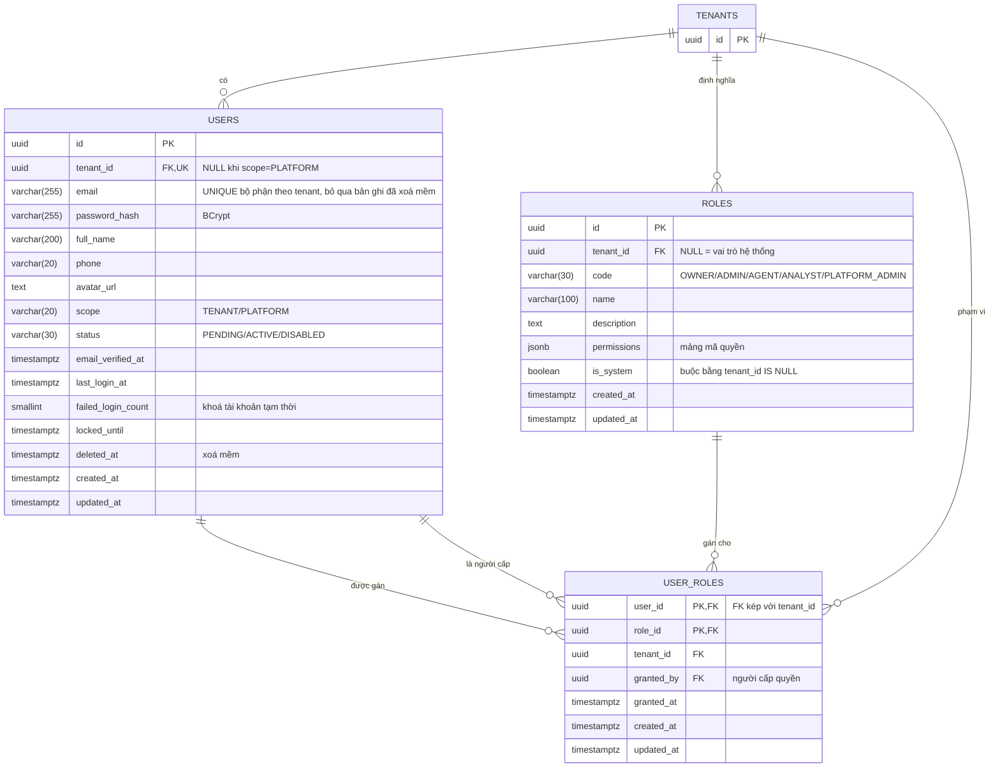
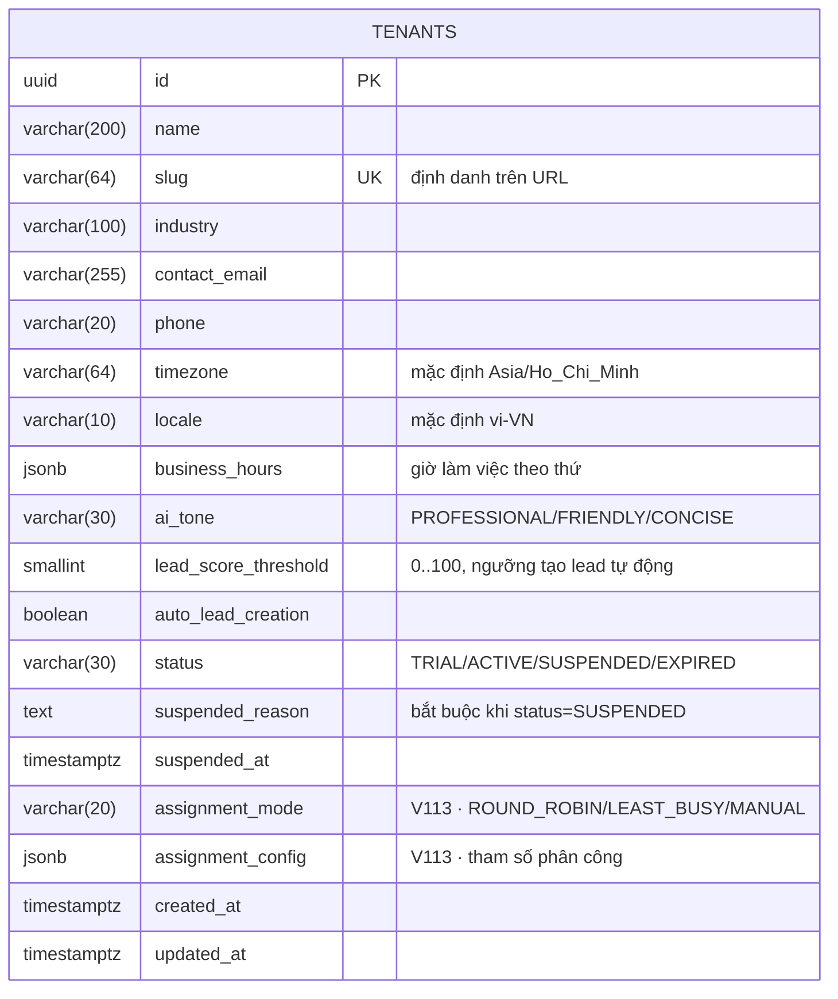
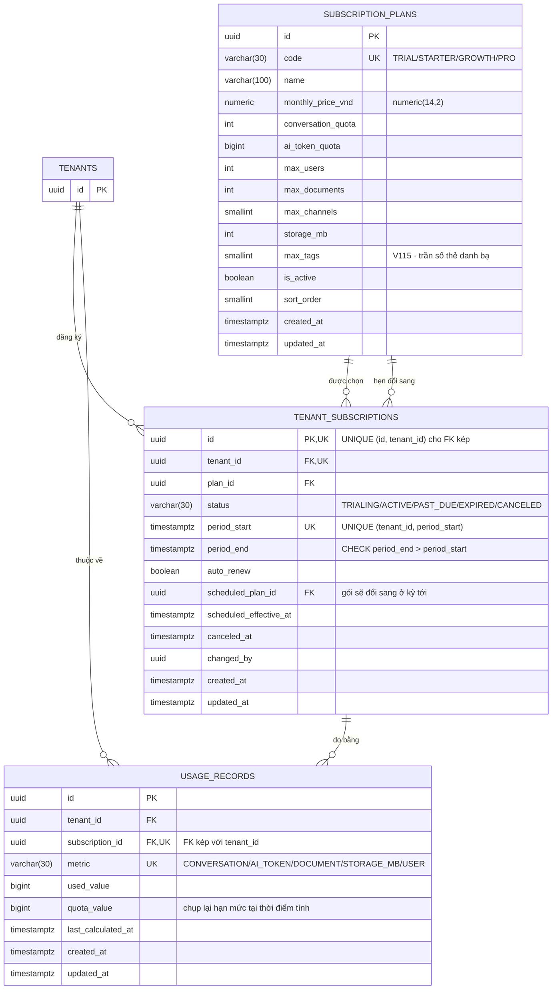
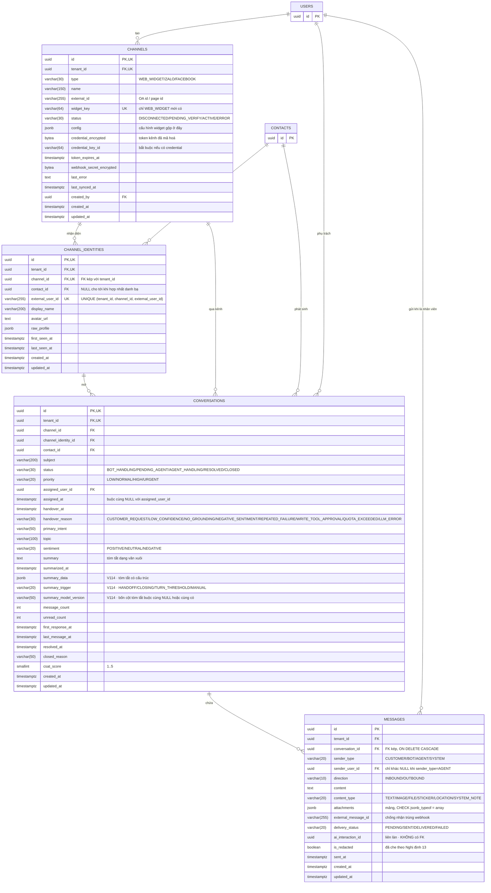
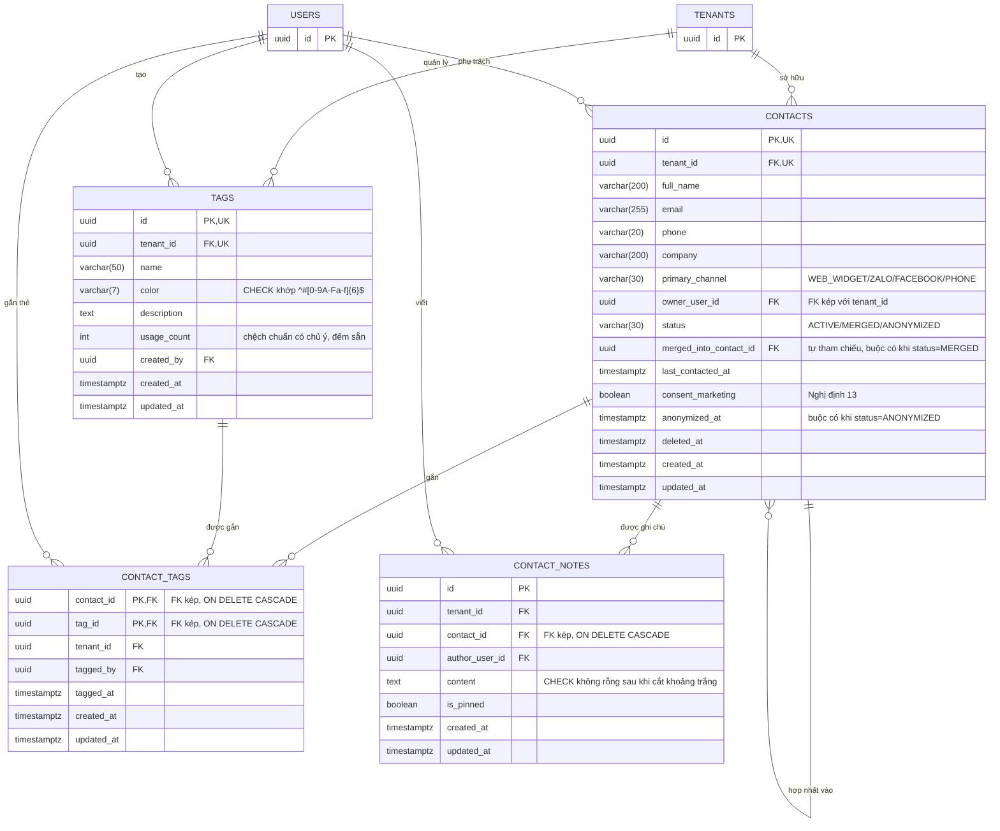
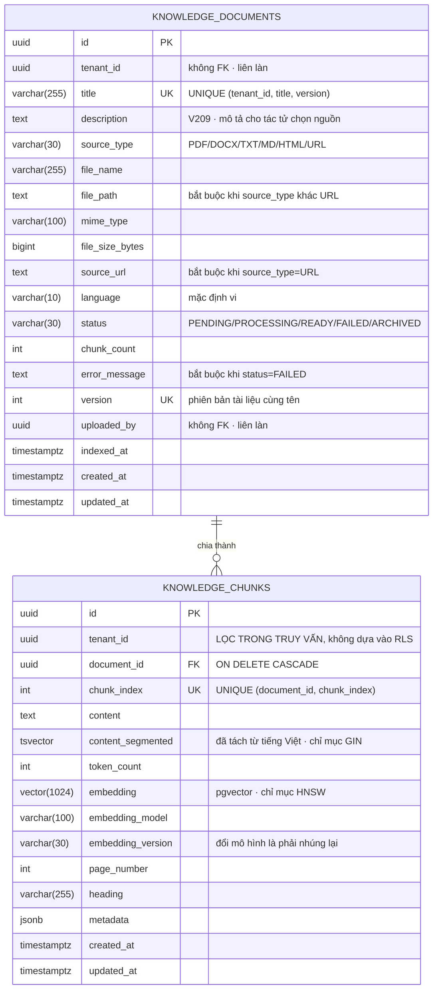
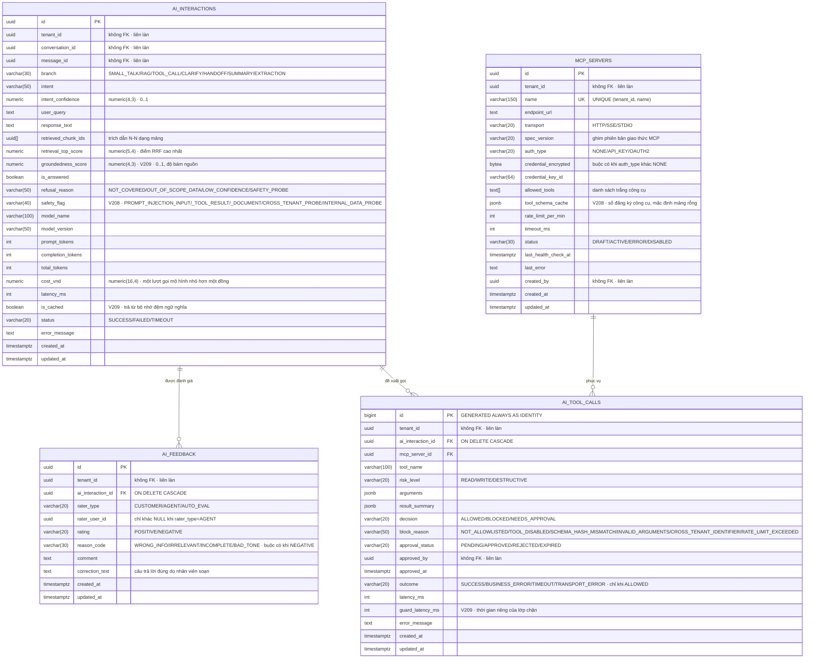
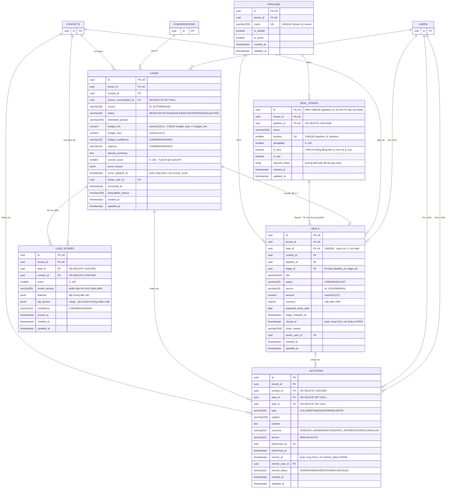

# ERD Mermaid — đầy đủ thuộc tính, sinh từ 24 migration Flyway

Sơ đồ thực thể — quan hệ **đầy đủ cột, kiểu và khoá** của toàn hệ thống: **32 bảng** (30 nghiệp vụ
+ 2 hạ tầng) trên **7 schema** PostgreSQL 16 + pgvector.

> **Nguồn duy nhất của tài liệu này là mã DDL đang chạy**, không phải bản phác:
> `java-core/src/main/resources/db/migration/` (V101–V115) và `ai-service/migration/`
> (V201–V209). Mọi cột, kiểu, giá trị `CHECK` dưới đây đọc thẳng từ 24 file đó — kể cả các cột
> thêm bằng `ALTER TABLE ... ADD COLUMN` ở V113/V114/V115/V208/V209.
>
> Tài liệu diễn giải thiết kế (lập luận, bảng đã cân nhắc rồi bỏ, RLS, chỉ mục) nằm ở
> [`erd-ai-crm.md`](erd-ai-crm.md). File này chỉ là **hình vẽ**.

---

## Đối chiếu context ↔ schema ↔ migration

| § | Bounded context | Schema | Làn | Migration | Bảng |
|---|---|---|---|---|---|
| [0](#0-tổng-quan--32-bảng) | *Tổng quan* | — | — | — | cả 32 |
| [1](#1-identity--access) | Identity & Access | `platform` | A | V103 | 3 |
| [2](#2-tenant-management) | Tenant Management | `platform` | A | V102 · V113 | 1 |
| [3](#3-subscription) | Subscription | `platform` | A | V102 · V115 | 3 |
| [4](#4-messaging) | Messaging | `engagement` | A | V106 · V107 · V114 | 4 |
| [5](#5-contact-management) | Contact Management | `engagement` | A | V105 | 4 |
| [6](#6-knowledge-base) | Knowledge Base | `knowledge` | **B** | V202 · V203 · V209 | 2 |
| [7](#7-ai-processing) | AI Processing | `ai` · `integration` | **B** | V204 · V205 · V208 · V209 | 4 |
| [8](#8-crm) | CRM | `sales` | A | V108 · V113 | 6 |
| [9](#9-analytics--compliance) | Analytics & Compliance | `platform` · `analytics` | A | V104 · V109 · V110 · V113 | 5 |

## Quy ước đọc sơ đồ

- **Tên thực thể** viết hoa, **bỏ tiền tố schema** (Mermaid không cho dấu chấm trong tên) — tra
  schema ở bảng trên.
- **Kiểu** giữ nguyên kiểu SQL thật: `uuid` `varchar(200)` `vector(1024)` `uuid[]` `text[]`
  `tsvector` `jsonb` `bytea` `inet` `timestamptz`.
- **Kiểu có độ chính xác và thang số ghi ở chú thích, không ghi ở cột kiểu.** Bộ phân tích cú
  pháp của Mermaid không nhận **dấu phẩy** trong tên kiểu — `numeric(16,4)` làm hỏng cả sơ đồ với
  `Expecting 'ATTRIBUTE_WORD', got ','`. Chín cột `numeric` vì thế viết kiểu là `numeric`, còn
  `numeric(16,4)` nằm ở đầu chú thích. Dấu ngoặc **không** kèm phẩy (`varchar(200)`, `char(3)`,
  `vector(1024)`) và dấu ngoặc vuông (`uuid[]`, `text[]`) thì mọi phiên bản đều nhận.
- **Khoá**: `PK` khoá chính · `FK` khoá ngoại · `UK` nằm trong một ràng buộc `UNIQUE` ·
  ghép được, ví dụ `uuid lead_id FK,UK`.
- **Chú thích cột** là chuỗi trong nháy kép, chứa giá trị enum của ràng buộc `CHECK` (ngăn bằng
  dấu `/`) hoặc ghi chú ngữ nghĩa.
- **Khoá ngoại phức hợp.** Hầu hết FK trong Track A là `(cột_nghiệp_vụ, tenant_id)` →
  `(id, tenant_id)` — ép quan hệ cha-con phải **cùng một tenant** ngay ở tầng CSDL, không phó mặc
  tầng ứng dụng. Mermaid không diễn tả được khoá phức hợp, nên chỉ cột nghiệp vụ được đánh `FK`,
  còn tính chất kép ghi trong chú thích.
- **Nét vẽ quan hệ**:
  - `||--o{` liền → có `FOREIGN KEY` thật trong CSDL.
  - `||..o{` đứt → **tham chiếu logic, không có khoá ngoại** vì cắt qua ranh giới hai làn
    (ADR-0002). Toàn vẹn do tầng ứng dụng giữ, xem [mục 7 của `erd-ai-crm.md`](erd-ai-crm.md#7-tham-chiếu-liên-làn--không-có-khoá-ngoại).
- **Bảng nối vẽ thành thực thể riêng** (`USER_ROLES`, `CONTACT_TAGS`) chứ không dùng ký hiệu
  N–N gộp: chúng mang cột riêng (`granted_by`, `tagged_at`, `tenant_id`), gộp lại là giấu mất.
- Cột `created_at` / `updated_at` có ở **mọi** bảng, do trigger `platform.touch_updated_at()` giữ.

---

## 0. Tổng quan — 32 bảng

Chỉ quan hệ, không cột. Đường **đứt** là ba chỗ duy nhất bắc qua ranh giới Track A ↔ Track B.

```mermaid
erDiagram
    TENANTS               ||--o{ USERS                 : "có"
    TENANTS               ||--o{ ROLES                 : "định nghĩa"
    TENANTS               ||--o{ USER_ROLES            : "phạm vi"
    USERS                 ||--o{ USER_ROLES            : "được gán"
    ROLES                 ||--o{ USER_ROLES            : "gán cho"

    TENANTS               ||--o{ TENANT_SUBSCRIPTIONS  : "đăng ký"
    SUBSCRIPTION_PLANS    ||--o{ TENANT_SUBSCRIPTIONS  : "được chọn"
    TENANT_SUBSCRIPTIONS  ||--o{ USAGE_RECORDS         : "đo bằng"

    TENANTS               ||--o{ CHANNELS              : "kết nối"
    CHANNELS              ||--o{ CHANNEL_IDENTITIES    : "nhận diện"
    CONTACTS              ||--o{ CHANNEL_IDENTITIES    : "hợp nhất từ"
    CHANNEL_IDENTITIES    ||--o{ CONVERSATIONS         : "mở"
    CHANNELS              ||--o{ CONVERSATIONS         : "qua kênh"
    CONTACTS              ||--o{ CONVERSATIONS         : "phát sinh"
    USERS                 ||--o{ CONVERSATIONS         : "phụ trách"
    CONVERSATIONS         ||--o{ MESSAGES              : "chứa"
    USERS                 ||--o{ MESSAGES              : "gửi"

    TENANTS               ||--o{ CONTACTS              : "sở hữu"
    CONTACTS              ||--o{ CONTACTS              : "hợp nhất vào"
    CONTACTS              ||--o{ CONTACT_NOTES         : "được ghi chú"
    CONTACTS              ||--o{ CONTACT_TAGS          : "gắn"
    TAGS                  ||--o{ CONTACT_TAGS          : "được gắn"
    TENANTS               ||--o{ TAGS                  : "quản lý"

    CONTACTS              ||--o{ LEADS                 : "trở thành"
    CONVERSATIONS         ||--o{ LEADS                 : "sinh ra"
    LEADS                 ||--o| DEALS                 : "chuyển đổi 1-1"
    CONTACTS              ||--o{ DEALS                 : "gắn với"
    PIPELINES             ||--o{ DEAL_STAGES           : "gồm"
    PIPELINES             ||--o{ DEALS                 : "chứa"
    DEAL_STAGES           ||--o{ DEALS                 : "đang ở"
    CONTACTS              ||--o{ ACTIVITIES            : "chăm sóc"
    LEADS                 ||--o{ ACTIVITIES            : "chăm sóc"
    DEALS                 ||--o{ ACTIVITIES            : "chăm sóc"
    USERS                 ||--o{ ACTIVITIES            : "thực hiện"
    LEADS                 ||--o{ LEAD_SCORES           : "lịch sử điểm"
    CONTACTS              ||--o{ LEAD_SCORES           : "của danh bạ"

    TENANTS               ||--o{ AUDIT_LOGS            : "ghi nhận"
    USERS                 ||--o{ AUDIT_LOGS            : "gây ra"
    CONTACTS              ||--o{ DATA_ERASURE_REQUESTS : "yêu cầu xoá"
    CHANNELS              ||--o{ METRICS_DAILY         : "tổng hợp theo"
    TENANTS               ||--o{ OUTBOX_EVENTS         : "phát sinh"
    TENANTS               ||--o{ PROCESSED_EVENTS      : "đã xử lý"

    KNOWLEDGE_DOCUMENTS   ||--o{ KNOWLEDGE_CHUNKS      : "chia thành"
    AI_INTERACTIONS       ||--o{ AI_TOOL_CALLS         : "đề xuất gọi"
    AI_INTERACTIONS       ||--o{ AI_FEEDBACK           : "được đánh giá"
    MCP_SERVERS           ||--o{ AI_TOOL_CALLS         : "phục vụ"

    CONVERSATIONS         ||..o{ AI_INTERACTIONS       : "logic · không FK · ADR-0002"
    MESSAGES              ||..o| AI_INTERACTIONS       : "logic · ngược chiều · không FK"
    KNOWLEDGE_CHUNKS      }o..o{ AI_INTERACTIONS       : "trích dẫn qua mảng uuid[]"
```

---

## 1. Identity & Access

`platform` · V103 · **3 bảng**. `users.scope = PLATFORM` thì `tenant_id IS NULL` — quản trị viên
nền tảng không thuộc tenant nào; `roles.is_system` cũng buộc phải bằng `(tenant_id IS NULL)`.

---

## 2. Tenant Management

`platform` · V102 + V113 · **1 bảng**. `tenants` là gốc của mọi thứ: nó *là* tenant nên không có
cột `tenant_id`, và policy RLS so trên chính `id`.

---

## 3. Subscription

`platform` · V102 + V115 · **3 bảng**. `subscription_plans` là **ngoại lệ không có `tenant_id`**:
danh mục gói do quản trị nền tảng định nghĩa, mọi tenant đọc chung, không bật RLS.

`usage_records` dùng FK kép `(subscription_id, tenant_id)` → `tenant_subscriptions (id, tenant_id)`
— không thể ghi mức dùng của tenant này vào thuê bao của tenant kia dù ứng dụng có sai.

---

## 4. Messaging

`engagement` · V106 + V107 + V114 · **4 bảng**. Đây là chỗ tin nhắn từ ba kênh đổ về.

Ba điểm đáng chú ý: bí mật kênh lưu `bytea` **đã mã hoá** kèm `credential_key_id`, không bao giờ
văn bản thô (UC008 bước 7) · `messages.external_message_id` là chốt chống nhận trùng webhook ·
`messages.ai_interaction_id` trỏ **ngược** sang Track B mà không có khoá ngoại.

---

## 5. Contact Management

`engagement` · V105 · **4 bảng**. `contacts` **tự tham chiếu** qua `merged_into_contact_id` để giữ
vết hợp nhất trùng lặp; xoá là xoá mềm bằng `status` + `anonymized_at` / `deleted_at`, không bao
giờ xoá vật lý (UC016, UC040).

---

## 6. Knowledge Base

`knowledge` · V202 + V203 + V209 · **2 bảng**, làn **Track B**.

Không bảng nào ở đây có khoá ngoại sang Track A — `uploaded_by` là `uuid` trần, đối chiếu qua API
nội bộ. `tenant_id` vẫn `NOT NULL` và **phải lọc ngay trong truy vấn vector**: chỉ mục HNSW là
chỉ mục xấp xỉ, nó chọn ứng viên *trước* khi RLS lọc, nên bỏ điều kiện `tenant_id` ra khỏi câu
truy vấn là mất kết quả chứ không phải rò rỉ (ADR-0007, bề mặt T6).

---

## 7. AI Processing

`ai` + `integration` · V204 + V205 + V208 + V209 · **4 bảng**, làn **Track B**.

`ai_tool_calls` là **sổ kiểm toán mọi lần tác tử chạm vào công cụ ngoài** — kể cả lần bị chặn:
`decision=BLOCKED` buộc phải có `block_reason`, `decision=NEEDS_APPROVAL` buộc phải có
`approval_status`, và chỉ `decision=ALLOWED` mới được có `outcome`. Đây là bằng chứng cho bề mặt
T4/T7 trong `threat-model.md`.

---

## 8. CRM

`sales` · V108 + V113 · **6 bảng**.

Chỗ tinh tế nhất của lược đồ nằm ở đây: `deals` có **hai** khoá ngoại về phễu —
`(pipeline_id, tenant_id) → pipelines` và `(pipeline_id, stage_id) → deal_stages (pipeline_id, id)`.
Khoá thứ hai ép giai đoạn phải thuộc **đúng cái phễu** mà deal đang nằm, thứ mà một FK đơn
`stage_id → deal_stages(id)` không chặn được.

`leads.current_score` do Track B ghi **qua API**, không ghi thẳng — xem ngoại lệ duy nhất ở
[CLAUDE.md](../.claude/CLAUDE.md); `lead_scores` giữ lịch sử từng lần chấm.

---

## 9. Analytics & Compliance

`platform` + `analytics` · V104 + V109 + V110 + V113 · **5 bảng** (3 nghiệp vụ + 2 hạ tầng).

- `audit_logs` **chỉ ghi thêm** — `UPDATE`/`DELETE` đã bị `REVOKE` khỏi `crm_app`.
- `outbox_events` và `processed_events` là **hạ tầng, không bật RLS**: outbox do tiến trình đẩy
  sự kiện đọc xuyên tenant, còn `processed_events` là chốt chống xử lý trùng khi Kafka giao nhận
  ít nhất một lần (ADR-0003).
- `metrics_daily` là read-model tổng hợp; `UNIQUE NULLS NOT DISTINCT` cho phép `channel_id`,
  `branch`, `model_name` cùng `NULL` mà vẫn coi là **một** hàng — nếu không, mỗi lần tổng hợp
  mức "toàn tenant" lại chèn thêm một dòng trùng.

```mermaid
erDiagram
    TENANTS {
        uuid id PK
    }
    USERS {
        uuid id PK
    }
    CONTACTS {
        uuid id PK
    }
    CHANNELS {
        uuid id PK
    }
    AUDIT_LOGS {
        bigint      id            PK "GENERATED ALWAYS AS IDENTITY"
        uuid        tenant_id     FK
        varchar(20) actor_type       "USER/AI_AGENT/SYSTEM/PLATFORM_ADMIN"
        uuid        actor_user_id FK "buộc có khi actor_type là USER/PLATFORM_ADMIN"
        varchar(60) action
        varchar(50) entity_type
        uuid        entity_id
        jsonb       before_data
        jsonb       after_data
        inet        ip_address
        text        user_agent
        varchar(64) request_id       "lần vết xuyên service"
        varchar(20) severity         "INFO/WARNING/CRITICAL"
        timestamptz created_at
        timestamptz updated_at
    }
    DATA_ERASURE_REQUESTS {
        uuid        id                    PK
        uuid        tenant_id             FK
        uuid        contact_id            FK
        varchar(20) requested_by             "CONTACT/STAFF"
        text        legal_basis              "căn cứ pháp lý, Nghị định 13"
        varchar(30) status                   "PENDING/IN_PROGRESS/COMPLETED/PARTIALLY_FAILED"
        jsonb       items                    "mảng · tiến độ xoá từng hạng mục"
        uuid        identity_verified_by  FK
        timestamptz identity_verified_at     "CHECK phải xác minh trước khi rời PENDING"
        text        external_systems_note
        text        certificate_uri          "chứng thư đã xoá"
        timestamptz requested_at
        timestamptz started_at
        timestamptz completed_at
        timestamptz created_at
        timestamptz updated_at
    }
    METRICS_DAILY {
        uuid          id                    PK
        uuid          tenant_id             FK,UK
        date          metric_date           UK
        uuid          channel_id            FK,UK "ON DELETE CASCADE · NULL = toàn tenant"
        varchar(30)   branch                UK    "SMALL_TALK/RAG/TOOL_CALL/CLARIFY/HANDOFF/SUMMARY/EXTRACTION"
        varchar(100)  model_name            UK    "UNIQUE NULLS NOT DISTINCT trên 5 cột"
        int           conversation_count
        int           ai_handled_count
        int           handover_count
        bigint        first_response_sum_ms       "tổng · chia cho count để ra trung bình"
        int           first_response_count
        int           interaction_count
        int           refusal_count
        int           positive_feedback
        int           negative_feedback
        bigint        prompt_tokens
        bigint        completion_tokens
        numeric       cost_vnd                    "numeric(16,4)"
        bigint        latency_sum_ms
        int           latency_p50_ms
        int           latency_p95_ms
        timestamptz   last_calculated_at
        timestamptz   created_at
        timestamptz   updated_at
    }
    OUTBOX_EVENTS {
        bigint      id             PK "GENERATED ALWAYS AS IDENTITY"
        uuid        tenant_id      FK
        varchar(50) aggregate_type
        uuid        aggregate_id
        varchar(60) event_type
        varchar(60) topic             "1 trong 5 topic ở docs/events/"
        jsonb       payload
        jsonb       headers
        timestamptz published_at      "NULL = chưa đẩy lên Kafka"
        smallint    attempt_count
        text        last_error
        timestamptz created_at
        timestamptz updated_at
    }
    PROCESSED_EVENTS {
        varchar(60) consumer_group PK
        bigint      event_id       PK "khoá chính kép chống xử lý trùng"
        uuid        tenant_id      FK
        timestamptz processed_at
        timestamptz created_at
        timestamptz updated_at
    }

    TENANTS  ||--o{ AUDIT_LOGS            : "ghi nhận"
    USERS    ||--o{ AUDIT_LOGS            : "gây ra"
    TENANTS  ||--o{ DATA_ERASURE_REQUESTS : "tiếp nhận"
    CONTACTS ||--o{ DATA_ERASURE_REQUESTS : "yêu cầu xoá"
    USERS    ||--o{ DATA_ERASURE_REQUESTS : "xác minh danh tính"
    TENANTS  ||--o{ METRICS_DAILY         : "tổng hợp cho"
    CHANNELS ||--o{ METRICS_DAILY         : "bóc tách theo"
    TENANTS  ||--o{ OUTBOX_EVENTS         : "phát sinh"
    TENANTS  ||--o{ PROCESSED_EVENTS      : "đã xử lý"
```

---

## Phụ lục — kiểm kê 32 bảng

| # | Bảng | Schema | Làn | Migration | Cột | Khoá chính |
|---|---|---|---|---|---|---|
| 1 | `tenants` | `platform` | A | V102, V113 | 19 | `uuid` |
| 2 | `subscription_plans` | `platform` | A | V102, V115 | 15 | `uuid` |
| 3 | `tenant_subscriptions` | `platform` | A | V102 | 13 | `uuid` |
| 4 | `usage_records` | `platform` | A | V102 | 9 | `uuid` |
| 5 | `users` | `platform` | A | V103 | 16 | `uuid` |
| 6 | `roles` | `platform` | A | V103 | 9 | `uuid` |
| 7 | `user_roles` | `platform` | A | V103 | 7 | kép `(user_id, role_id)` |
| 8 | `audit_logs` | `platform` | A | V104 | 15 | `bigint` identity |
| 9 | `contacts` | `engagement` | A | V105 | 16 | `uuid` |
| 10 | `tags` | `engagement` | A | V105 | 9 | `uuid` |
| 11 | `contact_tags` | `engagement` | A | V105 | 7 | kép `(contact_id, tag_id)` |
| 12 | `contact_notes` | `engagement` | A | V105 | 8 | `uuid` |
| 13 | `channels` | `engagement` | A | V106 | 17 | `uuid` |
| 14 | `channel_identities` | `engagement` | A | V106 | 12 | `uuid` |
| 15 | `conversations` | `engagement` | A | V107, V114 | 29 | `uuid` |
| 16 | `messages` | `engagement` | A | V107 | 16 | `uuid` |
| 17 | `pipelines` | `sales` | A | V108 | 7 | `uuid` |
| 18 | `deal_stages` | `sales` | A | V108 | 11 | `uuid` |
| 19 | `leads` | `sales` | A | V108 | 20 | `uuid` |
| 20 | `deals` | `sales` | A | V108 | 18 | `uuid` |
| 21 | `activities` | `sales` | A | V108 | 17 | `uuid` |
| 22 | `data_erasure_requests` | `platform` | A | V109 | 16 | `uuid` |
| 23 | `outbox_events` | `platform` | A | V110 | 13 | `bigint` identity |
| 24 | `processed_events` | `analytics` | A | V110 | 6 | kép `(consumer_group, event_id)` |
| 25 | `lead_scores` | `sales` | A | V113 | 12 | `uuid` |
| 26 | `metrics_daily` | `analytics` | A | V113 | 24 | `uuid` |
| 27 | `knowledge_documents` | `knowledge` | **B** | V202, V209 | 19 | `uuid` |
| 28 | `knowledge_chunks` | `knowledge` | **B** | V203 | 15 | `uuid` |
| 29 | `ai_interactions` | `ai` | **B** | V204, V208, V209 | 27 | `uuid` |
| 30 | `ai_feedback` | `ai` | **B** | V204 | 11 | `uuid` |
| 31 | `mcp_servers` | `integration` | **B** | V205, V208 | 19 | `uuid` |
| 32 | `ai_tool_calls` | `ai` | **B** | V205, V209 | 19 | `bigint` identity |

**Tổng: 32 bảng · 471 cột · 23 bảng Track A + 9 bảng Track B.**

### Ba ngoại lệ của quy tắc "mọi bảng nghiệp vụ có `tenant_id`"

1. `tenants` — chính nó *là* tenant, policy RLS so trên `id`.
2. `subscription_plans` — danh mục dùng chung, không bật RLS, `crm_app` chỉ có `SELECT`.
3. `processed_events` — có cột `tenant_id` nhưng **không bật RLS**: là hạ tầng chống xử lý trùng,
   consumer đọc xuyên tenant.

### Ba chỗ bắc qua ranh giới hai làn — không có khoá ngoại

| Từ | Tới | Cột | Vì sao không FK |
|---|---|---|---|
| `ai.ai_interactions` | `engagement.conversations` | `conversation_id` | ADR-0002 · `ai_app` không có cả quyền `USAGE` trên `engagement` |
| `ai.ai_interactions` | `engagement.messages` | `message_id` | như trên |
| `engagement.messages` | `ai.ai_interactions` | `ai_interaction_id` | tham chiếu **ngược chiều**, `crm_app` không đi vào schema `ai` |

Mất khoá ngoại là mất một lớp bảo đảm toàn vẹn — cái giá đã biết trước của ADR-0002, đổi lấy việc
mô hình ngôn ngữ không có bất kỳ đường nào chạm thẳng vào bảng nghiệp vụ.
