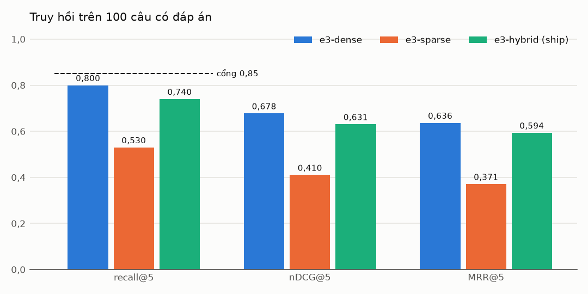
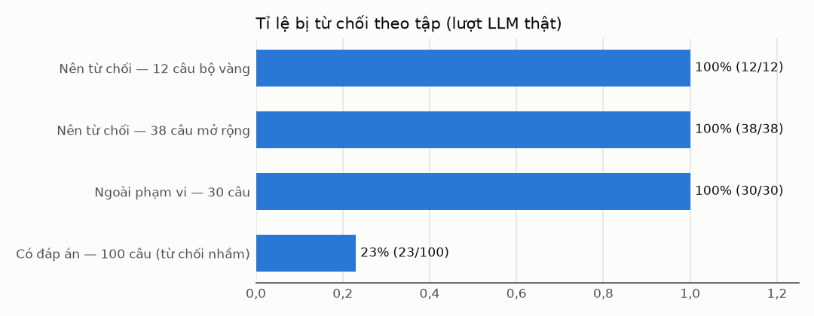
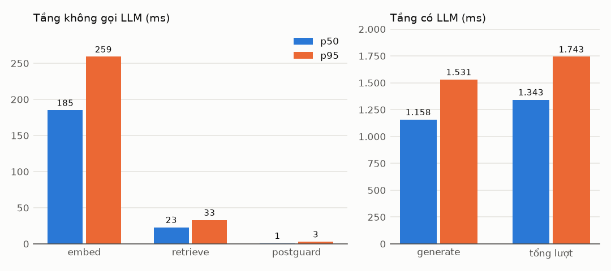

# Ngày 13 — Eval harness một lệnh, ba cổng §1.6 đo lần đầu (đo 10/10/2026)

> Kế hoạch Ngày 13 ([`ai-service/planning.md`](../../ai-service/planning.md)). Ghi chú ôn tập:
> [`ngay-13-eval-harness-mot-lenh.md`](../on-tap/ngay-13-eval-harness-mot-lenh.md). Harness:
> [`tests/eval/chay_tat_ca.py`](../../ai-service/tests/eval/chay_tat_ca.py) — định nghĩa mọi chỉ số ở
> docstring. Bảng đầy đủ của lượt 1: [`eval-ngay13-chi-so.csv`](eval-ngay13-chi-so.csv).

## Cách chạy và cấu hình

```bash
cd ai-service && source .venv/bin/activate          # Postgres + ai-embed :8091 đang chạy
AI_MODE=remote EMBED_URL=http://localhost:8091 \
python -m tests.eval.chay_tat_ca chay tests/eval/configs/n13_nghiem_thu.yaml --nhan lan1
python -m tests.eval.chay_tat_ca tai-lap tests/eval/reports/n13_lan1 tests/eval/reports/n13_lan2
python -m tests.eval.chay_tat_ca tinh-lai tests/eval/reports/n13_lan1
```

| | |
|---|---|
| Cấu hình | [`configs/n13_nghiem_thu.yaml`](../../ai-service/tests/eval/configs/n13_nghiem_thu.yaml) — 3 cấu hình E3, ship `e3-hybrid`, seed 42, dung sai LLM ±3 điểm % khai trước |
| Commit | đóng băng tập đo `6dc0b24`; đo trên `6dc0b24` + harness chưa commit (ghi trong `meta.json`) |
| Bộ vàng | `golden_set.jsonl` sha256 `323baf73…` — 100 câu có đáp án + 12 nên từ chối (không đổi) |
| Tập mới | `tu_choi_mo_rong.jsonl` sha256 `bf44948e…` — 38 câu nên từ chối (mục 7) |
| 30 câu UC025 | `ngoai_pham_vi.jsonl` sha256 `a1b6fd97…` |
| Kho | tenant `eeeeeeee-…-0001`, bge-m3 `int8-71e2aa91`, HNSW `m=16 ef_construction=64`, `ef_search=100` |
| Đường trả lời | đúng `RagAnswerer` production: luật → nhúng → hybrid RRF top-5 → sàn → lời nhắc → Gemini → hậu kiểm |
| LLM | `gemini-3.5-flash-lite`, `minimal`, `temperature=0`, hạn chót 30 s (production 10 s), giãn 4,5 s |
| Ngưỡng ship | sàn toàn tập 0 · sàn từng đoạn 0,15 · bám nguồn 0 (ADR-0029) · rerank TẮT |
| Lượt đo | `th1`, `th2` — chỉ truy hồi (09:51) · `khoi` — 5 câu mỗi tập · **`lan1` — đủ, xong 10:11** · **`lan2` — đủ, xong 14:21** (hạn mức mới) |

## 1. Ba cổng §1.6

| Chỉ số | Lượt 1 | Lượt 2 | Ngưỡng | Kết luận |
|---|---|---|---|---|
| recall@5, cấu hình ship `e3-hybrid` | **0,740** (74/100) | 0,740 (74/100) | ≥ 0,85 | **trượt** |
| độ phủ trích dẫn — theo câu | **0,797** (122/153) | 0,805 (132/164) | ≥ 0,80 | **sát ngưỡng — lượt 1 trượt, lượt 2 đạt** |
| tổng p95 ba service | — | — | < 480 ms | **chưa kết luận** — 1/3 service đo được |

Số chính thức là **lượt 1** (lượt độc lập đầu tiên). Độ phủ của hai lượt lệch 0,75 điểm — trong dung sai
tái lập — nhưng nằm hai phía ngưỡng: với 77–78 lượt trả lời, 0,80 nằm GIỮA độ dao động của chính LLM, nên
không được viết "đạt". Không hạ ngưỡng, không đổi định nghĩa sau khi thấy số. Chờ người dùng quyết ở mục 9.

## 2. Tái lập

| Phép | Kết quả |
|---|---|
| Truy hồi, hai lượt độc lập `th1` ↔ `th2` | **300/300** top-k trùng (3 cấu hình × 100 câu); mọi ô `tuyet_doi` khớp — **ĐẠT** |
| `tinh-lai lan1` — tính lại từ đầu ra thô | **52/52 ô** khớp từng chữ số |
| `tinh-lai lan2` | **52/52 ô** khớp |
| Phần LLM, `lan1` ↔ `lan2`, dung sai ±3 điểm % | **13/13 ô trong dung sai**, lớn nhất \|Δ\| = 1,6 điểm (groundedness) — **ĐẠT** |
| Câu đổi kết quả từ chối ↔ trả lời | **1/180** — G108 (mục 5) |
| Truy hồi `lan1` ↔ `lan2` | 300/300 top-k trùng (lần thứ hai độc lập) |

Bảng đầy đủ: [`eval-ngay13-tai-lap.md`](eval-ngay13-tai-lap.md).

Ghim cái gì để chạy hai lần ra cùng số: thứ tự câu = thứ tự tệp · bootstrap seed 42 · ai-embed tất định
(cùng model, cùng `int8-71e2aa91`) · cùng chỉ mục HNSW + cùng `ef_search` · Gemini `temperature=0`. Gemini
**không nhận seed** (ADR-0032) nên phần LLM chỉ đòi trong dung sai — khai trong cấu hình TRƯỚC lần đo.

## 3. Truy hồi (100 câu có đáp án, `ranx`)

| Cấu hình | recall@5 | nDCG@5 | MRR@5 | p50 / p95 SQL |
|---|---|---|---|---|
| `e3-dense` (baseline) | 0,800 | 0,678 | 0,637 | 3,7 / 5,1 ms |
| `e3-sparse` | 0,530 | 0,410 | 0,371 | 2,4 / 3,2 ms |
| **`e3-hybrid` (ship)** | **0,740** | 0,631 | 0,594 | 4,0 / 6,1 ms |

Paired bootstrap so với dense (B = 10.000, seed 42): hybrid −6,0 điểm recall@5 [−13,0; +1,0] — KTC chứa 0;
sparse −27,0 [−37,0; −17,0] ✱. Đúng các số của 06/10 và 08/10 — truy hồi không đổi từ Ngày 6.

`ranx` (`hit_rate@5`, `ndcg@5`, `mrr@5`) mã hoá theo lớp tương đương: mỗi câu MỘT tài liệu liên quan
`DUNG` đặt ở hạng đoạn đúng đầu tiên — khớp định nghĩa "trúng một căn cứ là đủ, IDCG = 1" của Ngày 6.
Công thức tự cài chạy song song, lệch > 1e-9 là dừng; chạy lại trên CSV 08/10 ra đúng 0,740 / 0,631 / 0,594.



### Phân tích 26 câu trượt (cấu hình ship)

| Trượt top-5 | Số câu |
|---|---|
| đoạn đúng ở hạng 6–30 — tập ứng viên CÓ, xếp hạng chưa đưa lên | **23** |
| ngoài top-30 — tập ứng viên KHÔNG có (G021, G071, G075) | 3 |
| trong 26: làn dense một mình trúng top-5 | 10 |
| trong 26: làn sparse một mình trúng top-5 | 2 |

| Kiểu gõ | recall@5 | | Loại câu | recall@5 |
|---|---|---|---|---|
| `co_dau` | 55/67 = 0,821 | | `cach_lam` | 12/14 = 0,857 |
| `tieng_anh` | 4/5 = 0,800 | | `lua_chon` | 5/6 = 0,833 |
| `viet_tat` | 4/6 = 0,667 | | `dieu_kien` | 22/30 = 0,733 |
| `dai` | 5/8 = 0,625 | | `tinh_huong` | 10/14 = 0,714 |
| **`khong_dau`** | **6/14 = 0,429** | | `con_so` | 25/36 = 0,694 |

Hai lớp lỗi, đọc thẳng từ cột hạng từng làn (`truot.csv`):

1. **Gõ không dấu — làn vector mù.** G001, G024, G050, G057, G081, G099, G100: làn vector không có đoạn đúng
   trong 30 ứng viên, chỉ làn từ khoá (qua `f_unaccent`) bắt được ở hạng 3–8.
2. **RRF dìm đoạn chỉ một làn thấy.** G006 (vector hạng 1 → hợp nhất hạng 10), G076 (1 → 14), G063 (2 → 13),
   G080 (2 → 19), G026 (3 → 13): làn từ khoá không thấy đoạn đó, nên nó chỉ nhận `1/(60+1)`, thua đoạn hạng
   trung bình ở CẢ hai làn (`2/(60+15)`). Đây là lý do dense (0,80) hơn hybrid (0,74).

Không sửa gì trong Ngày 13 (người dùng chốt: báo số + phân tích, dừng để quyết).

## 4. Độ phủ trích dẫn — bốn định nghĩa, bốn số

Trên các lượt trả lời (không từ chối, không suy giảm) — 77 lượt ở lượt 1, 78 ở lượt 2:

| Định nghĩa | Lượt 1 | Lượt 2 | Ghi chú |
|---|---|---|---|
| **theo câu — CỔNG** (chốt 10/10): câu ≥ 4 âm tiết có ≥ 1 trích dẫn | **122/153 = 0,797** | 132/164 = 0,805 | cùng cách tách câu với groundedness |
| theo câu, bỏ câu "chưa có thông tin" | 122/150 = 0,813 | 0,814 | biến thể |
| UC027 — lượt có ≥ 1 trích dẫn (`GET /v1/ai/quality`) | 77/77 = 1,000 | 1,000 | luôn 1,0: luật (c) ADR-0029 từ chối mọi câu 0 trích dẫn |
| Master Plan §5.12 — trích dẫn thô trỏ vào đoạn đã cấp | 153/153 = 1,000 | 1,000 | đếm TRƯỚC hậu kiểm; mô hình không bịa số `[n]` lần nào |
| trích đúng căn cứ (câu có đáp án được trả lời) | 73/77 = 0,948 | 0,936 | độ ĐÚNG, không phải độ phủ |
| groundedness trung bình | 0,767 | 0,783 | phép đo từ vựng (`hau_kiem.py`) |

**31 câu bị tính "thiếu nguồn" ở lượt 1 thuộc loại nào** (phân loại tay theo dấu hiệu câu chữ; lượt 2
có 32 câu cùng dạng — 22 câu mời/hỏi lại, 8 câu xã giao hoặc mời liên hệ, 2 câu "chưa có thông tin"):

| Loại | Số câu | Ví dụ |
|---|---|---|
| câu mời / hỏi lại | 20 | "Anh/chị cần em hỗ trợ thêm thông tin nào không ạ?" |
| câu xã giao khác | 6 | "Em cảm ơn anh/chị ạ!" · "Em xin phép gửi thông tin đến anh/chị nhé!" |
| "chưa có thông tin" | 4 | 3 câu bị bộ lọc bắt; G079 "tài liệu chưa **cung cấp** thông tin…" không khớp mẫu dò |
| câu dẫn | 1 | "…khác nhau ở các tiêu chí sau ạ:" |

Gần như cả 31 câu là câu mà **lời nhắc từ Ngày 10 CẤM gắn trích dẫn** (quy tắc 2: câu chào, câu mời,
câu "chưa có thông tin" không ghi số). Định nghĩa đã chốt tính câu xã giao từ 4 âm tiết trở lên vào mẫu
số — điều này đã khai trước ở docstring ("nghiêng về phía thấp"), nhưng độ lớn chỉ thấy sau khi đo: nó
quyết định trượt/đạt ở mức 1 câu. Không có câu nội dung nào thiếu nguồn mà mô hình lẽ ra phải trích.

## 5. Từ chối (180 câu mỗi lượt)

| Tập | Lượt 1 | Lượt 2 | Ghi chú |
|---|---|---|---|
| nên từ chối — 12 câu bộ vàng | 12/12 | 12/12 | |
| **nên từ chối — 38 câu mở rộng** | **38/38** | 38/38 | tập mới, độc lập với mọi luật và lời nhắc |
| gộp 50 câu | 50/50 | 50/50 | độ phủ của hành vi từ chối 1,0 — KTC 95% Wilson ≈ [0,93; 1] |
| có đáp án — từ chối nhầm | 23/100 | 22/100 | lượt 1: **22/23** do đoạn đúng không có trong top-5; ngoại lệ G112 (cả hai lượt, như Ngày 10) |
| 30 câu ngoài phạm vi — trả rỗng đúng | 30/30 | 30/30 | |
| 30 câu ngoài phạm vi — đúng lý do | 30/30 | 30/30 | |

Câu duy nhất đổi kết quả giữa hai lượt: **G108** "máy lạnh inverter dòng nào tiết kiệm điện nhất" — đoạn
đúng (bảng điện năng) KHÔNG có trong top-5. Lượt 1 từ chối; lượt 2 trả lời một phần ("tài liệu chưa có
thông tin cụ thể… chỉ nêu chung inverter tiết kiệm hơn khoảng 40% [1]") — có một câu mang thông tin bám
nguồn nên luật (d) giữ lại, không trích đúng căn cứ.



Lý do: `NOT_COVERED` 85 · `OUT_OF_SCOPE_DATA` 9 · `SAFETY_PROBE` 9 · suy giảm 0. Lượt không gọi LLM 18/180
— **trên tập đo**, không đại diện lưu lượng thật (KPI ≥ 55% đo bằng telemetry).

## 6. Độ trễ

Từng tầng, từ `latency_breakdown` của 180 lượt mỗi lượt đo (không xét tái lập):

| Tầng | p50 lượt 1 · 2 | p95 lượt 1 · 2 | Mẫu |
|---|---|---|---|
| embed (gồm HTTP tới ai-embed) | 185 · 190 ms | 259 · 299 ms | 162 |
| retrieve (pyvi + mở phiên RLS + SQL) | 23 · 21 ms | 33 · 35 ms | 162 |
| generate (Gemini) | 1.158 · 1.072 ms | 1.531 · 1.451 ms | 162 |
| postguard | 1 · 1 ms | 3 · 4 ms | 88 |
| **tổng lượt** | **1.343 · 1.258 ms** | **1.743 · 1.673 ms** | 180 |



**Phát hiện: ai-embed nguội sau khoảng nghỉ.** Đo riêng, gọi liền nhau: p50 26 ms, p95 55 ms; trong lượt
thật (giãn 4,5 s giữa các câu): p50 185 ms. Thử tách nguyên nhân (10/10, 0 lượt Gemini):

| Cách gọi `/v1/embed/batch` | p50 |
|---|---|
| giữ một kết nối, gọi liền nhau | 21,6 ms |
| **mở kết nối MỚI mỗi lần, gọi liền nhau** | 17,9 ms |
| **giữ một kết nối, giãn 4,5 s** | **177,9 ms** |

⇒ không phải chi phí kết nối HTTP; chính tiến trình ai-embed chậm lại sau ~4,5 s nghỉ (nghi luồng ONNX
Runtime hoặc CPU của máy ảo Docker Desktop). Với lưu lượng chat thưa — trường hợp thường gặp của SME — con
số đúng là con số "nguội". Đo kỹ và chốt ở Ngày 15 (benchmark), không sửa hôm nay.

| Ba service (§1.6, tổng p95 < 480 ms) | p95 |
|---|---|
| ai-classify | **chưa đo** — thiếu `artifacts/router_model.onnx`, chờ Dev B |
| ai-embed | 55 · 43 ms (ấm, liền nhau) · 259 · 299 ms (lượt thật, nguội) |
| ai-rerank | **chưa đo** — `RERANK_ENABLED` tắt, ai-rerank còn giả Jaccard |
| tổng | **chưa kết luận** — 1/3 service; riêng embed nguội đã chiếm 54% ngân sách |

## 7. 38 câu nên-từ-chối mở rộng — cách làm

1. 50 ứng viên viết CHỈ từ mục lục (`bo_vang muc-luc`), không trùng 12 câu cũ và 30 câu UC025; xáo seed
   42; khoá sha256 `59b7da79…` trước khi mở nội dung đoạn nào —
   [`eval-ngay13-ung-vien.jsonl`](eval-ngay13-ung-vien.jsonl).
2. Đọc TOÀN BỘ 19 tệp (`bo_vang doan`), duyệt theo thứ tự đã xáo. Luật loại định trước: kho trả lời TRỰC
   TIẾP đúng thuộc tính được hỏi, kể cả trả lời "không". Thông tin liên quan mà không trả lời đúng điều
   hỏi thì giữ.
3. Đủ 38 câu ở ứng viên thứ 39; loại 1 (U26 "dịch vụ chuyển nhà" — kho ghi Ngân Hà không di dời đồ đạc
   ngoài đơn hàng). 11 ứng viên sau điểm cắt không dùng (trong đó U35 "gas R32 hay R410A" kho có đáp án).
4. Khoá `bf44948e…` vào `artifacts/DATA_HASHES.txt` (+1 dòng), commit `6dc0b24` TRƯỚC lần đo đầu.

Thành phần: `gan_linh_vuc` 19 · `bay_thuoc_tinh` 10 · `ngoai_linh_vuc` 9. Ca giữ lại khó nhất:
"bình nóng lạnh 30 lít" (kho có "bình nóng lạnh" của máy lọc nước RO), "máy lọc nước cho bể cá",
"tủ lạnh side by side có làm đá tự động" (kho có mẫu side by side, không nói làm đá).

## 8. Hạn chế — khai trung thực

- **Cả 50 ứng viên, luật loại và phán quyết đều do AI** (như bộ vàng, ADR-0020). Rủi ro thiên vị giảm bằng
  khoá sha trước khi xem kho và luật loại định trước, không loại bỏ được.
- **38/38 là trên một lượt LLM**; luật trước truy hồi và lời nhắc không được sửa sau khi thấy tập này.
- Phân loại 31 câu "thiếu nguồn" ở mục 4 là phân loại tay theo dấu hiệu câu chữ, để giải thích — không
  phải chỉ số.
- p95 đo trên MacBook + Docker Desktop, không phải cấu hình triển khai. Độ trễ không xét tái lập.
- Lượt LLM dùng hạn chót 30 s thay vì 10 s của production để câu chậm không thành "suy giảm"; lượt 1 có
  0 suy giảm nên không ảnh hưởng số.

## 9. Quyết định của người dùng (10/10, sau khi xem số)

1. **Độ phủ trích dẫn — giữ định nghĩa đã chốt, báo "sát ngưỡng".** Số chính thức: 0,797 (lượt độc lập
   đầu, trượt 1 câu); lượt 2 0,805. Không đổi định nghĩa sau khi đo. Bảng phân loại 31 câu (mục 4) là
   nguyên liệu cho buổi đọc số Ngày 16.
2. **Recall@5 — ghi nợ, đi tiếp Ngày 14 như lịch.** Quay lại sau Ngày 15, khi ai-rerank có số thật:
   23/26 câu trượt nằm trong top-30 là cơ sở để thử xếp hạng lại; hai lớp lỗi (không dấu, RRF một làn) ghi
   ở mục 3.
3. **Embed nguội** — đo và xử lý ở Ngày 15 (benchmark).
