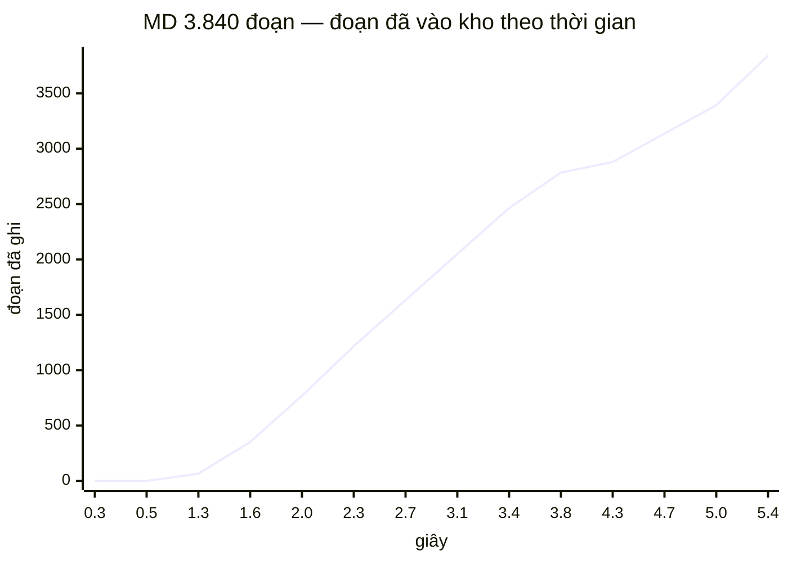

# UC019 (2/2) — minh chứng cổng ra Ngày 5: nhúng theo lô, worker Kafka, DLQ, HNSW

**Chạy ngày 27/09/2026** trên hạ tầng dùng một lần của `scripts/e2e-uc018.sh`:
- java-core thật (jar) → RustFS 1.0.0 → ai-service thật (API)
- Postgres 16 + pgvector, Kafka cp-kafka 7.9.0 (chế độ ZooKeeper)
- **ai-worker thật** (`RUN_MODE=worker`, chạy từ máy chủ nên nối `localhost:59092`)

Tái lập:

```bash
scripts/e2e-uc018.sh up && scripts/e2e-uc018.sh run && scripts/e2e-uc018.sh nap
scripts/e2e-uc018.sh down
```

`nap` gọi `scripts/e2e_uc019.py`, rồi đọc `ai.dlq`, in LAG của group, chạy `create_hnsw_index.sql`
và `\di+`.

> ⚠️ **`AI_MODE=mock`** — `ai-embed` chưa dựng (`inference/src/roles/embed.py` còn TODO). Vector sinh
> bằng `shake_256` với seed cố định, gắn nhãn `embedding_model = 'mock-hash-1024'` trên từng đoạn.
> Mọi con số thời gian và thông lượng dưới đây **không gồm thời gian nhúng thật**; đo lại với ai-embed
> ở Ngày 7. Ước lượng: một lô 32 đoạn trên CPU, nhân với 13 lô cho tài liệu 100 trang.

Thiết kế: [ADR-0021](../adr/0021-nap-tai-lieu-commit-theo-chang-chong-trung-va-quet-job-ket.md).

## Cổng ra (DoD)

| Điều kiện | Bằng chứng | Kết quả |
|---|---|---|
| Tài liệu thật nằm trong `knowledge_chunks` có vector | e2e §1: 44 tài liệu do java-core nhận, sự kiện đi qua outbox → Kafka → worker | ✅ 43 `READY` + 1 `FAILED` (PDF scan, đúng mong đợi) · mọi tài liệu `READY` có `chunk_count` = số đoạn có vector · 0 đoạn thuộc tài liệu không `READY` |
| `\di` xác nhận chỉ mục HNSW | e2e §6 | ✅ `ix_chunk_embedding` · `hnsw (embedding vector_cosine_ops) WITH (m='16', ef_construction='64')` · 6,8 MB |
| DLQ hoạt động | e2e §4 · `test_ban_tin_hong_luoc_do_vao_dlq_nguyen_byte_va_worker_di_tiep` (Kafka thật) | ✅ bản tin hỏng sang `ai.dlq` **nguyên byte**, đủ 7 header `dlq.*`, `X-Trace-Id` giữ nguyên; worker đi tiếp sang bản tin sau |
| Restart worker không mất job | `test_worker_chet_giua_chung_khoi_dong_lai_khong_mat_job` (Kafka thật) | ✅ xem mục "Khởi động lại giữa chừng" bên dưới |

`pytest tests`: **291 passed** — 218 test cũ và 73 test mới. `ruff check src tests` sạch. Ba lệnh grep
chiều phụ thuộc, grep `sklearn` và grep cổng CI `onnxruntime|torch|xgboost` đều rỗng.

## 1. Tài liệu do `run` tải lên — sự kiện thật từ java-core

Bật worker lúc 44 sự kiện `DocumentUploaded` đang nằm trên `crm.kb.document.uploaded`. Group
`ingestion-cg` mới nên đọc từ đầu topic (`auto_offset_reset="earliest"`). **Hàng đợi rỗng sau
6,3 s.**

| source_type | status | số tài liệu | tổng đoạn | mã lỗi |
|---|---|---|---|---|
| DOCX | READY | 4 | 39 |  |
| HTML | READY | 4 | 43 |  |
| MD | READY | 5 | 3.876 | |
| PDF | FAILED | 1 | 0 | `PARSE_NO_TEXT_EXTRACTED` |
| PDF | READY | 7 | 480 |  |
| TXT | READY | 25 | 50 |  |

Bảng gồm cả hai tài liệu lớn ở mục 2 (1 PDF, 1 MD). `ai.processed_events`: 46 dòng = 44 + 2 —
**đúng một dòng cho mỗi sự kiện**. PDF scan kết thúc ở `FAILED` và **không** vào DLQ: lý do đã
hiện trên SCR033 (ADR-0021 quyết định 5).

Offset đã xác nhận sau cùng — **LAG = 0** trên cả hai partition có dữ liệu:

```
GROUP           TOPIC                    PARTITION  CURRENT-OFFSET  LOG-END-OFFSET  LAG
ingestion-cg    crm.kb.document.uploaded 2          20              20              0
ingestion-cg    crm.kb.document.uploaded 0          27              27              0
```

## 2. Thời gian nạp tài liệu 100 trang — đo thật

Tệp PDF sinh từ nguồn Markdown của 9 tài liệu mẫu, lặp lại dưới các heading "Phần k" và dừng đúng
ở trang 100. Dựng bằng cùng `pymupdf.Story` + CSS với bộ tệp mẫu, nên có heading thật và bảng thật.
Tải lên qua java-core như người dùng thật. Thời gian lấy từ CSDL: `indexed_at − ingest_started_at`.

| Chỉ số | PDF 100 trang (1,1 MB) | MD 3.840 đoạn (2,0 MB) |
|---|---|---|
| Số đoạn | 413 | 3.840 |
| Chờ hàng đợi (`created_at` → `ingest_started_at`) | 0,14 s | 0,44 s |
| **Thời gian nạp** | **19,39 s** | **5,17 s** |
| **Thông lượng** (không gồm nhúng thật) | **21 đoạn/giây** | **742 đoạn/giây** |
| RSS đỉnh của worker | 48 MB | 86 MB |
| RSS đỉnh của tiến trình con phân tích | 122 MB | 53 MB |

**Phát hiện: chặng EXTRACTING chiếm 18,75 / 19,39 s (97%) của tài liệu 100 trang.** Lập hồ sơ bằng
cProfile cho thấy **98% thời gian phân tích nằm ở `pymupdf.Page.find_tables`**, ~0,3 s mỗi trang.
Tệp tổng hợp này dày bảng (~16 bảng/trang, 1.585 bảng tất cả) — gần ca xấu nhất. Tài liệu thường
ít bảng hơn nhiều. Hai hệ quả phải ghi lại:

- Câu "PDF 100 trang đo được vài giây" trong `config.py` (Ngày 4) **sai với PDF dày bảng**. Trần
  120 s cho mỗi tệp đủ cho ~400 trang dày bảng, không đủ cho ~730 trang. Vì thế bài 3.840 đoạn phải
  dùng MD: bài đó đo bộ nhớ vector, không phụ thuộc định dạng tệp.
- Hướng tối ưu cho sau: chỉ gọi `find_tables` trên trang có nét kẻ (`page.get_drawings()`). Đây là
  việc của `phan_tich.py` — ghi nợ, **chưa làm** ở Ngày 5.

## 3. Bộ nhớ không phình theo số đoạn

Hai bằng chứng độc lập:

**(a) Đơn vị — `tracemalloc`, chặt:** `tests/unit/test_nhung_theo_lo.py` nạp 3.000 đoạn với ai-embed
giả:

| Cách ghi | Đỉnh bộ nhớ Python |
|---|---|
| Nhúng lô nào ghi lô đó (`nhung_va_ghi_theo_lo`) | **2,2 MB** |
| Kiểm ngược: gom hết vector rồi ghi | **100,4 MB** |

Test khẳng định đỉnh < 10 MB. Test kiểm ngược khẳng định cách gom hết thì vượt 10 MB — tức tiêu chí
có sức phân biệt.

**(b) Đầu-cuối — RSS của tiến trình worker thật:** so đỉnh với đỉnh của hai tài liệu nạp liền nhau
trên cùng một worker đã chạy ấm. 413 đoạn → **48 MB**; 3.840 đoạn → **86 MB**. Chênh **+38 MB cho
thêm 3.427 đoạn**. Nếu gom hết vector (mỗi đoạn ~32 KB dạng float Python), riêng phần vector đã thêm
~107 MB. Phần 38 MB là văn bản của 3.427 đoạn và danh sách khối phân tích — những thứ tăng theo độ
dài tệp, không theo vector.

> **Ghi nhận trung thực:** tiêu chí đầu tiên của script e2e là "RSS tăng < 50 MB so với lúc trước
> khi nạp". Nó **trượt** ở lượt chạy thử (+64 MB). Lý do: mốc "trước" là RSS của macOS khi tiến trình
> nhàn rỗi, không tính trang bộ nhớ đã bị nén (đo được 12–29 MB — không thể đúng với một tiến trình
> đã nạp SQLAlchemy + aiokafka + pymupdf). Vì mốc đó thấp giả, tôi đổi sang so đỉnh với đỉnh như
> trên. Bằng chứng chặt vẫn là (a).

## 4. Bản tin trong DLQ

Phát `{"event_id": "khong-phai-so", "tenant_id": "x"}` với header `X-Trace-Id: ngay5-dlq` vào topic
nguồn. Đọc lại `ai.dlq` bằng `kafka-console-consumer --property print.headers=true`:

```
X-Trace-Id:ngay5-dlq
dlq.original_topic:crm.kb.document.uploaded
dlq.original_partition:0
dlq.original_offset:24
dlq.consumer_group:ingestion-cg
dlq.error_code:EVENT_SCHEMA_INVALID
dlq.error_message:Sai lược đồ — event_id: int_type; event_version: missing; event_type: missing; tenant_id: uuid_parsing; aggregate_id: missing; occurred_at: missing; payload: missing
dlq.failed_at:2026-09-27T13:52:29.257230+00:00 | 11111111-1111-1111-1111-111111111111 | {"event_id": "khong-phai-so", "tenant_id": "x"}
```

- Khoá và giá trị **giữ nguyên byte** bản tin gốc — phát lại từ DLQ là đưa vào worker đúng thứ đã hỏng.
- Thông điệp lỗi chỉ nêu vị trí và loại lỗi, **không** chép lại nội dung bản tin. Header DLQ đi vào
  log và công cụ vận hành, nên không được mang dữ liệu người dùng (NĐ 13).
- Offset gốc chỉ được xác nhận **sau khi** broker đã nhận bản tin DLQ (`send_and_wait`, `acks=all`).

## 5. Biểu đồ 6 bước tiến độ

Lấy mẫu `GET /v1/ai/kb/ingestion-jobs/{job_id}` của ai-service mỗi 50 ms trong lúc nạp. Dữ liệu
thô ở [`uc019-ngay5/`](uc019-ngay5/) (hai tệp CSV). Mốc trên biểu đồ là **lần đầu nhìn thấy** mỗi
bước qua API, nên sai số tối đa bằng một chu kỳ lấy mẫu.

```mermaid
gantt
    title PDF 100 trang — 413 đoạn (thời điểm thấy qua API, ms)
    dateFormat x
    axisFormat %S s
    section Bước
    QUEUED                : 0, 152
    EXTRACTING            : 152, 18903
    CHUNKING              : 18903, 19077
    EMBEDDING + INDEXING  : 19077, 19433
    DONE                  : 19433, 19450
```

```mermaid
gantt
    title MD 3.840 đoạn (thời điểm thấy qua API, ms)
    dateFormat x
    axisFormat %S s
    section Bước
    QUEUED                : 0, 274
    EXTRACTING            : 274, 462
    CHUNKING              : 462, 1317
    EMBEDDING + INDEXING  : 1317, 5450
    DONE                  : 5450, 5470
```





Trong chặng EMBEDDING của tài liệu 3.840 đoạn, `chunks_created` tăng từng bậc **bội số của 32**:
64 → 160 → 256 → … → 3.808 → 3.840. Tức là mỗi lô đã commit và nhìn thấy được ngay lúc đang nạp —
thứ phương án 2 của ADR-0021 mua được.



INDEXING không lọt vào lần lấy mẫu nào: chặng này chỉ đếm lại số đoạn rồi chuyển `READY`, mất vài
mili giây. Test `test_tien_do_giua_chung_embedding` chụp tiến độ đúng giữa lô 1 và lô 2, khẳng định
`state = EMBEDDING`, `chunks_created = 4/…`, và các bước ở trạng thái
`DONE, DONE, DONE, RUNNING, PENDING, PENDING`.

## 6. HNSW — chạy `create_hnsw_index.sql` LẦN ĐẦU, sau khi đã có 4.488 đoạn thật

```
  Schema   |           Name           | Type  |   Owner   |        Table        | Access method |  Size
-----------+--------------------------+-------+-----------+---------------------+---------------+---------
 knowledge | ix_chunk_embedding       | index | crm_owner | knowledge_chunks    | hnsw          | 6776 kB
 knowledge | ix_chunk_fts             | index | crm_owner | knowledge_chunks    | gin           | 4856 kB
 knowledge | ix_chunk_tenant_doc      | index | crm_owner | knowledge_chunks    | btree         | 80 kB
 knowledge | ix_doc_dang_nap          | index | crm_owner | knowledge_documents | btree         | 16 kB
 …
 CREATE INDEX ix_chunk_embedding ON knowledge.knowledge_chunks
     USING hnsw (embedding vector_cosine_ops) WITH (m='16', ef_construction='64')
```

Kế hoạch truy vấn vector có lọc tenant (ADR-0007): bộ tối ưu **tự chọn** chỉ mục, không cần
`enable_seqscan = off`.

```
 Limit
   ->  Index Scan using ix_chunk_embedding on knowledge_chunks
         Order By: (embedding <=> '[…1024 số…]'::vector)
         Filter: (tenant_id = '11111111-…'::uuid)
```

**Cờ cho Ngày 6:** `Filter` nằm **sau** `Index Scan`. HNSW lấy `hnsw.ef_search` (mặc định 40) ứng
viên gần nhất trên **toàn bảng**, rồi mới lọc theo tenant. Kho có nhiều tenant thì 8 kết quả đầu có
thể bị lọc gần hết — đúng cái bẫy ADR-0007 và V207 đã ghi. Hướng xử lý cần đo ở Ngày 6:
- `SET hnsw.iterative_scan = relaxed_order` (có từ pgvector 0.8);
- hoặc tăng `ef_search` riêng cho truy vấn nhiều tenant.

## 7. Khởi động lại worker giữa chừng — không mất job

`tests/integration/test_worker_kafka.py` chạy trên Kafka thật (cùng image với compose), Postgres
và RustFS thật:

| Kịch bản | Diễn biến | Khẳng định |
|---|---|---|
| **Chết cứng giữa chừng** | Worker 1 nhận việc, ghi lô 1, treo ở lô 2 rồi bị huỷ — không kịp dọn gì | Ngay sau khi chết: `PROCESSING`, lượt 1, bước `EMBEDDING`, 4 đoạn dở trong kho, **offset chưa xác nhận** |
| | Worker 2 khởi động cùng group: nhận lại bản tin → `TRUNG` (bước nhận việc đã ghi `ai.processed_events`) → xác nhận offset | |
| | Bộ quét thấy tài liệu không có nhịp tim quá 2 s → về `PENDING`, dọn đoạn dở → nạp lại | `READY`, **lượt 2**, `chunk_index` liên tục 0…n−1 (không sót, không trùng), offset = 1 |
| **SIGTERM giữa chừng** | Đặt cờ dừng đúng lúc đang nhúng lô 2 | Worker **nạp nốt** tới `READY`, xác nhận offset, rồi mới thoát |
| **Bản tin hỏng lược đồ** | Bản tin hỏng ở offset 0, bản tin tốt ở offset 1 | Bản tin 0 sang DLQ nguyên byte; bản tin 1 nạp tới `READY`; offset = 2 |

Trong lúc viết test này lộ ra một lỗi thật, đã sửa: worker bị **huỷ** vẫn `await` bộ quét tới khi
job của nó xong. Nếu job đó treo thì tắt không bao giờ xong. Nay bị huỷ thì huỷ luôn bộ quét; chỉ
khi SIGTERM mới chờ bộ quét làm nốt.

## 8. Kiểm ngược — phá đúng quyết định thì đúng test đỏ

Mỗi lần phá một quyết định rồi chạy test tương ứng; sau đó khôi phục tệp. Cả 7/7 đều đỏ:

| Phá | Test đỏ |
|---|---|
| Bỏ `attempt_count = :lan` khỏi thẻ sở hữu (chỉ còn `status = 'PROCESSING'`) | `test_luot_cu_tinh_lai_khong_ghi_de_luot_moi_da_nhan_lai` |
| Bỏ ghi `ai.processed_events` ở bước nhận việc | `test_su_kien_trung_thi_bo_qua_ma_khong_nap_lai` |
| Xác nhận offset TRƯỚC khi xử lý | `test_worker_chet_giua_chung_khoi_dong_lai_khong_mat_job` |
| Bỏ phát DLQ, vẫn xác nhận offset | `test_ban_tin_hong_luoc_do_vao_dlq_nguyen_byte_va_worker_di_tiep` |
| Bộ quét nhặt cả `PENDING` lượt 0 | `test_bo_quet_bo_qua_pending_chua_tung_co_su_kien` |
| Lỗi tạm thời → `FAILED` ngay | `test_kho_s3_chet_thi_thu_lai_va_tai_lieu_quay_ve_pending` |
| Không dọn đoạn dở khi trả về hàng đợi | `test_ai_embed_chet_giua_chung_thi_don_doan_do_dang` |

## 9. Còn nợ

- **ai-embed thật** — đo lại thời gian nạp và thông lượng ở Ngày 7. Các đoạn `mock-hash-1024` phải
  nhúng lại hết.
- **`find_tables`** chiếm 98% thời gian phân tích PDF dày bảng (mục 2).
- **HNSW + lọc tenant sau quét** (mục 6) — Ngày 6.
- **Truy hồi Ngày 6 BẮT BUỘC chỉ lấy đoạn của tài liệu `READY`** (ADR-0021 đánh đổi 1): đoạn dở
  dang nhìn thấy được trong lúc nạp.
- **CSDL dev chưa lên V211** — chạy `bash scripts/migrate-ai.sh`.
- Hợp đồng chưa vá: `/v1/ingestion-jobs` trong `ai-service-to-java-core.yaml`; hình dạng
  `/v1/embed/batch` với Dev B; `ai.dlq` + header `dlq.*` trong `docs/events/`.
