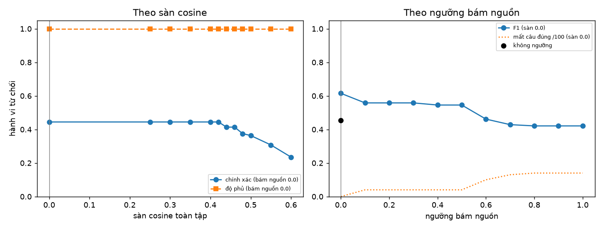

# UC025 + UC027 — Từ chối khi không đủ căn cứ, đánh giá chất lượng (Ngày 10, đo 08–09/10/2026)

> Căn cứ cho [ADR-0029](../adr/0029-tu-choi-bon-ly-do-va-nguong-tu-duong-cong.md) (từ chối, ngưỡng) và
> [ADR-0030](../adr/0030-ghi-luot-dong-bo-va-bo-cham-tu-dong-mau-5.md) (ghi lượt, bộ chấm 5%).
> Ghi chú ôn tập: [`ngay-10-tu-choi-va-danh-gia-chat-luong.md`](../on-tap/ngay-10-tu-choi-va-danh-gia-chat-luong.md).

## Cách chạy và cấu hình

```bash
cd ai-service && source .venv/bin/activate          # ai-embed :8091 đang chạy
AI_MODE=remote EMBED_URL=http://localhost:8091 python -m tests.eval.hieu_chinh_tu_choi chay --han-chot-s 60
python -m tests.eval.hieu_chinh_tu_choi quet tests/eval/reports/hieu-chinh_<nhan>.jsonl
AI_MODE=remote EMBED_URL=http://localhost:8091 python -m tests.eval.hieu_chinh_tu_choi kiem-30 \
    --san 0.0 --bam-nguon 0.0 --han-chot-s 60
```

| | |
|---|---|
| Đường đi | đúng `RagAnswerer` production: luật trước truy hồi → nhúng (ai-embed) → hybrid RRF top-5 → sàn → lời nhắc → Gemini → hậu kiểm. Khác production hai chỗ: hạn chót 60 s (Gemini quá tải đêm 08/10, 503 + ~30 s/lượt), mạch nới 100 lần hỏng |
| Model | `gemini-3.5-flash-lite`, `reasoning_effort=minimal`, `temperature=0` (ADR-0028) |
| Kho | tenant `eeeeeeee-0000-0000-0000-000000000001`, bge-m3 `int8-71e2aa91`, rerank TẮT |
| Tập CHỌN ngưỡng | bộ vàng `golden_set.jsonl` sha256 `323baf73…` — 100 câu có đáp án + **12 câu nên từ chối** |
| Tập NGHIỆM THU | `ngoai_pham_vi.jsonl` sha256 `a1b6fd97…` — 30 câu, khoá 23:19 08/10 trước khi viết luật |
| Luật chọn ngưỡng | viết vào script TRƯỚC khi chạy: F1 của hành vi từ chối cao nhất; hoà thì mất ít câu đúng nhất; vẫn hoà thì ngưỡng nhỏ hơn |
| Số liệu thô | `ai-service/tests/eval/reports/{hieu-chinh,kiem-30}_*.{jsonl,md,csv,png}` (không commit) |

Lớp dương = "nên từ chối". **Chính xác** = trong các câu bị từ chối, bao nhiêu câu đáng bị từ chối.
**Độ phủ** = trong các câu đáng bị từ chối, bao nhiêu câu bị từ chối. **Mất câu đúng** = câu có đáp án,
baseline trả lời và trích đúng căn cứ, nay bị từ chối.

## 1. Luật trước truy hồi (`rag/tu_choi.py`) — không gọi LLM

| Tập | Kết quả |
|---|---|
| 30 câu nghiệm thu, 18 câu thuộc phần luật | **18/18** đúng lý do (9 `OUT_OF_SCOPE_DATA`, 9 `SAFETY_PROBE`); 12 câu `NOT_COVERED` đi tiếp sang truy hồi đúng thiết kế |
| 100 câu có đáp án của bộ vàng | báo nhầm **0/100** |
| 200 câu người thật của UC022 (`data/intent_test_human.jsonl`) | lần đo đầu **1/200** ("cách import danh sách khách hàng từ file excel…") ⇒ luật "danh sách khách" phải có động từ đòi ⇒ **0/200** — con số sau sửa không còn độc lập |

## 2. Hiệu chỉnh ngưỡng trên bộ vàng (baseline = hệ thống Ngày 9)

Lượt chạy `hieu-chinh_…20261008-234704` (lời nhắc Ngày 9, 142 câu, 124 lượt LLM, 0 suy giảm).
Hai ngưỡng áp OFFLINE lên điểm thô; hai luật cấu trúc mô phỏng trên câu trả lời đã ghi.

| Cấu hình | sàn | bám nguồn | TP/FP/FN/TN | chính xác | độ phủ | F1 | mất câu đúng |
|---|---|---|---|---|---|---|---|
| không ngưỡng (Ngày 9) | 0 | 0 | 5/5/7/95 | 0,500 | 0,417 | 0,455 | 0 |
| + luật "0 trích dẫn" | 0 | 0 | 11/13/1/87 | 0,458 | 0,917 | 0,611 | 0 |
| + luật "không phải câu trả lời" | 0 | 0 | 12/15/0/85 | 0,444 | **1,000** | **0,615** | **0** |
| **đã chọn** (luật chọn định trước) | **0** | **0** | 12/15/0/85 | 0,444 | 1,000 | 0,615 | 0 |



Bảng lưới đầy đủ (12 sàn × 11 ngưỡng): [`uc025-ngay10-luoi-nguong.csv`](uc025-ngay10-luoi-nguong.csv).

**Vì sao cả hai ngưỡng bằng 0:**

- **Sàn cosine không tách được hai lớp.** Cosine cao nhất của câu có đáp án thấp nhất **0,421**; của câu
  ngoài kho cao nhất **0,650** (G004 "thu cũ đổi mới tủ lạnh" — gần lĩnh vực). Mọi sàn 0–0,42 cho đúng
  cùng kết quả; sàn 0,5 mất 5 câu đúng, sàn 0,6 mất 19. Sàn từng đoạn 0,15 vẫn còn, chặn đoạn quá xa.
- **Cổng bám nguồn gây hại.** Ngưỡng 0,1: thêm 0 câu từ chối đúng (G031 đã do luật cấu trúc bắt) nhưng
  **mất 4 câu đúng** (G061, G069, G092, G095 — groundedness 0 oan vì diễn đạt lại / dịch từ tài liệu tiếng
  Anh). Ngưỡng 0,7: mất 13. Groundedness vẫn được đo và ghi cho 100% lượt — chỉ không dùng để huỷ.

**Toàn bộ cải thiện đến từ hai luật cấu trúc trên đầu ra**, không từ ngưỡng nào.

## 3. "Từ chối nhầm" là truy hồi trượt, không phải logic từ chối

| Lượt | FP (câu có đáp án bị từ chối) | trong đó đoạn đúng KHÔNG nằm trong top-5 |
|---|---|---|
| lời nhắc Ngày 9 + hai luật | 15 | 15 |
| lời nhắc 09/10 + hai luật | 20 | 19 (ngoại lệ: G112) |

Xét theo những gì hệ thống THẤY được, từ chối gần như luôn đúng: khi đoạn đúng không được lấy về, nói
"chưa có thông tin" là hành vi đúng (E7). Nút thắt là **recall@5 của truy hồi** (74/100 ở cả hai lượt —
khớp hybrid 0,740 của Ngày 6), việc của Ngày 13.

## 4. Nghiệm thu 30 câu ngoài phạm vi — lịch sử đầy đủ

Mỗi lượt ~12 lượt LLM (18 câu luật chặn trước). "Trả rỗng" = `refused` và `citations` rỗng.

| Lượt (09/10) | Thay đổi trước lượt đó | Trả rỗng đúng | Trượt |
|---|---|---|---|
| 05:57 | luật trước truy hồi + luật "0 trích dẫn", ngưỡng 0/0 | 29/30 | N005 |
| 06:01 | + luật v1 "mọi câu nội dung đều là 'chưa có thông tin'" | 29/30 | N012 |
| 06:04 · 06:04 · 06:06 | + luật v2 "… hoặc 0 câu bám nguồn" | 30 · 29 · 30 | N003 |
| 06:08 · 06:09 · 06:10 | luật v3 dựa trên trích dẫn (`hau_kiem.khong_phai_tra_loi`) | 30 · 29 · 28 | N012 · N002, N007 |
| 06:12 (trong lượt baseline mới) | **sửa lời nhắc tại gốc** (mục 5) | **30/30** | — |
| 06:20 · 06:21 · 06:22 | không đổi gì | **30 · 30 · 30** | — |

Mọi lượt trượt cùng MỘT lớp lỗi: mô hình không ghi mã `KHONG_DU_CAN_CU` mà viết "Dạ cửa hàng chưa có
thông tin về… [1][2]. Anh/chị cần hỗ trợ gì khác cứ nhắn em nhé [1]!" — mỗi lượt một biến thể. Ba lần
vá luật hậu kiểm, mỗi lần kiểm trên bộ vàng trước (0 câu đúng bị bắt), nhưng vẫn lọt biến thể mới ⇒
dừng vá luật, sửa tại gốc. **Kết quả với cấu hình ship: 4/4 lượt 30/30, đúng cả lý do.**

⚠️ Các con số sau lượt 05:57 **không còn độc lập** — mọi thay đổi đều do thấy lỗi trên chính 30 câu này.
Con số độc lập duy nhất là lượt đầu: **29/30**.

## 5. Sửa lời nhắc (`rag/generate/loi_nhac.py`) — ảnh hưởng lên UC023

Hai câu thêm: quy tắc 2 "câu chào, câu mời hỏi thêm và câu nói chưa có thông tin thì KHÔNG ghi số";
quy tắc 4 "không đoạn nào giúp được ⇒ chỉ ghi `KHONG_DU_CAN_CU`, không thêm câu nào".

| Trên bộ vàng (100 câu có đáp án) | Lời nhắc Ngày 9 | Lời nhắc 09/10 |
|---|---|---|
| Truy hồi trúng | 74 | 74 |
| Trả lời + trích đúng căn cứ | **74** | **73** (mất G112) |
| Mô hình ghi mã `KHONG_DU_CAN_CU` (112 câu) | 10 | 31 |
| `generate_ms` trung vị · p95 | — (Gemini quá tải đêm 08/10) | 1.148 · 1.515 ms |

G112 "mua về không ưng thì được đổi trả trong mấy ngày": đoạn đúng có trong top-5, lời nhắc cũ trả lời
phần mua online (10 ngày) và nói rõ phần mua tại cửa hàng chưa có; lời nhắc mới trả mã từ chối. Một câu
— không tách được khỏi độ ngẫu nhiên của LLM với một lượt chạy. Theo dõi ở eval Ngày 13.

## 6. Bốn lý do × số ca (cấu hình ship, lượt 06:12, 142 câu)

| Lý do | Số ca | Gọi LLM | Ghi chú |
|---|---|---|---|
| `NOT_COVERED` | 44 | có (sau sinh) | 12/12 câu nên từ chối của bộ vàng + 12/12 câu "chưa có trong tài liệu" của tập 30 + 20 câu truy hồi trượt |
| `OUT_OF_SCOPE_DATA` | 9 | không | 9/9 câu của tập 30, kèm `handoff = true` |
| `SAFETY_PROBE` | 9 | không | 9/9, cờ `INTERNAL_DATA_PROBE` 7 · `CROSS_TENANT_PROBE` 2 |
| `LOW_CONFIDENCE` | 0 | — | cổng bám nguồn TẮT theo hiệu chỉnh (mục 2); lý do vẫn còn trong code, bật lại bằng `RAG_NGUONG_BAM_NGUON` |

## 7. Bảy tín hiệu chất lượng × tần suất đo (UC027)

| Tín hiệu | Tần suất | Nguồn | Chỗ đọc |
|---|---|---|---|
| Tỉ lệ từ chối (theo lý do) | 100% lượt | `ai_interactions.is_answered`, `refusal_reason` | `GET /v1/ai/quality` |
| Tỉ lệ suy giảm | 100% lượt | `is_degraded` (V212) | `GET /v1/ai/quality` |
| Tỉ lệ chuyển giao | 100% lượt | `is_handoff` (V212) | `GET /v1/ai/quality` |
| Độ phủ trích dẫn | 100% lượt RAG trả lời bằng LLM | `retrieved_chunk_ids` | `GET /v1/ai/quality` |
| Độ bám nguồn | 100% lượt có sinh | `groundedness_score` (hậu kiểm, từ vựng) | `GET /v1/ai/quality` (trung bình) |
| Đánh giá người (khách, nhân viên) | khi người bấm | `ai_feedback` CUSTOMER / AGENT | `ty_le_tich_cuc` chia cho **số lượt có đánh giá** |
| LLM giám khảo | **mẫu 5%** tất định (md5) | `ai_feedback` AUTO_EVAL, chỉ khi độ chắc ≥ 0,7 | worker, mỗi 15 phút |

Thêm: tỉ lệ không gọi LLM (KPI ≥ 55%, `llm_called` V212) đo bằng SQL trên CSDL.

## 8. UC027 — bằng chứng chạy

- `tests/integration/test_luot_va_danh_gia.py` (18 ca, Postgres thật, role `ai_app`): ghi lượt dưới RLS;
  đánh giá lại thì cập nhật (`created=false`); tenant B gắn đánh giá vào lượt của A ⇒ 404 và 0 dòng;
  **khoá ngoại không chịu RLS** (`INSERT … VALUES` từ B lọt — lý do dùng `INSERT … SELECT`); tỉ lệ tích cực
  0,5 chứ không 0,1; khoảng trống gom theo câu bỏ dấu, sắp theo số hội thoại; mẫu SQL khớp Python; lô đầy
  không bỏ rơi lượt; hàm DEFINER thứ hai khoá bốn chốt.
- Đầu–cuối qua HTTP trên CSDL dev (LLM giả, 08/10): đủ 4 lý do; đánh giá 200 → 200 (`created=false`) →
  422 `REASON_REQUIRED` → tenant khác 404; `GET /v1/knowledge-gaps`, `GET /v1/ai/quality`; từ chối lần 2
  liên tiếp trong cùng hội thoại ⇒ `handoff=true`.
- Kiểm ngược: 13/13 đột biến làm test đỏ (10 phép 08/10 + 3 phép cho luật "không phải câu trả lời").
- Chưa chạy: bộ chấm tự động với Gemini thật (mới chạy với LLM giả trong test tích hợp).

## 9. Giới hạn — nói trước khi bị hỏi

- **Chỉ 12 câu nên-từ-chối** trong bộ vàng: đủ thấy hình dạng đường cong, chưa đủ một tỉ lệ có khoảng
  tin cậy hẹp. Mở rộng ở Ngày 13.
- **Con số 30/30 sau sửa không độc lập** (mục 4). Số độc lập: 29/30.
- **LLM không tất định** dù `temperature=0`: cùng câu N012 cho ba câu trả lời khác nhau qua các lượt.
  Báo nhiều lượt thay vì một.
- **Hạn mức:** ~410–430/500 lượt bậc miễn phí đã dùng trong ngày hạn mức 08/10 (giờ Thái Bình Dương —
  làm mới 14:00 giờ VN 09/10).
